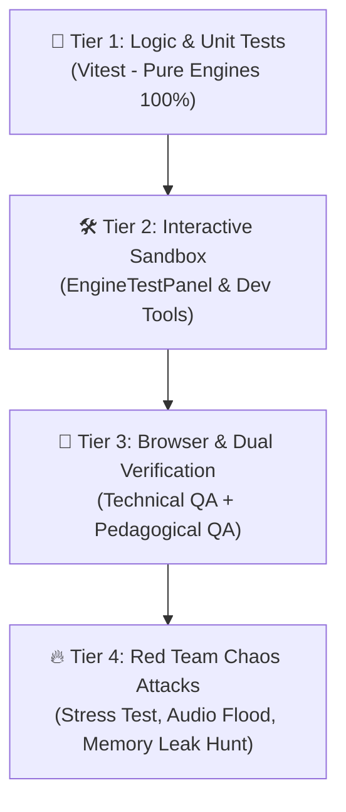

# 🐰 Hanzero - AI Agent Guidelines & Project Instructions (`AGENTS.md`)

ยินดีต้อนรับสู่โปรเจกต์ **Hanzero (ฮั่นซีโร่)** — แพลตฟอร์มเว็บแอปพลิเคชันสำหรับเรียนและฝึกฝนภาษาจีนตั้งแต่ศูนย์ ("เริ่มจาก 0 ก็เก่งจีนได้") โดยมุ่งเน้นประสบการณ์การเรียนรู้ที่ สนุก เข้าใจง่าย สวยงามทันสมัย และไม่น่ากลัวสำหรับผู้เริ่มต้น

เอกสารฉบับนี้กำหนดบทบาท แนวทางการทำงาน โครงสร้างสถาปัตยกรรม และมาตรฐานวิศวกรรมซอฟต์แวร์ (Systematic Coding & Testing Standards) สำหรับ AI Agent ในการร่วมพัฒนาระบบนี้อย่างมีประสิทธิภาพและไร้ข้อผิดพลาด

---

## 1. 🎯 Project Overview & Mission

* **ชื่อโปรเจกต์:** Hanzero (汉 + Zero)
* **สโลแกน:** "เริ่มจาก 0 สู่ภาษาจีนคล่องตัว"
* **กลุ่มเป้าหมาย:** ผู้เริ่มต้นเรียนภาษาจีนที่ไม่มีพื้นฐานมาก่อน (Zero-knowledge), ผู้ต้องการปูพื้นฐานพินอิน (Pinyin) ให้ถูกต้อง, ผู้เตรียมสอบ HSK ระดับเริ่มต้น (HSK 1-2), และผู้ที่ต้องการฝึกในชีวิตประจำวัน
* **แกนหลักของประสบการณ์การเรียนรู้ (Core Learning Philosophy):**
  1. **Bite-sized Learning:** บทเรียนขนาดเล็ก 3-5 นาที ย่อยง่าย ไม่ล้นสมอง
  2. **Pinyin & Tone Mastery:** เน้นการออกเสียงและวรรณยุกต์ที่แม่นยำ พร้อมระบบฟังเสียงและเทียบเสียง
  3. **Visual & Stroke-based Hanzi:** จำตัวอักษรจีนผ่านภาพ ความหมายรากศัพท์ (Radicals) และแอนิเมชันลำดับขีด (Stroke Order)
  4. **Gamified & Interactive:** แผนที่เส้นทางการเรียนรู้ (Learning Path / Quest Map), ระบบ Streak, หัวใจ/แต้มสะสม, และ Mini-quizzes
  5. **Spaced Repetition System (SRS):** ระบบทบทวนคำศัพท์อัจฉริยะ ป้องกันการลืมตามเส้นโค้งการลืม (Ebbinghaus Forgetting Curve)

---

## 2. 📚 Documentation & Agents Architecture (`docs/` & `agents/`)

โปรเจกต์นี้ใช้ **`docs/`** เป็น Single Source of Truth สำหรับสถาปัตยกรรมและหลักสูตร และใช้ **`agents/`** เป็นศูนย์รวมพิมพ์เขียวบทบาทของทีม Agent ทั้งหมด

### โครงสร้างของ `agents/` (Multi-Agent Blueprints):
```text
agents/
├── README.md                 # สรุปผังทีม Agent และโครงสร้างการทำงาน
├── ux_ui_designer.md         # นักออกแบบ UX/UI สุนทรียภาพ (Modern Oriental Minimalism, Mobile First)
├── pedagogical_qa.md         # อาจารย์ตรวจภาษาจีน (อักษรย่อ, วรรณยุกต์, สำนวนไทย)
├── technical_qa.md           # ผู้ตรวจการโค้ดและประสิทธิภาพ (Strict Types, Bundle < 100KB)
├── red_team_adversary.md     # หน่วยจู่โจมล่าบั๊ก (ถล่มคิวเสียง, Memory Leak, Safari Sleep)
├── web_dev.md                # วิศวกรเว็บแอปพลิเคชัน (Pure TypeScript, Web Audio, 60fps)
├── curriculum_tutor.md       # อาจารย์สอนภาษาจีนสายพี่เลี้ยง (สตอรี่ภาพจำช่วยจำ)
└── gamification_designer.md  # นักออกแบบเกม (Tone Coaster, เลโก้เรียงประโยค, Safe Zone)
```

### โครงสร้างของ `docs/`:
```text
docs/
├── README.md                 # ดัชนีภาพรวมและแผนผังเอกสารทั้งหมด
├── prd/                      # Product Requirement Documents (ความต้องการระบบ & ฟีเจอร์)
│   ├── 01_product_vision.md  # วิสัยทัศน์ กลุ่มเป้าหมาย และ Core Value Proposition
│   └── 02_feature_specs.md   # รายละเอียดฟีเจอร์ (Pinyin, Hanzi, Quiz, SRS, User System)
├── curriculum/               # โครงสร้างหลักสูตรและเนื้อหาบทเรียน
│   ├── 01_pinyin_system.md   # แม่บทระบบพินอิน (สระ พยัญชนะ วรรณยุกต์ กฎการเปลี่ยนเสียง)
│   ├── 02_radical_basics.md  # หมวดนำอักษรจีน (Radicals) สำคัญที่พบบ่อย
│   ├── 03_lesson_levels.md   # ผังระดับบทเรียน (Level 1: ทักทาย, ตัวเลข, ครอบครัว, สั่งอาหาร ฯลฯ)
│   └── 04_mini_games.md      # คลังการออกแบบมินิเกมการเรียนรู้ (Game Catalog)
├── architecture/             # สถาปัตยกรรมและเทคโนโลยี
│   ├── tech_stack.md         # การตัดสินใจเลือก Stack (Frontend, State, Sound, Animation)
│   └── data_schema.md        # รูปแบบข้อมูลคำศัพท์ บทเรียน และ User Progress Schema
├── plan/                     # แผนการพัฒนาแบบละเอียดและ Checklist การทำงาน (8 Phases)
│   ├── README.md             # สรุปภาพรวมและ Quality Gate ทั้ง 8 เฟส
│   ├── phase_01_web_foundation_engines.md
│   ├── phase_02_unit1_lesson_experience.md
│   ├── phase_03_gamification_srs.md
│   ├── phase_04_tier0_pinyin_mastery.md
│   ├── phase_05_tier1_content_rollout.md
│   ├── phase_06_content_authoring_studio.md
│   ├── phase_07_tier2_traveler_quest.md
│   └── phase_08_tier3_4_advanced_immersion.md
└── prompts/                  # คลังแม่แบบ Prompts เพิ่มเติม
```

### กฎสำคัญสำหรับ Agent เกี่ยวกับ `docs/`:
- **ตรวจสอบก่อนลงมือ (Check Before Implement):** ตรวจสอบเอกสารใน `docs/plan/` และ `docs/curriculum/` ก่อนเริ่มเขียนโค้ดเสมอ
- **อัปเดตเอกสารควบคู่กับการพัฒนา (Keep in Sync):** หากมีการปรับเปลี่ยนสถาปัตยกรรม โมเดลข้อมูล หรือลำดับบทเรียน ต้องอัปเดตไฟล์ใน `docs/` ให้ตรงกันทันที
- **ภาษาของเอกสาร:** ใช้ภาษาไทยเป็นภาษาหลัก ผสมผสานภาษาอังกฤษสำหรับศัพท์เทคนิค และระบุคำศัพท์ภาษาจีนควบคู่ Pinyin ชัดเจน

---

## 3. ⚙️ Phase-Driven Execution Workflow (การทำงานตามแผนทีละก้าวอย่างมีวินัย)

เพื่อให้งานมีความก้าวหน้าอย่างมั่นคงและไม่เกิดหนี้ทางเทคนิค (Technical Debt):
1. **Check Plan First:** ก่อนเริ่มโค้ดทุกครั้ง ต้องอ่านเอกสารแผนงานใน `docs/plan/` ที่เกี่ยวข้องเสมอ (เช่น `phase_01_web_foundation_engines.md`) เพื่อเข้าใจขอบเขตและเกณฑ์การตรวจรับ
2. **Micro-Slicing & Scope Control:** แบ่งงานเป็นสไลซ์ย่อย (Sub-tasks) ทำทีละส่วน ห้ามเขียนโค้ดรวดเดียวหลายระบบโดยไม่มีจุดพักตรวจสอบ
3. **Verify Before Progress:** แต่ละ Phase หรือ Sub-task ต้องผ่านการทดสอบ (Quality Gate) และยืนยันความถูกต้องก่อน จึงจะข้ามไปทำงานในขั้นตอนถัดไป

---

## 4. 🧱 Systematic Coding Guidelines (มาตรฐานวิศวกรรมและการเขียนโค้ด)

### 4.1 โครงสร้างโฟลเดอร์มาตรฐาน (Standard Directory Tree)
```text
src/
├── assets/          # SVG, ไอคอน, สัญลักษณ์มงคล
├── components/      # UI components (เน้นการแสดงผล ไม่ยัดตรรกะซับซ้อน)
│   ├── common/      # ปุ่มกดสปริง, Badge, ProgressBar, HeartMeter, Modal
│   ├── layout/      # Header (Streak/Hearts), BottomNav, Viewport Container
│   ├── lesson/      # VocabCard, DialoguePlayer, ToneBoard
│   ├── test-panels/ # Test Panels สำหรับทดสอบระหว่างพัฒนา (Dev Sandbox)
│   └── hanzi/       # HanziWriterBox (Canvas คัดลายมือ)
├── engines/         # แกนคำนวณและ Web API บริสุทธิ์ (Pure Logic / Zero-UI / 100% Testable)
│   ├── audio/       # audioEngine.ts (TTS + Web Audio Synth)
│   ├── pinyin/      # pinyinUtils.ts (Tone marks, Tone Sandhi)
│   └── srs/         # srsEngine.ts (SM-2 Interval Calculator)
├── data/            # ข้อมูลดิบ JSON บทเรียน และคำศัพท์
├── hooks/           # Custom React Hooks สำหรับเชื่อมต่อ State, LocalStorage และ Lifecycle
├── types/           # Type Definition (TypeScript Strict Interfaces)
├── styles/          # index.css (CSS Variables, Typography, Micro-interactions)
├── App.tsx          # ตัวสลับหน้าจอ (Simple View Router)
└── main.tsx
```

### 4.2 กฎเหล็กการเขียนโค้ดอย่างเป็นระบบ
1. **Separation of Concerns (แยกบทบาทหน้าที่เด็ดขาด):**
   - **`src/engines/`**: ต้องเป็น Pure TypeScript Logic (Zero-UI, ห้ามมี JSX/HTML) เพื่อให้สามารถเขียน Automated Unit Test ทดสอบได้เต็ม 100% โดยไม่ต้องพึ่ง DOM
   - **`src/components/`**: เน้น Presentation Layer รับ Props และส่ง Event Handlers ห้ามยัด Business Logic ยาวๆ หรือ Async Operations ที่ซับซ้อนไว้ใน Component
   - **`src/hooks/`**: ทำหน้าที่เป็นสะพานเชื่อม (Bridge) ระหว่าง Engine/LocalStorage เข้ากับ React State และ Lifecycle
2. **Defensive & Resilient Programming (ป้องกันบั๊กเชิงรุก):**
   - **Strict Typing:** กำหนด Interface/Type อย่างละเอียดรอบคอบ **ห้ามใช้ `any`**
   - **Safe Fallbacks เสมอ:** หากเบราว์เซอร์ไม่รองรับ Speech Synthesis หรือ Web Audio API ต้องไม่ทำให้ UI แครชหรือแฮงก์ และต้องแจ้งเตือนผู้ใช้อย่างสุภาพ
   - **Null / Undefined Safety:** ตรวจสอบความถูกต้องของข้อมูล JSON ก่อน Render เสมอ ป้องกันปัญหาจอขาว (White Screen of Death)
3. **1 File 1 Responsibility (ความเรียบง่ายและโฟกัส):**
   - ไฟล์ Component หรือ Logic แต่ละไฟล์ควรมีความยาวไม่เกิน 150-200 บรรทัด หากเริ่มยาวหรือทำงานหลายอย่าง ให้แยกโมดูลย่อยทันที
4. **Zero-Cost & 60fps Experience:**
   - ห้ามใช้ไลบรารีหรือบริการที่มีค่าใช้จ่ายแอบแฝง ระบบต้องรันบน Client-side ฟรี 100% (GitHub Pages Ready)
   - ใช้ CSS `transform` และ `opacity` สำหรับการเคลื่อนไหวและการ์ดพลิก ป้องกัน Layout Thrashing ลื่นไหล 60fps
   - **Prevent Memory Leaks:** ทำ Cleanup Resource เสมอใน `useEffect` (เช่น ยกเลิก Event Listeners, ปิด AudioContext, สั่ง destroy Canvas ของ `hanzi-writer`)

---

## 5. 🧪 Systematic Testing & 4-Tier Verification Matrix
 
กำหนดแนวทางการทดสอบ 4 มิติ (**4-Tier Verification Matrix**) โดยมี QA อิสระและ Red Team คอยตรวจสอบคุณภาพก่อนส่งมอบงาน:
 


### 5.1 Tier 1: Logic & Unit Tests (Automated Testing ด้วย Vitest)
ทดสอบ Core Engines ใน `src/engines/` ให้มี Test Coverage สูงและผ่านทุกกรณี:
- **`srsEngine.test.ts`**: ทดสอบการคำนวณสมการ SM-2, ช่วงเวลาการทบทวน (Intervals: 1, 6 วัน ฯลฯ), และการปรับค่า Ease Factor เมื่อตอบถูก/ผิด
- **`pinyinUtils.test.ts`**: ทดสอบการแยกพยัญชนะ-สระ-วรรณยุกต์, แปลงตัวเลขวรรณยุกต์เป็น Tone Marks (เช่น `ni3hao3` -> `nǐhǎo`), และการผันเสียงอัตโนมัติ (Tone Sandhi: 3+3 -> 2+3)
- **`schemaValidation.test.ts`**: สคริปต์อัตโนมัติสำหรับตรวจสอบความสมบูรณ์ของไฟล์ JSON บทเรียน (ห้ามตกหล่นฟิลด์ `hanzi`, `pinyin`, `th`, `en`, `tones`)

### 5.2 Tier 2: Interactive Sandbox & Test Panels (Developer Experience)
สร้าง Component หรือ Sandbox หน้าทดสอบชั่วคราวเพื่อลองระบบก่อนนำไปประกอบหน้าจริง:
- **`AudioTestPanel`**: แผงทดสอบกดฟัง Web Audio SFX สังเคราะห์สด (ถูก/ผิด/เด้ง) และปุ่มทดสอบ Web Speech TTS ปรับ Speed/Pitch ได้
- **`HanziWriterTestBox`**: แผงทดสอบแคนวาสคัดลายมือ ตรวจสอบความไวในการลากเส้น (Stroke recognition) และการรีเซ็ตแคนวาส

### 5.3 Tier 3: Browser & Dual Verification (Technical QA + Pedagogical QA)
1. **Technical QA ([agents/technical_qa.md](file:///d:/V/project/Hanzero/hanzero/agents/technical_qa.md)):**
   - 0 Browser Console Errors (ไม่มีข้อผิดพลาดสีแดงหรือ Warning ที่อันตราย)
   - Mobile-First Touch Ready (ขนาดปุ่มและ Hitbox ไม่ต่ำกว่า 44x44px สัมผัสง่ายบนมือถือ)
   - First Contentful Paint โหลดเร็วต่ำกว่า 0.8 วินาที
   - Production Bundle Size: JS gzipped ≤ 100 KB, CSS ≤ 20 KB
2. **Pedagogical QA ([agents/pedagogical_qa.md](file:///d:/V/project/Hanzero/hanzero/agents/pedagogical_qa.md)):**
   - ตรวจทานตัวอักษรจีนตัวย่อ (Simplified Chinese) ให้ถูกต้องแม่นยำ 100%
   - ตรวจทานตำแหน่งเครื่องหมายวรรณยุกต์ Pinyin (วางบนสระที่ถูกต้องตามหลักสากล)
   - ตรวจสอบคำแปลภาษาไทย ให้เป็นสำนวนที่เป็นธรรมชาติและตรงตามบริบทในชีวิตประจำวัน

### 5.4 Tier 4: Red Team Adversarial Attacks ([agents/red_team_adversary.md](file:///d:/V/project/Hanzero/hanzero/agents/red_team_adversary.md))
- **Audio Flood Attack:** รัวปุ่มออกเสียง 50 ครั้งใน 2 วินาที คิวเสียงต้องไม่ค้าง ไม่แฮงก์
- **Tab Sleep / Resume Attack:** สลับแท็บหรือพักหน้าจอขณะเล่นเสียง แล้วตรวจสถานะ `audioContext.state` ว่ากลับมา Auto-Resume หรือไม่
- **Memory Leak Hunt:** สลับการ์ดคัดอักษรจีน 100 รอบ ตรวจดูว่า Heap Memory ไม่บวมเกิน 40 MB
- **Offline Resilience:** ปิดเน็ตแล้วเปิดแอป Service Worker ต้องเสิร์ฟเนื้อหาได้ 100%
- **Small Viewport 320px Squeeze:** บีบจอแคบสุด 320px ตรวจดูว่าหัววรรณยุกต์พินอินไม่โดนตัด และปุ่มไม่ล้นจอ

---

## 6. 🚦 Definition of Done (DoD) & Acceptance Checklist

ก่อนส่งมอบงานในแต่ละ Sub-task หรือ Phase ทาง AI Agent ต้องตรวจสอบและรายงานผลตาม Checklist นี้:

- [ ] **TypeScript Clean:** โค้ดผ่านการคอมไพล์ (`tsc --noEmit` หรือ build สำเร็จ ไร้ Type Error)
- [ ] **Unit Tests Passed:** Unit Tests ที่เกี่ยวข้องรันผ่านครบ 100%
- [ ] **No Console Errors:** เปิดทดสอบบนเบราว์เซอร์จริงแล้วไม่มี Error สีแดงบน Console
- [ ] **Resource Cleanup:** มีการ Cleanup EventListener, AudioContext และ Canvas เรียบร้อย ไม่เกิด Memory Leak
- [ ] **Pedagogical Checked:** ตรวจทานอักษรจีน พินอิน วรรณยุกต์ และคำแปลไทยเรียบร้อย
- [ ] **Documentation Synced:** อัปเดตสถานะความคืบหน้าใน `docs/plan/` หรือ `docs/roadmap/` ให้ตรงกับสภาพความเป็นจริง

---

## 7. 🤖 Agent Behavior & Pair-Programming Guidelines

1. **สื่อสารแบบเป็นมิตร สร้างสรรค์ และมีโครงสร้าง (Proactive & Supportive Partner):**
   - ให้คำแนะนำเชิงการศึกษา (Pedagogy) ควบคู่กับคำแนะนำด้านเทคโนโลยี (Tech)
   - นำเสนอทางเลือก พร้อมข้อดี-ข้อเสียให้ผู้ใช้เห็นภาพชัดเจน
2. **Design with High Aesthetics (ห้ามทำ UI ธรรมดาหรือล้าสมัย):**
   - ใส่ใจ Typography (ฟอนต์ไทย-จีน-อังกฤษที่แมตช์กันลงตัว เช่น Prompt/Noto Sans Thai + Noto Sans SC/LXGW WenKai + Inter)
   - ใช้เฉดสีที่ให้ความรู้สึกผ่อนคลายแต่มีชีวิตชีวา (เช่น Imperial Red / Jade Green / Warm Ochre ผสมผสาน Neutral modern tones)
3. **Accuracy of Chinese Learning Content (ความถูกต้องของภาษาจีนต้องแม่นยำ 100%):**
   - ตรวจสอบวรรณยุกต์ พินอิน (Pīnyīn) และอักษรจีนตัวย่ออย่างเข้มงวด
   - คำแปลภาษาไทยต้องเป็นธรรมชาติ เข้าใจบริบทการใช้งานจริง
4. **Step-by-Step Milestones:**
   - ทำงานทีละขั้นตอน (Phase by phase) ตรวจสอบความถูกต้องและทดสอบฟังก์ชันตาม Quality Gate ก่อนข้ามไปส่วนถัดไป

---

## 8. 🚀 Immediate Next Steps

เมื่อเริ่มเซสชันใหม่หรือเริ่มวางแผน ให้ดำเนินการตามขั้นตอน:
1. ตรวจสอบสถานะของ `docs/plan/README.md` และ Phase เอกสารที่กำลังดำเนินการ
2. ยืนยัน Acceptance Criteria และ Quality Gate ของงานชิ้นปัจจุบัน
3. เริ่มต้นเขียนโค้ดและทดสอบตาม **3-Tier Verification Matrix** และส่งมอบงานตาม **Definition of Done (DoD)**
