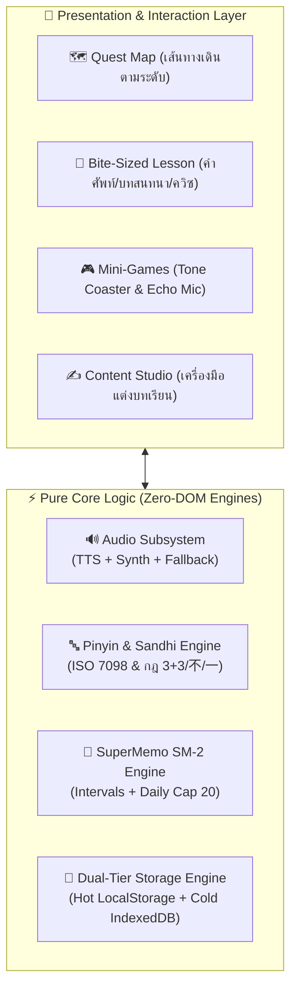
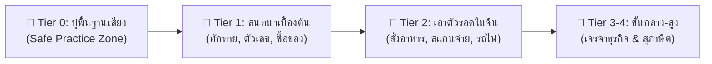

<div align="center">

# 🐰 Hanzero (汉 + Zero / ฮั่นซีโร่)
### "เริ่มจาก 0 สู่ภาษาจีนคล่องตัว"
**A Modern, Gamified & Resilient Web Platform for Zero-Knowledge Chinese Learners**

[](https://www.typescriptlang.org/)
[](https://react.dev/)
[](https://vitejs.dev/)
[](https://vitest.dev/)
[](https://playwright.dev/)
[](https://github.com/)
[](https://opensource.org/licenses/MIT)

[🌐 ทดลองใช้งาน (Live Demo)](#) • [📖 เอกสารสถาปัตยกรรม (Docs)](./docs/README.md) • [🗺️ แผนแม่บท 8 เฟส](./docs/plan/README.md) • [🛠️ Content Studio](#-สตูดิโอสร้างบทเรียน-in-browser-content-authoring-studio)

</div>

---

## 🎯 1. Hanzero คืออะไร (What is Hanzero?)

**Hanzero (ฮั่นซีโร่ 🐰)** คือเว็บแอปพลิเคชันเพื่อการเรียนรู้และฝึกฝนภาษาจีนตั้งแต่ศูนย์ ออกแบบมาเพื่อแก้ Pain Points หลักของผู้เรียนชาวไทย:
- ❌ **กลัวตัวอักษรจีน (Hanzi Phobia):** รู้สึกว่าอักษรจีนเหมือนภาพวาดที่จำยาก
- ❌ **สับสนวรรณยุกต์พินอิน (Tone Confusion):** แยกเสียง 2 กับเสียง 3 ไม่ออก หรือผันเสียงผิดเมื่อคำมาติดกัน
- ❌ **หมดไฟจากการท่องจำ (Burnout & Churn):** โดนบังคับท่องศัพท์วันละเป็นร้อยคำจนท้อถอย

Hanzero เปลี่ยนกระบวนการเรียนรู้ให้เป็น **เกมผจญภัยแบบ Bite-Sized** ผ่านการจำแนกเสียงด้วยภาพ แอนิเมชันลำดับขีด และระบบทบทวนอัจฉริยะที่คำนึงถึงสุขภาวะทางจิตใจของผู้เรียนเป็นอันดับหนึ่ง

---

## ⚙️ 2. ระบบทำงานอย่างไร (How It Works - Under the Hood)

ระบบทั้งหมดของ Hanzero ทำงานแบบ **Client-Side 100% ฟรีตลอดชีพ (Zero-Cost / Zero-Backend Architecture)** ทำงานได้รวดเร็วทันใจ ปลอดภัยต่อข้อมูลส่วนบุคคล และรองรับการเรียนแม้ออฟไลน์:



### 🔊 1. กระบวนการประมวลผลเสียง (3-Tier Audio Cascade)
ระบบเสียงของ Hanzero มีความทนทานสูง ไม่ล่มแม้ผู้เรียนใช้อุปกรณ์ที่ไม่มีชุดเสียงภาษาจีน:
1. **Tier 1 (OS Neural Voice):** เรียกใช้ Web Speech API (`speechSynthesis`) ภาษาจีนกลางสำเนียงมาตรฐาน (`zh-CN`) ในเครื่อง
2. **Tier 2 (Cloud DictVoice Fallback):** หากอุปกรณ์ไม่มีเสียงจีน ระบบจะดึงสตรีมเสียงความคมชัดสูงจาก Audio CDN อัตโนมัติ
3. **Tier 3 (Web Audio Tone Synthesizer):** หากออฟไลน์หรือไม่มีสัญญาณอินเทอร์เน็ต ระบบจะสังเคราะห์รูปคลื่นเสียง Sine Wave ตามเส้นระดับวรรณยุกต์ (Tone Contour) ให้ผู้เรียนฟังเทียบระดับเสียงสูง-ต่ำได้เสมอ
4. **Adaptive Speech Watchdog:** คำนวณระยะเวลาเล่นเสียงอัตโนมัติตามความยาวประโยค ป้องกันเสียงประโยคยาวถูกตัดจบก่อนเวลา

### ✍️ 2. กลไกการคัดและจำแนกอักษรจีน (Stroke Order & Radical Engine)
- ถอดรหัสโครงสร้างตัวอักษรจีนออกเป็น **หมวดนำ (Radical)** และ **ลำดับขีดมาตรฐาน (Stroke Order)**
- แสดงแอนิเมชันการเขียนทีละเส้นด้วย `hanzi-writer` บน Canvas ความเร็ว 60fps
- ระบบตรวจจับและประเมินทิศทางการลากเส้นของผู้เรียนแบบ Real-time พร้อมล้างหน่วยความจำ GPU ทันทีหลังปิดการ์ด

### 🧠 3. อัลกอริทึมทบทวนความจำ (SuperMemo SM-2 Spaced Repetition)
- คำนวณช่วงเวลาการทบทวนคำศัพท์ตามเส้นโค้งการลืมของ Ebbinghaus ($I(1) = 1, I(2) = 6, I(n) = I(n-1) \times EF$)
- ปรับค่าความง่าย (Ease Factor) อัตโนมัติตามผลการตอบถูก-ผิด
- **Anti-Churn Daily Cap:** จำกัดคำศัพท์ที่ต้องทบทวนไม่เกิน 20 คำ/วัน ป้องกันอาการหมดไฟ (Burnout)
- **Safe Practice Zone (Tier 0):** ในหมวดฝึกฟังพินอินพื้นฐาน **ไม่มีการหักหัวใจ** เพื่อสร้างความมั่นใจก่อนเข้าสู่บทเรียนหลัก

### 💾 4. สถาปัตยกรรมเก็บข้อมูลสองชั้น (Dual-Tier Resilient Storage)
- **Hot Tier (LocalStorage):** อ่านและเขียนสถานะผู้เรียนทันทีแบบ Synchronous (ความเร็ว 0ms ไร้กระตุก)
- **Cold Tier (IndexedDB Mirror):** สำรองข้อมูลคู่ขนานในฐานข้อมูลเบราว์เซอร์ พร้อมเรียก `navigator.storage.persist()` เพื่อป้องกัน Safari ล้างข้อมูลทิ้งหลังไม่ได้เปิดใช้งาน 7 วัน
- **Synchronous Tombstone Defense:** ป้องกันปัญหา Zombie Data ฟื้นคืนชีพเมื่อผู้เรียนกดรีเซ็ตความก้าวหน้า

---

## 🎮 3. ฟีเจอร์เด่นของ Hanzero (Core Features)



### 1. รถไฟเหาะวรรณยุกต์ (Bunny Tone Coaster)
มินิเกมลากนิ้วตามความโค้งของระดับเสียงวรรณยุกต์ทั้ง 4 เสียง (1: ราบเรียบ, 2: พุ่งขึ้น, 3: ตกแล้วขึ้น, 4: ตกฮวบ) เชื่อมโยงระบบกล้ามเนื้อมือเข้ากับความจำเสียง

### 2. ไมโครโฟนเงาเสียง (Client-Side Echo Mic / Shadowing)
ผู้เรียนกดอัดเสียงการออกเสียงของตนเอง แล้วระบบจะเล่นเทียบเสียงของตนเองกับเจ้าของภาษาแบบ Dual Echo ต่อเนื่องทันที เพื่อฝึกฟังความแตกต่างของวรรณยุกต์ โดยไม่มีการส่งไฟล์เสียงออกนอกเครื่อง

### 3. กระดานคู่เทียบเสียง (Minimal Pair Board)
ฝึกจำแนกคู่เสียงที่คนไทยมักสับสน เช่น `zh` vs `z`, `ch` vs `c`, `sh` vs `s`, และเสียงสระ `ü` vs `u`

### 4. สตูดิโอสร้างบทเรียน (In-Browser Content Authoring Studio)
เข้าใช้งานได้ผ่าน URL `?view=studio`
- **In-Browser Pedagogical Linter:** แปลงพินอินตัวเลขเป็นสัญลักษณ์วรรณยุกต์อัตโนมัติ (`ni3 hao3` ➔ `nǐ hǎo`), ตรวจจับอักษรจีนตัวเต็ม, และแจ้งเตือนกฎ Tone Sandhi
- **Live Mobile Preview:** แสดงผลตัวอย่างบทเรียนบนกรอบสมาร์ตโฟนจำลองแบบสดๆ ทุกครั้งที่พิมพ์
- **Zero-Token Git Hand-off:** 1-Click ดาวน์โหลดไฟล์บทเรียน JSON พร้อมสร้างเทมเพลต Pull Request สำเร็จรูป นำไปเปิด PR บน GitHub ได้ทันที ปลอดภัย ไร้ความเสี่ยงเรื่อง Token รั่วไหล

---

## 🗺️ 4. แผนผังหลักสูตร 8 เฟส (8-Phase Roadmap)

| เฟส | ชื่อเฟส / ขอบเขตงาน | คำอธิบาย | สถานะ |
| :---: | :--- | :--- | :---: |
| **Phase 1** | Foundations & Web Audio | วางรากฐานระบบ Web Audio Synthesizer, PWA, และฟอนต์ภาษาจีน | `DONE` ✅ |
| **Phase 2** | Unit 1 Complete Experience | บทเรียนต้นแบบ Unit 1 (ทักทาย & แนะนำตัว) พร้อมการ์ดคำศัพท์ 3 ภาษา | `DONE` ✅ |
| **Phase 3** | Gamification & SRS | แผนที่ Quest Map, ระบบหัวใจ, Safe Zone, และ SuperMemo SM-2 SRS | `DONE` ✅ |
| **Phase 4** | Tier 0 Pinyin Mastery | ปูพื้นฐานเสียงพินอินครบ 6 Units, ตรวจสุขภาพเสียง OS, Tone Coaster, Echo Mic | `DONE` ✅ |
| **Phase 5** | Tier 1 Production Rollout | ปล่อยเนื้อหา Tier 1 ครบ 10 Units (40 บทย่อย), Grand Boss Quests, และ CI/CD | `DONE` ✅ |
| **Phase 6** | Content Authoring Studio | เครื่องมือสร้างบทเรียนบนเบราว์เซอร์, In-Browser Linter, และ Zero-Token Git Hand-off | `DONE` ✅ |
| **Phase 7** | Tier 2 Traveler Quest | เนื้อหาเอาตัวรอดในยุคดิจิทัล (สแกนจ่าย, รถไฟความเร็วสูง, เดลิเวอรี่, โรงพยาบาล) | `UPCOMING` 🚀 |
| **Phase 8** | Tier 3-4 Advanced Immersion | เจรจาธุรกิจ, 成语 Story Explorer, เครื่องมือตัดคำอัตโนมัติ, และโหมดพอดแคสต์ | `PLANNED` 📋 |

---

## ⚡ 5. สถาปัตยกรรมซอฟต์แวร์ (Tech Stack & Architecture)

### การแบ่งสัดส่วนโค้ด (Separation of Concerns):
```text
src/
├── engines/             # Pure TypeScript Logic (Zero-DOM / ทดสอบได้ 100%)
│   ├── audio/           # ระบบจัดการเสียง Web Speech + Web Audio Synth
│   ├── pinyin/          # แปลงพินอินและวิเคราะห์ Tone Sandhi
│   ├── srs/             # คำนวณช่วงเวลาการทบทวน SuperMemo SM-2
│   ├── storage/         # ระบบบันทึกข้อมูลสองชั้น (Hot/Cold Persistence)
│   └── studio/          # เครื่องมือตรวจแก้บทเรียน (Linter & Git Hand-off)
├── components/          # Presentation Layer (ส่วนแสดงผล UI)
│   ├── common/          # ปุ่มกดสปริง, HeartMeter, Modal, ProgressBar
│   ├── layout/          # HeaderBar, BottomNav, DevStorageDrawer
│   ├── lesson/          # VocabCard, DialoguePlayer, QuizContainer, GrammarBite
│   ├── games/           # ToneCoaster, EchoMicRecorder, MinimalPairBoard
│   └── studio/          # StudioLayout, Composers, MobilePreviewFrame, GitExportModal
├── data/lessons/        # ฐานข้อมูลบทเรียน JSON (Tier 0 & Tier 1 รวม 16 Units)
├── hooks/               # สะพานเชื่อม React State กับ Core Engines
└── styles/              # Design System (Modern Oriental Minimalism)
```

- **Frontend Core:** React 18, TypeScript 5 (Strict Mode), Vite 5
- **CJK Stroke Animation:** `hanzi-writer` (Canvas GPU-accelerated)
- **Icons:** Lucide React
- **Storage Adapter:** `idb-keyval` (IndexedDB Promise Wrapper)
- **Performance Budget:** 
  - CSS Bundle Gzipped: **3.24 KB** (งบ $\le$ 20 KB)
  - Student App Initial JS: **97.32 KB** (งบ $\le$ 100 KB)

---

## 🚀 6. การติดตั้งและเริ่มต้นใช้งาน (Getting Started)

### ความต้องการของระบบ (Prerequisites)
- [Node.js](https://nodejs.org/) v18.0.0 หรือใหม่กว่า
- [npm](https://www.npmjs.com/) v9.0.0 หรือใหม่กว่า

### ขั้นตอนการรันระบบบนเครื่อง (Local Setup)
```bash
# 1. Clone repository
git clone https://github.com/vavinon/Hanzero.git
cd Hanzero

# 2. ติดตั้งแพ็กเกจ
npm install

# 3. รัน Development Server
npm run dev
```
เปิดเบราว์เซอร์ไปที่ `http://localhost:5173/`

### การเข้าสู่ Content Authoring Studio
เปิด URL: `http://localhost:5173/?view=studio` หรือคลิกปุ่ม **"🛠️ Open Authoring Studio"** ในแผง Developer Storage Drawer ด้านล่างของหน้าจอ

---

## 🧪 7. มาตรฐานการทดสอบและเกณฑ์คุณภาพ (Quality Gate)

ระบบ Hanzero ให้ความสำคัญสูงสุดกับคุณภาพและความถูกต้องของเนื้อหา มีคำสั่งทดสอบครบทุกระดับ:

```bash
# 1. ตรวจสอบความถูกต้องของ Type (Strict Mode - Zero 'any')
npm run lint

# 2. ตรวจสอบความถูกต้องของหลักสูตรภาษาจีนทุก Units (100% Strict)
npm run validate:curriculum -- --strict

# 3. รัน Unit & Component Tests ทั้งหมด (Vitest 552 Tests)
npm test

# 4. ตรวจวัดขนาด Production Bundle หลัง Build
npm run audit:bundle

# 5. รันการทดสอบผู้ใช้จริงบนเบราว์เซอร์ (Playwright E2E 18 Scenarios)
npm run test:e2e

# คำสั่งรันการตรวจสอบคุณภาพทั้งหมดครบวงจร
npm run test:all
```

---

## 📄 8. สัญญาอนุญาต (License)

โครงการนี้เผยแพร่ภายใต้สัญญาอนุญาต **[MIT License](LICENSE)** — สามารถนำไปศึกษา พัฒนาต่อยอด และใช้งานได้อย่างเสรี

<div align="center">
  <sub>สร้างสรรค์ด้วยความใส่ใจเพื่อผู้เริ่มต้นเรียนภาษาจีนทุกคน 🐰✨</sub>
</div>
