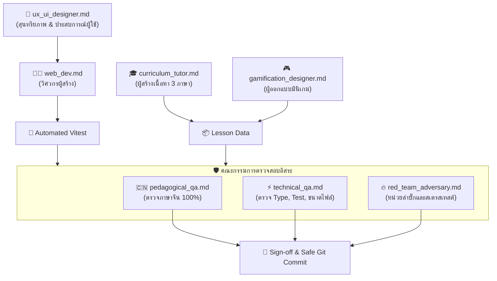

# 🤖 Hanzero Agent Ecosystem (`agents/`)

ยินดีต้อนรับสู่ศูนย์รวม Agent ประจำโปรเจกต์ **Hanzero (น้องกระต่ายฮั่นซีโร่ 🐰)**  
โฟลเดอร์นี้รวบรวมพิมพ์เขียว (System Prompts, Operating Rules, และ Checklists) ของ Agent แต่ละบทบาท เพื่อให้การทำงานโปร่งใส ตรวจสอบได้จริง และแยกหน้าที่กันอย่างเป็นอิสระ (Separation of Concerns)

---

## 🗺️ ผังโครงสร้างทีมงานและการตรวจรับงาน

---

## 📂 สารบัญบทบาท Agent

| ไฟล์ Agent | บทบาทหน้าที่ | หน้าที่หลัก |
| :--- | :--- | :--- |
| **[ux_ui_designer.md](file:///d:/V/project/Hanzero/hanzero/agents/ux_ui_designer.md)** | นักออกแบบผลิตภัณฑ์ UX/UI และสุนทรียภาพ | กำกับความเรียบง่าย สวยงาม มินิมอลแบบ Modern Oriental คุม Space & Typography บนเว็บ/มือถือ |
| **[pedagogical_qa.md](file:///d:/V/project/Hanzero/hanzero/agents/pedagogical_qa.md)** | ผู้ตรวจการภาษาจีน | ตรวจสอบอักษรจีนตัวย่อ, วรรณยุกต์พินอิน, กฎ Tone Sandhi และคำแปลไทยธรรมชาติ |
| **[technical_qa.md](file:///d:/V/project/Hanzero/hanzero/agents/technical_qa.md)** | ผู้ตรวจการเทคนิคและประสิทธิภาพ | บังคับ Strict Type, ห้ามมี `any`, คุมขนาดไฟล์ JS < 100KB, CSS < 20KB |
| **[red_team_adversary.md](file:///d:/V/project/Hanzero/hanzero/agents/red_team_adversary.md)** | หน่วยจู่โจมเคสพิสดาร (Chaos) | รัวคิวเสียง 50 ครั้ง/วิ, แกล้งพักหน้าจอ Safari, ล่า Memory Leak บน Canvas |
| **[web_dev.md](file:///d:/V/project/Hanzero/hanzero/agents/web_dev.md)** | วิศวกรเว็บแอปพลิเคชัน | เขียนโค้ด Pure TypeScript, จัดการ Web Audio API, PWA Offline, ลื่นไหล 60fps |
| **[curriculum_tutor.md](file:///d:/V/project/Hanzero/hanzero/agents/curriculum_tutor.md)** | อาจารย์สอนภาษาจีนสายพี่เลี้ยง | สร้างเนื้อหาบทเรียน 3 ภาษา (จีน-ไทย-อังกฤษ), คิดสตอรี่เลโก้ช่วยจำ (Mnemonics) |
| **[gamification_designer.md](file:///d:/V/project/Hanzero/hanzero/agents/gamification_designer.md)** | นักออกแบบเกมการเรียนรู้ | ออกแบบมินิเกม Tone Coaster, กระดานวรรณยุกต์, ระบบ Streak และหัวใจ |
