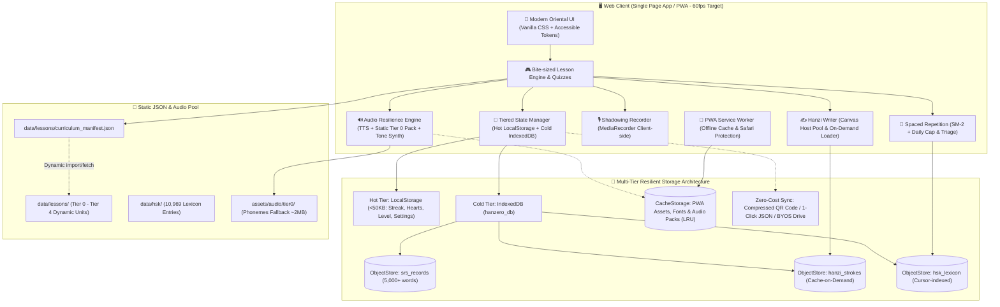

# 🛠️ Hanzero Tech Stack & Architecture Design

เอกสารนี้ระบุการตัดสินใจเลือกเทคโนโลยี (Technology Stack) และสถาปัตยกรรมระบบของ **Hanzero** โดยเน้นความเร็ว ประสบการณ์ผู้ใช้ที่ลื่นไหลระดับ 60fps ความทนทานต่อข้อผิดพลาด (Resilience) และความสามารถในการทำงานแบบ Offline-first ฟรี 100%

---

## 🏛️ System Architecture Overview

---

## 💻 การเลือกเทคโนโลยี (Tech Stack Selection)

### 1. Frontend Core & PWA
* **Framework:** **React (Vite + TypeScript)**
  * *เหตุผล:* โหลดเร็วทันใจ (Fast HMR), น้ำหนักเบา, Strict Typing ป้องกันบั๊กตั้งแต่ระดับคอมไพล์
* **PWA & Offline Installation (`vite-plugin-pwa`):**
  * ติดตั้ง Service Worker แคช Static Assets, Web Fonts และ Audio Pack
  * บรรจุ Web App Manifest (ไอคอนน้องหมีเปาเปา, Theme Color, Standalone Mode)
  * **Safari Protection:** การ Add to Home Screen ช่วยให้เว็บรอดพ้นจากนโยบาย Safari 7-Day Inactivity Purge
* **Code Quality & Testing Tooling:**
  * **Linter & Formatter:** ESLint + Prettier เพื่อความเป็นระเบียบและมาตรฐานโค้ด
  * **Test Runner:** Vitest สำหรับ Automated Unit Testing (Pure Engines ใน `src/engines/`)
* **Design & Styling (Vanilla CSS Tokens):**
  * **Design System:** สุนทรียศาสตร์เอเชียร่วมสมัย (**Modern Oriental Minimalist / Warm Ochre, Jade Green & Imperial Vermilion**)
  * **Font Subsetting Strategy (แก้ปัญหาฟอนต์ CJK ยักษ์):**
    * ภาษาไทย: `Prompt` หรือ `Noto Sans Thai`
    * อักษรจีน: `LXGW WenKai` / `Noto Sans SC` โดยใช้กลยุทธ์ **Google Fonts Dynamic Slice** หรือตัด Font Subset เฉพาะหมวดตัวอักษร HSK 1–3 เพื่อคุมขนาดไฟล์ไม่เกิน 300–500 KB ป้องกันหน้ากระพริบ (FOIT/FOUT)
    * ภาษาอังกฤษ/ตัวเลข: `Inter` หรือ `Outfit`
  * **Hanzi Legibility & Accessibility Standard:** 
    * กำหนดขนาดตัวอักษรจีนขั้นต่ำ `>= 36px` ใน Flashcard และ `>= 28px` ใน Quiz พร้อมปุ่ม Zoom Modal (120px)
    * **Color-Blind Friendly Tone Design:** ระบบแสดง 4 วรรณยุกต์ต้องใช้เครื่องหมายกำกับเสียง (Contour marks: ¯ ˊ ˇ ˋ) หรือตัวเลขควบคู่กับสีเสมอ ไม่พึ่งพาเฉพาะสีเขียว/แดง
  * **Theme & Commute Mode:** รองรับ Dark/Light Mode และสวิตช์เปิด/ปิด Silent Mode สำหรับเรียนขณะเดินทาง
  * **60fps Mobile Performance:** บังคับใช้ GPU Layer สำหรับ Card Flip และการเปลี่ยนหน้า (`will-change: transform, opacity`, `transform: translateZ(0)`) ลด Main-thread layout thrashing

### 2. Chinese Language Engines & Resilience Layer
* **✍️ Stroke Order & Handwriting:** **HanziWriter** (`hanzi-writer`)
  * แอนิเมชันลากเส้นทีละขีดตามมาตรฐาน และโหมดฝึกคัดลายมือด้วยเมาส์/นิ้ว
  * **On-Demand Stroke Caching (ไม่ Bundling ข้อมูลขีด 6MB ล่วงหน้า):** ใช้ Custom `charDataLoader` ดึงพิกัดเส้นขีดจาก CDN/Static แยกรายตัวอักษร แล้วแคชลง `IndexedDB: hanzi_strokes` ทำให้ออฟไลน์ได้ 100% หลังโหลดครั้งแรก
  * **Lifecycle Cleanup & Canvas Pool:** เคลียร์ SVG Container และ Event Listeners ทุกครั้งที่เปลี่ยนการ์ดหรือ Unmount ป้องกัน Memory Leak 100%
* **🔤 Pinyin Parser & Phonetics:** **pinyin-pro**
  * แปลงตัวอักษรจีนเป็นพินอินพร้อมวรรณยุกต์, แยกพยัญชนะ/สระ/วรรณยุกต์ และกำกับ Tone Sandhi
* **🔊 Audio & Speech Resilience Engine (`audioEngine.ts`):**
  * **4-Tier Hybrid Resilience Hierarchy:**
    1. **Tier 0 High-Fidelity Static Pack (~2MB):** ฝังไฟล์เสียงพยัญชนะ สระ และวรรณยุกต์พื้นฐานแบบบีบอัด (Opus 32kbps) สำหรับปูพื้นฐานเสียงเป๊ะ 100%
    2. **Web Speech Synthesis (TTS) สำหรับ Tier 1–4:** ใช้เสียงจีนกลาง (`zh-CN`, `cmn-Hans-CN`) ปรับ Speed ได้ (0.75x - 1.0x) ประหยัดพื้นที่จัดเก็บและแบนด์วิดท์เป็น 0 KB
    3. **Web Audio API Oscillator (0 KB SFX & Tonal Guide):** สังเคราะห์เสียง Bamboo Click, Correct Chime, Wrong Thud, Fanfare และคลื่นเสียงแนะนำระดับวรรณยุกต์
    4. **On-Demand Unit Audio Packs (Opt-in Download):** สำหรับเสียงบทสนทนายาวในระดับสูง แคชผ่าน CacheStorage พร้อมระบบ LRU Eviction กำหนดโควตารวมไม่เกิน 50 MB
  * **Singleton AudioContext & iOS Gesture Unlocker:** สร้าง AudioContext เพียง instance เดียวทั้งแอป ปลดล็อกอัตโนมัติใน First Touch ของผู้เรียน
  * **Speech Synthesis GC Workaround:** เก็บ Reference ของ `SpeechSynthesisUtterance` ใน Module-level Set เพื่อป้องกันบั๊ก Garbage Collector ของ Chrome/Safari ตัดเสียงหยุดพูดกลางประโยค
* **🎙️ Shadowing / Self-Echo Engine (Client-side):**
  * ใช้ `MediaRecorder API` บันทึกเสียงผู้เรียนสั้นๆ 2 วินาทีในหน่วยความจำชั่วคราว เพื่อเล่นเทียบกับเสียงต้นฉบับ (Echo Method) ฟรี 0 บาทโดยไม่ต้องพึ่ง Cloud AI

### 3. State Management & Resilient Storage (Tiered Storage Architecture)
* **Storage Partitioning Strategy:**
  * **Hot Tier (`LocalStorage` < 50 KB):** จัดเก็บค่าที่ต้องโหลดทันทีตอนเปิดแอป เช่น Preferences, Streak, Hearts, Current Unit ID (คีย์: `hanzero_user_state_v1`)
  * **Cold Tier (`IndexedDB`):** จัดเก็บคลังคำศัพท์ SRS (5,000+ คำ), ประวัติการทบทวนรายวัน และแคชเส้นขีดอักษรจีน เพื่อไม่ให้ชนเพดานโควตา 5MB ของ LocalStorage
* **Persistence & Portability:**
  * มีระบบ Auto-migration ข้าม Schema Version โดยไม่ทำข้อมูลผู้เรียนสูญหาย
  * **Compressed Base64 QR Sync:** ใช้ `pako` (gzip) บีบอัดความก้าวหน้าสำหรับย้ายข้ามเครื่องผ่านการสแกน QR Code ภายใน 5 วินาที
  * **1-Click JSON Backup (Export / Import):** ส่งออกและนำเข้า Snapshot ข้อมูลความก้าวหน้าได้ทุกเมื่อ
  * **Future BYOS Sync:** สถาปัตยกรรมรองรับการเชื่อมต่อ Bring-Your-Own-Storage (Google Drive AppData API) เพื่อสำรองข้อมูลระยะยาว 1-2 ปีโดยไม่มีค่าใช้จ่ายเซิร์ฟเวอร์
* **SRS Engine Optimization:**
  * คำนวณด้วยอัลกอริทึม SuperMemo SM-2
  * **Daily Review Cap (จำกัด 15–20 คำ/วัน):** ป้องกันปรากฏการณ์ SRS Overload จนผู้เรียนถอดใจ
  * **Backlog Triage Mode:** ระบบเฉลี่ยการ์ดค้างส่งเมื่อผู้เรียนหยุดเรียนไปนาน
