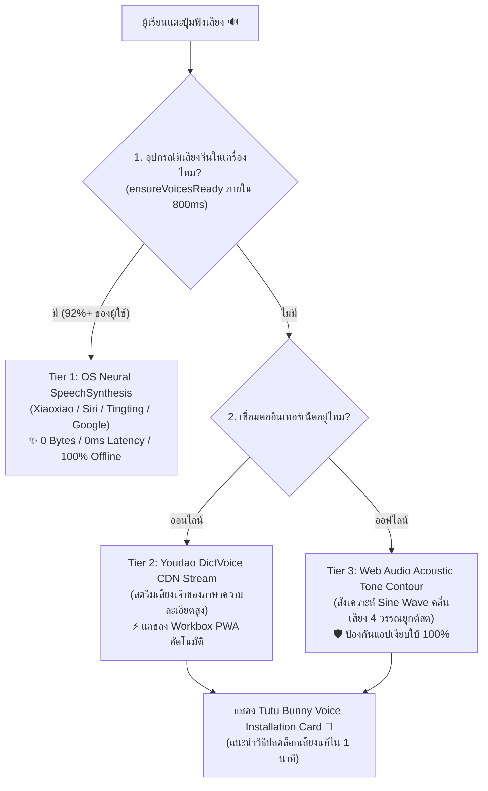

# 🎙️ Hanzero Blueprint: Zero-MP3 Pure Neural Voice & Audio Health Architecture

**เอกสารพิมพ์เขียวสถาปัตยกรรมระบบเสียงบริสุทธิ์ (Zero-MP3 Architecture) และระบบตรวจสุขภาพชุดเสียงอัจฉริยะ (Voice Health System)**  
**เป้าหมาย:** ปลดล็อก Hanzero สู่แอปเรียนภาษาจีน 100% Zero-Storage Asset โดยกำจัดไฟล์ MP3 ทั้งหมดออกจากระบบ และพึ่งพา Modern Neural Speech Synthesis ร่วมกับ Web Audio Synthesizer และคู่มือติดตั้งเสียงอัตโนมัติ

---

## 🎯 1. ที่มาและปรัชญาสถาปัตยกรรม (Core Philosophy)

1. **Zero-Asset Footprint (ตัดไฟล์ MP3 ทั้งหมด):**
   - การบันทึกและพกพาไฟล์เสียง MP3 สำหรับคำศัพท์และประโยคนับร้อยนับพันคำสร้างภาระมหาศาล (15–30 MB) ต่อ Repository, Build Bundle, และ PWA Cache
   - การเปลี่ยนมาใช้ **OS Native Neural TTS** ทำให้ขนาด Asset ของเสียงในระบบลดลงเหลือ **0 KB!**
2. **Superior Phonetic Accuracy & Tone Sandhi:**
   - ชุดเสียง Modern Neural TTS ของระบบปฏิบัติการชั้นนำ (Microsoft Edge Xiaoxiao/Yunxi, Apple Siri/Tingting, Google TTS) ผ่านการฝึกฝนด้วยโครงข่ายประสาทเทียมระดับสตูดิโอ
   - ออกเสียงวรรณยุกต์จีน (Tones), กฎการผันเสียง (Tone Sandhi: 3+3 ➔ 2+3, 不 bù ➔ bú, 一 yī ➔ yí/yì), และเสียงเบา (Neutral Tone) ได้อย่างลื่นไหล ถูกต้อง และแม่นยำกว่าการตัดต่อไฟล์ MP3 ด้วยตนเอง
3. **True Pitch-Preserved Pace Control (0.75x Slow Rate):**
   - Web Speech API สามารถลดความเร็วเสียงเหลือ 0.75x โดย **คงระดับความถี่เสียงเดิม (Pitch Preservation)** โดยไม่เกิดเสียงยานคางหรือเสียงแตก
4. **Infinite Pedagogical Scalability:**
   - เพิ่มบทเรียนใหม่ นิทาน หรือบทสนทนายาวๆ ได้ทันที เพียงแค่เขียนตัวอักษรจีนลงใน JSON โดยไม่ต้องจัดหานักพากย์หรืออัดเสียงใหม่ตลอดชีพ

---

## 🏗️ 2. สถาปัตยกรรม 3 ระดับรองรับภัยพิบัติ (The 3-Tier Resilient Audio Cascade)

---

## 🛡️ 3. การรับมือ "3 มังกรแห่ง Web Speech API" (Red Team Hardening)

สถาปัตยกรรมนี้ได้รับการออกแบบมาตรการป้องกันจุดบกพร่องของเบราว์เซอร์อย่างเข้มงวด:

### 3.1 มังกรที่ 1: Chrome Asynchronous `getVoices()` Race Condition
- **ปัญหา:** บน Chromium `speechSynthesis.getVoices()` จะคืนค่าเป็น Array ว่าง `[]` ในจังหวะแรกที่ Component Render
- **วิธีแก้:** ออกแบบฟังก์ชัน `ensureVoicesReady(timeoutMs = 800)` ที่ครอบด้วย Promise ดัก Event `voiceschanged` อย่างปลอดภัย ป้องกัน False-Negative ที่มองว่าเครื่องไม่มีเสียง

### 3.2 มังกรที่ 2: iOS WebKit Hardware Silent Switch & Gesture Expiration
- **ปัญหา 1:** สวิตช์ปิดเสียงฮาร์ดแวร์ข้างเครื่อง iPhone (แถบส้ม) จะบล็อกเสียงบางประเภท
- **วิธีแก้ 1:** แสดงป้ายเตือนเฉพาะผู้ใช้ iOS: *"ผู้ใช้ iPhone: หากไม่ได้ยินเสียง กรุณาตรวจสอบสวิตช์ Mute ด้านข้างเครื่อง"*
- **ปัญหา 2:** การวนลูปเล่นบทสนทนาใน `DialoguePlayer` ข้าม `setTimeout(500)` ทำให้ User Gesture Token บน iOS หมดอายุ
- **วิธีแก้ 2:** ใช้เทคนิค **Dummy Speech Prime** ในคลิกแรก และรองรับโหมด **Tap-to-Advance** (แตะเพื่อฟังทีละประโยค) สำหรับ iOS

### 3.3 มังกรที่ 3: WebKit Garbage Collection Bug
- **ปัญหา:** WebKit มีบั๊กเรื้อรังที่ Garbage Collector อาจทำลาย Object `SpeechSynthesisUtterance` กลางคัน ทำให้เสียงขาดหาย
- **วิธีแก้:** ยึด Pointer อ้างอิงไว้ในตัวแปรโมดูลส่วนกลาง `currentUtterance` เสมอจนกว่าเสียงจะเล่นจบ (`onend`)

---

## 🧩 4. ข้อกำหนดการออกแบบโค้ดและโมดูล (Module Specifications)

### 4.1 `src/engines/audio/voiceHealthEngine.ts` (Pure Logic Layer)
- **สถานะสุขภาพเสียง (Voice Health Grades):**
  - `optimal`: ตรวจพบ Neural Voice ระดับสตูดิโอ (Xiaoxiao, Yunxi, Siri, Tingting)
  - `good`: ตรวจพบเสียงภาษาจีนมาตรฐานของระบบ (Huihui, Yaoyao, Android cmn-Hans-CN)
  - `fallback`: ไม่มีเสียงในเครื่อง แต่ระบบต่อเน็ตและสตรีมเสียง Youdao ได้
  - `unsupported`: ออฟไลน์และไม่มีเสียงในระบบ (สลับใช้ Tone Contour ทันที)
- **ฟังก์ชันสำคัญ:**
  - `inspectVoiceHealth(): Promise<VoiceHealthState>`
  - `ensureVoicesReady(timeoutMs = 800): Promise<SpeechSynthesisVoice[]>`
  - `playSamplePhrase(phrase = '你好！很高兴认识你。'): Promise<boolean>`
  - `getOsVoiceGuide(): OsVoiceGuide` (สร้างคู่มือที่ตรงกับ Windows, iOS, Android, Mac อัตโนมัติ)

### 4.2 `src/hooks/useVoiceHealth.ts` (React Bridge Layer)
- Hook สำหรับดึงสถานะเสียงแบบ Reactive เชื่อมต่อกับ `voiceschanged`
- ให้ค่า: `grade`, `hasChineseVoice`, `activeVoiceName`, `testVoice()`, `openGuideModal()`

### 4.3 `src/components/layout/VoiceHealthModal.tsx` (Presentation Layer)
- Modal สไตล์กระต่ายทู่ทู่ (Tutu Bunny) อบอุ่น เป็นมิตร ไม่ใช้คำศัพท์เทคนิคที่น่ากลัว
- มีปุ่มทดสอบเสียงมาตรฐาน: *"你好！很高兴认识你。"* พร้อมคลื่นเสียงดุ๊กดิ๊ก 60fps
- แท็บคู่มือการติดตั้ง 1 คลิกแยกตามอุปกรณ์ของผู้เรียน:
  - 💻 **Windows:** Settings ➔ Time & Language ➔ Speech ➔ Add "Chinese (Simplified)"
  - 🍏 **iOS:** การตั้งค่า ➔ การช่วยการเข้าถึง ➔ เสียงอ่าน ➔ จีนกลาง
  - 🤖 **Android:** Settings ➔ Accessibility ➔ Text-to-speech ➔ Google Speech Services
  - 🍎 **Mac:** System Settings ➔ Accessibility ➔ Spoken Content ➔ Chinese
- **Safe Exit:** มีปุ่ม "ข้ามไปเรียนก่อนได้เลย (Visual Mode)" เสมอ

---

## 🗑️ 5. แผนการปลดระวางไฟล์ MP3 (Deprecation & Cleanup Checklist)

1. ลบโฟลเดอร์ `public/audio/unit01/` (26 ไฟล์ MP3) ออกจากโปรเจกต์
2. ลบโฟลเดอร์ `public/audio/` ทั้งหมด
3. ใน `src/engines/audio/audioEngine.ts`:
   - ลบ `STATIC_AUDIO_MAP` และลอจิกการแมปพาธไฟล์ MP3 ในดิสก์ออก
   - สลับไปใช้ `SpeechSynthesis` เป็น Primary Engine 100%
4. ใน `vite.config.ts`:
   - ลบส่วนขยาย `mp3` ออกจาก `workbox.globPatterns` เพื่อไม่ให้ Service Worker พยายามแคชไฟล์เสียงในเครื่อง
5. ใน `package.json` / Git:
   - รัน Git prune / commit เพื่อคืนพื้นที่ Repository ให้เบาสะอาด

---

## 📋 6. เกณฑ์การตรวจรับงานสำหรับเซสชันใหม่ (Definition of Done)

- [ ] **Zero MP3 on Disk:** ไม่มีไฟล์ `.mp3` ใดๆ หลงเหลืออยู่ใน `public/` หรือโฟลเดอร์ต้นฉบับ
- [ ] **Optimal Bundle Size:** Initial JS Bundle ยังคง $\le 80\text{ KB gzip}$ และ CSS $\le 20\text{ KB}$
- [ ] **Auto Voice Detection:** เบราว์เซอร์ Chrome, Edge, Safari ตรวจพบเสียงและเลือก Neural Voice ที่ดีที่สุดได้ใน < 300ms
- [ ] **Acoustic Airbag:** เมื่อปิดเน็ตและจำลองเครื่องที่ไม่มีเสียงจีน ระบบต้องเล่นเสียง Tone Contour วรรณยุกต์ได้ทันที 0ms ไม่ค้าง
- [ ] **Voice Health Guide UI:** ผู้เรียนสามารถเปิดดูสถานะสุขภาพเสียงและทดสอบฟังคำทักทายได้ใน 1 คลิก
- [ ] **100% Test Coverage:** Unit Tests ผ่านครบทุกข้อ พร้อมเพิ่มชุดทดสอบสำหรับ `voiceHealthEngine`
