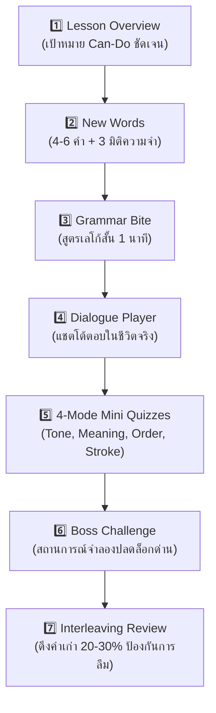

# 📚 Hanzero Lesson Architecture & Pedagogical Framework (`00_lesson_framework.md`)

> **Single Source of Truth (SSOT)** ประจำโปรเจกต์ Hanzero สำหรับมาตรฐานการออกแบบบทเรียน โครงสร้างเนื้อหา 3 ภาษา (จีน-ไทย-อังกฤษ) และหลักจิตวิทยาการสอนผู้เริ่มต้นจากศูนย์

---

## 🎯 1. วิสัยทัศน์และจิตวิทยาผู้เรียน (Zero-Knowledge Pedagogy)

ผู้เริ่มต้นเรียนภาษาจีนที่ไม่มีพื้นฐานมาก่อน (Zero-knowledge) มักเผชิญกับ **"กำแพงความกลัว 3 ด้าน (The 3 Fears)"**:
1. **กลัววรรณยุกต์:** แยกเสียงไม่ออก ผันเสียงเพี้ยน กลัวพูดผิด
2. **กลัวตัวอักษรจีน:** มองเห็นตัวอักษรจีนเป็นเพียง "กองเส้นขีดที่ยุ่งเหยิง"
3. **กลัวไวยากรณ์:** สับสนเรื่องการเรียงประโยค

### 🛡️ ปรัชญาการสอนเพื่อทลายความกลัว (Core Teaching Pillars)
* **Bite-sized Cognitive Pacing:** แต่ละบทเรียนจำกัดคำศัพท์ใหม่เพียง **4 - 6 คำ** ใช้เวลาเรียน 3 - 5 นาที จบใน 1 หน้าจอ ไม่ล้นสมอง
* **Dual-Anchor Trilingual Method:** ใช้ **ภาษาไทยเป็นสมอความเข้าใจ (Cognitive Anchor)** และใช้ **ภาษาอังกฤษเป็นตัวล็อกความแม่นยำ (Precision Anchor)**
* **Safe-to-Fail Zone:** ในระดับ Tier 0 และโหมดฝึกฟังเสียง **ห้ามตัดหัวใจเด็ดขาด (Zero Heart Deduction)**
* **No Red Cross (ห้ามกากบาทแดง):** เมื่อตอบผิด ใช้เสียงสปริงดึ๋ง แอนิเมชันน้องกระต่ายทู่ทู่ 🐰 เอียงคอสงสัย และปุ่ม *"สะกิดลองใหม่อีกทีนะคนเก่ง!"*

---

## 🏗️ 2. โครงสร้างแม่บท 7 เสาหลักของ 1 บทเรียน (The 7 Pillars)

ทุกบทเรียนในระดับ Tier 1 - 4 (Archetype B) ต้องประกอบด้วย 7 องค์ประกอบตามลำดับดังนี้:

### รายละเอียดแต่ละเสาหลัก:

#### 1. 🎯 Lesson Overview (เป้าหมาย Can-Do)
- ชื่อบทเรียน 3 ภาษา (เช่น `Unit 1.1: สวัสดี & ขอบคุณ / 初次见面 / First Greetings`)
- ภารกิจ Can-Do ที่จับต้องได้ในชีวิตจริง (เช่น *"พูดทักทายและตอบรับคำขอบคุณได้อย่างเป็นธรรมชาติ"*)

#### 2. 🔤 New Words: คลังคำใหม่ (4 - 6 คำ พร้อม 3 มิติช่วยจำ)
ทุกคำศัพท์ต้องมี:
- **Simplified Hanzi:** ตัวอักษรจีนตัวย่อ ถูกต้อง 100%
- **Pinyin พร้อมวรรณยุกต์:** แสดงตำแหน่งวรรณยุกต์ถูกต้องสากล
- **Display Pinyin:** แสดงเสียงที่ผันจริงตามกฎ Tone Sandhi (เช่น `不客气` -> `bú kèqi`)
- **Thai Meaning (ภาษาพูดธรรมชาติ):** ไม่แปลแข็งทื่อ
- **English Meaning (คำจำกัดความสากล):** เช่น `想 (to miss / to want)` vs `要 (to want / to need)`
- **Radical & Stroke Count:** หมวดนำพร้อมความหมายรากศัพท์
- **Kid Mnemonic (นิทานภาพจำ):** เช่น `好` (แม่ `女` กอดลูก `子` = เรื่องดีๆ)
- **Body Gesture (ภาษากายขยับจำ):** ท่าทางร่างกายประกอบการออกเสียง

#### 3. 🧩 Grammar Bite (สูตรเลโก้ไวยากรณ์ 1 นาที)
- เทียบโครงสร้าง 3 ภาษา (จีน vs ไทย vs อังกฤษ)
- แสดงสูตรเลโก้สำเร็จรูป (Lego Formula) เช่น `[ประธาน] + [สถานที่] + [กริยา] + [กรรม]`
- กล่องปลอบใจ (Reassurance Box): สรุปข้อยกเว้นหรือความต่างแบบไม่เครียด

#### 4. 💬 Dialogue Player (บทสนทนาจำลองในชีวิตจริง)
- สนทนาสลับฝั่ง A-B สไตล์แชตโมเดิร์น
- เล่นเสียง Native Voice ต่อเนื่องพร้อมไฮไลต์คาราโอเกะ
- ปุ่มสลับมุมมอง 3 ระดับ: "จีน+พินอิน+ไทย", "จีน+พินอิน", "จีนล้วน"

#### 5. 🎮 4-Mode Interactive Mini Quizzes
- **Mode 1 (Tone & Sound Matcher):** ฟังเสียงแล้วเลือกพินอิน/วรรณยุกต์
- **Mode 2 (Word Meaning Match):** จับคู่ตัวอักษรจีนกับความหมายภาษาไทย
- **Mode 3 (Sentence Builder):** แตะบล็อกคำเรียงประโยคที่ถูกต้อง
- **Mode 4 (Mini Hanzi Stroke):** ตรวจสอบลำดับขีดตัวอักษรสำคัญ 1 ตัว
- *Silent Mode Support:* สลับโหมดเงียบอัตโนมัติเมื่อผู้เรียนอยู่ในที่สาธารณะ

#### 6. 🏯 Boss Challenge (ด่านทดสอบปิดท้าย)
- จำลองสถานการณ์สนทนาต่อเนื่อง 3-4 บทพูดแบบ Interactive
- เมื่อผ่านสำเร็จ แสดงหน้าต่างชัยชนะพร้อมบัตรเกียรติยศ (Milestone Badge)

#### 7. 🔄 Interleaving Retention (ดึงคำเก่า 20 - 30%)
- สอดแทรกคำศัพท์จาก Unit ก่อนหน้า 1-2 ข้อในทุก Quiz เพื่อกระตุ้น Active Retrieval ตามเส้นโค้งการลืมของ Ebbinghaus

---

## 🎭 3. นิยามแม่แบบบทเรียน 2 รูปแบบ (Dual Lesson Archetypes)

| องค์ประกอบ | Archetype A (Tier 0: Phonics & Hanzi Strokes) | Archetype B (Tier 1–4: Communication Lessons) |
| :--- | :--- | :--- |
| **กลุ่มเป้าหมาย** | ปูพื้นฐานเสียงพินอินและ 8 เส้นขีดอักษรจีน | สร้างบทสนทนา ไวยากรณ์ และคำศัพท์สื่อสาร |
| **การตัดหัวใจ** | ❌ **Safe Practice Zone (ไม่ตัดหัวใจ 100%)** | ✅ ตัดหัวใจเมื่อตอบผิด (เติมหัวใจด้วยการทบทวน) |
| **โครงสร้างข้อมูลหลัก** | `sound_cards`, `stroke_cards`, `tone_slider` | `vocabulary`, `grammar_bite`, `dialogue`, `quizzes` |
| **เกมประจำกลุ่ม** | Bunny Tone Coaster, Stroke Order Tracer, Echo Mic | Sentence Scramble, Word Match, Boss Dialogue |

---

## 🇨🇳 4. กฎการผันเสียงวรรณยุกต์ที่โปร่งใส (Pedagogical Tone Sandhi)

1. **กฎ 3 + 3 ➔ 2 + 3:**
   - คำคู่เสียงสามติดกัน ตัวหน้าต้องออกเสียงเป็นเสียงสอง
   - *ตัวอย่าง:* `你好` เขียนรูปพินอินแม่บทว่า `nǐ hǎo` แต่ในระบบเสียงและการแสดงผลสำหรับผู้เริ่มต้น ต้องกำกับ Display Pinyin เป็น **`ní hǎo`**
2. **กฎการเปลี่ยนเสียงของ 不 (bù):**
   - เมื่ออยู่หน้าพยางค์เสียงสี่ `不` จะเปลี่ยนเป็นเสียงสอง `bú`
   - *ตัวอย่าง:* `不是` (`bú shì`), `不客气` (`bú kèqi`)
3. **กฎการเปลี่ยนเสียงของ 一 (yī):**
   - เมื่ออยู่หน้าเสียงสี่ เปลี่ยนเป็นเสียงสอง `yí` (เช่น `一块` -> `yí kuài`)
   - เมื่ออยู่หน้าเสียงหนึ่ง/สอง/สาม เปลี่ยนเป็นเสียงสี่ `yì` (เช่น `一天` -> `yì tiān`)

---

## 📋 5. เกณฑ์การตรวจรับด้านการเรียนการสอน (Pedagogical Definition of Done)

ก่อนนำเข้าไฟล์ JSON บทเรียนเข้าสู่ระบบ:
- [ ] ตัวอักษรจีนเป็น **ตัวย่อ (Simplified Chinese)** 100% ไร้ตัวเต็มปะปน
- [ ] เครื่องหมายวรรณยุกต์วางบนสระที่ถูกต้องตามลำดับสากล: `a > o > e > i / u / ü`
- [ ] มีคำแปลไทยเป็นภาษาพูดที่เป็นธรรมชาติ และมีคำแปลอังกฤษสากลกำกับควบคู่
- [ ] มีฟิลด์ `kid_mnemonic` และ `body_gesture` สำหรับการ์ดคำศัพท์ทุกใบ
- [ ] มีการสอดแทรกคำศัพท์เก่า 20-30% ในแบบทดสอบตามกฎ Interleaving
