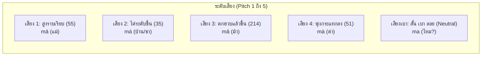

# 🎙️ Hanzero Pinyin Mastery System (ระบบแม่บทการออกเสียงพินอิน)

เอกสารนี้คือ **พิมพ์เขียวระบบเสียงพินอิน (Hanyu Pinyin)** สำหรับหลักสูตร Hanzero ออกแบบมาสำหรับ **ผู้เริ่มต้นความรู้เป็น 0 (Zero-Knowledge Learners)** โดยเน้นการเทียบเคียงกับฐานเสียงภาษาไทยและสากล พร้อมจุดสังเกตและข้อควรระวังที่คนไทยมักออกเสียงผิด

---

## 🧭 ปรัชญาการสอนพินอินของ Hanzero: "ฟังออก - วางลิ้นถูก - ผันแม่นยำ"

1. **ไม่สอนแบบท่องจำตัวอักษรละตินตามภาษาอังกฤษ:** พินอินเป็นเพียงสัญลักษณ์แทนเสียงภาษาจีน ห้ามอ่านด้วยสำเนียงอังกฤษ (เช่น `e` ไม่ใช่ "อี", `c` ไม่ใช่ "ซี")
2. **เทียบเคียงเสียงไทยอย่างมีวิจารณญาณ:** นำเสียงพยัญชนะ/สระไทยมาเทียบเคียงเพื่อให้เริ่มต้นได้เร็ว แต่ชี้ชัดตำแหน่งลิ้นและรูปปากที่ต่างจากภาษาไทย
3. **จำแนกคู่เสียงพ่นลม (Aspirated) vs ไม่พ่นลม (Unaspirated):** ซึ่งเป็นหัวใจสำคัญของการฟังคนจีนพูดรู้เรื่อง
4. **Interactive Waveform & Tone Pitch Guide:** จำลองระดับเสียงสูง-ต่ำเป็นระดับ 1-5 (Five-degree Tone System)

---

## 1. 🗣️ พยัญชนะต้น 21 ตัว + กึ่งสระ 2 ตัว (Initials: 声母)

แบ่งเป็น 6 กลุ่มตามฐานกรณ์ (ตำแหน่งที่เกิดเสียงในช่องปาก):

### กลุ่มที่ 1: ริมฝีปาก (Lips / 双唇音 & 唇齿音)
| Pinyin | เทียบเสียงไทย | วิธีออกเสียง & ตำแหน่งปาก | ตัวอย่างคำ |
| :---: | :---: | :--- | :--- |
| **b** | ป (ไม่พ่นลม) | ริมฝีปากบน-ล่างประกบกัน กักลมแล้วปล่อย ไม่พ่นลมแรง | 爸爸 (bàba - พ่อ) |
| **p** | พ (พ่นลมแรง) | ตำแหน่งเดียวกับ b แต่พ่นลมกระแทกออกมาอย่างชัดเจน | 苹果 (píngguǒ - แอปเปิล) |
| **m** | ม (เสียงขึ้นจมูก) | ริมฝีปากปิด ลมออกทางจมูก | 妈妈 (māma - แม่) |
| **f** | ฟ | ฟันบนแตะริมฝีปากล่าง ลมเสียดแทรกออกมา | 发票 (fāpiào - ใบเสร็จ) |

### กลุ่มที่ 2: ปลายลิ้นแตะปุ่มเหงือก (Tongue Tip / 舌尖中音)
| Pinyin | เทียบเสียงไทย | วิธีออกเสียง & ตำแหน่งปาก | ตัวอย่างคำ |
| :---: | :---: | :--- | :--- |
| **d** | ต (ไม่พ่นลม) | ปลายลิ้นแตะปุ่มเหงือกบน ปล่อยลมเบาๆ ไม่พ่นลม | 大 (dà - ใหญ่) |
| **t** | ท (พ่นลมแรง) | ปลายลิ้นแตะปุ่มเหงือกบน พ่นลมแรงออกมา | 他 (tā - เขา) |
| **n** | น | ปลายลิ้นแตะปุ่มเหงือก ลมออกจมูก | 你 (nǐ - เธอ) |
| **l** | ล | ปลายลิ้นแตะปุ่มเหงือก ลมออกข้างลิ้น | 老师 (lǎoshī - ครู) |

### กลุ่มที่ 3: โคนลิ้นแตะเพดานอ่อน (Back Tongue / 舌根音)
| Pinyin | เทียบเสียงไทย | วิธีออกเสียง & ตำแหน่งปาก | ตัวอย่างคำ |
| :---: | :---: | :--- | :--- |
| **g** | ก (ไม่พ่นลม) | โคนลิ้นยกแตะเพดานอ่อน ลมไม่พ่นออก | 哥哥 (gēge - พี่ชาย) |
| **k** | ค (พ่นลมแรง) | โคนลิ้นยกแตะเพดานอ่อน พ่นลมออกมาแรงๆ | 看 (kàn - ดู) |
| **h** | ฮ (เสียดแทรกโคนลิ้น) | ลมเสียดแทรกผ่านระหว่างโคนลิ้นกับเพดานอ่อน (ลึกกว่า ฮ ไทย) | 好 (hǎo - ดี) |

### กลุ่มที่ 4: หน้าลิ้นแตะเพดานแข็ง (Tongue Face / 舌面前音)
> ⚠️ **จุดระวังพิเศษ:** ต้องยิ้มเห็นฟัน ฉีกยิ้มกว้างๆ ลิ้นแตะฟันล่าง
| Pinyin | เทียบเสียงไทย | วิธีออกเสียง & ตำแหน่งปาก | ตัวอย่างคำ |
| :---: | :---: | :--- | :--- |
| **j** | จ (เบาๆ ไม่อูมปาก) | ยิ้มกว้าง หน้าลิ้นแนบเพดานแข็ง ปล่อยลมเบาๆ | 叫 (jiào - เรียก/ชื่อ) |
| **q** | ช (พ่นลมแรง + ยิ้ม) | หน้าลิ้นแนบเพดานแข็ง พ่นลมแรงลอดไรฟัน (ฉีกยิ้ม) | 钱 (qián - เงิน) |
| **x** | ซ (เสียดแทรก + ยิ้ม) | หน้าลิ้นใกล้เพดานแข็ง ลมพ่นแทรกออกมา (คล้ายเสียง "ชี่" ผสม "ซี่") | 谢谢 (xièxie - ขอบคุณ) |

### กลุ่มที่ 5: ลิ้นม้วนแตะเพดานแข็ง (Retroflex / 舌尖后音 - "กลุ่มลิ้นม้วนห่อ")
> 🌟 **หัวใจสำเนียงจีนปักกิ่ง:** ปลายลิ้นต้องกระดกม้วนขึ้นด้านบน ไม่แตะโดนเพดาน
| Pinyin | เทียบเสียงไทย | วิธีออกเสียง & ตำแหน่งปาก | ตัวอย่างคำ |
| :---: | :---: | :--- | :--- |
| **zh** | จ (ม้วนลิ้น) | ยกปลายลิ้นงอไปด้านหลังแตะเพดานแข็ง ไม่พ่นลม | 中国 (Zhōngguó - ประเทศจีน) |
| **ch** | ช (ม้วนลิ้น + พ่นลม) | ตำแหน่งเดียวกับ zh แต่พ่นลมออกมาแรง | 吃 (chī - กิน) |
| **sh** | ช/ษ (ม้วนลิ้นเสียดแทรก) | ปลายลิ้นงอขึ้นเกือบแตะเพดานแข็ง พ่นลมผ่าน (เสียงคล้าย Sh ภาษาอังกฤษ) | 是 (shì - คือ/ใช่) |
| **r** | ย ผสม ร (โคนลิ้นสั่น) | ลิ้นม้วนขึ้นเหมือน sh แต่เปล่งเสียงก้องในลำคอ คล้าย ร ม้วนลิ้นนุ่มๆ | 人 (rén - คน) |

### กลุ่มที่ 6: ปลายลิ้นดันฟันหน้า (Flat Tongue / 舌尖前音 - "กลุ่มฟันชิด")
> ⚠️ **ความต่างกับกลุ่มม้วนลิ้น:** ปลายลิ้นต้องแบนราบ แตะที่หลังฟันล่าง/ฟันบน ห้ามม้วนลิ้นเด็ดขาด!
| Pinyin | เทียบเสียงไทย | วิธีออกเสียง & ตำแหน่งปาก | ตัวอย่างคำ |
| :---: | :---: | :--- | :--- |
| **z** | ซ/จ (กึ่ง จ กับ ซ) | ปลายลิ้นแตะหลังฟันบน ปล่อยลมเบาๆ เสียงกระแทกสั้น | 在 (zài - อยู่/ที่) |
| **c** | ช/ซ (พ่นลมแรง) | ปลายลิ้นแตะหลังฟันบน พ่นลมแรงพุ่งออกมา | 菜 (cài - อาหาร/ผัก) |
| **s** | ซ (เสียดแทรก) | ปลายลิ้นแตะโคนฟันล่าง ปล่อยลมเสียดแทรกผ่านไรฟัน | 三 (sān - สาม) |

### กึ่งสระ (Zero-initials / Half-vowels)
* **y** = เทียบเท่าเสียง "ย" หรือใช้แทนสระ i นำหน้า (เช่น yī, yà)
* **w** = เทียบเท่าเสียง "ว" หรือใช้แทนสระ u นำหน้า (เช่น wǒ, wǔ)

---

## 2. 🎵 สระเดี่ยว 6 ตัว & สระผสมสำคัญ (Finals: 韵母)

### 2.1 สระเดี่ยว 6 ตัวหลัก (Simple Finals)
ลำดับของสระเดี่ยวนี้สำคัญมากสำหรับการใส่เครื่องหมายวรรณยุกต์ (a > o > e > i > u > ü):

| Pinyin | เทียบเสียงไทย | รูปปากและกลเม็ด |
| :---: | :---: | :--- |
| **a** | อา | อ้าปากกว้างที่สุด ลิ้นวางระนาบต่ำ |
| **o** | ออ (กึ่ง โอ) | ปากห่อกลม ลิ้นถอยไปข้างหลัง |
| **e** | เออ (กึ่ง เออะ) | ปากกว้างปานกลาง ลิ้นถอยไปข้างหลัง (ไม่ใช่เสียง "อี" หรือ "เอ") |
| **i** | อี | ฉีกยิ้มกว้าง ปลายลิ้นแตะหลังฟันล่าง |
| **u** | อู | ห่อปากกลมเล็ก ยื่นริมฝีปากไปข้างหน้า |
| **ü** | อวี (อู+อี) | 🌟 **เคล็ดลับเด็ด:** ทำปากจู๋รูปตัว "u" แต่ในลำคอเปล่งเสียง "i" โดยห้ามขยับริมฝีปาก! |

### 2.2 สระผสมและเสียงตัวสะกดที่พบบ่อย (Compound & Nasal Finals)
* **ai** = ไอ (爱 ài - รัก)
* **ei** = เอ (杯 bēi - แก้ว)
* **ao** = เอา / อาว (包 bāo - ซาลาเปา)
* **ou** = โอว (狗 gǒu - หมา)
* **an** = อัน (安 ān - ปลอดภัย)
* **en** = เอิน (门 mén - ประตู)
* **ang** = อาง (忙 máng - ยุ่ง)
* **eng** = เอิง (朋 péng - เพื่อน)
* **ong** = อง (红 hóng - แดง)
* **er** = เออร์ (ม้วนลิ้น เช่น 二 èr - สอง)

---

## 3. 🎼 ระบบ 4 วรรณยุกต์ + เสียงเบา (The 4 Tones & Neutral Tone)

ภาษาจีนเป็นภาษาที่มีวรรณยุกต์ (Tonal Language) หากวรรณยุกต์เปลี่ยน ความหมายจะเปลี่ยนทันที:
> เช่น **mā** (แม่), **má** (ป่าน/ชา), **mǎ** (ม้า), **mà** (ด่า)

| วรรณยุกต์ | สัญลักษณ์ | กราฟระดับเสียง | เทียบเสียงวรรณยุกต์ไทย | ตัวอย่าง |
| :---: | :---: | :---: | :--- | :--- |
| **เสียงที่ 1** | **ā** | 55 (สูง-ราบ) | เสียง **สามัญ (แต่คีย์เสียงสูงกว่า)** ร้องลากเสียงราบเรียบ | 妈 mā |
| **เสียงที่ 2** | **á** | 35 (กลาง-ขึ้นสูง) | เสียง **จัตวา** คล้ายการถามเอ๊ะ? "หา? จริงเหรอ?" | 麻 má |
| **เสียงที่ 3** | **ǎ** | 214 (ต่ำ-แล้วเด้ง) | เสียง **เอก ลากลงต่ำสุด แล้วตวัดหางขึ้น** | 马 mǎ |
| **เสียงที่ 4** | **à** | 51 (สูง-ดิ่งต่ำ) | เสียง **โท สั้น ห้วน กระแทกเสียงตก** คล้ายตะโกน "ไม่!" | 骂 mà |
| **เสียงเบา (Neutral)** | ไม่มีขีด | จุดสั้นๆ | ออกเสียงเพียงครึ่งเสียง เบาและสั้นเหมือนสะบัดเสียงทิ้ง | 吗 ma |

---

## 4. ⚡ กฎการผันเสียงสำคัญ (Crucial Tone Sandhi Rules) & แผนการสอนแบบเกลียววน (Spiral Learning)

> 💡 **กลยุทธ์การสอนของ Hanzero:** เพื่อไม่ให้ผู้เรียนสมองล้น (Cognitive Overload) เราจะไม่จับกฎทั้งหมดมาสอนพร้อมกันในคาบเดียว แต่จะใช้ **"Spiral Just-in-Time Learning"** กระจายไปสอนในจังหวะที่ผู้เรียนพบคำศัพท์จริงในชีวิตประจำวัน:

### กฎข้อที่ 1: เสียงสามชนเสียงสาม (3 + 3 ➔ 2 + 3) *(สอนใน Unit 0.3)*
เมื่อตัวอักษรเสียงที่ 3 อยู่ติดกัน 2 ตัว ตัวแรกจะเปลี่ยนเป็น **เสียงที่ 2** อัตโนมัติ:
* `你 (nǐ) + 好 (hǎo)` ➔ ออกเสียงว่า **"ní hǎo" (หนีห่าว)**
* `水 (shuǐ) + 果 (guǒ)` ➔ ออกเสียงว่า **"shuí guǒ" (สุ๋ยกั่ว)**

#### 🌟 กฎเสริมสำคัญ: เสียงสามชนกัน 3 คำขึ้นไป (Syntactical Branching)
เมื่อมีเสียง 3 ติดกัน 3 พยางค์ การผันขึ้นอยู่กับ **โครงสร้างคำ/ประโยค**:
* **[ประธาน] + [วลีกริยา/คุณศัพท์] (1 + 2):** เช่น `我 (wǒ) + 很好 (hěn hǎo)` ➔ ผันเป็น **3 + 2 + 3** (`wǒ hén hǎo`) ในการพูดช้า หรือ **2 + 2 + 3** (`wó hén hǎo`) ในการพูดเร็วปกติ
* **[วลี 2 คำแรก] + [คำหลัง] (2 + 1):** เช่น `买水饺` (mǎi shuǐjiǎo) ➔ ผันเป็น **2 + 2 + 3** (`mái shuí jiǎo`)

### กฎข้อที่ 2: เสียงสามครึ่งเสียง (Half-Third Tone: 半三声) *(หัวใจสำคัญของการพูดให้เป็นธรรมชาติ)*
> ⚠️ **คนไทยมักเข้าใจผิดว่าเสียง 3 ต้องออกเสียงเต็ม (214: ดิ่งแล้วตวัดขึ้น) ตลอดเวลา!**  
> ในความเป็นจริง เสียง 3 จะออกเต็มรูป (214) เฉพาะเมื่ออยู่เดี่ยวๆ หรืออยู่ท้ายประโยคเท่านั้น!
* **กฎ:** เมื่อเสียง 3 อยู่หน้า **เสียง 1, เสียง 2, เสียง 4 หรือเสียงเบา** ➔ ออกเสียงเฉพาะ **ครึ่งแรก (211 หรือ 21: ทิ้งเสียงลงต่ำห้วน)** โดย **ไม่ตวัดหางเสียงขึ้นเด็ดขาด**:
  * อยู่หน้าเสียง 1: `北京` (Běijīng) ➔ Běi (เสียงต่ำ) + jīng (เสียงสูง)
  * อยู่หน้าเสียง 2: `好人` (hǎorén) ➔ hǎo (เสียงต่ำ) + rén (เสียงขึ้น)
  * อยู่หน้าเสียง 4: `好看` (hǎokàn) ➔ hǎo (เสียงต่ำ) + kàn (เสียงทิ้งดิ่ง)
  * อยู่หน้าเสียงเบา: `好吗` (hǎo ma) ➔ hǎo (เสียงต่ำ) + ma (เสียงเบา)

### กฎข้อที่ 3: กฎการเปลี่ยนเสียงของคำว่า "不" (bù - ไม่) *(สอนใน Unit 1.1 & 1.3)*
* ปกติออกเสียงเดิม **เสียงที่ 4 (bù)** เมื่ออยู่หน้าเสียง 1, 2, 3 เช่น 不吃 (bù chī), 不好 (bù hǎo)
* เมื่ออยู่หน้าคำที่เป็น **เสียงที่ 4** เหมือนกัน ➔ เปลี่ยนเป็น **เสียงที่ 2 (bú)**  
  เช่น `不 (bù) + 是 (shì)` ➔ **bú shì** (ไม่ใช่)  
  เช่น `不 (bù) + 客气 (kèqi)` ➔ **bú kèqi** (ไม่เป็นไร)
* ⚡ **ข้อยกเว้นสำคัญ (ออกเป็นเสียงเบา Neutral Tone: bu):**
  1. **โครงสร้างคำถามแบบ A-not-A:** เช่น `好不好` (hǎo bu hǎo), `是不是` (shì bu shì), `吃不吃` (chī bu chī) ➔ "不" จะเบาสั้น ไม่ใส่เสียง 4 หรือ 2
  2. **คำช่วยเสริมบอกผล (Complements):** เช่น `看不见` (kàn bu jiàn - มองไม่เห็น), `买不起` (mǎi bu qǐ - ซื้อไม่ไหว) ➔ "不" ออกเป็นเสียงเบา

### กฎข้อที่ 4: กฎการเปลี่ยนเสียงของคำว่า "一" (yī - หนึ่ง) *(สอนใน Unit 2.1 & 4.1)*
* หากอยู่เดี่ยวๆ หรือนับเลข ➔ ออกเสียงเดิม **เสียง 1 (yī)** เช่น 星期一 (xīngqīyī)
* เมื่ออยู่หน้าคำที่เป็น **เสียงที่ 4** ➔ เปลี่ยนเป็น **เสียงที่ 2 (yí)**  
  เช่น `一 + 块 (kuài)` ➔ **yí kuài** (หนึ่งหยวน), `一 + 定 (dìng)` ➔ **yí dìng** (แน่นอน)
* เมื่ออยู่หน้าคำที่เป็น **เสียง 1, 2, 3** ➔ เปลี่ยนเป็น **เสียงที่ 4 (yì)**  
  เช่น `一 + 起 (qǐ)` ➔ **yì qǐ** (ด้วยกัน), `一 + 天 (tiān)` ➔ **yì tiān** (หนึ่งวัน)
* ⚡ **ข้อยกเว้นสำคัญที่ต้องคงเสียง 1 (yī) หรือออกเสียงอื่น:**
  1. **ลำดับที่ (Ordinal Numbers):** เช่น `第一` (dì-yī - ที่หนึ่ง) ➔ คงเสียง 1 เสมอ
  2. **วันที่และเดือน:** เช่น `一月` (yīyuè - มกราคม), `十一` (shíyī - สิบเอ็ด) ➔ คงเสียง 1 เสมอ แม้อยู่หน้าเสียง 4
  3. **หมายเลขโทรศัพท์ / ห้องพัก / ปี ค.ศ.:** มักอ่าน `一` เป็น **yāo** (เสียง 1) เพื่อแยกจากเสียง `七 (qī)` เช่น ห้อง 101 = yāo líng yāo
  4. **กริยาซ้ำรูป (A-一-A):** เช่น `看一看` (kàn yi kàn), `等一等` (děng yi děng) ➔ "一" ออกเป็น **เสียงเบา (Neutral Tone: yi)**

---

## 5. 🏷️ มาตรฐานการแสดงผลและจัดเก็บพินอินในระบบ Hanzero (Pinyin Representation Standard)

เพื่อความแม่นยำทางภาษาศาสตร์และการตรวจสอบคำตอบในระบบ Quiz / SRS ที่ไม่ผิดเพี้ยน ระบบ Hanzero ใช้เกณฑ์มาตรฐานแบบ **Dual Pinyin Field**:
1. **`pinyin` (Standard Dictionary Form):** บันทึกตามพจนานุกรมทางการ (GB/T 16159-2012) โดย **คงรูปวรรณยุกต์เดิมของคำศัพท์เดี่ยวเสมอ** เช่น `nǐ hǎo`, `bù kèqi`, `yī kuài` ใช้สำหรับระบบค้นหา, ดัชนี HSK และการตรวจคำตอบพิมพ์พินอิน
2. **`display_pinyin` (Pedagogical Sandhi Form):** แสดงรูปวรรณยุกต์ที่เปลี่ยนตามกฎผันเสียงจริง เช่น `bú kèqi`, `yí kuài` ใช้สำหรับแสดงบนการ์ดคำศัพท์สำหรับผู้เริ่มต้น และส่งข้อความให้ TTS สังเคราะห์เสียงตรงเป๊ะ
3. **สำหรับ 3+3 (เช่น 你好):** ให้แสดงรูปวรรณยุกต์เดิม `nǐ hǎo` เสมอตามหลักสากล แต่ในโหมดเสียง (Audio) และเกร็ดความรู้ ให้มีสัญลักษณ์รูปคลื่นบอกการผันเป็น `ní hǎo`

---

## 6. ✏️ กฎการสะกดพินอินที่ผู้เรียนมักสับสน (Spelling Traps)

1. **จุดบนหัว ü หายไปเมื่อเจอกับ j, q, x:**
   * `j + ü` ➔ เขียนเป็น **ju** (แต่อ่านออกเสียงสระ ü)
   * `q + ü` ➔ เขียนเป็น **qu** (แต่อ่านออกเสียงสระ ü)
   * `x + ü` ➔ เขียนเป็น **xu** (แต่อ่านออกเสียงสระ ü)
   * *กลอนช่วยจำ: "j, q, x ตัวแสบ เจอตาของน้อง ü ทีไร ควักตาหลุดทุกที"*
   * แต่ถ้าเจอกับ `l` และ `n` ตาจุดยังอยู่: **nǚ** (ผู้หญิง), **lǜ** (เขียว)

2. **รูปสระที่ลดรูปเมื่อมีพยัญชนะนำหน้า:**
   * `iou` ➔ ลดรูปเหลือ **iu** (เช่น `d + iou` ➔ **diū**)
   * `uei` ➔ ลดรูปเหลือ **ui** (เช่น `g + uei` ➔ **guī**)
   * `uen` ➔ ลดรูปเหลือ **un** (เช่น `l + uen` ➔ **lún**)

---

## 🎯 แผนผังการสอนพินอินในบทเรียน Tier 0 (Bite-sized Dual-Track 6 Units)

| Unit | หัวข้อ | เนื้อหาการเรียนรู้ระบบเสียง & เส้นขีด | คำศัพท์จริงที่ได้พูดทันที (Dual-Track) |
| :---: | :--- | :--- | :--- |
| **0.1** | พยัญชนะริมฝีปาก & ปลายลิ้น | b, p, m, f, d, t, n, l + สระเดี่ยว a, o, e + เส้นขีด 横, 竖 | 爸爸 (bàba), 妈妈 (māma), 大 (dà), 十 (shí) |
| **0.2** | พยัญชนะโคนลิ้น & ลมพ่น | g, k, h, j, q, x + สระเดี่ยว i, u, ü + เส้นขีด 撇, 捺 + หมวดนำ 亻, 女 | 你 (nǐ), 好 (hǎo), 喝 (hē), 七 (qī) |
| **0.3** | 4 วรรณยุกต์ & เสียง 3 ชน 3 | ā, á, ǎ, à, เสียงเบา + เส้นขีด 提, 点 + หมวดนำ 口, 子 + มินิเกม Bunny Tone Coaster | 你好 (ní hǎo - สวัสดี!), 吗 (ma), 字 (zì) |
| **0.4** | ลิ้นม้วน (zh, ch, sh, r) vs ลิ้นแบน (z, c, s) | แยกคู่เสียงปราบเซียน + เส้นขีด 折, 钩 + หมวดนำ 氵, 木 | 是 (shì), 人 (rén), 吃 (chī), 在 (zài), 水 (shuǐ) |
| **0.5** | สระผสมลดรูป & สระนาสิก | สระ iu, ui, un, an, en, ang, eng, ong + หมวดนำ 饣, 辶, 宀, 门 | 饭 (fàn), 这 (zhè), 家 (jiā), 问 (wèn) |
| **0.6** | 7 กฎทองลำดับขีด & ประกอบเลโก้อักษรจีน | บูรณาการ 8 เส้นขีด 40 หมวดนำ + ทายเสียงถอดรหัสอักษรจีน | 🏆 **Tier 0 Grand Boss Quest:** "ไขรหัสลับน้องกระต่ายทู่ทู่" พิชิต 5 อักษรจีนแรกในชีวิต |
