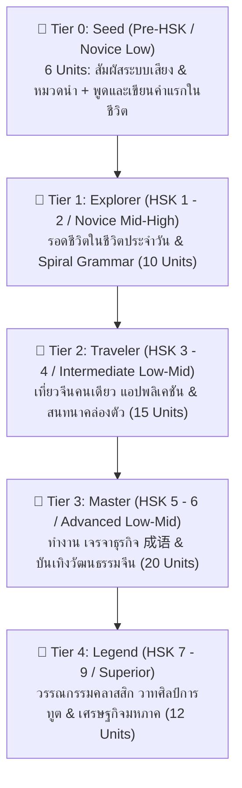
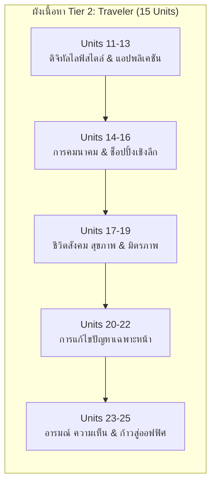
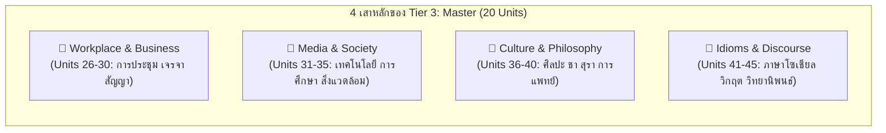
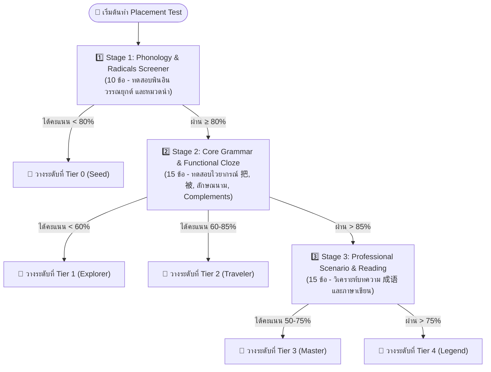
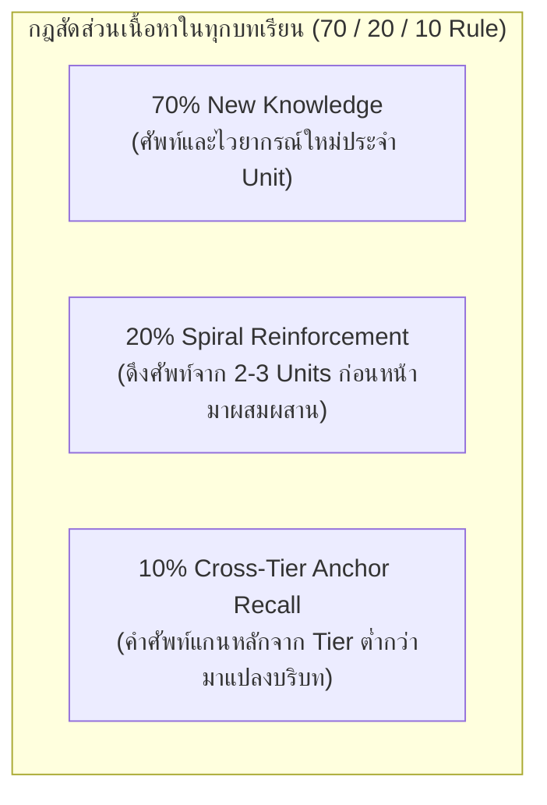

# 🗺️ Hanzero Curriculum Roadmap & Lesson Units (แม่บทโครงสร้างหลักสูตรบันได 5 ขั้น)

โครงสร้างหลักสูตรของ Hanzero จัดระเบียบการเรียนรู้แบบ **3 ภาษา (🇨🇳 จีน - 🇹🇭 ไทย - 🇬🇧 อังกฤษ)** แบ่งเป็นบันได 5 ขั้น (Tiers 0 ถึง 4) และย่อยเป็น Unit และ Bite-sized Lessons (3-5 นาทีต่อบท) ตามมาตรฐานสากล **HSK 3.0 (2021)** และ **ACTFL Proficiency Guidelines** สำหรับผู้เริ่มต้นที่ความรู้เป็นศูนย์โดยเฉพาะ

---

## 🌟 ภาพรวมผังบันไดการเรียนรู้ (Curriculum Levels Overview)



---

## 🌱 Tier 0: Seed (Pre-HSK / Novice Low: Dual-Track เสียงคู่ตัวอักษร 6 Units)
> **เป้าหมาย Can-Do:** ฟังออก ผันวรรณยุกต์แม่นยำ เข้าใจระบบ 8 เส้นขีดและหมวดนำ ไม่กลัวตัวอักษรจีน ออกเสียงและประกอบร่าง 15 ตัวอักษรจีนแรกสำเร็จ  
> **หลักการสำคัญ:** ไม่เรียนทฤษฎีเสียงแห้งๆ แต่ใช้หลัก **"Dual-Track"** เรียนเสียงคู่คำจริง และสะสมชิ้นส่วนเลโก้อักษรจีนอย่างเป็นระบบ  
> **เอกสารอ้างอิง:** [01_pinyin_system.md](file:///c:/DevProjects/hanzero/hanzero/docs/curriculum/01_pinyin_system.md) และ [02_radical_basics.md](file:///c:/DevProjects/hanzero/hanzero/docs/curriculum/02_radical_basics.md)

* **Unit 0.1:** เสียงริมฝีปาก & ปลายลิ้น (b, p, m, f, d, t, n, l) + สระเดี่ยว (a, o, e) + เส้นขีด 横 (นอน), 竖 (ตั้ง)  
  * 🔤 *คำแรกในชีวิต:* **爸爸** (bàba - พ่อ), **妈妈** (māma - แม่), **大** (dà - ใหญ่), **十** (shí - สิบ)
* **Unit 0.2:** เสียงโคนลิ้น & ลมพ่น (g, k, h, j, q, x) + สระเดี่ยว (i, u, ü) + เส้นขีด 撇 (ปัดซ้าย), 捺 (ตวัดขวา) + หมวดนำ 亻(คน), 女 (หญิง)  
  * 🔤 *คำแรกในชีวิต:* **你** (nǐ - คุณ), **好** (hǎo - ดี), **喝** (hē - ดื่ม), **七** (qī - เจ็ด)
* **Unit 0.3:** 4 วรรณยุกต์ (ā, á, ǎ, à) + เสียงเบา + เส้นขีด 提 (ตวัดขึ้น), 点 (จุด) + หมวดนำ 口 (ปาก), 子 (เด็ก) + มินิเกม **Panda Tone Coaster**  
  * ⚡ *กฎผันเสียงแรกพบ:* กฎเสียง 3 ชน 3 (3+3 ➔ 2+3: **nǐ + hǎo ➔ ní hǎo**)  
  * 🔤 *คำแรกในชีวิต:* **吗** (ma - ไหม?), **字** (zì - ตัวอักษร)
* **Unit 0.4:** กลุ่มลิ้นม้วน (zh, ch, sh, r) ปะทะ กลุ่มลิ้นแบนชิดฟัน (z, c, s) + เส้นขีด 折 (หักมุม), 钩 (ตะขอ) + หมวดนำ 氵(น้ำ), 木 (ไม้)  
  * 🔤 *คำแรกในชีวิต:* **是** (shì - คือ/ใช่), **人** (rén - คน), **吃** (chī - กิน), **在** (zài - อยู่/ที่), **水** (shuǐ - น้ำ)
* **Unit 0.5:** สระผสมสำคัญ สระลดรูป (iu, ui, un) & สระนาสิก (an, en, ang, eng, ong) + หมวดนำ 饣(อาหาร), 辶(ก้าวเดิน), 宀(หลังคา), 门(ประตู)  
  * 🔤 *คำแรกในชีวิต:* **饭** (fàn - ข้าว), **这** (zhè - นี่), **家** (jiā - บ้าน), **问** (wèn - ถาม)
* **Unit 0.6:** 7 กฎทองลำดับขีด & การประกอบร่างเลโก้อักษรจีน (Radical Assembly)  
  * 🏆 **Tier 0 Grand Boss Quest:** "ไขรหัสลับเปาเปา" — ฟังเสียง ทายวรรณยุกต์ และประกอบร่าง 5 อักษรจีนแรกในชีวิตอย่างถูกต้อง 100% พร้อมก้าวสู่ Tier 1!

---

## 🌿 Tier 1: Explorer (HSK 1 - 2 / Novice Mid-High: เอาชีวิตรอดในชีวิตจริง 10 Units)
> **เป้าหมาย Can-Do:** ใช้ชีวิตรอดในประเทศจีน ทักทาย สั่งอาหาร ซื้อของ ถามทาง แนะนำตัว และสื่อสารพื้นฐาน 3 ภาษา  
> **หลักการเกลียววน (Spiral Learning):** แทรกกฎการผันเสียงขั้นสูง (Tone Sandhi) และโครงสร้างไวยากรณ์พื้นฐานแบบไม่ท่องจำ

### 1. Unit 1: ทักทาย & รู้จักกัน (First Greetings & Gratitude)
- **Lesson 1.1:** สวัสดี & ขอบคุณ (你好, 谢谢, 不客气, 再见)  
  *(⚡ Spiral Sandhi: แนะนำกฎของ **不 (bù ➔ bú)** เมื่อเจอ 不客气 bú kèqi)*
- **Lesson 1.2:** ฉันคือ... คุณชื่ออะไร? (我, 叫, 什么, 名字)
- **Lesson 1.3:** คนชาติไหน? (是, 哪, 国, 人, 泰国, 中国)  
  *(⚡ Spiral Sandhi: ตอกย้ำ **不是 bú shì**)*
- **Lesson 1.4:** **Boss Challenge:** สนทนาแนะนำตัวกับเพื่อนร่วมงานชาวจีนในวันแรก

### 2. Unit 2: ตัวเลข วันที่ & เวลา (Numbers, Calendar & Time)
- **Lesson 2.1:** นับเลข 0 - 10 & ภาษามือจีน (零, 一 到 十)  
  *(⚡ Spiral Sandhi: แนะนำเสียงเดิมของ **一 (yī)** เมื่อนับเลขเดี่ยวๆ)*
- **Lesson 2.2:** วันนี้ วันพรุ่งนี้ วันอะไร? (今天, 明天, 昨天, 星期, 几)
- **Lesson 2.3:** กี่โมงแล้ว & เวลานัดหมาย (现在, 点, 分, 半, 早上, 晚上)  
  *(🧱 Spiral Grammar: ลำดับคำบอกเวลาจีน **[ประธาน + เวลา + กริยา]** เช่น 我早上学习)*
- **Lesson 2.4:** **Boss Challenge:** นัดหมายเวลากินข้าวกับเพื่อนที่หน้าร้านอาหาร *(ทบทวนคำศัพท์ทักทายจาก Unit 1)*

### 3. Unit 3: สั่งอาหาร & เครื่องดื่ม (Food & Street Bites)
- **Lesson 3.1:** กินอะไรดี? (吃, 米饭, 面条, 包子, 饺子)
- **Lesson 3.2:** ดื่มอะไรดี? (喝, 水, 茶, 咖啡, 可乐)  
  *(🧱 Scaffolding ลักษณนามแรกพบ: โครงสร้าง **[จำนวน + ลักษณนาม + คำนาม]** เช่น 一杯水, 一杯茶)*
- **Lesson 3.3:** อร่อยมาก / ไม่อร่อย / เผ็ดไหม? (好吃, 好喝, 很, 辣, 不)  
  *(⚡ Spiral Sandhi: ทบทวน **不吃 bù chī** เสียง 4 + เสียง 1 ไม่เปลี่ยนเสียง)*
- **Lesson 3.4:** **Boss Challenge:** สั่งบะหมี่และชานมไข่มุกในร้านสตรีทฟู้ดปักกิ่ง

### 4. Unit 4: ช็อปปิ้ง & ถามราคา (Shopping & Bargaining)
- **Lesson 4.1:** อันนี้เท่าไหร่? (这, 那, 多少, 钱, 块/元)  
  *(⚡ Spiral Sandhi: กฎของ 一 เมื่ออยู่หน้าเสียง 4: **一块 yí kuài**)*
- **Lesson 4.2:** แพงไปหน่อย ลดได้ไหม? (太...了, 贵, 便宜, 一点儿)
- **Lesson 4.3:** เอาอันนี้ ไม่เอาอันนั้น (要, 不要, 买, 给)  
  *(🧱 Clarification: จำแนก **要** (เอา/จะเอา) vs **想** (อยาก/ตั้งใจ))*
- **Lesson 4.4:** **Boss Challenge:** ต่อรองราคาของฝากที่ตลาดโบราณเฉินหวงเมี่ยว

### 5. Unit 5: การเดินทาง & ทิศทาง (Directions & Transit)
- **Lesson 5.1:** อยู่ที่ไหน? (在, 哪儿, 这里, 那里)
- **Lesson 5.2:** ไปอย่างไร เลี้ยวซ้ายเลี้ยวขวา (去, 怎么走, 左, 右, 前)  
  *(🧱 Spiral Grammar: ลำดับคำบอกสถานที่ **[ประธาน + 在 สถานที่ + กริยา]** เช่น 我在北京学习)*
- **Lesson 5.3:** รถไฟใต้ดิน & แท็กซี่ (地铁, 出租车, 车站, 师傅)
- **Lesson 5.4:** **Boss Challenge:** บอกคนขับแท็กซี่ไปส่งที่สถานีรถไฟความเร็วสูง

### 6. Unit 6: ครอบครัว & คนรอบตัว (Family & Friends)
- **Lesson 6.1:** พ่อ แม่ พี่ น้อง (爸爸, 妈妈, 哥哥, 姐姐, 弟弟, 妹妹)
- **Lesson 6.2:** บ้านคุณมีกี่คน? (家, 有, 没有, 口/个, 几)  
  *(🧱 Scaffolding: โครงสร้างแสดงความเป็นเจ้าของ **คำนาม/สรรพนาม + (的) + คำนาม** เช่น 我家的口人)*
- **Lesson 6.3:** เพื่อน & เพื่อนร่วมงาน (朋友, 同学, 同事, 认识, 高兴)
- **Lesson 6.4:** **Boss Challenge:** เล่าภาพครอบครัวให้โฮสต์ชาวจีนฟัง

### 7. Unit 7: กิจวัตรประจำวัน & งานอดิเรก (Daily Life & Free Time)
- **Lesson 7.1:** ตื่นนอน ทำงาน เข้านอน (起床, 上班, 睡觉, 学习)
- **Lesson 7.2:** ชอบทำอะไรยามว่าง? (喜欢, 看电影, 听音乐, 玩手机)
- **Lesson 7.3:** วันหยุดสุดสัปดาห์ไปไหน? (周末, 常常, 一起, 想)  
  *(⚡ Spiral Sandhi: กฎของ 一 เมื่ออยู่หน้าเสียง 3: **一起 yì qǐ**)*
- **Lesson 7.4:** **Boss Challenge:** ชวนเพื่อนชาวจีนไปดูหนังในวันเสาร์

### 8. Unit 8: สภาพอากาศ & ฤดูกาล (Weather & Seasons)
- **Lesson 8.1:** วันนี้อากาศเป็นอย่างไร? (天气, 怎么样, 热, 冷)
- **Lesson 8.2:** ฝนตก & หิมะตก (下雨, 下雪, 阴天, 晴天)
- **Lesson 8.3:** ฤดูใบไม้ผลิ ร้อน ร่วง หนาว (春天, 夏天, 秋天, 冬天)
- **Lesson 8.4:** **Boss Challenge:** เตรียมเสื้อผ้าและตรวจสภาพอากาศก่อนบินไปฮาร์บิน

### 9. Unit 9: ร่างกาย สุขภาพ & ไม่สบาย (Health & Body)
- **Lesson 9.1:** ส่วนต่างๆ ของร่างกาย (头, 肚子, 眼睛, 手, 脚)
- **Lesson 9.2:** ปวดหัว ไม่สบาย เป็นไข้ (疼, 不舒服, 发烧, 感冒)
- **Lesson 9.3:** ไปโรงพยาบาล & กินยา (医院, 医生, 药, 吃药, 休息)
- **Lesson 9.4:** **Boss Challenge:** ซื้อยาแก้ปวดที่ร้านขายยาในเซี่ยงไฮ้

### 10. Unit 10: โรงแรม & เที่ยวบิน (Hotel Check-in & Airport)
- **Lesson 10.1:** เช็กอินโรงแรม (预订, 房间, 入住, 房卡, 押金)
- **Lesson 10.2:** Wi-Fi และสิ่งอำนวยความสะดวก (密码, 浴室, 空调, 坏了)
- **Lesson 10.3:** สนามบิน & ขึ้นเครื่อง (机场, 登机牌, 行李, 护照)
- **Lesson 10.4:** **Tier 1 Grand Boss Quest:** พิชิตภารกิจเที่ยวจีน 3 วัน 2 คืนไร้อุปสรรค!

---

## 🎋 Tier 2: Traveler (HSK 3 - 4 / ACTFL Intermediate Low-Mid: ท่องเที่ยวและใช้ชีวิตคล่องตัว 15 Units)
> **เป้าหมาย Can-Do:** เดินทางท่องเที่ยวในประเทศจีนคนเดียวได้อย่างมั่นใจ สื่อสารในสถานการณ์ซับซ้อน (จองตั๋ว, สั่งเดลิเวอรี่, แก้ปัญหาเฉพาะหน้า, แสดงอารมณ์/ความเห็น) และใช้วิจารณญาณในชีวิตประจำวันได้คล่องตัว



| Unit | ชื่อ Unit (中 / 🇹🇭) | Can-Do Objective | Core Vocabulary (แกนคำศัพท์ HSK 3-4) | Spiral Grammar & Complex Structures |
| :---: | :--- | :--- | :--- | :--- |
| **11** | **扫码支付**<br/>สแกนจ่าย & ดิจิทัลไลฟ์สไตล์ | สแกน QR Code โอนเงิน ถามช่องทางชำระเงิน และเติมเงินมือถือ | 扫、微信、支付宝、转账、二维码、现金、零钱、充值 | **ประโยค 把 (พื้นฐาน):** 把手机拿出来 / 能够...吗？ |
| **12** | **外卖与快递**<br/>สั่งเดลิเวอรี่ & พัสดุด่วน | สั่งอาหารผ่านแอป ใส่หมายเลขห้อง นัดรับพัสดุที่ตู้ล็อกเกอร์ | 外卖、快递、地址、送餐、备注、取件码、超时、催单 | **ไวยากรณ์แนวโน้ม (Directional Complements):** 送过来、拿上去 |
| **13** | **高铁与出行**<br/>รถไฟความเร็วสูง & การเดินทางไกล | จองตั๋วรถไฟ คืน/เปลี่ยนตั๋ว ผ่านเครื่องตรวจบัตรประจำตัว | 高铁、二等座、改签、退票、候车室、检票口、准时、行李架 | **โครงสร้างคู่เชื่อม:** 不但...而且... / 刚才 vs 刚 |
| **14** | **租房与生活设施**<br/>เช่าห้อง & สิ่งอำนวยความสะดวก | คุยกับนายหน้า ถามค่าน้ำค่าไฟ สัญญาเช่า แจ้งซ่อมแอร์ | 房东、中介、合同、房租、水电费、押金、修理、冰箱 | **ผลลัพธ์ของกริยา (Resultative Complements):** 修好了、听懂了 |
| **15** | **餐厅点菜进阶**<br/>อาหารจีนเชิงลึก & วัฒนธรรมโต๊ะจีน | สั่งอาหารตามรสชาติท้องถิ่น (เสฉวน, กวางตุ้ง) สั่งลดมัน/หวาน | 招牌菜、忌口、少油、微辣、打包、买单、口味、特色 | **โครงสร้างเน้นย้ำ 是...的:** 我们是一起点的 / 越...越... |
| **16** | **商场退换货**<br/>ช็อปปิ้ง เปลี่ยน/คืนสินค้า | สอบถามเงื่อนไขการรับประกัน ขอเปลี่ยนไซส์ คืนเงินพร้อมใบเสร็จ | 发票、退货、换货、尺码、质量、打折、保修、售货员 | **ประโยค 被 (ถูกกระทำ):** 衣服被弄脏了 / 只要...就... |
| **17** | **看病与买药进阶**<br/>พบแพทย์ & แจ้งอาการละเอียด | อธิบายอาการแพ้ ท้องเสีย วัดไข้ ซื้อยาเฉพาะทาง | 过敏、拉肚子、挂号、嗓子、检查、药房、按时、严重 | **ระดับความเป็นไปได้ (Potential Complements):** 吃得下、好不了 |
| **18** | **银行与通信业务**<br/>เปิดบัญชี & จัดการซิมการ์ด | กรอกฟอร์มเปิดบัญชีธนาคาร ทำบัตรเดบิต สอบถามแพ็กเกจเน็ต | 办理、表格、签字、护照、业务、开户、流量、营业厅 | **โครงสร้างเงื่อนไข:** 只有...才... / 除了...以外 |
| **19** | **中国节庆与拜访**<br/>เทศกาลจีน & มารยาทเยี่ยมเยือน | อวยพรตรุษจีน ไหว้พระจันทร์ มอบของขวัญอย่างถูกกาลเทศะ | 春节、中秋节、月饼、拜年、红包、礼物、客气、打扰 | **คำบอกระดับ:** 稍微、特别、非常 / รูปประโยคอวยพร 祝你... |
| **20** | **求助与意外处理**<br/>แจ้งเหตุฉุกเฉิน & ของสูญหาย | แจ้งความกระเป๋าหาย สื่อสารกับเจ้าหน้าที่สถานีตำรวจ | 丢失、警察、报案、小偷、证件、找回、危险、倒霉 | **คำกริยาวิเศษณ์เน้นอารมณ์:** 竟然、果然、连...都... |
| **21** | **文娱与观影**<br/>ดูหนัง นิทรรศการ & สันทนาการ | จองตั๋วภาพยนตร์ ชวนคุยเนื้อเรื่อง และซื้อตั๋วเข้าพิพิธภัณฑ์ | 电影院、排片、剧情、门票、展览、爆米花、感动、推荐 | **การเปรียบเทียบขั้นสูง:** A 没有 B 那么... / 像...一样 |
| **22** | **健身与户外**<br/>ฟิตเนส กีฬา & กิจกรรมกลางแจ้ง | สมัครฟิตเนส วิ่งสวนสาธารณะ ชวนเล่นแบดมินตัน | 健身房、跑步、羽毛球、教练、锻炼、坚持、力气、散步 | **โครงสร้างเวลาต่อเนื่อง:** 一边...一边... / 着 (บอกสภาพต่อเนื่อง) |
| **23** | **日常办公初探**<br/>ปฐมนิเทศออฟฟิศจีน | ปริ้นต์เอกสาร ส่งอีเมล นัดประชุม แนะนำเพื่อนร่วมแผนก | 打印、会议室、发邮件、同事、部门、请假、通知、安排 | **คำเชื่อมบอกลำดับ:** 首先...然后...最后... / 关于... |
| **24** | **观点与讨论**<br/>แสดงความคิดเห็น & ถกเถียงสุภาพ | แสดงจุดยืน เห็นด้วย/ไม่เห็นด้วย ให้เหตุผลสนับสนุน | 认为、看法、同意、反对、原因、其实、尽管、态度 | **คำเชื่อมแสดงการหักมุม:** 尽管...但是... / 对我来说... |
| **25** | **Grand Boss: 穿越中国**<br/>จำลองทริปแบ็กแพ็ก 7 วัน | เอาชีวิตรอดในสถานการณ์สุ่ม: รถไฟดีเลย์, หลงทาง, เจรจาที่พัก | คำศัพท์บูรณาการ Tier 2 ทั้งหมด (กว่า 600 คำ) | รวมไวยากรณ์ 把, 被, Complements, และ Complex Connectors |

### 11. Unit 11: 扫码支付 (Scan & Pay: ดิจิทัลไลฟ์สไตล์)
- **Lesson 11.1:** 微信与支付宝 (WeChat & Alipay: 微信, 支付宝, 扫一扫, 二维码)  
  *(🧱 โครงสร้าง 把 พื้นฐาน: **把手机拿出来 / 把二维码出示一下**)*
- **Lesson 11.2:** 扫我还是我扫你? (Scan Me or I Scan You?: 扫我, 我扫你, 收款码, 付款码)  
  *(⚡ Spiral Sandhi: ผันเสียงสามต่อเนื่อง **我扫你 wǒ sǎo nǐ ➔ wó sáo nǐ**)*
- **Lesson 11.3:** 转账与零钱 (Transfer & Small Change: 转账, 余额, 零钱, 现金, 充值)  
  *(🧱 โครงสร้างขอความช่วยเหลือ: **能够...吗 / 可以用现金吗**)*
- **Lesson 11.4:** **Boss Challenge:** สแกนจ่ายค่าผลไม้ที่ตลาดสดในเฉิงตู และขอเงินทอนเมื่อเน็ตมือถือช้า

### 12. Unit 12: 外卖与快递 (Delivery & Courier: สั่งเดลิเวอรี่ & พัสดุด่วน)
- **Lesson 12.1:** 点外卖与填地址 (Food Delivery Order: 外卖, 菜单, 地址, 门牌号, 备注)  
  *(🧱 โครงสร้างกำชับ: **请在备注里写... / 放在门口就好**)*
- **Lesson 12.2:** 骑手配送中 (Rider In-Transit: 骑手, 送餐, 配送费, 超时, 催单)  
  *(🧱 Directional Complements: **送过来 / 拿上去 / 带下来**)*
- **Lesson 12.3:** 菜鸟驿站取快递 (Pickup Station & Locker: 快递, 菜鸟驿站, 快递柜, 取件码, 寄存)  
  *(⚡ Spiral Sandhi: ผันเสียง **取件码 qǔjiànmǎ** ทอดเสียงต่ำครึ่งเสียงสาม)*
- **Lesson 12.4:** **Boss Challenge:** สั่งชานมไข่มุกมาส่งที่คอนโดและบอกรหัสผ่านประตูหน้าให้ไรเดอร์

### 13. Unit 13: 高铁与出行 (High-Speed Rail: รถไฟความเร็วสูง & ทางไกล)
- **Lesson 13.1:** 预订高铁票 (Booking HSR: 高铁, 动车, 一等座, 二等座, 商务座)  
  *(🧱 โครงสร้างคู่เชื่อม: **不但...而且... / 刚 vs 刚才**)*
- **Lesson 13.2:** 进站与安检 (Station Entry & Security: 身份证, 护照, 检票口, 候车室, 行李架, 安检)  
  *(⚡ Spiral Sandhi: ตอกย้ำ **检票口 jiǎnpiàokǒu**)*
- **Lesson 13.3:** 改签与退票 (Change & Refund: 改签, 退票, 晚点, 准时, 差价, 手续费)  
  *(🧱 Resultative Complements: **改好了 / 没赶上 / 买到了**)*
- **Lesson 13.4:** **Boss Challenge:** จัดการเปลี่ยนตั๋วรถไฟความเร็วสูงที่สถานีปักกิ่งใต้เมื่อมาถึงสาย 10 นาที

### 14. Unit 14: 租房与生活设施 (Renting & Utilities: เช่าห้อง & สิ่งอำนวยความสะดวก)
- **Lesson 14.1:** 看房与中介 (Apartment Viewing: 房东, 中介, 房租, 合同, 押金, 户型)  
  *(🧱 วัฒนธรรมเช่าจีน: **押一付三 (มัดจำ 1 จ่าย 3) / 除了...以外**)*
- **Lesson 14.2:** 水电暖气与网络 (Utilities & Broadband: 水电费, 暖气, 宽带, 燃气, 抄表)  
  *(🧱 Resultative Complements: **交清了 / 连上了 / 开通了**)*
- **Lesson 14.3:** 家电报修 (Appliance Repair: 修理, 师傅, 冰箱, 洗衣机, 空调, 坏了)  
  *(🧱 ประโยค 把 & 被: **把空调修好 / 遥控器被弄丢了**)*
- **Lesson 14.4:** **Boss Challenge:** เจรจาเงื่อนไขสัญญาเช่ากับเจ้าของห้องและแจ้งช่างเข้ามาซ่อมแอร์น้ำหยด

### 15. Unit 15: 餐厅点菜进阶 (Advanced Dining: อาหารจีนเชิงลึก & รสชาติท้องถิ่น)
- **Lesson 15.1:** 特色风味与招牌菜 (Regional Flavors: 川菜, 粤菜, 招牌菜, 特色, 口味, 地道)  
  *(🧱 โครงสร้าง: **越...越... เช่น 越吃越辣, 越喝越香**)*
- **Lesson 15.2:** 饮食忌口与特殊要求 (Dietary Preferences: 忌口, 微辣, 免葱, 少油, 少糖, 过敏)  
  *(🧱 โครงสร้างเน้นย้ำ: **麻烦不要放... / 我对花生过敏**)*
- **Lesson 15.3:** 买单与打包文化 (Bill & Takeaway: 买单, 打包, 发票, 服务费, 打包盒)  
  *(🧱 โครงสร้างเน้นย้ำ 是...的: **我们是在网上团购的 / 是一起算的**)*
- **Lesson 15.4:** **Boss Challenge:** เป็นเจ้าภาพจัดเลี้ยงเพื่อนคนจีน สั่งอาหาร 4 ภาค พร้อมระบุรสชาติเฉพาะตัว

### 16. Unit 16: 商场退换货 (Shopping Returns: ช็อปปิ้ง เปลี่ยน/คืนสินค้า)
- **Lesson 16.1:** 尺码与试穿 (Sizes & Fitting: 尺码, 大号, 小号, 试衣间, 宽松, 合身)  
  *(🧱 โครงสร้างเปรียบเทียบ: **比...更... / 这件有点儿肥, 有小一点儿的吗**)*
- **Lesson 16.2:** 质量问题与退换 (Quality Defects: 质量, 褪色, 破损, 退货, 换货, 发票)  
  *(🧱 ประโยค 被 (ถูกกระทำ): **衣服被洗掉色了 / 只要发票在就能退**)*
- **Lesson 16.3:** 折扣与保修服务 (Discounts & Warranty: 打折, 优惠券, 保修期, 凭证, 专柜)  
  *(⚡ Spiral Sandhi: กฎของ **打折 dǎzhé** เสียง 3 ครึ่งเสียง)*
- **Lesson 16.4:** **Boss Challenge:** นำเสื้อที่ซื้อไปเปลี่ยนไซส์และขอคืนเงินส่วนต่างที่ห้างสรรพสินค้าในหังโจว

### 17. Unit 17: 看病与买药进阶 (Advanced Clinic: พบแพทย์ & แจ้งอาการละเอียด)
- **Lesson 17.1:** 挂号与科室 (Registration & Clinic: 挂号, 门诊, 急诊, 内科, 外科, 医保)  
  *(🧱 โครงสร้างลำดับ: **先挂号, 然后去二楼候诊**)*
- **Lesson 17.2:** 描述详细病情 (Describing Symptoms: 嗓子疼, 拉肚子, 恶心, 头晕, 体温, 严重)  
  *(🧱 Potential Complements: **吃得下 / 吃不下 / 睡不着 / 好不了**)*
- **Lesson 17.3:** 药房取药与医嘱 (Pharmacy & Prescription: 处方, 药房, 饭前, 饭后, 副作用, 按时)  
  *(🧱 โครงสร้างบอกปริมาณยา: **一天三次, 一次两粒, 饭后服用**)*
- **Lesson 17.4:** **Boss Challenge:** สื่อสารอาการอาหารเป็นพิษกับแพทย์ที่โรงพยาบาลและรับยาตามใบสั่งอย่างปลอดภัย

### 18. Unit 18: 银行与通信业务 (Banking & Telecom: เปิดบัญชี & จัดการซิมการ์ด)
- **Lesson 18.1:** 开设银行账户 (Opening Bank Account: 开户, 借记卡, 柜台, 护照, 签名, 表格)  
  *(🧱 โครงสร้างเงื่อนไข: **只有...才... / 必须要本人签字**)*
- **Lesson 18.2:** 手机套餐与流量 (Mobile Plans & Data: 手机号, 套餐, 流量, 停机, 营业厅)  
  *(🧱 คำถามเงื่อนไข: **包含多少GB流量 / 超出部分怎么计费**)*
- **Lesson 18.3:** 汇款与外币兑换 (Forex & Wire Transfer: 外汇, 兑换, 汇率, 手续费, 限额)  
  *(⚡ Spiral Sandhi: **美元兑换 měiyuán duìhuàn**)*
- **Lesson 18.4:** **Boss Challenge:** ยื่นเอกสารเปิดบัญชีธนาคาร ICBC สำหรับการเรียนต่อและผูกเข้า Alipay

### 19. Unit 19: 中国节庆与拜访 (Festivals & Visits: เทศกาลจีน & มารยาทเยี่ยมเยือน)
- **Lesson 19.1:** 春节与拜年 (Spring Festival: 春节, 拜年, 压岁钱, 红包, 团圆饭, 守岁)  
  *(🧱 วลีอวยพร: **祝您新年快乐, 万事如意, 身体健康**)*
- **Lesson 19.2:** 中秋与端午 (Mid-Autumn & Dragon Boat: 中秋节, 赏月, 月饼, 端午节, 粽子)  
  *(🧱 โครงสร้างวัฒนธรรม: **象征着阖家团圆 / 既有文化又有口福**)*
- **Lesson 19.3:** 做客礼仪与送礼 (Guest Etiquette: 做客, 礼物, 添麻烦, 客气, 招待, 告辞)  
  *(⚡ Spiral Sandhi: **买礼物 mǎi lǐwù ➔ mái lǐwù**)*
- **Lesson 19.4:** **Boss Challenge:** นำผลไม้ไปสวัสดีปีใหม่ที่บ้านเพื่อนคนจีนและร่วมโต๊ะอาหารค่ำอย่างถูกธรรมเนียม

### 20. Unit 20: 求助与意外处理 (Emergencies: แจ้งเหตุฉุกเฉิน & ของสูญหาย)
- **Lesson 20.1:** 物品遗失与报警 (Lost Property & Police: 丢失, 钱包, 证件, 报警, 派出所, 小偷)  
  *(🧱 คำกริยาวิเศษณ์เน้นอารมณ์: **竟然 / 果然 / 连护照都丢了**)*
- **Lesson 20.2:** 交通事故与理赔 (Traffic Incidents: 撞车, 刮蹭, 交警, 责任, 救护车, 保险)  
  *(🧱 ประโยค 被: **车身被撞了一下 / 幸好人没事**)*
- **Lesson 20.3:** 使领馆求助与证件 (Embassy & Consular Help: 大使馆, 领事馆, 补办, 紧急联系, 证明)  
  *(🧱 โครงสร้างประสานงาน: **请协助我办理紧急旅行证**)*
- **Lesson 20.4:** **Boss Challenge:** แจ้งความพาสปอร์ตหายที่สถานีตำรวจและประสานงานสถานทูตเพื่อขอเอกสารเดินทางชั่วคราว

### 21. Unit 21: 文娱与观影 (Entertainment: ดูหนัง นิทรรศการ & สันทนาการ)
- **Lesson 21.1:** 电影院选座与观影 (Cinema & Seating: 电影院, 选座, 爆米花, 3D眼镜, 字幕, 排片)  
  *(🧱 โครงสร้างเปรียบเทียบ: **A 没有 B 那么受欢迎 / 还是选中间的座位吧**)*
- **Lesson 21.2:** 博物馆与展览 (Museum & Exhibits: 展览, 门票, 语音导览, 文物, 历史, 艺术)  
  *(🧱 กฎระเบียบและข้อห้าม: **请勿拍照 / 馆内禁止大声喧哗**)*
- **Lesson 21.3:** 评论剧情与推荐 (Reviewing & Recommending: 剧情, 演员, 演技, 感动, 评分, 推荐)  
  *(🧱 โครงสร้างแสดงความรู้สึก: **像传说中一样精彩 / 值得二刷**)*
- **Lesson 21.4:** **Boss Challenge:** ซื้อตั๋วพิพิธภัณฑ์พระราชวังโบราณ (กู้กง) ผ่านมินิโปรแกรมและพูดคุยเกี่ยวกับนิทรรศการกับไกด์

### 22. Unit 22: 健身与户外 (Fitness & Sports: ฟิตเนส กีฬา & กิจกรรมกลางแจ้ง)
- **Lesson 22.1:** 健身房锻炼 (Gym & Training: 健身房, 跑步机, 哑铃, 教练, 锻炼, 增肌, 减脂)  
  *(🧱 โครงสร้างเวลาต่อเนื่อง: **一边跑步一边听中文播客**)*
- **Lesson 22.2:** 球类运动与约球 (Ball Games: 羽毛球, 乒乓球, 篮球, 场地, 约战, 输赢)  
  *(⚡ Spiral Sandhi: **两个球 liǎng ge qiú**)*
- **Lesson 22.3:** 户外徒步与露营 (Hiking & Camping: 徒步, 露营, 帐篷, 装备, 爬山, 风景)  
  *(🧱 โครงสร้างบอกสภาพ: **背着背包 / 穿戴着专业装备**)*
- **Lesson 22.4:** **Boss Challenge:** สมัครสมาชิกฟิตเนสรายเดือน นัดเทรนเนอร์ และชวนเพื่อนร่วมงานไปตีแบดมินตัน

### 23. Unit 23: 日常办公初探 (Workplace Orientation: ปฐมนิเทศออฟฟิศจีน)
- **Lesson 23.1:** 办公室日常设施 (Office Facilities: 工位, 打印机, 会议室, 投影仪, 饮水机)  
  *(🧱 คำเชื่อมบอกลำดับ: **首先...然后...最后...**)*
- **Lesson 23.2:** 邮件沟通与请假 (Emails & Leave Request: 发邮件, 抄送, 请假, 事假, 病假, 审批)  
  *(🧱 โครงสร้างทางการ: **关于...的申请 / 望领导批准**)*
- **Lesson 23.3:** 跨部门协作与会议 (Cross-team Collaboration: 部门, 同事, 开会, 纪要, 沟通, 截止)  
  *(🧱 โครงสร้างประสานงาน: **跟产品部门确认一下 / 按时交付**)*
- **Lesson 23.4:** **Boss Challenge:** เขียนอีเมลขอลาป่วย 1 วัน และส่งมอบงานด่วนให้เพื่อนร่วมแผนกอย่างมืออาชีพ

### 24. Unit 24: 观点与讨论 (Opinions & Debate: แสดงความคิดเห็น & ถกเถียงสุภาพ)
- **Lesson 24.1:** 表达赞同与反对 (Agree & Disagree: 赞成, 反对, 看法, 观点, 理由, 角度)  
  *(🧱 คำเชื่อมหักมุม: **尽管...但是... / 实际上并不是这样**)*
- **Lesson 24.2:** 委婉表达与建议 (Polite Suggestions: 建议, 考虑, 也许, 不妨, 稍微, 妥当)  
  *(🧱 โครงสร้างสุภาพ: **对我来说... / 不妨换个思路考虑**)*
- **Lesson 24.3:** 探讨生活节奏与热点 (Social Topics: 节奏, 压力, 选择, 趋势, 平衡)  
  *(🧱 โครงสร้างสองด้าน: **一方面提高效率, 另一方面也要注意休息**)*
- **Lesson 24.4:** **Boss Challenge:** ร่วมถกอภิปรายในทีมว่าด้วยการทำงานแบบ Work from Home vs เข้าออฟฟิศ

### 25. Unit 25: Grand Boss: 穿越中国 (Grand Capstone: ทริปแบ็กแพ็ก 7 วัน)
- **Lesson 25.1:** 路线规划与预订 (Itinerary Planning: 行程, 路线, 预算, 攻略, 导航, 预定)  
  *(🧱 บูรณาการคำศัพท์การเดินทางและจองที่พักข้ามมณฑล)*
- **Lesson 25.2:** 应对突发与转车 (Transit & Crisis: 误车, 晚点, 改道, 暴雨, 应急处理)  
  *(🧱 บูรณาการประโยค 把, 被, และ Complements)*
- **Lesson 25.3:** 深度人文交流 (Cultural Connection: 风土人情, 交流, 结交朋友, 故事, 感悟)  
  *(🧱 ถ่ายทอดความรู้สึกและสะท้อนมุมมองชีวิต)*
- **Lesson 25.4:** **Tier 2 Grand Boss Quest:** พิชิตการเดินทางเดี่ยว 7 วัน ข้าม 4 มณฑล แก้ไข 5 วิกฤตการณ์เฉพาะหน้าด้วยภาษาจีน 100%!

---

## 🐉 Tier 3: Master (HSK 5 - 6 / ACTFL Advanced Low-Mid: ทำงาน สื่อสารจริงจัง & วัฒนธรรม 20 Units)
> **เป้าหมาย Can-Do:** สื่อสารภาษาจีนระดับมืออาชีพ เจรจาธุรกิจ ทำงานร่วมกับคนจีน วิเคราะห์ข่าวสาร เสพภาพยนตร์/ซีรีส์จีนเข้าใจ และใช้สำนวนจีน (成语) ได้อย่างเป็นธรรมชาติ



| Unit | ธีมหลัก (Theme & Topic) | หัวข้อบทเรียน & สถานการณ์ | สำนวนสำคัญ (成语 - Chéngyǔ) | ไวยากรณ์ขั้นสูง & วาทกรรม (Discourse) |
| :---: | :--- | :--- | :--- | :--- |
| **26** | **职场沟通**<br/>การสื่อสารในที่ทำงาน | การรายงานผลงาน (汇报), การรับบรีฟจากหัวหน้า | **脚踏实地** (ทำงานจริงจังไม่เพ้อฝัน) | โครงสร้างภาษาเขียน: 鉴于...、据统计... |
| **27** | **商务谈判**<br/>การเจรจาและต่อรองการค้า | การเจรจาราคา, Minimum Order (起订量), เครดิตเทอม | **讨价还价** (ต่อรองราคาอย่างดุเดือด) | 哪怕...也... / 绝不... |
| **28** | **中国电商生态**<br/>อีคอมเมิร์ซ & ไลฟ์สดจีน | ทำความเข้าใจระบบ Taobao, Douyin Live, การตลาด KOL | **货真价实** (สินค้าแท้ราคายุติธรรม) | 所谓...是指... / 日益 (นับวันยิ่ง...) |
| **29** | **酒桌文化与社交**<br/>วัฒนธรรมโต๊ะสุราและการสร้างสัมพันธ์ | มารยาทการชนแก้ว (敬酒), การสร้างคอนเนกชัน (关系) | **入乡随俗** (เข้าเมืองตาหลิ่วต้องหลิ่วตาตาม) | 借此机会... / 不免 (อดไม่ได้ที่จะ...) |
| **30** | **合同与法务初步**<br/>ตรวจร่างสัญญาเบื้องต้น | เงื่อนไขการละเมิดสัญญา (违约), ข้อตกลงความลับ (保密协议) | **一清二楚** (ชัดเจนแจ่มแจ้ง) | 依照...规定、予以 (ให้การ...) |
| **31** | **中国科技与创新**<br/>นวัตกรรมและเทคโนโลยีจีน | รถยนต์ EV, พลังงานสะอาด, AI และสังคมไร้เงินสด | **日新月异** (เปลี่ยนไปเร็วราวพลิกฝ่ามือ) | 随着...的发展、从而 (ส่งผลให้...) |
| **32** | **求职与面试技巧**<br/>สัมภาษณ์งานบริษัทข้ามชาติจีน | การเล่าประสบการณ์, การตอบคำถามจุดแข็ง/จุดอ่อน | **自告奋勇** (อาสาด้วยความกระตือรือร้น) | 具有...能力、足以 (เพียงพอที่จะ...) |
| **33** | **中国地理与方言**<br/>ภูมิศาสตร์จีนและสำเนียงท้องถิ่น | ความต่างเหนือ-ใต้ (南北差异), อาหาร 8 ตระกูลใหญ่ | **五湖四海** (จากทั่วทุกสารทิศ) | 固然...然而... (แม้เป็นเช่นนั้น แต่...) |
| **34** | **教育与内卷现象**<br/>ระบบการศึกษาและภาวะกดดัน | การสอบเกาเข่า (高考), การกวดวิชา, คำสแลง "内卷/躺平" | **望子成龙** (หวังให้ลูกเจริญก้าวหน้า) | 难免...、以至于 (จนกระทั่งก่อให้เกิด...) |
| **35** | **环境保护与低碳**<br/>สิ่งแวดล้อมและการพัฒนาสีเขียว | นโยบายคาร์บอนต่ำ (双碳), การแยกขยะ, รถไฟความเร็วสูง | **绿水青山** (ธรรมชาติป่าเขาเขียวขจี) | 采取...措施、以期 (เพื่อมุ่งหวังว่า...) |
| **36** | **心理健康与情感**<br/>สุขภาพจิตและความสัมพันธ์ | ความกดดันของคนรุ่นใหม่, ภาวะหมดไฟ, การให้กำลังใจ | **得不偿失** (ได้ไม่คุ้มเสีย) | 何况...、甚至于 (ยิ่งไปกว่านั้น...) |
| **37** | **中国传统艺术**<br/>ศิลปะการแสดงและดนตรีจีน | งิ้วปักกิ่ง (京剧), การคัดพู่กันจีน (书法), พิณกู่เจิง | **妙不可言** (วิเศษจนยากจะพรรณนา) | 既体现了...又蕴含着... |
| **38** | **现代医疗与养生**<br/>การแพทย์แผนจีน & สุขภาพ | การฝังเข็ม (针灸), ลมปราณ (气血), การบำรุงสุขภาพ | **对症下药** (รักษาตรงจุด/แก้ปัญหาตรงประเด็น) | 本着...原则、由...组成 |
| **39** | **投资与个人理财**<br/>การลงทุนและเศรษฐกิจครัวเรือน | การซื้อกองทุน (基金), ดอกเบี้ย, อสังหาริมทรัพย์ | **未雨绸缪** (เตรียมร่มก่อนฝนตก/ป้องกันไว้ก่อน) | 凡是...均...、一旦...便... |
| **40** | **中国茶道与禅意**<br/>วัฒนธรรมชาและสุนทรียศาสตร์ | ชนิดของใบชา (หลงจิ่ง, ผู่เอ๋อร์), ขั้นตอนการชงชา | **苦尽甘来** (ลำบากก่อนสบายทีหลัง) | 仿佛...似的、所谓... |
| **41** | **网络热梗与流行语**<br/>ภาษาโซเชียล & มีมจีน | เข้าใจศัพท์วัยรุ่น Weibo/Xiaohongshu (种草, 破防, 芭比Q) | **半途而废** (ล้มเลิกกลางคัน) | 动不动就...、不见得 (ไม่แน่ว่า...) |
| **42** | **城市变迁与历史**<br/>ประวัติศาสตร์และการพัฒนาเมือง | เซี่ยงไฮ้โบราณ vs ผู่ตงใหม่, หูท่งปักกิ่ง | **翻天覆地** (เปลี่ยนแปลงฟ้าคว่ำแผ่นดินหงาย) | 从...演变而来、见证了... |
| **43** | **企业危机公关**<br/>การบริหารวิกฤต & การแถลงข่าว | การรับมือดราม่าออนไลน์, จดหมายขออภัยสาธารณะ | **亡羊补牢** (ล้อมคอกเมื่อวัวหาย) | 针对...事件、对此深表歉意 |
| **44** | **跨文化交流与误解**<br/>การสื่อสารข้ามวัฒนธรรม | ข้อห้าม (Taboos), ปรัชญาเรื่อง "หน้าตา" (面子) | **胸怀大度** (จิตใจกว้างขวางมีเมตตา) | 难免产生误解、在于... |
| **45** | **Master Thesis Defense**<br/>โปรเจกต์ใหญ่: รายงานแผนธุรกิจ | นำเสนอโครงการขยายตลาดสินค้าไทยสู่ประเทศจีน | **全力以赴** (ทุ่มเทสุดกำลังความสามารถ) | บูรณาการคำเชื่อมและลีลาภาษาเขียนระดับสูง |

### 26. Unit 26: 职场沟通 (Workplace Communication: การสื่อสารในที่ทำงาน)
- **Lesson 26.1:** 向上汇报工作 (Reporting to Manager: 汇报, 进展, 总结, 方案, 顾虑)  
  *(🧱 ภาษาเขียนทางการ: **鉴于目前情况... / 据初步统计...**)*
- **Lesson 26.2:** 任务拆解与跟进 (Task Tracking: 任务拆解, 责任人, 里程碑, 进度, 滞后)  
  *(📜 สำนวน 成语: **脚踏实地** (ทำงานจริงจังมีหลักเกณฑ์ ไม่เพ้อฝัน))*
- **Lesson 26.3:** 职场情商与反馈 (Constructive Feedback: 委婉, 反馈, 协作, 协调, 默契)  
  *(🧱 โครงสร้างการนำเสนอความเห็น: **依我看... / 是否可以考虑...**)*
- **Lesson 26.4:** **Boss Challenge:** รายงานสรุปผลการเปิดตัวโปรดักต์ประจำไตรมาสต่อผู้จัดการฝ่ายปฏิบัติการ

### 27. Unit 27: 商务谈判 (Business Negotiation: การเจรจาและต่อรองการค้า)
- **Lesson 27.1:** 询价与报价 (Quotation & Inquiry: 报价, 询价, 成本, 起订量, 利润率)  
  *(🧱 โครงสร้างต่อรอง: **哪怕...也... / 绝不能在质量上妥协**)*
- **Lesson 27.2:** 支付条款与账期 (Payment Terms & Credit: 账期, 预付款, 尾款, 信用证, 汇票)  
  *(📜 สำนวน 成语: **讨价还价** (ต่อรองเงื่อนไขอย่างละเอียดรอบคอบ))*
- **Lesson 27.3:** 妥协与双赢 (Compromise & Win-Win: 让步, 互利共赢, 底线, 顾全大局, 达成共识)  
  *(🧱 คำเชื่อมสละสลวย: **本着互惠互利的原则...**)*
- **Lesson 27.4:** **Boss Challenge:** เจรจาขยายระยะเวลาชำระเงิน (Credit Term) จาก 30 วันเป็น 60 วันกับคู่ค้าซัพพลายเออร์ที่เซินเจิ้น

### 28. Unit 28: 中国电商生态 (E-Commerce Ecosystem: อีคอมเมิร์ซ & ไลฟ์สดจีน)
- **Lesson 28.1:** 平台运营与流量 (Platforms & Traffic: 淘宝, 京东, 拼多多, 流量, 转化率, 投流)  
  *(🧱 วาทกรรมวิเคราะห์: **所谓...是指... / 日益突显的重要性**)*
- **Lesson 28.2:** 直播带货与KOL (Live Commerce & Influencers: 直播带货, 主播, 坑位费, 佣金, 爆款)  
  *(📜 สำนวน 成语: **货真价实** (สินค้าแท้คุณภาพคุ้มราคา))*
- **Lesson 28.3:** 供应链与售后 (Supply Chain & Customer Service: 仓储, 物流履约, 退换货率, 好评率, 复购)  
  *(🧱 โครงสร้างสาเหตุผลลัพธ์: **正是由于...从而导致...**)*
- **Lesson 28.4:** **Boss Challenge:** ร่างกลยุทธ์โปรโมชันแคมเปญ 11.11 เพื่อเปิดตัวแบรนด์สินค้าไทยบน Douyin Store

### 29. Unit 29: 酒桌文化与社交 (Banquet & Networking: วัฒนธรรมโต๊ะสุรา & คอนเนกชัน)
- **Lesson 29.1:** 座次礼仪与敬酒 (Seating & Toasting: 主宾, 主陪, 敬酒, 碰杯, 干杯, 随意)  
  *(📜 สำนวน 成语: **入乡随俗** (เข้าเมืองตาหลิ่วต้องหลิ่วตาตาม))*
- **Lesson 29.2:** 敬酒词与客套话 (Toasting Speeches: 借此机会, 感谢关照, 招待不周, 赏光, 荣幸)  
  *(🧱 โครงสร้างแสดงความนอบน้อม: **借此机会, 我代表全组敬大家一杯**)*
- **Lesson 29.3:** 关系维护与尺度 (Networking & Boundaries: 关系网, 分寸, 恰到好处, 不免, 体面)  
  *(🧱 โครงสร้างสภาวะ: **既不失礼貌, 又不失分寸**)*
- **Lesson 29.4:** **Boss Challenge:** กล่าวสุนทรพจน์ชนแก้วเปิดงานเลี้ยงต้อนรับพันธมิตรทางธุรกิจจากปักกิ่ง

### 30. Unit 30: 合同与法务初步 (Contracts & Legal Basics: ตรวจร่างสัญญาเบื้องต้น)
- **Lesson 30.1:** 关键合同条款 (Key Clauses: 甲方, 乙方, 违约金, 保密协议, 不可抗力)  
  *(🧱 ภาษากฎหมาย: **依照...之规定 / 予以追究法律责任**)*
- **Lesson 30.2:** 权利与义务 (Rights & Obligations: 履约, 义务, 授权, 豁免, 纠纷)  
  *(📜 สำนวน 成语: **一清二楚** (แจ่มแจ้งชัดเจน ไร้ข้อคลุมเครือ))*
- **Lesson 30.3:** 争议解决机制 (Dispute Resolution: 协商, 调解, 诉讼, 仲裁委员会, 管辖权)  
  *(🧱 โครงสร้างเงื่อนไขกฎหมาย: **如发生争议, 双方应先行友好协商**)*
- **Lesson 30.4:** **Boss Challenge:** ตรวจทานร่างสัญญาจัดซื้อสินค้า ตรวจพบเงื่อนไขการส่งมอบที่คลุมเครือ และทำบันทึกแก้ไขส่งฝ่ายกฎหมาย

### 31. Unit 31: 中国科技与创新 (Tech & Innovation: นวัตกรรมและเทคโนโลยีจีน)
- **Lesson 31.1:** 新能源与智驾 (EV & Smart Driving: 新能源, 电动车, 自动驾驶, 算力, 续航)  
  *(🧱 โครงสร้างความก้าวหน้า: **随着...的飞速发展, 从而...**)*
- **Lesson 31.2:** 人工智能与大模型 (AI & LLM: 人工智能, 大语言模型, 算法, 训练, 落地应用)  
  *(📜 สำนวน 成语: **日新月异** (เปลี่ยนแปลงรุดหน้าเร็ววันต่อวัน))*
- **Lesson 31.3:** 产业升级与挑战 (Industrial Upgrade: 产业升级, 芯片, 自主研发, 瓶颈, 突破)  
  *(🧱 โครงสร้างเชิงลึก: **不仅关乎...更直接影响到...**)*
- **Lesson 31.4:** **Boss Challenge:** เขียนบทวิเคราะห์เปรียบเทียบตลาดรถยนต์ไฟฟ้าในจีนและอาเซียนความยาว 300 คำ

### 32. Unit 32: 求职与面试技巧 (Job Hunting & Interview: สัมภาษณ์งานบริษัทข้ามชาติจีน)
- **Lesson 32.1:** 简历亮点呈现 (Resume Highlights: 简历, 工作亮点, 量化指标, 核心优势, 履历)  
  *(🧱 โครงสร้างแสดงคุณสมบัติ: **具备...能力 / 积累了丰富的实战经验**)*
- **Lesson 32.2:** 面试问答攻防 (Interview Q&A: 优势, 劣势, 职业规划, 突发状况, 离职原因)  
  *(📜 สำนวน 成语: **自告奋勇** (อาสาด้วยความกระตือรือร้นและมั่นใจ))*
- **Lesson 32.3:** 薪酬期望与反问 (Salary & Questions: 薪酬结构, 年终奖, 股票期权, 团队氛围, 晋升)  
  *(🧱 โครงสร้างสุภาพเชิงเจรจา: **我想进一步了解贵公司在...方面的规划**)*
- **Lesson 32.4:** **Boss Challenge:** จำลองการสัมภาษณ์งานตำแหน่ง Business Development Manager กับ HR บริษัทเทคยักษ์ใหญ่จีน

### 33. Unit 33: 中国地理与方言 (Geography & Dialects: ภูมิศาสตร์จีนและสำเนียงท้องถิ่น)
- **Lesson 33.1:** 南北差异大盘点 (North vs South: 南北差异, 供暖, 甜咸豆腐脑, 面食 vs 米饭)  
  *(🧱 โครงสร้างเปรียบเทียบเชิงวัฒนธรรม: **固然...然而两地人民各具风采**)*
- **Lesson 33.2:** 方言文化与乡音 (Dialects & Accent: 粤语, 吴语, 四川话, 东北口音, 普通话推广)  
  *(📜 สำนวน 成语: **五湖四海** (มาจากทั่วทุกทิศทุกมุมแคว้น))*
- **Lesson 33.3:** 八大菜系背后的地理 (Eight Great Cuisines: 鲁苏粤川, 闽浙湘徽, 地理气候, 烹饪特色)  
  *(🧱 โครงสร้างบริบท: **得益于优越的地理环境...**)*
- **Lesson 33.4:** **Boss Challenge:** บรรยายความแตกต่างทางวัฒนธรรมอาหารและสภาพอากาศระหว่างภาคเหนือและภาคใต้ของจีนให้ชาวต่างชาติเข้าใจ

### 34. Unit 34: 教育与内卷现象 (Education & Involution: การศึกษาและภาวะกดดัน)
- **Lesson 34.1:** 高考与家庭寄托 (Gaokao & Expectations: 高考, 独木桥, 志愿填报, 名校情结, 寄托)  
  *(📜 สำนวน 成语: **望子成龙** (หวังให้บุตรหลานเจริญก้าวหน้าเป็นเอก))*
- **Lesson 34.2:** 内卷、躺平与摆烂 (Involution & Slang: 内卷, 躺平, 摆烂, 竞争白热化, 焦虑)  
  *(🧱 วาทกรรมสะท้อนสังคม: **难免带来...以至于引发全社会的广泛思考**)*
- **Lesson 34.3:** 职业教育与终身学习 (Lifelong Learning: 职业教育, 技能培训, 终身学习, 破局, 心态)  
  *(🧱 โครงสร้างชวนคิด: **与其盲目焦虑, 不如专注自身成长**)*
- **Lesson 34.4:** **Boss Challenge:** อภิปรายปรากฏการณ์ "การแข่งขันด้านการศึกษาของคนรุ่นใหม่ในเอเชีย" อย่างสร้างสรรค์

### 35. Unit 35: 环境保护与低碳 (Environment & Green Tech: การพัฒนาสีเขียว & คาร์บอนต่ำ)
- **Lesson 35.1:** 双碳目标与新能源 (Dual Carbon Goals: 碳达峰, 碳中和, 绿色转型, 清洁能源)  
  *(📜 สำนวน 成语: **绿水青山** (ธรรมชาติป่าเขาเขียวขจีมีค่าดั่งทอง))*
- **Lesson 35.2:** 垃圾分类与低碳出行 (Waste Sorting & Transit: 垃圾分类, 绿色出行, 共享单车, 环保意识)  
  *(🧱 โครงสร้างมาตรการ: **采取有力措施, 以期在短时间内见效**)*
- **Lesson 35.3:** 生态保护与治理 (Ecological Restoration: 水土流失, 植树造林, 生态红线, 荒漠化, 治理)  
  *(🧱 โครงสร้างเชิงนโยบาย: **坚持人与自然和谐共生的方针**)*
- **Lesson 35.4:** **Boss Challenge:** ร่างข้อเสนอกิจกรรม "ออฟฟิศสีเขียว (Green Office)" นำเสนอในที่ประชุมบริษัท

### 36. Unit 36: 心理健康与情感 (Mental Health: สุขภาพจิตและความสัมพันธ์)
- **Lesson 36.1:** 压力疏导与情绪调节 (Stress Management: 职场焦虑, 倦怠感, 情绪宣泄, 调节, 倾诉)  
  *(🧱 โครงสร้างตระหนักรู้: **何况在快节奏的生活中, 每个人都难免...**)*
- **Lesson 36.2:** 人际边界与心理能量 (Boundaries & Energy: 边界感, 内耗, 讨好型人格, 自我接纳)  
  *(📜 สำนวน 成语: **得不偿失** (ได้ไม่คุ้มเสีย หักโหมจนสูญเสียสุขภาพ))*
- **Lesson 36.3:** 心理咨询与支持体系 (Counseling & Support: 心理咨询, 疏导, 互助小组, 阳光心态)  
  *(🧱 โครงสร้างปลอบประโลม: **允许自己偶尔停下来, 接纳不完美的自己**)*
- **Lesson 36.4:** **Boss Challenge:** เขียนจดหมายให้กำลังใจเพื่อนร่วมงานที่กำลังเผชิญภาวะหมดไฟในการทำงาน (Burnout)

### 37. Unit 37: 中国传统艺术 (Traditional Arts: ศิลปะการแสดงและดนตรีจีน)
- **Lesson 37.1:** 京剧与脸谱艺术 (Peking Opera: 京剧, 生旦净丑, 脸谱, 唱念做打, 传统国粹)  
  *(🧱 โครงสร้างเชิงสุนทรียะ: **既体现了东方美学的精髓, 又蕴含着深厚的文化底蕴**)*
- **Lesson 37.2:** 书法与国画笔墨 (Calligraphy & Ink Painting: 书法, 文房四宝, 笔墨纸砚, 气韵生动, 留白)  
  *(📜 สำนวน 成语: **妙不可言** (วิเศษล้ำเลิศเกินกว่าจะพรรณนาด้วยวาจา))*
- **Lesson 37.3:** 民族乐器之美 (Instruments: 古筝, 二胡, 琵琶, 旋律, 余音袅袅)  
  *(🧱 โครงสร้างพรรณนา: **琴声悠扬, 仿佛将听众带入了千年前的江山画卷**)*
- **Lesson 37.4:** **Boss Challenge:** นำชมนิทรรศการศิลปะพู่กันจีนและอธิบายปรัชญา "留白 (พื้นที่ว่าง)" ให้เพื่อนชาวต่างชาติ

### 38. Unit 38: 现代医疗与养生 (TCM & Wellness: การแพทย์แผนจีน & สุขภาพ)
- **Lesson 38.1:** 中医基本理论 (TCM Foundations: 阴阳五行, 气血, 经络, 脏腑, 望闻问切)  
  *(🧱 โครงสร้างคำอธิบาย: **中医本着阴阳平衡的原则, 强调整体调理**)*
- **Lesson 38.2:** 针灸与草药养生 (Acupuncture & Herbs: 针灸, 拔罐, 枸杞, 养生茶, 滋补, 调理)  
  *(📜 สำนวน 成语: **对症下药** (รักษาตรงจุด/แก้ปัญหาตรงประเด็น))*
- **Lesson 38.3:** 现代视角看养生 (Modern Wellness: 保健品, 作息规律, 食疗, 科学养生)  
  *(🧱 โครงสร้างจำแนก: **由内部调养与外部运动两大部分组成**)*
- **Lesson 38.4:** **Boss Challenge:** อธิบายหลักการของการ "ดื่มน้ำอุ่นและชาเก๋ากี้บำรุงสายตา" ให้เพื่อนร่วมงานชาวตะวันตกเข้าใจอย่างเป็นวิทยาศาสตร์

### 39. Unit 39: 投资与个人理财 (Personal Finance: การลงทุนและเศรษฐกิจครัวเรือน)
- **Lesson 39.1:** 理财工具盘点 (Wealth Tools: 储蓄, 基金, 股票, 国债, 定投, 收益率)  
  *(🧱 โครงสร้างการตัดสินใจ: **凡是投资均伴随风险, 切不可盲目跟风**)*
- **Lesson 39.2:** 资产配置与抗风险 (Asset Allocation: 资产配置, 止损, 抵御通胀, 备用金)  
  *(📜 สำนวน 成语: **未雨绸缪** (เตรียมร่มก่อนฝนตก/วางแผนป้องกันความเสี่ยงไว้ล่วงหน้า))*
- **Lesson 39.3:** 消费主义与理性消费 (Consumerism & Prudence: 提前消费, 信用卡, 记账, 理性消费)  
  *(🧱 โครงสร้างตักเตือน: **一旦超出个人承受范围, 便容易陷入债务危机**)*
- **Lesson 39.4:** **Boss Challenge:** วางแผนจัดสรรงบประมาณเงินเดือนและแผนการออมเงินในระยะยาว 3 ปีเป็นภาษาจีน

### 40. Unit 40: 中国茶道与禅意 (Tea Culture & Zen: วัฒนธรรมชาและสุนทรียศาสตร์)
- **Lesson 40.1:** 名茶品类与器具 (Tea Varieties: 龙井, 普洱, 铁观音, 大红袍, 紫砂壶, 茶海)  
  *(🧱 โครงสร้างเปรียบเปรย: **茶香扑鼻, 仿佛置身于云雾缭绕的武夷山间**)*
- **Lesson 40.2:** 泡茶工序与心境 (Brewing Steps: 温杯, 投茶, 醒茶, 出汤, 品茗, 静心)  
  *(📜 สำนวน 成语: **苦尽甘来** (แรกขมปลายหวาน / ผ่านความลำบากย่อมพบความสำเร็จ))*
- **Lesson 40.3:** 茶道中的禅意与社交 (Tea & Philosophy: 茶道, 禅意, 以茶会友, 淡泊名利)  
  *(🧱 โครงสร้างนิยาม: **所谓茶道, 不仅仅是饮茶, 更是修身养性的生活哲学**)*
- **Lesson 40.4:** **Boss Challenge:** จัดพิธีชงชาต้อนรับแขกคนสำคัญ พร้อมเล่าความหมายของ "苦尽甘来" อย่างลึกซึ้ง

### 41. Unit 41: 网络热梗与流行语 (Internet Culture & Slang: มีมจีน & เทรนด์โซเชียล)
- **Lesson 41.1:** 社交媒体热词 (Social Buzzwords: 种草, 拔草, 破防, 芭比Q, 绝绝子)  
  *(🧱 โครงสร้างวิเคราะห์: **动不动就登上热搜榜, 成为年轻人的口头禅**)*
- **Lesson 41.2:** 弹幕文化与网络幽默 (Danmu & Memes: 弹幕, 刷屏, 玩梗, 表情包, 幽默感)  
  *(📜 สำนวน 成语: **半途而废** (ล้มเลิกกลางคัน / เล่นมุกไม่สุด))*
- **Lesson 41.3:** 流行语背后的心理 (Psychology Behind Memes: 情感共鸣, 减压, 认同感, 圈层文化)  
  *(🧱 โครงสร้างพิจารณา: **不见得都是负面情绪, 很多时候是一种自我调侃**)*
- **Lesson 41.4:** **Boss Challenge:** ถอดรหัสคอมเมนต์ใต้คลิปไวรัลใน Bilibili และอธิบายความหมายของมีมใหม่ๆ 3 คำให้เพื่อนในทีมฟัง

### 42. Unit 42: 城市变迁与历史 (Urban Transformation: ประวัติศาสตร์และการพัฒนาเมือง)
- **Lesson 42.1:** 老胡同与新天际线 (Old Hutongs vs Skylines: 胡同, 四合院, 摩天大楼, 保护, 拆迁)  
  *(🧱 โครงสร้างวิวัฒนาการ: **从过去的破旧街巷演变而来, 见证了时代的飞跃**)*
- **Lesson 42.2:** 城市更新与文化保留 (Urban Renewal: 城市更新, 留住记忆, 烟火气, 地标建筑)  
  *(📜 สำนวน 成语: **翻天覆地** (เปลี่ยนแปลงฟ้าคว่ำแผ่นดินหงาย))*
- **Lesson 42.3:** 新一线城市的崛起 (New First-Tier Cities: 新一线城市, 人才引进, 宜居, 活力)  
  *(🧱 โครงสร้างดึงดูด: **不仅具备成熟的产业链, 更具备吸引年轻人的生活氛围**)*
- **Lesson 42.4:** **Boss Challenge:** นำเสนอเรื่องราวการเปลี่ยนแปลงของนครเซี่ยงไฮ้จากอดีตสู่มหานครระดับโลก

### 43. Unit 43: 企业危机公关 (Crisis PR: การบริหารวิกฤต & การแถลงข่าว)
- **Lesson 43.1:** 舆情监控与黄金时间 (Public Opinion: 舆情监控, 发酵, 黄金4小时, 危机公关)  
  *(🧱 โครงสร้างแถลงการณ์: **针对近期网络上关于本公司的相关传言, 特此声明...**)*
- **Lesson 43.2:** 致歉声明与事实澄清 (Apology & Clarification: 严正声明, 致歉信, 诚恳, 担责, 赔偿)  
  *(📜 สำนวน 成语: **亡羊补牢** (ล้อมคอกเมื่อวัวหาย / รีบแก้ไขก่อนวิกฤตลุกลาม))*
- **Lesson 43.3:** 重塑信任与长期措施 (Rebuilding Trust: 重拾信任, 深度整改, 公开透明, 接受监督)  
  *(🧱 โครงสร้างความมุ่งมั่น: **对此深表歉意, 并已全面展开内部排查**)*
- **Lesson 43.4:** **Boss Challenge:** ร่างจดหมายขออภัยสาธารณะในนามโฆษกองค์กรจากกรณีระบบขนส่งเกิดความล่าช้าในวันหยุดเทศกาล

### 44. Unit 44: 跨文化交流与误解 (Cross-Cultural Communication: การสื่อสารข้ามวัฒนธรรม)
- **Lesson 44.1:** 面子文化与含蓄表达 (Mianzi & Indirectness: 面子, 给面子, 含蓄, 留余地, 弦外之音)  
  *(🧱 โครงสร้างเข้าใจวัฒนธรรม: **难免产生误解, 其根源在于思维方式的差异**)*
- **Lesson 44.2:** 社交禁忌与送礼讲究 (Taboos & Gifts: 避讳, 送钟, 梨, 绿色帽子, 分手, 寓意)  
  *(📜 สำนวน 成语: **胸怀大度** (จิตใจกว้างขวางเข้าใจความแตกต่าง))*
- **Lesson 44.3:** 跨文化谈判中的求同存异 (Seeking Common Ground: 求同存异, 包容, 换位思考, 桥梁)  
  *(🧱 โครงสร้างเชื่อมโยง: **在尊重彼此文化底线的基础上, 寻找利益交汇点**)*
- **Lesson 44.4:** **Boss Challenge:** ไกล่เกลี่ยข้อพิพาทระหว่างทีมงานชาวไทยและหัวหน้างานชาวจีนอันเกิดจากความเข้าใจคลาดเคลื่อนเรื่อง "การปฏิเสธอย่างสุภาพ"

### 45. Unit 45: Master Thesis Defense (Master Capstone: มหาโปรเจกต์แผนธุรกิจ)
- **Lesson 45.1:** 商业企划书构架 (Business Proposal Outline: 商业企划, 痛点, 解决方案, 竞争壁垒)  
  *(🧱 โครงสร้างนำเสนอระดับสูง: **综上所述, 本项目具有极高的市场可行性**)*
- **Lesson 45.2:** 市场规模与财务模型 (Market & Financials: 市场规模, 复合增长率, 盈亏平衡, 投资回报)  
  *(📜 สำนวน 成语: **全力以赴** (ทุ่มเทสรรพกำลังความสามารถทั้งหมด))*
- **Lesson 45.3:** 现场答辩与抗辩 (Live Pitch & Defense: 答辩, 质询, 核心壁垒, 应变, 总结致谢)  
  *(🧱 ลีลาวาทศิลป์: **面对评委的犀利提问, 沉着冷静并给出有理有据的回应**)*
- **Lesson 45.4:** **Tier 3 Grand Boss Quest:** นำเสนอแผนขยายธุรกิจสินค้าสุขภาพไทยสู่ตลาดจีน 15 นาที พร้อมตอบข้อซักถามของนักลงทุนจีน

---

## 👑 Tier 4: Legend (HSK 7 - 9 / ACTFL Superior: คลังความรู้ขั้นสูง วรรณกรรม & การทูต 12 Units)
> **เป้าหมาย Can-Do:** เข้าใจวรรณกรรมจีนโบราณที่สอดแทรกในภาษาปัจจุบัน (文白异同), เจรจาการทูตและสัญญาเชิงลึก, วิจารณ์งานวิจัยและบทวิเคราะห์เศรษฐกิจ-การเมืองระดับนานาชาติ

```text
โครงสร้าง Tier 4 แบ่งออกเป็น 3 แกนองค์ความรู้ (Tri-Core Pillars):
[Core 1: 文言虚词 & วรรณกรรม] ➔ [Core 2: 政治外交 & การทูต] ➔ [Core 3: 宏观经济 & กฎหมายขั้นสูง]
```

| Unit | รหัสวิชา | หัวข้อและประเด็นศึกษาเชิงลึก | เอกสารอ้างอิง / วรรณกรรมคลาสสิก | แกนทักษะและไวยากรณ์โบราณ (文言语法) |
| :---: | :---: | :--- | :--- | :--- |
| **46** | **L-01** | **文言虚词在现代汉语中的沉淀**<br/>คำช่วยโบราณที่ยังโลดแล่นในภาษาทางการ | ถอดรหัสคำว่า **之、乎、者、也、以、于、而、其** ในประกาศทางการ | การละประธาน, การสลับตำแหน่งคำ (倒装句) |
| **47** | **L-02** | **《孙子兵法》与商业谋略**<br/>พิชัยสงครามซุนวูกับกลยุทธ์ธุรกิจ | ศึกษาวลีเด็ด: 知己知彼，百战不殆 / 攻其不备，出其不意 | การวิเคราะห์บริบทคำศัพท์ที่มีความหมายหลายชั้น |
| **48** | **L-03** | **中国古代哲学思想核心**<br/>ปรัชญาขงจื๊อ-เล่าจื๊อ-เต๋า | คัมภีร์เต้าเต๋อจิง (道德经) และหลุนอวี่ (论语) คัดสรร | โครงสร้าง对仗 (ความสมดุลของประโยคคู่ขนาน) |
| **49** | **L-04** | **中国外交修辞与声明文本**<br/>วาทศิลป์ทางการทูตและแถลงการณ์ | ศึกษาวิธีถอดรหัสแถลงการณ์กระทรวงการต่างประเทศจีน | ถ้อยคำเชิงนัย (Nuanced Diplomatic Euphemisms) |
| **50** | **L-05** | **宏观经济白皮书与政策解读**<br/>สมุดปกขาวเศรษฐกิจและนโยบายรัฐ | แผนพัฒนาเศรษฐกิจ 5 ปี (五年规划) และการเงินมหภาค | ศัพท์เฉพาะทางเศรษฐศาสตร์ (GDP, 逆差, 降准) |
| **51** | **L-06** | **知识产权与跨国诉讼法务**<br/>ทรัพย์สินทางปัญญาและการฟ้องร้อง | อนุญาโตตุลาการทางการค้า, ข้อพิพาทลิขสิทธิ์และสิทธิบัตร | ภาษากฎหมายระดับสูง (侵权, 诉讼, 仲裁, 赔偿) |
| **52** | **L-07** | **唐诗宋词鉴赏与现代引用**<br/>สุนทรียศาสตร์กวีนิพนธ์ถังและซ่ง | บทกวีของหลี่ไป๋ (李白), ตู้ฝู่ (杜甫), ซูซื่อ (苏轼) | สัมผัสนอก-สัมผัสใน และการยืมบทกวีมาใช้อวยพร/เปรียบเปรย |
| **53** | **L-08** | **中国近现代文学选读**<br/>วรรณกรรมจีนสมัยใหม่ | ผลงานคลาสสิกของหลู่ซวิ่น (鲁迅 - 《阿Q正传》/ 《狂人日记》) | ลีลาการประชดประชันและการสะท้อนปัญหาสังคม |
| **54** | **L-09** | **地缘政治与“一带一路”**<br/>ภูมิรัฐศาสตร์และ Belt and Road | ยุทธศาสตร์เส้นทางสายไหม โครงสร้างพื้นฐาน และโลจิสติกส์ | การอภิปรายเชิงวิชาการ (Academic Discourse) |
| **55** | **L-10** | **高层商务谈判与危机公关斡旋**<br/>การเจรจาระดับผู้บริหารและการไกล่เกลี่ย | กรณีศึกษา M&A ควบรวมกิจการและการประนีประนอม | เทคนิคการพูดแบบบัวไม่ให้ช้ำน้ำไม่ให้ขุ่น |
| **56** | **L-11** | **学术论文写作与同行评审**<br/>การเขียนบทความวิจัยวิชาการ | โครงสร้าง Abstract, Methodology, Discussion ในวารสารจีน | การอ้างอิงเชิงวิชาการ (综上所述, 有鉴于此, 毋庸置疑) |
| **57** | **L-12** | **Legend Grand Capstone**<br/>มหาศึกวิทยานิพนธ์ระดับตำนาน | เขียนสุนทรพจน์หรือแถลงการณ์นโยบาย 3 ภาษาความยาว 2,000 คำ | การผสมผสานภาษาจีนโบราณ ภาษาทางการ และวาทศิลป์ขั้นสุด |

### 46. Unit 46 (L-01): 文言虚词在现代汉语中的沉淀 (Classical Function Words in Modern Chinese)
- **Lesson 46.1:** 之与其的代词与领属 (Deixis & Possession: 之, 其, 忘其根本, 避之不及)  
  *(🏛️ ไวยากรณ์โบราณ: **โครงสร้างแสดงความเป็นเจ้าของและการแทนคำนามในภาษาทางการ**)*
- **Lesson 46.2:** 以与于的介词功能 (Prepositional Usage: 以...为由, 鉴于, 见笑于大方之家)  
  *(🏛️ ไวยากรณ์โบราณ: **การละกรรมและการเปลี่ยนรูปประโยคกรรมวาจก (被动句)**)*
- **Lesson 46.3:** 而与也的语意转折与判断 (Conjunction & Judgement: 而, 进而, 非...也, 必由之路)  
  *(🏛️ ไวยากรณ์โบราณ: **ประโยคตัดสินใจแบบโบราณ 者...也**)*
- **Lesson 46.4:** **Boss Challenge:** แปลและถอดรหัสประกาศคำสั่งศาลและแถลงการณ์ภาษากฎหมายจีนโบราณผสมปัจจุบัน

### 47. Unit 47 (L-02): 《孙子兵法》与商业谋略 (Sun Tzu's Art of War in Business Strategy)
- **Lesson 47.1:** 计篇与知己知彼 (Calculations: 知己知彼, 百战不殆, 庙算, 始计)  
  *(📜 ถอดรหัสยุทธศาสตร์: **การประเมินจุดแข็ง-จุดอ่อนคู่แข่งในตลาดการค้า**)*
- **Lesson 47.2:** 谋攻与兵不厌诈 (Strategic Attack: 上兵伐谋, 其次伐交, 攻其不备, 出其不意)  
  *(🏛️ ไวยากรณ์โบราณ: **โครงสร้างการเปรียบเทียบลำดับความสำคัญ โบราณ 其次**)*
- **Lesson 47.3:** 虚实与因敌制胜 (Emptiness & Fullness: 避实就虚, 兵无常势, 水无常形)  
  *(📜 การปรับใช้: **ความยืดหยุ่นขององค์กรและการปรับตัวตามพฤติกรรมผู้บริโภค**)*
- **Lesson 47.4:** **Boss Challenge:** วางกลยุทธ์การตลาดเปิดตัวสินค้าโดยประยุกต์ใช้ปรัชญา "攻其不备，出其不意" อย่างแยบยล

### 48. Unit 48 (L-03): 中国古代哲学思想核心 (Core Chinese Philosophical Thought)
- **Lesson 48.1:** 儒家：仁义礼智与中庸 (Confucianism: 仁爱, 礼制, 中庸之道, 己所不欲勿施于人)  
  *(🏛️ ไวยากรณ์โบราณ: **ประโยคคู่ขนาน 对仗 และคำปฏิเสธ 勿, 莫**)*
- **Lesson 48.2:** 道家：道法自然与无为 (Taoism: 道法自然, 无为而治, 上善若水, 物极必反)  
  *(📜 ปรัชญาผู้นำ: **การบริหารองค์กรแบบปล่อยตามกลไกธรรมชาติโดยไม่อวดอ้าง**)*
- **Lesson 48.3:** 法家：法术势之权衡 (Legalism: 法不阿贵, 赏罚分明, 治国安邦, 权衡)  
  *(🏛️ โครงสร้างไวยากรณ์: **โครงสร้างเงื่อนไขเด็ดขาด ไม่เกรงหน้าอินทร์หน้าพรหม**)*
- **Lesson 48.4:** **Boss Challenge:** วิพากษ์และเปรียบเทียบแนวคิด "การจูงใจพนักงาน" ระหว่างสำนักขงจื๊อ (仁) กับสำนักนิติธรรม (法)

### 49. Unit 49 (L-04): 中国外交修辞与声明文本 (Diplomatic Rhetoric & Official Statements)
- **Lesson 49.1:** 外交辞令中的微妙层级 (Diplomatic Nuances: 关切, 遗憾, 强烈谴责, 不容置喙)  
  *(🏛️ วาทศาสตร์การทูต: **ถอดรหัสระดับความตึงเครียดจากคำศัพท์แถลงการณ์ทางการ**)*
- **Lesson 49.2:** 核心利益与主权表述 (Sovereignty & Interests: 核心利益, 领土完整, 互不干涉内政)  
  *(📜 โครงสร้างโวหาร: **立场坚定, 措辞严正的声明结构**)*
- **Lesson 49.3:** 国际倡议与命运共同体 (Global Community: 人类命运共同体, 多边主义, 互利共赢)  
  *(🏛️ โครงสร้างภาษาเขียน: **致力于推进...为世界和平注入稳定力量**)*
- **Lesson 49.4:** **Boss Challenge:** ร่างแถลงการณ์ทางการตอบโต้กรณีพิพาทด้านการค้าระหว่างประเทศในนามโฆษกกระทรวง

### 50. Unit 50 (L-05): 宏观经济白皮书与政策解读 (Macroeconomic White Papers & Policy)
- **Lesson 50.1:** 五年规划与政策导向 (Five-Year Plans: 五年规划, 宏观调控, 积极财政, 稳健货币)  
  *(🏛️ คำศัพท์นโยบาย: **定向降准, 逆差, 结构性改革**)*
- **Lesson 50.2:** 经济指标解读 (Economic Indicators: 国内生产总值(GDP), 居民消费价格指数(CPI), 外汇储备)  
  *(📜 โครงสร้างสถิติ: **同比上升...个百分点, 环比企稳回升**)*
- **Lesson 50.3:** 产业循环与内循环 (Dual Circulation: 国内大循环, 国际双循环, 供给侧, 提振内需)  
  *(🏛️ ลีลาการเขียนบทวิเคราะห์: **立足新发展阶段, 贯彻新发展理念**)*
- **Lesson 50.4:** **Boss Challenge:** เขียนบทวิเคราะห์ผลกระทบของนโยบาย "กระตุ้นการบริโภคภายในประเทศ" ต่อธุรกิจนำเข้า-ส่งออกไทย-จีน

### 51. Unit 51 (L-06): 知识产权与跨国诉讼法务 (Intellectual Property & Cross-border Litigation)
- **Lesson 51.1:** 专利商标与商业秘密 (IP & Trade Secrets: 专利侵权, 商标抢注, 商业秘密, 专有技术)  
  *(🏛️ ภาษากฎหมายโบราณผสมปัจจุบัน: **侵权责任之认定, 证据保全**)*
- **Lesson 51.2:** 跨境仲裁与诉讼管辖 (International Arbitration: 涉外仲裁, 国际仲裁院, 管辖权异议, 裁决执行)  
  *(📜 กลไกสัญญา: **不可抗力条款, 准据法之适用**)*
- **Lesson 51.3:** 侵权赔偿与和解谈判 (Damages & Settlement: 损害赔偿, 惩罚性赔偿, 和解协议, 免责)  
  *(🏛️ ถ้อยแถลงกฎหมาย: **承担连带赔偿责任, 立即停止侵害**)*
- **Lesson 51.4:** **Boss Challenge:** ร่างจดหมายเตือนทางกฎหมาย (Cease and Desist Letter) ถึงบริษัทคู่แข่งกรณีละเมิดสิทธิบัตรซอฟต์แวร์

### 52. Unit 52 (L-07): 唐诗宋词鉴赏与现代引用 (Tang Poetry & Song Lyrics: สุนทรียศาสตร์กวีนิพนธ์)
- **Lesson 52.1:** 李白之豪放与明月 (Li Bai's Romanticism: 床前明月光, 举杯邀明月, 长风破浪会有时)  
  *(🏛️ ฉันทลักษณ์: **กวีห้าคำ/เจ็ดคำ (五绝/七律) และการใช้ภาพสะท้อนจิตวิญญาณ**)*
- **Lesson 52.2:** 杜甫之沉郁与家国 (Du Fu's Realism: 国破山河在, 城春草木深, 安得广厦千万间)  
  *(📜 วรรณกรรมสะท้อนประวัติศาสตร์: **ความเห็นอกเห็นใจเพื่อนมนุษย์และอุดมคติเพื่อชาติ**)*
- **Lesson 52.3:** 苏轼之旷达与词牌 (Su Shi's Song Lyrics: 水调歌头, 但愿人长久, 千里共婵娟, 竹杖芒鞋)  
  *(🏛️ การประยุกต์ใช้: **การหยิบยกบทกวีมาใช้อวยพรและกล่าวสุนทรพจน์ในยุคปัจจุบัน**)*
- **Lesson 52.4:** **Boss Challenge:** เรียบเรียงสุนทรพจน์งานเลี้ยงส่งผู้ใหญ่ โดยสอดแทรกบทกวีของซูซื่อ "千里共婵娟" ได้อย่างไพเราะและจับใจ

### 53. Unit 53 (L-08): 中国近现代文学选读 (Modern Chinese Literature: วรรณกรรมจีนสมัยใหม่)
- **Lesson 53.1:** 鲁迅笔下的批判意识 (Lu Xun: 《狂人日记》, 《阿Q正传》, 精神胜利法, 呐喊)  
  *(🏛️ ลีลาวรรณกรรม: **การใช้ภาษาเหน็บแนม (Irony) และการเสียดสีสังคม**)*
- **Lesson 53.2:** 老舍的市民京味文学 (Lao She: 《骆驼祥子》, 《茶馆》, 老北京方言, 悲剧色彩)  
  *(📜 ภาษาถิ่นในวรรณกรรม: **กลิ่นอายภาษาถิ่นปักกิ่งและภาพชีวิตคนหาเช้ากินค่ำ**)*
- **Lesson 53.3:** 钱锺书的智巧讽刺 (Qian Zhongshu: 《围城》, 城外的人想冲进去, 婚姻与生活寓意)  
  *(🏛️ สำนวนเปรียบเทียบ: **การอุปมาอุปไมยล้ำลึกที่กลายมาเป็นภาษิตชีวิต**)*
- **Lesson 53.4:** **Boss Challenge:** เขียนบทวิจารณ์วรรณกรรมสั้น 400 คำ ถอดรหัสพฤติกรรม "精神胜利法" ของอาคิวในโลกการทำงานปัจจุบัน

### 54. Unit 54 (L-09): 地缘政治与“一带一路” (Geopolitics & Belt and Road Initiative)
- **Lesson 54.1:** 丝绸之路经济带与互联互通 (Silk Road: 丝绸之路, 基础设施, 互联互通, 泛亚铁路)  
  *(🏛️ ศัพท์ภูมิรัฐศาสตร์: **枢纽工程, 跨境贸易便利化, 陆海新通道**)*
- **Lesson 54.2:** 投资风险评估与属地化 (Risk & Localization: 国别风险, 政治风险, 本地化用工, 社区融合)  
  *(📜 การเจรจาเชิงนโยบาย: **兼顾各方关切, 推动包容性增长**)*
- **Lesson 54.3:** 绿色丝绸之路倡议 (Green Silk Road: 绿色金融, 碳足迹, 可持续发展, 多边合作机制)  
  *(🏛️ วาทกรรมวิชาการ: **深化双边合作, 打造开放型世界经济**)*
- **Lesson 54.4:** **Boss Challenge:** ร่างรายงานประเมินความเสี่ยงและโอกาสการลงทุนโครงการสถานีขนส่งสินค้าทางรางไทย-จีน

### 55. Unit 55 (L-10): 高层商务谈判与危机公关斡旋 (High-Stakes Negotiation & Crisis Mediation)
- **Lesson 55.1:** 跨国并购与控股权博弈 (M&A & Control: 跨国并购, 控股权, 尽职调查, 估值博弈)  
  *(🏛️ ศัพท์เจรจาระดับสูง: **对赌协议, 一票否决权, 反稀释条款**)*
- **Lesson 55.2:** 僵局打破与斡旋技巧 (Breaking Deadlocks: 斡旋, 迂回战术, 寻找替代方案, 顾全体面)  
  *(📜 วาทศิลป์การทูตธุรกิจ: **เทคนิคพูดประนีประนอมโดยไม่เสียผลประโยชน์หลัก**)*
- **Lesson 55.3:** 签署仪式与公报发布 (Signing & Communiqué: 签约仪式, 联合公报, 备忘录, 媒体发布会)  
  *(🏛️ พิธีการทูต: **严格遵循涉外礼仪与文书规范**)*
- **Lesson 55.4:** **Boss Challenge:** เจรจาแก้ไขวิกฤตความขัดแย้งเรื่องการถือหุ้นในบริษัทร่วมทุน (Joint Venture) จนสามารถบรรลุข้อตกลงและลงนามร่วมกัน

### 56. Unit 56 (L-11): 学术论文写作与同行评审 (Academic Writing & Peer Review)
- **Lesson 56.1:** 论文摘要与引言结构 (Abstract & Introduction: 摘要, 关键词, 研究背景, 理论框架, 创新点)  
  *(🏛️ วาทกรรมวิชาการ: **有鉴于此, 本文旨在探讨...填补学术界空白**)*
- **Lesson 56.2:** 研究方法与实证分析 (Methodology & Empirical Analysis: 定量分析, 定性研究, 样本量, 回归模型)  
  *(📜 การอ้างอิงและเชื่อมโยง: **实证结果表明...在统计学上呈显著正相关**)*
- **Lesson 56.3:** 结论、局限与同行评审答辩 (Conclusions & Rebuttal: 结论, 局限性, 同行评审, 审稿意见回复)  
  *(🏛️ ภาษาทางการวิชาการ: **毋庸置疑...综上所述, 本研究为后续探索提供了新视角**)*
- **Lesson 56.4:** **Boss Challenge:** ร่างบทคัดย่อ (Abstract) งานวิจัยด้านการสอนภาษาจีนในฐานะภาษาต่างประเทศ ความยาว 250 คำ พร้อมตอบความเห็นของผู้ทรงคุณวุฒิ

### 57. Unit 57 (L-12): Legend Grand Capstone: มหาศึกวิทยานิพนธ์ระดับตำนาน (Superior Legend Capstone)
- **Lesson 57.1:** 宏观视野确立与破题 (Vision & Framing: 融汇古今, 贯通中外, 高瞻远瞩, 立意高远)  
  *(🏛️ ผสมผสานภาษาจีนโบราณ วาทศิลป์ทางการ และภาษาเศรษฐกิจ-การเมือง)*
- **Lesson 57.2:** 跨文明对话与话语体系 (Cross-civilization Dialogue: 文明互鉴, 叙事体系, 全球治理, 东方智慧)  
  *(📜 ลีลาโวหารขั้นสุด: **การสร้างความเข้าใจอันลึกซึ้งไร้อคติทางภาษาและวัฒนธรรม**)*
- **Lesson 57.3:** 终极演说演练与答辩 (Capstone Rehearsal: 演说艺术, 抑扬顿挫, 临场应变, 气场)  
  *(🏛️ การคุมจังหวะและวรรณยุกต์เสียงในระดับสุนทรพจน์ผู้นำสากล)*
- **Lesson 57.4:** **👑 Tier 4 Legend Grand Boss Quest:** บรรยายสุนทรพจน์ 3 ภาษา (จีน-ไทย-อังกฤษ) ความยาว 15 นาที ในหัวข้อ "สะพานเชื่อมมิตรภาพและเศรษฐกิจแห่งสหัสวรรษใหม่" พร้อมตอบข้อซักถามระดับนานาชาติอย่างไร้ที่ติ!

---

## 🎯 ระบบ Placement & Diagnostic Test (คัดกรองข้ามระดับอย่างปลอดภัย)

เพื่อรองรับผู้เรียนที่มีพื้นฐานมาแล้ว ให้สามารถข้ามไปยัง Tier ที่เหมาะสมได้ โดย**ไม่ตกหล่นไวยากรณ์สำคัญที่เป็นรากฐาน (Grammar Bricks)** Hanzero ใช้ระบบ **Adaptive Multi-Stage Diagnostic Model**:



### กลไกตาข่ายนิรภัย: "Grammar Rescue Pills" (Micro-Bridge System)
หากผู้เรียนทำการทดสอบแล้วได้ข้ามไปเริ่มที่ **Tier 2** แต่มีข้อผิดพลาดในหัวข้อไวยากรณ์สำคัญของ Tier 1 (เช่น ตำแหน่งคำบอกเวลา หรือ ลักษณนาม):
1. ระบบจะไม่บล็อกผู้เรียนให้อยู่ Tier 1 ซ้ำซาก (ป้องกันความน่าเบื่อ)
2. ระบบจะติดแท็ก **"Identified Grammar Gaps"** ในโปรไฟล์ผู้เรียน
3. ผู้เรียนจะได้รับมินิการ์ดทบทวนอัตโนมัติที่เรียกว่า **"Grammar Rescue Pills (แคปซูลกู้ชีพไวยากรณ์)"** แทรกอยู่ในกล่องทบทวนประจำวัน (Daily Warm-up) 1-2 นาทีก่อนเริ่มบทเรียนหลักของ Tier 2

---

## 🔄 Interleaving & Vocabulary Retention Matrix (ระบบวนคำศัพท์ข้าม Tier)

Hanzero ใช้หลักการ **Interleaving (การเรียนรู้แบบสลับไขว้)** ควบคู่กับ **Spaced Repetition System (SRS)** ข้าม Tier อย่างเป็นรูปธรรม:



### Multi-Context Semantic Recycling (การอัปเกรดความหมายข้ามระดับ)

| ศัพท์พื้นฐาน (Tier 0-1) | ความหมายระดับเริ่มต้น (Tier 0-1) | ถูกนำมารีไซเคิลใน Tier 2 (Traveler) | ถูกอัปเกรดใน Tier 3 (Master) | เผยโฉมในวรรณกรรม Tier 4 (Legend) |
| :---: | :--- | :--- | :--- | :--- |
| **打** (dǎ) | ตี / โทรศัพท์ (打电话) | สแกนลดราคา (打折) / พิมพ์เอกสาร (打印) | ต่อรองราคา (打交道) / ผิดแผน (打破常规) | ศึกสงคราม (《孙子兵法》: 百战不殆) |
| **面** (miàn) | ก๋วยเตี๋ยว (面条) | ด้านหน้า/ด้านข้าง (前面 / 里面) | การรักษาหน้าตา (面子) / การสัมภาษณ์ (面试) | ข้อตกลงสองฝ่าย (见票即付 / 面面相觑) |
| **生** (shēng) | นักเรียน (学生) / เกิด (生日) | คนแปลกหน้า (陌生人) / มีผลบังคับ (生效) | ทำธุรกิจ (做生意) / กระทบกระเทือน (产生矛盾) | ปรัชญาชีวิต (人生苦短 / 生生不息) |
| **开** (kāi) | เปิดประตู (开门) / ขับรถ (开车) | จัดประชุม (开会) / เปิดบัญชี (开户) | เปิดตัวผลิตภัณฑ์ใหม่ (开拓市场) | เริ่มเปิดฉากทัศนะ (开诚布公) |
| **算** (suàn) | คิดเลข / นับเลข | คิดเงิน (买单 / 结账) | ถือว่า/นับเป็น (算不上) / การวางแผน (盘算) | กลยุทธ์คำนวณ (运筹帷幄之中，决胜千里之外) |

---

## 📋 แม่แบบบทเรียนมาตรฐาน (Standard Lesson Structure)
ทุกบทเรียนจะถูกสร้างขึ้นตามแม่แบบ **Master Prompt (Trilingual)** ใน [curriculum_prompt.md](file:///c:/DevProjects/hanzero/hanzero/docs/prompts/curriculum_prompt.md) โดยประกอบด้วย 7 เสาหลัก:
1. 🎯 **Lesson Overview:** ภารกิจ Can-Do ชัดเจน จบใน 3-5 นาที
2. 🔤 **New Words (4-6 คำ):** ศัพท์ใหม่พร้อมหมวดนำ (Radical) และภาพจำ (Visual Mnemonic)
3. 🧩 **Grammar Bite:** ไวยากรณ์ภาษาพูด 1 นาที (เปรียบเทียบ จีน-ไทย-อังกฤษ)
4. 💬 **Real-life Dialogue:** บทสนทนาสั้น 2-4 บรรทัด
5. 🎮 **Interactive Mini-Quizzes:** 4 ด่านฝึกฝน (ฟัง, ขีด, เรียงคำ, ทายไว)
6. 🏆 **Boss Challenge:** ภารกิจจำลองสถานการณ์จริง
7. 🔄 **Interleaving Retention Rule:** ทุกด่านแบบฝึกหัดและ Boss Challenge จะมีคำศัพท์/โครงสร้างจาก Unit ก่อนหน้าแทรกเข้ามา 20–30% เสมอ ป้องกันการลืมตามธรรมชาติ (Ebbinghaus Forgetting Curve)
