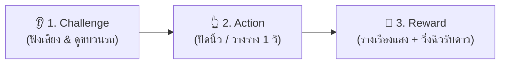

# 🎮 คลังการออกแบบมินิเกมการเรียนรู้ (Hanzero Mini-Game Catalog)

เอกสารฉบับนี้รวบรวมพิมพ์เขียวและการออกแบบ **มินิเกมการเรียนรู้ (Bite-sized Learning Mini-Games)** ประจำแพลตฟอร์ม **Hanzero** โดยยึดหลัก **Early-Stage Pedagogy & Safe-to-Fail Game Mechanics** มุ่งเน้นเปลี่ยนหัวข้อภาษาจีนที่ผู้เรียนกลัว ให้กลายเป็นเกมเล่นง่าย จบไวใน 30–90 วินาที ได้รับ Instant Dopamine และไม่มีกากบาทสีแดงน่ากลัว

---

## 🕹️ 5 กฎเหล็กของมินิเกม Hanzero (Core Game Design Pillars)
1. **One-Thumb / One-Tap Rule:** เข้าใจวิธีเล่นใน 3 วินาทีแรก ควบคุมด้วยนิ้วเดียว (Tap, Drag & Drop หรือ Swipe)
2. **Sensory Feedback:** ทุกสัมผัสมีเสียงดนตรีสดใส (Marimba, Bamboo Woodblock) และมาสคอตแพนด้าเปาเปาขยับดุ๊กดิ๊ก
3. **No Red Cross (ห้ามกากบาทสีแดง):** ผิดได้ ปลอบใจด้วยท่าทางน่ารัก มีเสียงสปริงดึ๋ง แล้วสะกิดให้ลองใหม่ทันที
4. **Micro-Progression:** เล่นรอบละ 3–5 คำสั้นๆ ชนะรับเหรียญดาว 🌟 และแต้มสะสม
5. **Web-Feasible:** สร้างได้จริงด้วย SVG Animation, Web Audio API, CSS Transitions โดยไม่ต้องพึ่งเอนจินเกมขนาดใหญ่

---

## 📚 ดัชนีมินิเกม 6 หมวดหลัก

| หมวดการเรียนรู้ | ชื่อเกม | สถานะ |
| :--- | :--- | :--- |
| **1. 🎢 Tone Mastery** | **Panda Tone Coaster (รถไฟเหาะผจญภัย 4 เสียง)** | ✅ ออกแบบสมบูรณ์ |
| **2. 💨 Pinyin & Phonetics** | *Bubble Pop & Wind Blower (เป่าฟองสระพ่นลม)* | 📝 รอวางแผน |
| **3. 🧩 Radical & Hanzi Anatomy** | *Lego Hanzi Builder (ตัวต่อเลโก้ประกอบร่างอักษร)* | 📝 รอวางแผน |
| **4. ✍️ Stroke Order & Kinesthetics** | *Rainbow Stroke Slicer (สะบัดพู่กันตัดเส้นแสง)* | 📝 รอวางแผน |
| **5. 🍱 Sentence Scramble** | *Bento Box Grammars (จัดข้าวกล่องเบนโตะประโยค)* | 📝 รอวางแผน |
| **6. ⚡ Flash Recall & SRS** | *Dumpling Rush (ทบทวนศัพท์ด่วนก่อนเกี๊ยวละลาย)* | 📝 รอวางแผน |

---

## 🎢 Game 01: Panda Tone Coaster (รถไฟเหาะผจญภัย 4 เสียง)

### 1. 🏷️ ข้อมูลทั่วไป (Game Metadata)
* **ชื่อเกม:** Panda Tone Coaster: รถไฟเหาะผจญภัย 4 เสียง 🎢🐼
* **หมวดเป้าหมาย:** Tone Mastery (วรรณยุกต์ 4 เสียง & กฎผันเสียง 3+3)
* **คำโปรย (Tagline):** *"ไม่ต้องท่องจำ แค่ไถสเก็ตบอร์ดตามรางเสียง แล้วพุ่งทะยานไปด้วยกัน!"*
* **ระยะเวลาต่อรอบ:** 30 – 60 วินาที (3-5 คำต่อรอบ)

---

### 2. 🎯 ปัญหาที่เกมนี้ช่วยแก้ (Learning Friction Solved)
1. **ลดการแปลสัญลักษณ์ซับซ้อน:** เปลี่ยนเครื่องหมายนามธรรม `ˉ ˊ ˇ ˋ` ให้กลายเป็น **"ภูมิประเทศจำลอง (Kinesthetic Terrain)"** ที่ตามองเห็นและร่างกายรับรู้ได้
2. **แก้ปัญหาเสียง 2 vs เสียง 3:** ผู้เรียนเห็นความลึกของหุบเขาชัดเจนว่าเสียง 3 ต้องดิ่งลงก่อนแล้วสะบัดขึ้น
3. **ทลายกำแพงกฎผันเสียง 3+3 (Tone Sandhi):** เปลี่ยนกฎทฤษฎียาวๆ ให้กลายเป็นแอนิเมชัน **"สับรางหลบภัย"** ที่เห็นภาพจำทันที

---

### 3. 🔄 ลูปการเล่นหลัก (Core Game Loop)



#### 🟡 ขั้นตอนที่ 1 (Challenge):
* เปาเปา (BaoBao) แพนด้าน้อยยืนอยู่บนหัวรถจักร เป่าแคนเสียงพินอิน เช่น ออกเสียง **"mā" (เสียง 1)**
* มีรางรถไฟ 4 สไตล์ลอยอยู่เหนือก้อนเมฆ:
  - ➖ **รางฟ้าเรียบ (เสียง 1):** เส้นตรงลอยสูงขนานเส้นขอบฟ้า (High Flat 5-5)
  - ↗️ **รางเขียวขึ้นเขา (เสียง 2):** ทางลาดชันพุ่งทะยานขึ้นยอดหอดูดาว (Rising Slope 3-5)
  - 〽️ **รางม่วงฮาล์ฟไพพ์ (เสียง 3):** ทางโค้งดิ่งลงหุบเหวก่อนเด้งสะบัดขึ้น (Dip & Swoop 2-1-4)
  - ↘️ **รางส้มสไลเดอร์ (เสียง 4):** ทางตกหน้าผาสูงชันฟิ้วววว (Steep Cliff Drop 5-1)

#### 🟢 ขั้นตอนที่ 2 (Action):
* ผู้เล่นใช้นิ้วเดียว **แตะเลือกรางที่ถูกต้อง** หรือ **ปัดนิ้วไปตามทิศทางของเสียง (Swipe Gesture)**:
  - แนวนอน ➡️ = เสียง 1
  - เฉียงขึ้น ↗️ = เสียง 2
  - ทรงตัว V 〽️ = เสียง 3
  - เฉียงลง ↘️ = เสียง 4

#### 🟣 ขั้นตอนที่ 3 (Resolution & Reward):
* รางรถไฟดูดเชื่อมเข้ากับเส้นทางหลักแบบแม่เหล็ก **Snap!** พร้อมประกายดาววิบวับ ✨
* รถไฟพุ่งทะยานไปตามรางอย่างลื่นไหล ตัวละครกางแขนรับลม มีเสียงกู่เจิงรูดสายตาม Pitch เสียง
* รับผลท้อสีทอง 🍑 และเหรียญดาวสะสม 🌟 พร้อมเสียงระนาดแก้วคอร์ด C Major สดใส

#### 🌟 ด่านพิเศษ: กฎสับราง 3 + 3 (The Double-Dip Twist)
* เมื่อรถไฟแล่นมาเจอคู่คำเสียง 3 สองตัวติดกัน เช่น **"nǐ hǎo"**
* รางตัวแรกจะเกิดแอนิเมชัน **"สับรางอัตโนมัติ"** ดีดตัวเปลี่ยนเป็นรางเฉียงขึ้น (เสียง 2) เพื่อไม่ให้รถไฟตกราง
* ข้อความปลอบประโลมขึ้นว่า: *"เสียง 3 สองตัวมาเจอกัน ตัวหน้าขอหลบขึ้นเขาเป็นเสียง 2 นะจ๊ะ!"*

---

### 4. 💖 ระบบปลอบใจเมื่อตอบพลาด (Gentle Failure & Reassurance)
* **ไม่มีกากบาทสีแดงและไม่มีเสียงหวอ:** รถไฟไม่ได้ระเบิดหรือชนพัง แต่ชะลอความเร็วลงเบาๆ แล้วจอดเทียบท่า
* **มาสคอตปลอบใจ:** เปาเปาเอียงคอสงสัย 45 องศาแล้วกระพริบตาปริบๆ
* **เสียงบรรยายอบอุ่น:** *"เอ๊ะ รางนี้สูงไปนิดนึงนะคนเก่ง ลองฟังเสียงอีกที เปาเปาจะร้องให้ฟังชัดๆ น้า"*
* **คำใบ้สะท้อนแสง:** รางที่ถูกต้องจะเริ่มกระเพื่อมเบาๆ (Pulse) ให้ผู้เรียนกดปุ่ม *"สะกิดลองใหม่อีกที"* ได้ทันที

---

### 5. 🎨 สุนทรียศาสตร์ & งานภาพ-เสียง (Visual & Audio Atmosphere)
* **โทนสี (Color Palette):**
  - พื้นหลัง: กระดาษสาอบอุ่น `#FDFBF7` ผสมสีท้องฟ้าพาสเทล
  - รางเสียง 1 (ฟ้าพาสเทล): `#63B3ED`
  - รางเสียง 2 (เขียวไผ่สดใส): `#48BB78`
  - รางเสียง 3 (ม่วงองุ่นละมุน): `#9F7AEA`
  - รางเสียง 4 (ส้มแสงอาทิตย์): `#ED8936`
* **มาสคอต:** **"เปาเปา" (BaoBao 🐼)** ลูกแพนด้าใส่หมวกนายสถานีจิ๋ว
* **เอฟเฟกต์เสียง (SFX):**
  - แตะปุ่ม: เสียงเคาะกิ่งไผ่ (*Woodblock Tap*)
  - ตอบถูก: ระนาดแก้ว Marimba คอร์ด C-E-G
  - รถไฟวิ่ง: กู่เจิงรูดสายตามความชันของราง (Pitch glide)
  - สะกิดใหม่: เสียงฟองสบู่แตก *เป๊าะ!*

---

### 6. 🛠️ แนวทางการพัฒนาโค้ดหน้าบ้าน (Frontend Implementation Guide)

#### SVG Motion Path
```html
<svg viewBox="0 0 400 200" class="coaster-track">
  <!-- รางเสียง 3: Dip & Rise Curve -->
  <path id="tone3Path" d="M 20 60 Q 150 180 250 170 T 380 40" 
        fill="none" stroke="#9F7AEA" stroke-width="8" stroke-linecap="round"/>
</svg>
```

#### Web Audio API Sound Synthesizer
```javascript
// จำลองการเลื่อนระดับ Pitch เสียงวรรณยุกต์
function playToneCurve(audioCtx, toneType) {
  const osc = audioCtx.createOscillator();
  const gain = audioCtx.createGain();
  const now = audioCtx.currentTime;

  osc.connect(gain);
  gain.connect(audioCtx.destination);

  if (toneType === 1) { // 55: สูงคงที่
    osc.frequency.setValueAtTime(440, now);
    osc.frequency.setValueAtTime(440, now + 0.4);
  } else if (toneType === 2) { // 35: ขึ้น
    osc.frequency.setValueAtTime(330, now);
    osc.frequency.exponentialRampToValueAtTime(440, now + 0.35);
  } else if (toneType === 3) { // 214: ลงแล้วขึ้น
    osc.frequency.setValueAtTime(290, now);
    osc.frequency.exponentialRampToValueAtTime(210, now + 0.2);
    osc.frequency.exponentialRampToValueAtTime(370, now + 0.45);
  } else if (toneType === 4) { // 51: ดิ่งลงเร็ว
    osc.frequency.setValueAtTime(440, now);
    osc.frequency.exponentialRampToValueAtTime(180, now + 0.25);
  }

  gain.gain.setValueAtTime(0.3, now);
  gain.gain.exponentialRampToValueAtTime(0.01, now + 0.5);

  osc.start(now);
  osc.stop(now + 0.5);
}
```

---

*เอกสารฉบับนี้อ้างอิงและทำงานร่วมกับ [01_pinyin_system.md](file:///c:/DevProjects/hanzero/hanzero/docs/curriculum/01_pinyin_system.md) และ [game_design_prompt.md](file:///c:/DevProjects/hanzero/hanzero/docs/prompts/game_design_prompt.md)*
