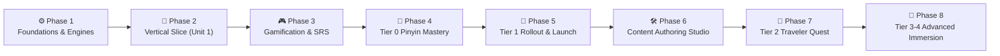

# 📋 Hanzero Execution & Verification Roadmap

ศูนย์รวมแผนปฏิบัติการ (Actionable Execution Plans) และเกณฑ์การตรวจรับงาน (Quality Gates & Verification Checklists) สำหรับการพัฒนาแพลตฟอร์ม **Hanzero (ฮั่นซีโร่)** ตามมาตรฐานการกำกับดูแลของ Senior Product Manager

---

## 🎯 ปรัชญาการพัฒนาและการตรวจรับงาน (Core Principles)
1. **Bite-Sized Slicing:** แบ่งงานเป็นหน่วยเล็กและเป็นอิสระต่อกัน เพื่อให้ตรวจสอบได้จริงในทุกขั้นตอน
2. **Quality Gate Before Next Phase:** แต่ละ Phase มีเกณฑ์การตรวจรับ (Acceptance Criteria) ที่ชัดเจน ต้องผ่านการทดสอบก่อนจึงจะข้ามไปเฟสถัดไป
3. **Engineering Vertical Slice First:** สร้าง Phase 2 (Unit 1) เพื่อเป็นแม่แบบทดสอบความสมบูรณ์ของคอมโพเนนต์ (Golden Template) ก่อนผสาน Onboarding และขยายเนื้อหาทั้งหมด
4. **Pedagogical Protection (Safe Practice Zone):** ในระดับปูพื้นฐาน Tier 0 ไม่มีการตัดหัวใจ เพื่อไม่ให้ผู้เรียนท้อถอยจากการฝึกฟังวรรณยุกต์
5. **Zero-Cost Constraint & Resilience:** ทุกระบบทำงาน 100% บน Client-side ฟรีตลอดชีพ พร้อมระบบรับมือเสียงขาดหายบน Safari/Android (Static Audio Fallback Pack)
6. **Anti-Churn & Daily Habit Design:** ป้องกันอาการหมดไฟด้วย Daily Review Cap (สูงสุด 20 คำ/วัน) และ PWA ป้องกันข้อมูลหายบน Safari

---

## 🗺️ แผนผัง 8 เฟสการพัฒนา (The 8 Execution Phases)

---

## 📂 สารบัญเอกสารแผนงานรายเฟส

| เฟส | เอกสารแผนงาน | ขอบเขตงานหลัก | สถานะ | การตรวจสอบ & ส่งมอบ |
| :---: | :--- | :--- | :---: | :--- |
| **Phase 1** | [phase_01_web_foundation_engines.md](./phase_01_web_foundation_engines.md) | Scaffolding, PWA (`vite-plugin-pwa`), CJK Font Subsetting, Hanzi Legibility (>=36px), Accessible Tones, Audio Resilience & Static Audio Fallback Pack (~2MB), Canvas ล้าง Memory | `DONE` ✅ | แผงทดสอบ `EngineTestPanel` แสดงสถานะเสียงจีน, ทดสอบปลดล็อกเสียง iOS และทดสอบ Static Audio สำเร็จ |
| **Phase 2** | [phase_02_unit1_lesson_experience.md](./phase_02_unit1_lesson_experience.md) | **Engineering Vertical Slice:** บทเรียน Unit 1 (4 Lessons), การ์ดคำ 3 ภาษา + ปุ่มขยายเส้นขีด, **Progressive Pinyin Fading**, Dialogue, Silent Mode Quiz | `DONE` ✅ | เรียนและทดสอบจบ Unit 1 สลับโหมดเงียบและสลับซ่อนพินอินได้ราบรื่น ตรวจสอบภาษา 100% |
| **Phase 3** | [phase_03_gamification_srs.md](./phase_03_gamification_srs.md) | แผนที่ Quest Map, แดชบอร์ดหัวใจ + **Safe Practice Zone**, SM-2 SRS พร้อม **Daily Cap (20 คำ) & Backlog Triage**, IndexedDB Mirror & JSON Backup | `DONE` ✅ | ตอบผิดใน Tier 0 ไม่เสียหัวใจ, การ์ดไม่ล้นเกิน 20 คำ/วัน, สำรอง/กู้คืนข้อมูลและปลอดภัยจาก Safari Purge |
| **Phase 4** | [phase_04_tier0_pinyin_mastery.md](./phase_04_tier0_pinyin_mastery.md) | **First-Run Onboarding & Voice Health:** ตรวจสุขภาพเสียง OS (Zero-MP3 Architecture), ปูพื้นฐานเสียงครบถ้วน 6 Units (Tier 0 รวมสระผสมและสระนาสิก), Bunny Tone Coaster, **Client-side Echo Mic (Shadowing)**, **Shareable Passport Card** | `DONE` ✅ | ผู้เรียนเข้า Onboarding ถูกต้อง, ตรวจจับชุดเสียง OS แนะนำติดตั้งได้ตรงรุ่น, แยก 4 วรรณยุกต์ได้แม่นยำ, อัดฟังเทียบเสียงตนเองได้ และแชร์รูปความสำเร็จได้ |
| **Phase 5** | [phase_05_tier1_content_rollout.md](./phase_05_tier1_content_rollout.md) | ปล่อยเนื้อหา Tier 1 ครบ 10 Units (40 บทย่อย), กฎ Interleaving 20%, **Zero-Knowledge Alpha Playtest**, CI/CD GitHub Pages & Product KPIs | `IN PROGRESS` ⏳ | Schema Validation ผ่าน 100%, ผู้ใช้ทดสอบ Alpha ผ่านเกณฑ์, Deploy อัตโนมัติบน GitHub Pages |
| **Phase 6** | [phase_06_content_authoring_studio.md](./phase_06_content_authoring_studio.md) | **Content Authoring Studio:** Web GUI สร้างบทเรียน/ควิซ, Auto Pinyin/Tone Linting, Stroke Validator, Live Mobile Preview, Export & 1-Click GitHub PR | `PLANNED` 📋 | สร้าง Unit ใหม่และส่งออก JSON ผ่านการตรวจ Linter 100% โดยไม่ต้องแก้โค้ด |
| **Phase 7** | [phase_07_tier2_traveler_quest.md](./phase_07_tier2_traveler_quest.md) | **Tier 2 Content Rollout (Units 11-25):** เอาตัวรอดในยุคดิจิทัล (สแกนจ่าย, รถไฟ, สั่งเดลิเวอรี่), Branching Dialogues, Grammar Slot Sandboxes (把/被), HSR Metro Map | `PLANNED` 📋 | บทสนทนาแตกกิ่งและต่อบล็อกไวยากรณ์ทำงานลื่นไหลบนมือถือ ตรวจสอบภาษา 100% |
| **Phase 8** | [phase_08_tier3_4_advanced_immersion.md](./phase_08_tier3_4_advanced_immersion.md) | **Tier 3-4 Advanced Immersion (Units 26-57):** เจรจาธุรกิจ, 成语 Story Explorer, Smart Immersion Reader (`Intl.Segmenter`), Native Speed Audio Ladder, Voice Pitching | `PLANNED` 📋 | ตัวตัดคำ Client-side ทำงานแม่นยำ, โหมดพอดแคสต์เล่นเสียงต่อเนื่อง, คลังสุภาษิตสมบูรณ์ |

---

## 🛡️ เกณฑ์การตรวจรับคุณภาพรวม (General Quality Assurance Gate)

ก่อนจะขยับข้ามเฟส ทีมพัฒนาต้องยืนยันว่า:
- [x] **Zero Console Errors:** ไม่มีข้อผิดพลาดสีแดงหรือ Memory Leak บน Browser Console
- [x] **Audio Resilience & Static Fallback:** ทดสอบทั้งกรณีมีและไม่มีเสียง `zh-CN` ในเครื่อง โดย Tier 0 มีระบบสังเคราะห์ Sine Wave Tone Contour และ Static Fallback เล่นได้ 100% แม้ออฟไลน์
- [x] **Hanzi Legibility & Accessibility:** ขนาดตัวอักษรจีนขั้นต่ำไม่ต่ำกว่า 28px ในแบบฝึกหัด และ 36px ในบัตรคำ พร้อมปุ่ม Zoom และมีสัญลักษณ์/ตัวเลขกำกับวรรณยุกต์รองรับผู้มีภาวะตาบอดสี
- [x] **Safe Practice Zone Active:** ไม่มีการหักหัวใจในหมวดฝึกฟังเสียงและ Tier 0
- [x] **Performance 60fps & Font Fast Load:** ฟอนต์ภาษาจีนผ่านการทำ Subsetting และโหลดเร็ว Bundle CSS < 20 KB
- [x] **Data Persistence & Safari Protection:** ข้อมูลผู้เรียนซิงก์คู่ขนาน LocalStorage + IndexedDB ไม่สูญหายเมื่อหยุดเล่นเกิน 7 วัน และรองรับการติดตั้งแบบ PWA
- [x] **Pedagogical Accuracy:** ยึดตามหลักสูตรใน [docs/curriculum/](../curriculum) และสเปกใน [docs/prd/02_feature_specs.md](../prd/02_feature_specs.md) เสมอ

