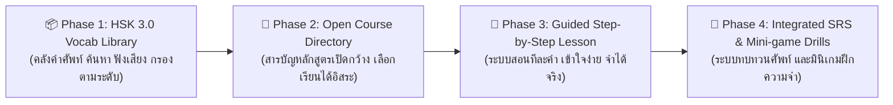

# 🗺️ Hanzero Realignment & Rebuilding Master Plan (`docs/plan/README.md`)

เอกสารฉบับนี้คือ **แผนแม่บทฉบับปรับทัพใหม่ (Realignment Blueprint)** สำหรับ Hanzero เพื่อดึงทิศทางของแพลตฟอร์มกลับมาสู่ **"เว็บเรียนภาษาจีนที่สอนเข้าใจง่าย ได้ผลจริง และมีคลังคำศัพท์ HSK 3.0 ครบถ้วน"** แทนระบบเกมแฟนตาซีเดิม

---

## 🏗️ แผนการพัฒนา 4 เฟสหลัก (Streamlined 4-Phase Roadmap)

```mermaid
graph LR
    P1["📦 Phase 1: HSK 3.0 Vocab Library<br/>(คลังคำศัพท์ ค้นหา ฟังเสียง กรองตามระดับ)"] --> P2["📑 Phase 2: Open Course Directory<br/>(สารบัญหลักสูตรเปิดกว้าง เลือกเรียนได้อิสระ)"]
    P2 --> P3["📖 Phase 3: Guided Step-by-Step Lesson<br/>(ระบบสอนทีละคำ เข้าใจง่าย จำได้จริง)"]
    P3 --> P4["🎴 Phase 4: Integrated SRS & Mini-game Drills<br/>(ระบบทบทวนศัพท์ และมินิเกมฝึกความจำ)"]
```

---

## 📌 รายละเอียดของแต่ละเฟส

### 📦 Phase 1: คลังคำศัพท์ HSK 3.0 & Search Explorer (`/vocab`)
* **เป้าหมาย:** สร้างหน้าแรกที่ผู้เรียนภาษาจีนทุกคนต้องมี — หน้าพจนานุกรม/คลังคำศัพท์ที่เปิดดูและค้นหาได้อิสระ
* **งานที่ต้องทำ:**
  1. สร้าง UI Component `VocabLibraryView`:
     - Search Bar (พิมพ์ไทย, พินอิน, จีน)
     - Level Tabs: ทั้งหมด, HSK 1, HSK 2, เอาชีวิตรอดในจีน
     - Category Tags: อาหาร, ทักทาย, ตัวเลข, การเดินทาง ฯลฯ
  2. การ์ดแสดงผลคำศัพท์: ตัวอักษรจีนใหญ่คมชัด, พินอิน, ปุ่มฟังเสียง TTS ปกติ/ช้า, คำแปล, ตัวอย่างประโยค
  3. ปุ่มเชื่อมโยง "คัดลายมือ (HanziWriter)" และ "เพิ่มเข้าคลังทบทวน (Add to SRS)"
  4. เพิ่มเมนู "📚 คลังคำศัพท์" บน Navigation Sidebar

---

### 📑 Phase 2: สารบัญบทเรียนเปิดกว้าง (Open Course Directory / Home)
* **เป้าหมาย:** ปรับหน้าแรกของเว็บจาก Quest Map RPG เดิม ให้กลายเป็นสารบัญบทเรียน (Course Catalog) ที่จัดระเบียบชัดเจน
* **งานที่ต้องทำ:**
  1. ปรับ `QuestMap` หรือสร้าง `CourseDirectoryView`:
     - จัดกลุ่มตามแทร็ก:
       - 🌱 **Tier 0: ปูพื้นฐานพินอิน & เสียง** (6 บทเรียน)
       - 🌿 **Tier 1: เอาตัวรอดในชีวิตประจำวัน** (10 บทเรียน)
       - 🎋 **Tier 2: ท่องเที่ยว & ชีวิตในจีน** (บทเรียนขั้นต่อยอด)
  2. **ปลดล็อกทุกบทเรียน:** ผู้เรียนสามารถกดเข้าเรียนบทใดก็ได้ตามความสนใจทันที
  3. แสดงการ์ดบทเรียนที่บอกชัดเจนว่า: *"บทนี้เรียนศัพท์อะไรบ้าง"* พร้อมจำนวนคำศัพท์

---

### 📖 Phase 3: ระบบการสอนแบบเป็นสเต็ป (Step-by-Step Guided Lesson Engine)
* **เป้าหมาย:** รื้อหน้า `LessonView` จาก 5 แท็บที่เคว้ง ให้กลายเป็น Guided Stepper ที่พาผู้เรียนเรียนจริง
* **งานที่ต้องทำ:**
  1. สร้าง Stepper Navigation:
     - **Step 1 (คำศัพท์ทีละคำ):** โชว์ทีละคำพร้อมเสียง พินอิน ภาพจำ และปุ่มคัดลายมือ
     - **Step 2 (ประโยคบริบท):** ฟังบทสนทนาที่ใช้คำศัพท์นั้น
     - **Step 3 (มินิเกมฝึกความจำ):** มินิเกมสั้น 3-4 ข้อ (จับคู่, เรียงประโยค) ไม่มีการตัดหัวใจ
     - **Step 4 (สรุปคำศัพท์วันนี้):** หน้าสรุปคำศัพท์ที่ได้เรียนวันนี้ทั้งหมด
  2. ซิงค์คำศัพท์ที่เรียนผ่านเข้าสู่ SRS Database อัตโนมัติ

---

### 🎴 Phase 4: ระบบทบทวน SRS & ล้างโค้ดส่วนเกิน (Clean & Polish)
* **เป้าหมาย:** ปรับปรุงระบบทบทวน SRS ให้เชื่อมโยงกับคลังคำศัพท์ และถอดโค้ดส่วนเกินของระบบเกมเดิมออก
* **งานที่ต้องทำ:**
  1. ปรับปรุงหน้า `ReviewDeck` ให้แสดงผลสวยงาม สอดคล้องกับคลังคำศัพท์
  2. ตัดการทำงานของระบบตัดหัวใจ (Heart Deduction) และระบบล็อกบทเรียน
  3. ทำการตรวจสอบ Build และ TypeScript ให้คลีน 100% พร้อม Deploy สู่ GitHub Pages
