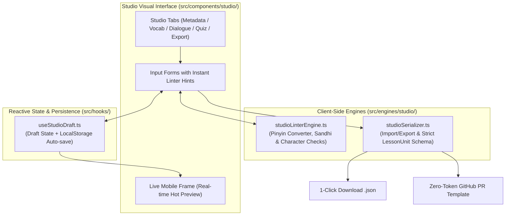

# 🛠️ Phase 6: Content Authoring Studio & Community Contribution

เอกสารแผนปฏิบัติการและรายการตรวจสอบอย่างละเอียดสำหรับ **Phase 6** ของการพัฒนา Hanzero: การสร้างเครื่องมือจัดการและผลิตเนื้อหาบทเรียนแบบไม่พึ่งพาเซิร์ฟเวอร์ (Zero-Backend Web-based Content Studio), ระบบตรวจสอบความถูกต้องทางภาษาศาสตร์อัตโนมัติในเบราว์เซอร์ (In-Browser Pedagogical Linter), หน้าจอจำลองมือถือสด (Live Interactive Mobile Preview) และระบบส่งออกเชื่อมต่อ Git (1-Click Export & Zero-Token GitHub Hand-off)

---

## 🎯 เป้าหมายของ Phase 6
ปลดล็อกคอขวด (Bottleneck) ในการผลิตเนื้อหาบทเรียน ช่วยให้ครูผู้สอน นักออกแบบหลักสูตร และคอมมูนิตี้สามารถสร้าง แก้ไข และทดสอบบทเรียน ควิซ และบทสนทนาได้ผ่านหน้าจอ Visual GUI ที่ใช้งานง่าย โดยไม่ต้องมีความรู้ด้านการเขียนโค้ดและไม่ต้องแก้ไขไฟล์ JSON ด้วยมือ พร้อมระบบป้องกันความผิดพลาดทางภาษาศาสตร์ 100%

---

## 🗺️ แผนผังและสถาปัตยกรรมของ Studio (System Architecture)

---

## 📋 แผนงานปฏิบัติการ 5 Micro-Slices (Actionable Task Slices)

### `TASK-601`: In-Browser Pedagogical Linter & Pinyin Auto-Converter Engine
- [x] พัฒนา Pure TypeScript Engine ใน `src/engines/studio/studioLinterEngine.ts`:
  - **Auto Pinyin Tone Placer:** พิมพ์ตัวเลขวรรณยุกต์ (เช่น `ni3hao3`) แล้วแปลงเป็นเครื่องหมายมาตรฐานสากล (`nǐhǎo`, `lv4` ➔ `lǜ`)
  - **Tone Sandhi Detector:** ตรวจจับคำที่มีการผันเสียงอัตโนมัติ (`一`, `不`, และกฎเสียง 3 ชน 3) แจ้งเตือนผู้เขียนให้ระบุเสียงตามกฎ
  - **Traditional Chinese & Forbidden Grammar Guard:** สกัดกั้นอักษรตัวเต็ม 100% จาก Blacklist และบล็อกไวยากรณ์ต้องห้าม (เช่น `不有`)
  - **Character Stroke Availability Check:** ตรวจสอบความพร้อมของตัวอักษรจีนในคลัง `hanzi-writer`
  - Unit Tests ครอบคลุม 100% ด้วย Vitest (`studioLinterEngine.test.ts`)

### `TASK-602`: Studio State Engine, Draft Recovery & JSON Serialization
- [x] พัฒนา Hook และ Serializer ใน `src/hooks/useStudioDraft.ts` และ `src/engines/studio/studioSerializer.ts`:
  - **Reactive Draft State:** จัดเก็บสถานะแบบร่าง Unit, Vocab List, Dialogue Script, และ Quizzes
  - **Crash-Resilient Auto-Save:** บันทึกดราฟต์ลง LocalStorage ทุกครั้งที่มีการแก้ไข กู้คืนข้อมูลอัตโนมัติเมื่อหน้ารีเฟรช
  - **Strict Schema Serialization:** แปลงสถานะแบบร่างเป็น JSON ตามโครงสร้าง `UnitLessonData` ใน `src/types/lesson.ts`
  - **JSON Importer:** นำเข้าไฟล์ JSON บทเรียนเดิมมาเปิดแก้ไขได้ทันที พร้อมระบบ Validate และฟ้อง Error จุดที่ผิด
  - Unit Tests สำหรับ Round-trip Import/Export 100% กับ `unit01_greetings.json` และ `unit02_numbers_time.json`

### `TASK-603`: Studio Visual Composer UI (Vocab, Dialogue & Quiz Forms)
- [x] พัฒนา UI Components ใน `src/components/studio/`:
  - **LessonMetadataForm:** ตั้งค่า Tier (0–4), Unit ID, Lesson ID, และชื่อบท 3 ภาษา (🇨🇳, 🇹🇭, 🇬🇧)
  - **VocabComposer:** เพิ่ม/ลบ/เรียงการ์ดคำศัพท์ พร้อม Pinyin assist, Radical selector, และปุ่มลองฟังเสียง
  - **DialogueComposer:** สร้างบทสนทนา A/B กำหนดผู้พูดและเลือกเสียงสังเคราะห์
  - **QuizComposer:** สร้างแบบฝึกหัด 4 รูปแบบ (Multiple Choice, Hanzi Stroke Order, Sentence Scramble, Tone Discrimination) พร้อมระบบตรวจสมดุลเฉลย
  - **StudioNavbar & StudioReviewPanel & StudioLayout:** ควบคุมการเปลี่ยนแท็บ ตรวจสอบสถานะการบันทึก และส่งออก JSON สะดวก

### `TASK-604`: Live Interactive Mobile Device Preview & Audio Sandbox
- [x] พัฒนาหน้าจอจำลองและการโต้ตอบสด:
  - **Split-Screen Layout:** ด้านซ้ายเป็นพื้นที่แก้ไข (Editor Form) และด้านขวาเป็นกรอบสมาร์ตโฟนจำลอง (Mobile Device Frame) พร้อมปุ่มย่อ/ขยาย
  - **Hot Real-time Rendering:** นำคอมโพเนนต์จริง (`VocabCard`, `DialoguePlayer`, `QuizContainer`) มารันในกรอบมือถือ ตอบสนองทันทีที่พิมพ์ข้อมูล พร้อมระบบ Carousel Pager และ Reset Quiz
  - **In-Studio Audio Sandbox:** ปุ่มทดสอบเสียงภาษาจีนกลาง (`zh-CN`) ปรับความเร็วได้ (0.75x, 1.0x) พร้อมระบบวิเคราะห์ Tone Sandhi (3+3 -> 2+3)
  - Responsive Mobile Adaptability: รองรับการสลับแท็บไป-มาเมื่อเปิดใช้งานบนหน้าจอมือถือหรือแท็บเล็ต ด้วย Floating Action Button (FAB) และ Slide-over Overlay Drawer

### `TASK-605`: Zero-Token Git Hand-off, PR Template & Playwright E2E Suite
- [ ] พัฒนาระบบส่งมอบงานสู่ GitHub และชุดทดสอบอัตโนมัติ:
  - **1-Click JSON Download:** ส่งออกไฟล์ `.json` ที่พร้อมใช้งานใน `src/data/lessons/`
  - **Zero-Token PR Generator:** สร้างเทมเพลต GitHub Issue / PR พร้อมก็อปปี้ JSON Payload ปลอดภัย ไม่ต้องใช้ Personal Access Token
  - **Playwright E2E Test Suite (`e2e/studio.spec.ts`):** ทดสอบ User Journey การแต่งบทเรียนตั้งแต่เริ่มต้นจนถึงส่งออกไฟล์
  - Red Team Chaos Verification: ทดสอบการรับมือข้อมูลขยะ (Corrupted JSON), ข้อความยาวเกินพิกัด, และการปิดเบราว์เซอร์กะทันหัน

---

## 🛡️ เกณฑ์การตรวจรับงาน (Quality Gate & DoD)

| ลำดับ | จุดตรวจสอบ | เครื่องมือทดสอบ | เกณฑ์การผ่าน |
| :---: | :--- | :--- | :--- |
| **1** | **Type Safety** | `npm run lint` (`tsc --noEmit`) | 0 Type Errors, Zero `any` |
| **2** | **Linter & State Unit Tests** | `npm test` | ผ่าน 100% ครบทุกโมดูลใน `src/engines/studio/` |
| **3** | **Curriculum Validation Round-trip** | `npm run validate:curriculum -- --strict` | ไฟล์ JSON ที่ Export จาก Studio ผ่านสคริปต์ตรวจสอบ 100% |
| **4** | **Live Mobile Hot Preview** | Interactive Browser Test | แก้ไขฟอร์มแล้วหน้าจอมือถือจำลองอัปเดตแบบเรียลไทม์ ไร้กระตุก 60fps |
| **5** | **Draft Crash Resilience** | Red Team Browser Kill Test | ปิดแท็บหรือรีเฟรชหน้าเว็บ ข้อมูลบทเรียนที่กำลังแต่งต้องไม่สูญหาย |
| **6** | **Playwright E2E Pass** | `npm run test:e2e` | ผ่านการทดสอบ Authoring Journey ทุกสถานการณ์ |
