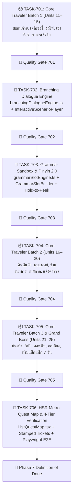

# 🎋 Phase 7: Tier 2 Content Rollout & HSK 3-4 Quest Map

เอกสารแผนปฏิบัติการแม่บทและรายการตรวจสอบ Task Slices อย่างเป็นระบบสำหรับ **Phase 7** ของการพัฒนา Hanzero: ทยอยผลิต ตรวจทาน และปล่อยเนื้อหา **Tier 2: Traveler (15 Units / 60 บทเรียน)** ตามมาตรฐาน HSK 3–4 พร้อมระบบบทสนทนาแตกกิ่ง (Branching Dialogues), วิดเจ็ตไวยากรณ์เชิงโครงสร้าง (Grammar Slot Builder), และแผนที่รถไฟความเร็วสูง (High-Speed Rail Metro Map)

---

## 🎯 เป้าหมายหลักของ Phase 7 (Core Mission)
ยกระดับผู้เรียนจากระดับพื้นฐานเอาชีวิตรอด สู่การเดินทางท่องเที่ยวและใช้ชีวิตดิจิทัลในประเทศจีนคนเดียวได้อย่างแท้จริง (**Digital & Cashless China Survival**):
- การสแกนจ่าย QR Code (WeChat Pay / Alipay) และการถามช่องทางชำระเงิน
- การสั่งอาหารเดลิเวอรี่ Meituan / Ele.me และการนัดรับพัสดุตู้ล็อกเกอร์อัจฉริยะ (Cainiao)
- การจองตั๋ว คืน/เปลี่ยนตั๋วรถไฟความเร็วสูง 12306 และการขึ้นรถไฟ
- การเช่าห้องพัก อพาร์ตเมนต์ และการแจ้งซ่อมสิ่งอำนวยความสะดวก
- การสั่งอาหารจีนเชิงลึก 4 ภาค และการแจ้งอาการแพ้อาหาร / รสชาติเฉพาะ
- การเปลี่ยน/คืนสินค้าในห้างสรรพสินค้า
- การพบแพทย์ แจ้งอาการป่วยอย่างละเอียด และการรับประทานยา
- การเปิดบัญชีธนาคาร ICBC และการจัดการแพ็กเกจซิมการ์ดโทรศัพท์
- มารยาทในเทศกาลจีนและการเยี่ยมเยือนบ้านเพื่อน
- การแก้ไขปัญหาเฉพาะหน้า แจ้งความของหายที่สถานีตำรวจ และการติดต่อสถานทูต
- สันทนาการ ชมภาพยนตร์ และการซื้อตั๋วเข้าชมพิพิธภัณฑ์กู้กง
- การออกกำลังกาย ฟิตเนส และการเล่นกีฬา
- ปฐมนิเทศออฟฟิศจีน การส่งอีเมล และการขอลาป่วย
- การแสดงความคิดเห็นและการถกอภิปรายอย่างสุภาพ
- **Tier 2 Grand Boss Quest:** พิชิตการเดินทางแบ็กแพ็ก 7 วัน ข้าม 4 มหานคร (ปักกิ่ง ➔ ซีอาน ➔ เฉิงตู ➔ เซี่ยงไฮ้)

---

## 👥 บทบาทหน้าที่ของทีมงาน (Multi-Agent Blueprints)
1. **curriculum_tutor:** เรียบเรียงเนื้อหา Units 11 ถึง 25 ตาม [03_lesson_levels.md](../curriculum/03_lesson_levels.md)
2. **web_dev:** พัฒนา Pure TypeScript Engines (`branchingDialogueEngine.ts`, `grammarSlotEngine.ts`), UI Components (`InteractiveScenarioPlayer.tsx`, `GrammarSlotBuilder.tsx`, `HsrQuestMap.tsx`), และ State Hooks
3. **ux_ui_designer:** ออกแบบผังเส้นทางรถไฟความเร็วสูง High-Speed Rail Metro Map, บัตรโดยสารดิจิทัล, และ Micro-interactions 60fps (Patience Bar, Hold-to-Peek)
4. **pedagogical_qa:** ตรวจสอบอักษรจีนตัวย่อ, ตำแหน่งวรรณยุกต์ Pinyin, กฎ Tone Sandhi และรัน `npm run validate:curriculum -- --strict`
5. **technical_qa:** ตรวจสอบ Strict Typing 100% (Zero `any`), Bundle Budget (CSS $\le$ 20KB, JS $\le$ 300KB), และตรวจจับ Memory Leaks
6. **red_team_adversary:** ทลายระบบบทสนทนาแตกกิ่ง (ตรวจหา Dead ends/Loops), ทดสอบกดรัว/สแปม, และทดสอบจอแคบ 320px
7. **test_automation_engineer:** สร้าง Vitest Unit Tests สำหรับ Pure Engines และ Playwright E2E Tests สำหรับ Traveler Journey

---

## 📋 แผนงานปฏิบัติการแบ่งตาม Tasks (Task Breakdown & Micro-Slices)

---

### `TASK-701`: Core Traveler Curriculum Batch 1 (Units 11–15) `DONE` ✅
- [x] **Unit 11: 扫码支付 (Scan & Pay: ดิจิทัลไลฟ์สไตล์)**
  - 11.1: 微信与支付宝 (WeChat & Alipay: 微信, 支付宝, 扫一扫, 二维码) — 把 พื้นฐาน: `把手机拿出来 / 把二维码出示一下`
  - 11.2: 扫我还是我扫你? (Scan Me or I Scan You?: 扫我, 我扫你, 收款码, 付款码) — Tone Sandhi: `我扫你 wǒ sǎo nǐ ➔ wó sáo nǐ`
  - 11.3: 转账与零钱 (Transfer & Small Change: 转账, 余额, 零钱, 现金, 充值) — โครงสร้างขอความช่วยเหลือ: `能够...吗 / 可以用现金吗`
  - 11.4: Boss Challenge: สแกนจ่ายค่าผลไม้ที่ตลาดสดในเฉิงตู และขอเงินทอนเมื่อเน็ตมือถือช้า
- [x] **Unit 12: 外卖与快递 (Delivery & Courier: สั่งเดลิเวอรี่ & พัสดุด่วน)**
  - 12.1: 点外卖与填地址 (Food Delivery Order: 外卖, 菜单, 地址, 门牌号, 备注) — ไวยากรณ์กำชับ: `请在备注里写... / 放在门口就好`
  - 12.2: 骑手配送中 (Rider In-Transit: 骑手, 送餐, 配送费, 超时, 催单) — Directional Complements: `送过来 / 拿上去 / 带下来`
  - 12.3: 菜鸟驿站取快递 (Pickup Station & Locker: 快递, 菜鸟驿站, 快递柜, 取件码, 寄存) — Tone Sandhi: `取件码 qǔjiànmǎ`
  - 12.4: Boss Challenge: สั่งชานมไข่มุกมาส่งที่คอนโดและบอกรหัสผ่านประตูหน้าให้ไรเดอร์
- [x] **Unit 13: 高铁与出行 (High-Speed Rail: รถไฟความเร็วสูง & ทางไกล)**
  - 13.1: 预订高铁票 (Booking HSR: 高铁, 动车, 一等座, 二等座, 商务座) — โครงสร้างคู่เชื่อม: `不但...而且... / 刚 vs 刚才`
  - 13.2: 进站与安检 (Station Entry & Security: 身份证, 护照, 检票口, 候车室, 行李架, 安检) — Tone Sandhi: `检票口 jiǎnpiàokǒu`
  - 13.3: 改签与退票 (Change & Refund: 改签, 退票, 晚点, 准时, 差价, 手续费) — Resultative Complements: `改好了 / 没赶上 / 买到了`
  - 13.4: Boss Challenge: จัดการเปลี่ยนตั๋วรถไฟความเร็วสูงที่สถานีปักกิ่งใต้เมื่อมาถึงสาย 10 นาที
- [x] **Unit 14: 租房与生活设施 (Renting & Utilities: เช่าห้อง & สิ่งอำนวยความสะดวก)**
  - 14.1: 看房与中介 (Apartment Viewing: 房东, 中介, 房租, 合同, 押金, 户型) — วัฒนธรรมเช่า: `押一付三 / 除了...以外`
  - 14.2: 水电暖气与网络 (Utilities & Broadband: 水电费, 暖气, 宽带, 燃气, 抄表) — Resultative Complements: `交清了 / 连上了 / 开通了`
  - 14.3: 家电报修 (Appliance Repair: 修理, 师傅, 冰箱, 洗衣机, 空调, 坏了) — ประโยค 把 & 被: `把空调修好 / 遥控器被弄丢了`
  - 14.4: Boss Challenge: เจรจาเงื่อนไขสัญญาเช่ากับเจ้าของห้องและแจ้งช่างเข้ามาซ่อมแอร์น้ำหยด
- [x] **Unit 15: 餐厅点菜进阶 (Advanced Dining: อาหารจีนเชิงลึก & รสชาติท้องถิ่น)**
  - 15.1: 特色风味与招牌菜 (Regional Flavors: 川菜, 粤菜, 招牌菜, 特色, 口味, 地道) — `越...越...: 越吃越辣, 越喝越香`
  - 15.2: 饮食忌口与特殊要求 (Dietary Preferences: 忌口, 微辣, 免葱, 少油, 少糖, 过敏) — `麻烦不要放... / 我对花生过敏`
  - 15.3: 买单与打包文化 (Bill & Takeaway: 买单, 打包, 发票, 服务费, 打包盒) — โครงสร้างเน้นย้ำ `是...的: 我们是在网上团购的 / 是一起算的`
  - 15.4: Boss Challenge: เป็นเจ้าภาพจัดเลี้ยงเพื่อนคนจีน สั่งอาหาร 4 ภาค พร้อมระบุรสชาติเฉพาะตัว
- [x] **เครื่องมือและสคริปต์:**
  - สร้าง `scripts/build_tier2_batch_a.ts` ผลิตไฟล์ JSON ลงทั้ง `src/data/lessons/tier2/` และ `data/lessons/tier2/`
  - สร้าง `src/data/lessons/tier2/schemaValidation.test.ts` เพื่อทดสอบโครงสร้างและความถูกต้องของข้อมูล

---

### `TASK-702`: Branching Dialogue & Scenario Decision Engine
- [ ] **Pure TypeScript Engine (`src/engines/scenario/branchingDialogueEngine.ts`):**
  - Data structure: `ScenarioNode`, `DecisionBranch`, `ScenarioSession`, `CulturalNote`, `NPCMood`
  - Pure functions: `createScenarioSession`, `makeChoice`, `calculatePatienceDelta`, `validateScenarioTree`
  - ตรวจจับ Directed Acyclic Graph (DAG), ป้องกัน Dead ends, ป้องกันค่า Patience หลุดช่วง 0–100
- [ ] **UI Component (`src/components/scenario/InteractiveScenarioPlayer.tsx`):**
  - แถบอารมณ์/ความพึงพอใจของ NPC (Patience Bar) พร้อมสีตอบสนอง (เขียว/เหลือง/แดง)
  - กล่องคำพูด NPC พร้อม Avatar ตัวละคร (ไรเดอร์, คนขับรถ, หมอ, พนักงานโรงแรม, ตำรวจ)
  - ปุ่มตัวเลือกคำตอบขนาด $\ge 44$px
  - การ์ดแนะนำมารยาททางสังคมจีน (Cultural Etiquette Note)
  - เสียงตอบสนองสังเคราะห์ Web Audio SFX
- [ ] **Unit Tests & Adversarial Verification:**
  - Vitest Unit Tests: `branchingDialogueEngine.test.ts` ครอบคลุม 100%
  - Component Tests: `InteractiveScenarioPlayer.test.tsx`
  - Red Team: ทดสอบสแปมกดตัวเลือก และตรวจสอบไม่พบบั๊กทางตันในทุกเคส

---

### `TASK-703`: Complex Grammar Sandbox & Dynamic Pinyin Fading 2.0
- [ ] **Pure Grammar Engine (`src/engines/grammar/grammarSlotEngine.ts`):**
  - รองรับโครงสร้าง:
    - ประโยค 把: $[S] + 把 + [O] + [V] + [Result/Direction]$
    - ประโยค 被: $[O] + 被 + [Agent] + [V] + [Result/Direction]$
    - Complements: $[V] + 得/不 + [Result]$ (吃得下 vs 吃不下)
  - ตรวจสอบลำดับสล็อตและคืนคำแนะนำ (Pedagogical Guidance Hint)
- [ ] **UI Component (`src/components/grammar/GrammarSlotBuilder.tsx`):**
  - บล็อกไวยากรณ์ต่อสนุก แยกสีตามประเภทคำ (ประธาน, เครื่องหมาย, กรรม, กริยา, ผลลัพธ์)
  - รองรับทัชสกรีนลื่นไหล 60fps
  - เสียงอ่านเมื่อแตะบล็อกคำ
- [ ] **Dynamic Pinyin Fading 2.0 (Hold-to-Peek):**
  - ซ่อนพินอินเป็นค่าเริ่มต้นใน Tier 2
  - กดค้าง (Hold) ที่ตัวอักษรจีนเพื่อแอบดูพินอินชั่วคราว ปล่อยมือแล้วจางหาย
  - บันทึกความถี่การแอบดู (`peekCount`) สำหรับจัดคิวทบทวนใน SRS
  - ผสานเข้ากับ `VocabCard.tsx` และ `InteractiveScenarioPlayer.tsx`
- [ ] **Unit Tests:** `grammarSlotEngine.test.ts` และ `GrammarSlotBuilder.test.tsx` ผ่าน 100%

---

### `TASK-704`: Core Traveler Curriculum Batch 2 (Units 16–20)
- [ ] **Unit 16: 商场退换货 (Shopping Returns: ช็อปปิ้ง เปลี่ยน/คืนสินค้า)**
  - 16.1: 尺码与试穿 (比...更... / 这件有点儿肥)
  - 16.2: 质量问题与退换 (ประโยค 被: 衣服被洗掉色了 / 只要发票在就能退)
  - 16.3: 折扣与保修服务 (Tone Sandhi: 打折 `dǎzhé`)
  - 16.4: Boss Challenge: นำเสื้อไปเปลี่ยนไซส์และขอคืนเงินส่วนต่างที่ห้างหังโจว
- [ ] **Unit 17: 看病与买药进阶 (Advanced Clinic: พบแพทย์ & แจ้งอาการละเอียด)**
  - 17.1: 挂号与科室 (先挂号，然后去二楼候诊)
  - 17.2: 描述详细病情 (Potential Complements: 吃得下 / 吃不下 / 好不了)
  - 17.3: 药房取药与医嘱 (一天三次，一次两粒，饭后服用)
  - 17.4: Boss Challenge: สื่อสารอาการอาหารเป็นพิษกับแพทย์ที่โรงพยาบาลและรับยา
- [ ] **Unit 18: 银行与通信业务 (Banking & Telecom: เปิดบัญชี & จัดการซิมการ์ด)**
  - 18.1: 开设银行账户 (只有...才... / 必须要本人签字)
  - 18.2: 手机套餐与流量 (包含多少GB流量 / 超出部分怎么计费)
  - 18.3: 汇款与外币兑换 (Tone Sandhi: 美元兑换 `měiyuán duìhuàn`)
  - 18.4: Boss Challenge: เปิดบัญชีธนาคาร ICBC และผูกเข้า Alipay
- [ ] **Unit 19: 中国节庆与拜访 (Festivals & Visits: เทศกาลจีน & มารยาทเยี่ยมเยือน)**
  - 19.1: 春节与拜年 (祝您新年快乐，万事如意，身体健康)
  - 19.2: 中秋与端午 (象征着阖家团圆 / 既有文化又有口福)
  - 19.3: 做客礼仪与送礼 (Tone Sandhi: 买礼物 `mái lǐwù`)
  - 19.4: Boss Challenge: นำผลไม้ไปสวัสดีปีใหม่บ้านเพื่อนคนจีน
- [ ] **Unit 20: 求助与意外处理 (Emergencies: แจ้งเหตุฉุกเฉิน & ของสูญหาย)**
  - 20.1: 物品遗失与报警 (竟然 / 果然 / 连护照都丢了)
  - 20.2: 交通事故与理赔 (ประโยค 被: 车身被撞了一下 / 幸好人没事)
  - 20.3: 使领馆求助与证件 (请协助我办理紧急旅行证)
  - 20.4: Boss Challenge: แจ้งความพาสปอร์ตหายที่สถานีตำรวจและประสานงานสถานทูต
- [ ] **เครื่องมือและสคริปต์:** สร้าง `scripts/build_tier2_batch_b.ts` ผลิตไฟล์ JSON Units 16–20

---

### `TASK-705`: Core Traveler Curriculum Batch 3 & Grand Boss (Units 21–25)
- [ ] **Unit 21: 文娱与观影 (Entertainment: ดูหนัง นิทรรศการ & สันทนาการ)**
  - 21.1: 电影院选座与观影 (A 没有 B 那么受欢迎)
  - 21.2: 博物馆与展览 (请勿拍照 / 馆内禁止大声喧哗)
  - 21.3: 评论剧情与推荐 (像传说中一样精彩 / 值得二刷)
  - 21.4: Boss Challenge: ซื้อตั๋วพิพิธภัณฑ์กู้กงผ่านมินิโปรแกรม
- [ ] **Unit 22: 健身与户外 (Fitness & Sports: ฟิตเนส กีฬา & กิจกรรมกลางแจ้ง)**
  - 22.1: 健身房锻炼 (一边跑步一边听中文播客)
  - 22.2: 球类运动与约球 (Tone Sandhi: 两个球 `liǎng ge qiú`)
  - 22.3: 户外徒步与露营 (背着背包 / 穿戴着专业装备)
  - 22.4: Boss Challenge: สมัครสมาชิกฟิตเนสนัดเทรนเนอร์
- [ ] **Unit 23: 日常办公初探 (Workplace Orientation: ปฐมนิเทศออฟฟิศจีน)**
  - 23.1: 办公室日常设施 (首先...然后...最后...)
  - 23.2: 邮件沟通与请假 (关于...的申请 / 望领导批准)
  - 23.3: 跨部门协作与会议 (跟产品部门确认一下 / 按时交付)
  - 23.4: Boss Challenge: เขียนอีเมลขอลาป่วย 1 วัน และส่งมอบงานด่วน
- [ ] **Unit 24: 观点与讨论 (Opinions & Debate: แสดงความคิดเห็น & ถกเถียงสุภาพ)**
  - 24.1: 表达赞同与反对 (尽管...但是... / 实际上并不是这样)
  - 24.2: 委婉表达与建议 (对我来说... / 不妨换个思路考虑)
  - 24.3: 探讨生活节奏与热点 (一方面提高效率, 另一方面也要注意休息)
  - 24.4: Boss Challenge: ถกอภิปราย WFH vs เข้าออฟฟิศ
- [ ] **Unit 25: Grand Boss: 穿越中国 (Grand Capstone: ทริปแบ็กแพ็ก 7 วัน)**
  - 25.1: 路线规划与预订 (วางแผนข้าม 4 มหานคร ปักกิ่ง ➔ ซีอาน ➔ เฉิงตู ➔ เซี่ยงไฮ้)
  - 25.2: 应对突发与转车 (วิกฤตรถไฟล่าช้าและฝนตกหนัก บูรณาการ 把/被)
  - 25.3: 深度人文交流 (แลกเปลี่ยนเรื่องราวกับคนท้องถิ่น)
  - 25.4: Tier 2 Grand Boss Quest (พิชิตทริป 7 วัน ข้าม 4 มหานคร 5 วิกฤตการณ์)
- [ ] **เครื่องมือและสคริปต์:** สร้าง `scripts/build_tier2_batch_c.ts` ผลิตไฟล์ JSON Units 21–25

---

### `TASK-706`: HSR Metro Quest Map & 4-Tier Verification
- [ ] **HSR Metro Quest Map (`src/components/layout/HsrQuestMap.tsx`):**
  - แผนผังเส้นทางรถไฟ 4 มหานคร (ปักกิ่ง ➔ ซีอาน ➔ เฉิงตู ➔ เซี่ยงไฮ้)
  - 15 สถานีย่อยสอดคล้องกับ Units 11–25
  - ตั๋วรถไฟความเร็วสูงประทับตราดิจิทัล (Stamped HSR Ticket Modal)
  - ผสานเข้ากับ `QuestMap.tsx` ผ่านแท็บ **"🎋 Tier 2: นักเดินทาง"**
- [ ] **Playwright E2E Test Suite (`e2e/tier2_traveler_quest.spec.ts`):**
  - ทดสอบสลับไปแท็บ Tier 2
  - ทดสอบเข้าเรียนสถานีรถไฟความเร็วสูง
  - ทดสอบเล่นบทสนทนาแตกกิ่งและต่อบล็อกไวยากรณ์
  - ทดสอบรับตั๋วรถไฟประทับตราเมื่อเรียนจบ
- [ ] **4-Tier QA & DoD Checklist:**
  - [ ] TypeScript Clean: `tsc --noEmit` ไร้ Type Error 100%
  - [ ] Unit Tests Passed: รัน Vitest ผ่าน 100% ทุกชุด
  - [ ] Curriculum Validated: `npm run validate:curriculum -- --strict` ผ่าน 100%
  - [ ] Bundle Budget Compliant: `npm run audit:bundle` ผ่านเกณฑ์ (CSS $\le$ 20KB, JS $\le$ 300KB)
  - [ ] Red Team Verified: ปราศจาก Dead-ends, ไม่พังบนจอ 320px
  - [ ] Documentation Synced: อัปเดตสถานะใน `docs/plan/README.md` และ `phase_07_tier2_traveler_quest.md`

---

## 🚦 ลำดับการส่งมอบงาน (Execution Slices Order)
1. **Slice 1:** ส่งมอบ `TASK-701` (Units 11–15 JSON + Schema Tests) ➔ ตรวจรับ
2. **Slice 2:** ส่งมอบ `TASK-702` (Branching Engine + InteractiveScenarioPlayer) ➔ ตรวจรับ
3. **Slice 3:** ส่งมอบ `TASK-703` (GrammarSlotEngine + GrammarSlotBuilder + Hold-to-Peek) ➔ ตรวจรับ
4. **Slice 4:** ส่งมอบ `TASK-704` (Units 16–20 JSON) ➔ ตรวจรับ
5. **Slice 5:** ส่งมอบ `TASK-705` (Units 21–25 JSON + Capstone) ➔ ตรวจรับ
6. **Slice 6:** ส่งมอบ `TASK-706` (HsrQuestMap + E2E + 4-Tier QA Summary) ➔ สรุปปิด Phase 7
