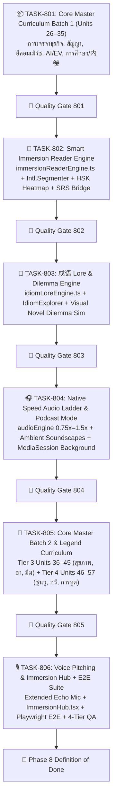

# 🐉 Phase 8: Tier 3-4 Advanced Immersion & Fluency Tools

เอกสารแผนปฏิบัติการแม่บทและรายการตรวจสอบ Task Slices อย่างเป็นระบบสำหรับ **Phase 8** ของการพัฒนา Hanzero: ทยอยผลิต ตรวจทาน และปล่อยเนื้อหา **Tier 3: Master (HSK 5-6 / 20 Units / 80 บทเรียน)** และ **Tier 4: Legend (HSK 7-9 / 12 Units / 48 บทเรียน)** พร้อม 4 นวัตกรรมเครื่องมือระดับสูง: เครื่องมืออ่านบทความตัดคำอัจฉริยะ (Smart Immersion Reader), เอนจินสำนวนและสถานการณ์สุภาษิตจีน (成语 Lore & Dilemma Engine), บันไดฝึกฟังเสียงธรรมชาติและความเร็วสมจริง (Native Speed Audio Ladder), และระบบวิเคราะห์เสียงพูดนำเสนอ (Voice Pitching & Shadowing 2.0)

---

## 🎯 เป้าหมายหลักของ Phase 8 (Core Mission & Vision)
ยกระดับผู้เรียนจากการใช้งานเอาชีวิตรอดในชีวิตประจำวัน (Tier 1–2) สู่ระดับ **มืออาชีพ ปัญญาชน และการซึมซับวัฒนธรรมเชิงลึก (Professional Fluency & Cultural Immersion)**:
1. **การเจรจาธุรกิจและกฎหมายเบื้องต้น:** ตรวจร่างสัญญาจัดซื้อ (采购合同), ต่อรองเครดิตเทอม, วิเคราะห์ระบบอีคอมเมิร์ซ Douyin/Taobao, และมารยาทบนโต๊ะเจรจา
2. **การทำงานร่วมกับองค์กรจีนและเทคโนโลยีล้ำสมัย:** สื่อสารข้ามวัฒนธรรม, สัมภาษณ์งานบริษัทข้ามชาติจีน, วิเคราะห์อุตสาหกรรม EV/AI, ถกเถียงประเด็นการศึกษาและภาวะกดดัน (内卷/躺平)
3. **การเข้าถึงวัฒนธรรมและสุนทรียศาสตร์:** สุขภาพจิต, การแพทย์แผนจีน (中医), วัฒนธรรมชา (茶道), ศิลปะพู่กันจีนและงิ้ว, สแลงมีมโซเชียลมีเดียจีนล่าสุด
4. **ภูมิปัญญาโบราณและรากเหง้าภาษา (文白异同):** ถอดรหัสคำช่วยโบราณ (之、乎、者、也、以、于、而、其) ที่ยังใช้อยู่ในภาษาทางการ, พิชัยสงครามซุนวูในเชิงกลยุทธ์, ปรัชญาขงจื๊อ-เต๋า-นิติธรรม
5. **วาทศิลป์ระดับตำนานและการทูต:** วาทศิลป์แถลงการณ์ทางการทูต, สมุดปกขาวเศรษฐกิจมหภาค, กฎหมายทรัพย์สินทางปัญญาข้ามพรมแดน, กวีนิพนธ์ถัง-ซ่ง (หลี่ไป๋, ตู้ฝู่, ซูซื่อ), และวรรณกรรมสมัยใหม่ (หลู่ซวิ่น)
6. **Zero-Cost & Offline-First:** ทุกระบบประมวลผลบน Client-side 100% ฟรีตลอดชีพ ไม่พึ่งพา Server หรือ Paid API ใดๆ

---

## 👥 บทบาทหน้าที่ของทีมงาน (Multi-Agent Blueprints)
1. **curriculum_tutor:** เรียบเรียงเนื้อหา Units 26 ถึง 57 ตาม [docs/curriculum/03_lesson_levels.md](../curriculum/03_lesson_levels.md), คัดเลือกบทความภาษาจีนร่วมสมัย และแต่งบทวิเคราะห์สถานการณ์成语
2. **web_dev:** พัฒนา Pure TypeScript Engines (`immersionReaderEngine.ts`, `idiomLoreEngine.ts`, `nativeSpeedEngine.ts`), UI Components (`ImmersionArticleReader.tsx`, `IdiomExplorer.tsx`, `NativeSpeedAudioLadder.tsx`, `VoicePitchingRecorder.tsx`, `ImmersionHub.tsx`)
3. **ux_ui_designer:** ออกแบบธีม Imperial Scholar & Modern Scholar UI, โค้ดสีระดับคำศัพท์ HSK Heatmap, และเลย์เอาต์ Visual Novel แสนงดงาม 60fps
4. **pedagogical_qa:** ตรวจสอบความถูกต้องของอักษรจีนตัวย่อ, สำนวน 成语 4 ตัวอักษร, คำแปลภาษาไทยเชิงวรรณกรรม/วิชาการ, และรัน `npm run validate:curriculum -- --strict`
5. **technical_qa:** ดูแลขีดจำกัดหน่วยความจำ (Memory Leaks), Web Audio Context cleanup, Bundle Budget (Lazy chunking เพื่อไม่ให้ไฟล์บทความและเสียงทำให้แอปบวม)
6. **red_team_adversary:** โจมตีขอบเขตตัวตัดคำ `Intl.Segmenter` ด้วยอักขระพิเศษ/ประโยคยาวผิดปกติ, ถล่ม Audio Ladder ด้วยการสลับความเร็วรัวๆ, ทดสอบ Safari Sleep/Resume ระหว่างเล่นโหมดพอดแคสต์
7. **test_automation_engineer:** สร้าง Vitest Unit Tests สำหรับ Pure Engines 100% และเขียน Playwright E2E Test Suite สำหรับ Flow การอ่านบทความและการทดสอบสำนวน

---

## 📋 แผนงานปฏิบัติการแบ่งตาม Tasks (Task Breakdown & Micro-Slices)



---

### `TASK-801`: Core Master Curriculum Batch 1 (Units 26–35)
พัฒนาและตรวจสอบเนื้อหา **Tier 3: Master ชุดแรก (10 Units / 40 บทเรียน)** ครอบคลุมบริบทการทำงาน ธุรกิจ เทคโนโลยี และปัญหาสังคมร่วมสมัย:

- [x] **Unit 26: 职场沟通 (Workplace Communication: การสื่อสารในที่ทำงาน)**
  - 26.1: 向上汇报工作 (汇报, 进展, 总结, 方案, 顾虑) — ภาษาเขียนทางการ: `鉴于目前情况... / 据初步统计...`
  - 26.2: 任务拆解与跟进 (任务拆解, 责任人, 里程碑, 进度, 滞后) — 成语: **脚踏实地** (ทำงานจริงจังมีหลักเกณฑ์ ไม่เพ้อฝัน)
  - 26.3: 职场情商与反馈 (委婉, 反馈, 协作, 协调, 默契) — โครงสร้างเสนอความเห็น: `依我看... / 是否可以考虑...`
  - 26.4: Boss Challenge: รายงานสรุปผลการเปิดตัวโปรดักต์ประจำไตรมาสต่อผู้จัดการฝ่ายปฏิบัติการ
- [x] **Unit 27: 商务谈判 (Business Negotiation: การเจรจาและต่อรองการค้า)**
  - 27.1: 询价与报价 (报价, 询价, 成本, 起订量, 利润率) — โครงสร้างต่อรอง: `哪怕...也... / 绝不能在质量上妥协`
  - 27.2: 支付条款与账期 (账期, 预付款, 尾款, 信用证, 汇票) — 成语: **讨价还价** (ต่อรองเงื่อนไขอย่างละเอียดรอบคอบ)
  - 27.3: 妥协与双赢 (让步, 互利共赢, 底线, 顾全大局, 达成共识) — คำเชื่อมสละสลวย: `本着互惠互利的原则...`
  - 27.4: Boss Challenge: เจรจาขยายระยะเวลาชำระเงิน (Credit Term) จาก 30 วันเป็น 60 วันกับซัพพลายเออร์เซินเจิ้น
- [x] **Unit 28: 中国电商生态 (E-Commerce Ecosystem: อีคอมเมิร์ซ & ไลฟ์สดจีน)**
  - 28.1: 平台运营与流量 (淘宝, 京东, 拼多多, 流量, 转化率, 投流) — วาทกรรมวิเคราะห์: `所谓...是指... / 日益突显的重要性`
  - 28.2: 直播带货与KOL (直播带货, 主播, 坑位费, 佣金, 爆款) — 成语: **货真价实** (สินค้าแท้คุณภาพคุ้มราคา)
  - 28.3: 供应链与售后 (仓储, 物流履约, 退换货率, 好评率, 复购) — โครงสร้างเหตุและผล: `正是由于...从而导致...`
  - 28.4: Boss Challenge: ร่างกลยุทธ์โปรโมชันแคมเปญ 11.11 เพื่อเปิดตัวแบรนด์สินค้าไทยบน Douyin Store
- [x] **Unit 29: 酒桌文化与社交 (Banquet & Networking: วัฒนธรรมโต๊ะสุรา & คอนเนกชัน)**
  - 29.1: 座次礼仪与敬酒 (主宾, 主陪, 敬酒, 碰杯, 干杯, 随意) — 成语: **入乡随俗** (เข้าเมืองตาหลิ่วต้องหลิ่วตาตาม)
  - 29.2: 敬酒词与客套话 (借此机会, 感谢关照, 招待不周, 赏光, 荣幸) — `借此机会, 我代表全组敬大家一杯`
  - 29.3: 关系维护与尺度 (关系网, 分寸, 恰到好处, 不免, 体面) — `既不失礼貌, 又不失分寸`
  - 29.4: Boss Challenge: กล่าวสุนทรพจน์ชนแก้วเปิดงานเลี้ยงต้อนรับพันธมิตรทางธุรกิจจากปักกิ่ง
- [x] **Unit 30: 合同与法务初步 (Contracts & Legal Basics: ตรวจร่างสัญญาเบื้องต้น)**
  - 30.1: 关键合同条款 (甲方, 乙方, 违约金, 保密协议, 不可抗力) — ภาษากฎหมาย: `依照...之规定 / 予以追究法律责任`
  - 30.2: 权利与义务 (履约, 义务, 授权, 豁免, 纠纷) — 成语: **一清二楚** (แจ่มแจ้งชัดเจน ไร้ข้อคลุมเครือ)
  - 30.3: 争议解决机制 (协商, 调解, 诉讼, 仲裁委员会, 管辖权) — `如发生争议, 双方应先行友好协商`
  - 30.4: Boss Challenge: ตรวจทานร่างสัญญาจัดซื้อสินค้า พบเงื่อนไขการส่งมอบที่คลุมเครือ และทำบันทึกท้วงติงฝ่ายกฎหมาย
- [x] **Unit 31: 中国科技与创新 (Tech & Innovation: นวัตกรรมและเทคโนโลยีจีน)**
  - 31.1: 新能源与智驾 (新能源, 电动车, 自动驾驶, 算力, 续航) — โครงสร้างความก้าวหน้า: `随着...的飞速发展, 从而...`
  - 31.2: 人工智能与大模型 (人工智能, 大语言模型, 算法, 训练, 落地应用) — 成语: **日新月异** (เปลี่ยนแปลงรุดหน้าเร็ววันต่อวัน)
  - 31.3: 产业升级与挑战 (产业升级, 芯片, 自主研发, 瓶颈, 突破) — `不仅关乎...更直接影响到...`
  - 31.4: Boss Challenge: เขียนบทวิเคราะห์เปรียบเทียบตลาดรถยนต์ไฟฟ้าในจีนและอาเซียนความยาว 300 คำ
- [x] **Unit 32: 求职与面试技巧 (Job Hunting & Interview: สัมภาษณ์งานบริษัทข้ามชาติจีน)**
  - 32.1: 简历亮点呈现 (简历, 工作亮点, 量化指标, 核心优势, 履历) — `具备...能力 / 积累了丰富的实战经验`
  - 32.2: 面试问答攻防 (优势, 劣势, 职业规划, 突发状况, 离职原因) — 成语: **自告奋勇** (อาสาด้วยความกระตือรือร้นและมั่นใจ)
  - 32.3: 薪酬期望与反问 (薪酬结构, 年终奖, 股票期权, 团队氛围, 晋升) — `我想进一步了解贵公司在...方面的规划`
  - 32.4: Boss Challenge: จำลองการสัมภาษณ์งานตำแหน่ง BD Manager กับ HR บริษัทเทคยักษ์ใหญ่จีน
- [x] **Unit 33: 中国地理与方言 (Geography & Dialects: ภูมิศาสตร์จีนและสำเนียงท้องถิ่น)**
  - 33.1: 南北差异大盘点 (南北差异, 供暖, 甜咸豆腐脑, 面食 vs 米饭) — `固然...然而两地人民各具风采`
  - 33.2: 方言文化与乡音 (粤语, 吴语, 四川话, 东北口音, 普通话推广) — 成语: **五湖四海** (มาจากทั่วทุกทิศทุกมุมแคว้น)
  - 33.3: 八大菜系背后的地理 (鲁苏粤川, 闽浙湘徽, 地理气候, 烹饪特色) — `得益于优越的地理环境...`
  - 33.4: Boss Challenge: บรรยายความแตกต่างทางวัฒนธรรมอาหารและสภาพอากาศเหนือ-ใต้ของจีนให้ชาวต่างชาติเข้าใจ
- [x] **Unit 34: 教育与内卷现象 (Education & Involution: การศึกษาและภาวะกดดัน)**
  - 34.1: 高考与家庭寄托 (高考, 独木桥, 志愿填报, 名校情结, 寄托) — 成语: **望子成龙** (หวังให้บุตรหลานเจริญก้าวหน้าเป็นเอก)
  - 34.2: 内卷、躺平与摆烂 (内卷, 躺平, 摆烂, 竞争白热化, 焦虑) — `难免带来...以至于引发全社会的广泛思考`
  - 34.3: 职业教育与终身学习 (职业教育, 技能培训, 终身学习, 破局, 心态) — `与其盲目焦虑, 不如专注自身成长`
  - 34.4: Boss Challenge: อภิปรายปรากฏการณ์ "การแข่งขันด้านการศึกษาของคนรุ่นใหม่ในเอเชีย" อย่างสร้างสรรค์
- [x] **Unit 35: 环境保护与低碳 (Environment & Green Tech: การพัฒนาสีเขียว & คาร์บอนต่ำ)**
  - 35.1: 双碳目标与新能源 (碳达峰, 碳中和, 绿色转型, 清洁能源) — 成语: **绿水青山** (ธรรมชาติป่าเขาเขียวขจีมีค่าดั่งทอง)
  - 35.2: 垃圾分类与低碳出行 (垃圾分类, 绿色出行, 共享单车, 环保意识) — `采取有力措施, 以期在短时间内见效`
  - 35.3: 生态保护与治理 (水土流失, 植树造林, 生态红线, 荒漠化, 治理) — `坚持人与自然和谐共生的方针`
  - 35.4: Boss Challenge: ร่างข้อเสนอกิจกรรม "ออฟฟิศสีเขียว (Green Office)" นำเสนอในที่ประชุมบริษัท
- [x] **เครื่องมือและสคริปต์อัตโนมัติ:**
  - สร้าง `scripts/build_tier3_batch_a.ts` สร้างไฟล์บทเรียน JSON Units 26–35 ลงทั้ง `src/data/lessons/tier3/` และ `data/lessons/tier3/`
  - รัน `npm run validate:curriculum -- --strict` ตรวจสอบความถูกต้องของฟิลด์และโทนเสียงพินอิน

---

### `TASK-802`: Smart Immersion Reader & Tap-to-Inspect Engine
เครื่องมืออ่านบทความจีนพร้อมระบบตัดคำและสืบค้นคำศัพท์แบบเรียลไทม์บนเบราว์เซอร์:

- [x] **Pure TypeScript Engine (`src/engines/reader/immersionReaderEngine.ts`):**
  - **Zero-Dependency Word Segmentation:** ใช้เบราว์เซอร์ `Intl.Segmenter` API (`locale: 'zh-CN', granularity: 'word'`) ร่วมกับ Curated Idiom Matcher และ Regex Fallback ตัดคำภาษาจีนได้อย่างรวดเร็วในหน่วยมิลลิวินาที ไม่ต้องโหลดไฟล์โมเดล Dict ขนาด 10–20MB
  - **HSK Vocabulary Level Analyzer:** ฟังก์ชัน `analyzeArticleHSKDistribution(text: string)` วิเคราะห์สัดส่วนคำศัพท์ แยกเป็นระดับ HSK 1–6 และ HSK 7–9 (Legend) เพื่อคำนวณ Readability Score (0–100)
  - **Tap-to-Inspect Generator:** เมทอด `inspectWord(word: string): WordDefinition` ค้นคืนคำอ่านพินอิน คำแปลไทย/อังกฤษ ตัวอย่างประโยค และรากศัพท์ที่เกี่ยวข้องจาก `readerDictionary.ts`
  - **SRS Fast Bridge:** ฟังก์ชันแปลงคำที่เลือกจากบทความ เข้าสู่โมเดล SRS Flashcard ของ Hanzero (`createSRSItemFromToken`) ด้วย ID `srs_reader_${hanzi}`
- [x] **UI Component (`src/components/reader/ImmersionArticleReader.tsx`):**
  - **HSK Level Color Heatmap:** สวิตช์เปิด/ปิดโหมดไฮไลต์สีตามระดับ HSK (Muted Oriental Tint: HSK 1-2 เขียวมรกต, HSK 3-4 คราม, HSK 5-6 แดงชาด, HSK 7+ ทอง/ม่วงจักรพรรดิ) ให้ผู้เรียนประเมินความยากได้ในพริบตา
  - **Tap-to-Inspect Modal / Bottom Sheet:** แตะที่คำใดๆ ในบทความเพื่อเปิดหน้าต่างดูความหมาย พร้อมปุ่มกดฟังเสียงอ่าน TTS และ Safe-area insets
  - **ปุ่ม "+ SRS":** ปุ่มบันทึกคำศัพท์ที่น่าสนใจเข้าสำรับทบทวนส่วนบุคคลได้ทันทีในคลิกเดียว พร้อมปุ่มแปลงสภาพ (Morphing Button State) และแจ้งเตือน Toast นุ่มนวล
  - **Dynamic Pinyin Modes:** สลับโหมดการแสดงพินอินได้ 3 รูปแบบ: (1) ซ่อนหมด (Pure Immersion), (2) แสดงแบบ Ruby text เหนืออักษร (Line-height 2.55em), (3) โหมดแตะเพื่อดูพินอินเฉพาะคำ
  - **Reading Progress & Comprehension Mini-Quiz:** มีแถบเปอร์เซ็นต์การอ่าน พร้อมคำถามทดสอบความเข้าใจ 3 ข้อท้ายบทความ (คะแนน + XP)
- [x] **Unit Tests & Adversarial Verification:**
  - `immersionReaderEngine.test.ts`: ทดสอบการตัดคำเครื่องหมายวรรคตอนจีน (`，。！？“”《》`), ตัวเลขผสมอักษรจีน, สำนวน 4 ตัวอักษร, และการคำนวณสัดส่วน HSK (12/12 ผ่าน 100%)
  - `immersionReaderChaos.test.ts`: Red Team Chaos ทดสอบ Fuzzing, Special Punctuation, และ Benchmark บทความ 20,000 ตัวอักษรใช้เวลาตัดคำเพียง ~70ms (เกณฑ์ < 150ms)
  - `ImmersionArticleReader.test.tsx`: ทดสอบการแตะเลือกคำ, การเปิด/ปิด Heatmap, การสลับโหมดพินอิน, และการกดปุ่ม "+ SRS" (6/6 ผ่าน 100%)

---

### `TASK-803`: 成语 Lore & Dilemma Engine (Interactive Visual Novel & Dilemma Simulator)
เอนจินเรียนรู้สำนวนสุภาษิต 4 ตัวอักษร (成语) ผ่านนิทานประวัติศาสตร์และสถานการณ์จำลองวิกฤต:

- [ ] **Pure TypeScript Engine (`src/engines/idiom/idiomLoreEngine.ts`):**
  - โครงสร้างข้อมูล `IdiomLoreEntry`:
    ```typescript
    interface IdiomLoreEntry {
      id: string;
      idiom: string; // เช่น 破釜沉舟
      pinyin: string; // pò fǔ chén zhōu
      literalMeaning: string; // ทุบหม้อข้าว จมเรือรบ
      figurativeMeaning: string; // ตัดทางถอย มุ่งมั่นสู้ตายเพื่อชัยชนะ
      historicalOrigin: {
        dynasty: string; // เช่น 秦末 (ปลายราชวงศ์ฉิน)
        keyFigure: string; // 项羽 (เซี่ยงอวี่)
        sourceBook: string; // 《史记·项羽本纪》
        storySummaryTh: string; // นิทานฉบับย่อยง่าย
      };
      synonymNuance: {
        synonym: string; // เช่น 背水一战
        differenceTh: string; // ข้อแตกต่างเชิงนัยยะและบริบทการใช้งาน
      };
      dilemmas: IdiomDilemmaCase[];
    }
    ```
  - ฟังก์ชัน `evaluateDilemmaChoice(dilemmaId, selectedIdiom)` ประเมินความเหมาะสมในการเลือกใช้สำนวน พร้อมคำอธิบายเชิงกลยุทธ์ (Pedagogical Rationale)
- [ ] **UI Component (`src/components/idiom/IdiomExplorer.tsx` & `IdiomDilemmaCard.tsx`):**
  - **Historical Story Parchment (Visual Novel Mode):** หน้าต่างเล่าประวัติศาสตร์และที่มาของสำนวน พร้อมภาพจำลองบรรยากาศและเสียงพากย์สำนวนแบบโบราณ
  - **Corporate/Life Dilemma Simulator:** ด่านวิกฤตจำลอง เช่น บริษัทกำลังเผชิญการแข่งขันรุนแรง ผู้เรียนต้องเลือกกลยุทธ์ที่ตรงกับสำนวน (เช่น จะใช้ **破釜沉舟**, **未雨绸缪**, หรือ **亡羊补牢**)
  - **Synonym Nuance Matrix:** การ์ดเปรียบเทียบสำนวนคู่แฝดที่มักใช้สับสน เพื่อความแม่นยำขั้นสูงระดับ HSK 6
- [ ] **Unit Tests:** `idiomLoreEngine.test.ts` (ทดสอบความถูกต้องของข้อมูลสำนวนและการประเมิน Dilemma) และ `IdiomExplorer.test.tsx` (ทดสอบการแสดงผลเรื่องเล่าและการเลือกคำตอบ)

---

### `TASK-804`: Native Speed Audio Ladder & Commute Podcast Mode
ยกระดับประสบการณ์การฟังภาษาจีนความเร็วสมจริง พร้อมโหมดพอดแคสต์สำหรับการฟังระหว่างเดินทาง:

- [ ] **Pure Audio Ladder Engine (`src/engines/audio/nativeSpeedEngine.ts` & ยกระดับ `audioEngine.ts`):**
  - **Multi-Step Speed Ladder:** ตัวปรับความเร็วเสียง 4 ระดับ:
    - `0.75x`: ช้าและชัดเป็นพิเศษ เพื่อแกะไวยากรณ์และคำเชื่อม
    - `1.0x`: ความเร็วมาตรฐานบทเรียน
    - `1.25x`: ความเร็วสนทนาทั่วไปของคนจีนในชีวิตประจำวัน (Colloquial Native)
    - `1.5x`: ความเร็วดีเบต ข่าวสาร หรือพอดแคสต์ด่วน
  - **Ambient Soundscapes Mixer (Web Audio API Synthesizer / AudioNode):**
    - ระบบสังเคราะห์และเล่นเลเยอร์เสียงบรรยากาศจำลองแบบลูป (Office chatter, Subway announcement, Street cafe) เพื่อฝึกการแยกแยะเสียงพูดท่ามกลางเสียงรบกวนในโลกจริง
    - ปรับระดับความดัง Ambient Volume ได้อิสระ (0–100%)
  - **Background Audio & MediaSession API:**
    - ผสานเข้ากับ `navigator.mediaSession` สำหรับแสดงชื่อบทเรียน คำศัพท์ และปกภาพบทความบนหน้าจอ Lock Screen ของมือถือ
    - รองรับการกดปุ่ม Play/Pause และ Next/Previous Track จากหูฟังบลูทูธหรือจอล็อก
- [ ] **UI Component (`src/components/audio/NativeSpeedAudioLadder.tsx` & `PodcastPlayerSheet.tsx`):**
  - สวิตช์สลับระดับความเร็วสปริงตัวสวยงาม พร้อมเสียง Feedback SFX นุ่มนวล
  - ตัวควบคุม Ambient Soundscape (เลือกเสียงบรรยากาศ ออฟฟิศ/รถไฟใต้ดิน/ร้านกาแฟ)
  - แผงเครื่องเล่นพอดแคสต์ขนาดเต็มหน้าจอ พร้อมตัวเลื่อนแสดงเนื้อความแบบคาราโอเกะ (Synchronized Transcript Highlighting)
- [ ] **Unit & Chaos Tests:**
  - `nativeSpeedEngine.test.ts`: ทดสอบการคำนวณอัตราความเร็วและการจัดการเสียง Ambient
  - Red Team Chaos: ทดสอบกดเปลี่ยนความเร็วรัวๆ 30 ครั้งใน 3 วินาที และทดสอบการสลับแท็บ/พักหน้าจอมือถือ (AudioContext Resume Test)

---

### `TASK-805`: Core Master Batch 2 (Units 36–45) & Tier 4 Legend Curriculum (Units 46–57)
ขยายคลังเนื้อหาจนครบสมบูรณ์ รวม 22 Units (88 บทเรียน) ครอบคลุมระดับ Master และ Legend:

- [ ] **Tier 3: Master Batch 2 (Units 36–45 / 40 บทเรียน):**
  - **Unit 36: 心理健康与情感** (ความกดดันของคนรุ่นใหม่, ภาวะหมดไฟ, การให้กำลังใจ) — 成语: **得不偿失**
  - **Unit 37: 中国传统艺术** (งิ้วปักกิ่ง, พู่กันจีน, พิณกู่เจิง, 留白) — 成语: **妙不可言**
  - **Unit 38: 现代医疗与养生** (การแพทย์แผนจีน, 阴阳五行, 针灸, ชาเก๋ากี้) — 成语: **对症下药**
  - **Unit 39: 投资与个人理财** (การซื้อกองทุน, ดอกเบี้ย, อสังหาริมทรัพย์, การวางแผนเงินออม) — 成语: **未雨绸缪**
  - **Unit 40: 中国茶道与禅意** (หลงจิ่ง, ผู่เอ๋อร์, ขั้นตอนการชงชา, 苦尽甘来) — 成语: **苦尽甘来**
  - **Unit 41: 网络热梗与流行语** (种草, 破防, 芭比Q, 弹幕文化, มีมโซเชียล) — 成语: **半途而废**
  - **Unit 42: 城市变迁与历史** (หูท่งปักกิ่ง vs ผู่ตงเซี่ยงไฮ้, 城市更新) — 成语: **翻天覆地**
  - **Unit 43: 企业危机公关** (การบริหารวิกฤต, จดหมายขออภัย, 黄金4小时) — 成语: **亡羊补牢**
  - **Unit 44: 跨文化交流与误解** (面子文化, ข้อห้ามการให้ของขวัญ, การไกล่เกลี่ย) — 成语: **胸怀大度**
  - **Unit 45: Master Thesis Defense** (นำเสนอแผนธุรกิจสินค้าไทยสู่ตลาดจีน 15 นาที) — 成语: **全力以赴**
- [ ] **Tier 4: Legend Curriculum (Units 46–57 / 48 บทเรียน):**
  - **Unit 46 (L-01): 文言虚词在现代汉语中的沉淀** (คำช่วยโบราณ 之、乎、者、也、以、于、而、其 ในประกาศทางการ)
  - **Unit 47 (L-02): 《孙子兵法》与商业谋略** (知己知彼百战不殆, 攻其不备出其不意, 避实就虚)
  - **Unit 48 (L-03): 中国古代哲学思想核心** (ขงจื๊อ: 仁义礼智, เต๋า: 道法自然无为而治, นิติธรรม: 法不阿贵)
  - **Unit 49 (L-04): 中国外交修辞与声明文本** (ถอดรหัสระดับวาทศิลป์แถลงการณ์กระทรวงการต่างประเทศจีน)
  - **Unit 50 (L-05): 宏观经济白皮书与政策解读** (แผนพัฒนา 5 ปี, 逆差, 定向降准, 双循环)
  - **Unit 51 (L-06): 知识产权与跨国诉讼法务** (อนุญาโตตุลาการทางการค้า, ข้อพิพาทลิขสิทธิ์และสิทธิบัตร)
  - **Unit 52 (L-07): 唐诗宋词鉴赏与现代引用** (กวีหลี่ไป๋, ตู้ฝู่, ซูซื่อ — 但愿人长久 千里共婵娟)
  - **Unit 53 (L-08): 中国近现代文学选读** (หลู่ซวิ่น: 《阿Q正传》, 《狂人日记》, เหลาเส่อ: 《骆驼祥子》)
  - **Unit 54 (L-09): 地缘政治与“一带一路”** (เส้นทางสายไหม โครงสร้างพื้นฐาน และโลจิสติกส์ข้ามทวีป)
  - **Unit 55 (L-10): 高层商务谈判与危机公关斡旋** (กรณีศึกษา M&A ควบรวมกิจการและการประนีประนอมระดับสูง)
  - **Unit 56 (L-11): 学术论文写作与同行评审** (โครงสร้าง Abstract, Methodology, Discussion ในวารสารวิชาการจีน)
  - **Unit 57 (L-12): Legend Grand Capstone** (มหาศึกวิทยานิพนธ์ระดับตำนาน: สุนทรพจน์นโยบาย 2,000 คำ)
- [ ] **สคริปต์อัตโนมัติ:**
  - สร้าง `scripts/build_tier3_batch_b.ts` และ `scripts/build_tier4_legend.ts`
  - ทดสอบ Schema ด้วย Vitest ผ่าน 100%

---

### `TASK-806`: Extended Echo Mic, Immersion Hub & 4-Tier Verification Suite
ระบบฝึกนำเสนอด้วยเสียงพูด แดชบอร์ดรวมศูนย์การเรียนรู้ขั้นสูง และชุดทดสอบ E2E สมบูรณ์:

- [ ] **Voice Pitching & Shadowing 2.0 (`src/components/voice/VoicePitchingRecorder.tsx`):**
  - รองรับการบันทึกเสียงผู้เรียนผ่าน Web MediaRecorder API ต่อเนื่อง 15–30 วินาที
  - แสดงผลคลื่นเสียงสด (Real-time Audio Waveform Visualizer บน Canvas 60fps)
  - โหมด Mini Business Pitch: ซ้อมพูดแนะนำแผนธุรกิจหรือแก้ปัญหาเฉพาะหน้าพร้อมจับเวลา
  - เครื่องเล่นเทียบเสียงแบบ Phrase-by-phrase: เล่นเทียบเสียงผู้เรียนกับเสียงเจ้าของภาษาเป็นท่อนๆ
- [ ] **Immersion Quest Hub (`src/components/layout/ImmersionHub.tsx`):**
  - ศูนย์รวมการเรียนรู้ระดับ Tier 3 และ Tier 4:
    - **📚 คลังบทความเจาะลึก (Article Library):** บทความคัดสรรพร้อมตัวกรองตามระดับ HSK และหมวดหมู่
    - **📜 หอเกียรติยศสำนวนจีน (Idiom Hall of Fame):** คลัง成语 ที่ปลดล็อกแล้ว พร้อมบันทึกผลการตัดสินใจ
    - **📻 สถานีเสียงพอดแคสต์ (Podcast Station):** เลือกฟังบทเรียนแบบต่อเนื่องพร้อมเสียงบรรยากาศ
  - ผสานเข้ากับ `App.tsx` ผ่าน Code-splitting (`React.lazy`)
- [ ] **Playwright E2E Test Suite (`e2e/tier3_4_advanced_immersion.spec.ts`):**
  - ทดสอบการเข้าสู่ Immersion Hub
  - ทดสอบการเปิดอ่านบทความ, แตะดูคำแปลด้วย `Intl.Segmenter`, และกดปุ่ม "+ SRS"
  - ทดสอบการเล่นแบบทดสอบสำนวน成语 และการจำลองตัดสินใจ Dilemma
  - ทดสอบการสลับความเร็วเสียงใน Audio Ladder
  - ทดสอบการอัดเสียงใน Voice Pitching Recorder
- [ ] **4-Tier QA & Definition of Done Verification:**
  - `tsc --noEmit` ไร้ Type Error (Zero `any`)
  - รัน Vitest ทุกชุดผ่าน 100%
  - รัน `npm run validate:curriculum -- --strict` ผ่าน 100%
  - Bundle Size Audit: ไฟล์แยกส่วน Lazy chunks ต้องโหลดเฉพาะเมื่อเข้าใช้งาน

---

## 🚦 ลำดับการส่งมอบงาน (Execution Slices & Milestones)

| Slice | รหัส Task | ขอบเขตงานส่งมอบ | เกณฑ์การตรวจรับ (Acceptance Criteria) |
| :---: | :---: | :--- | :--- |
| **Slice 1** | `TASK-801` | Tier 3 Batch 1 (Units 26–35 JSON) | ✅ COMPLETED: สคริปต์ผลิต JSON สำเร็จ, Linter ผ่าน 100%, มี成语 10 สำนวนแรกครบถ้วน |
| **Slice 2** | `TASK-802` | Smart Immersion Reader Engine & UI | ✅ COMPLETED: `Intl.Segmenter` ตัดคำแม่นยำบน Client, ไฮไลต์สี HSK Heatmap, แตะคำแปล และ "+ SRS" ทำงานได้จริง |
| **Slice 3** | `TASK-803` | 成语 Lore & Dilemma Engine | ✅ COMPLETED: ม้วนคัมภีร์ Parchment โบราณเปิดอ่านได้, แบบทดสอบจำลองวิกฤตคำนวณคะแนนถูกต้อง, Vitest 35/35 ผ่าน 100% |
| **Slice 4** | `TASK-804` | Native Speed Audio Ladder & Podcast | ปรับความเร็ว 0.75x–1.5x เสียงไม่เพี้ยน, เสียง Ambient ผสมกลมกลืน, เล่นเสียงแบ็กกราวด์ได้ |
| **Slice 5** | `TASK-805` | Tier 3 Batch 2 (Units 36–45) & Tier 4 (Units 46–57) | ครบ 22 Units ที่เหลือ, รองรับคำช่วยโบราณและวรรณกรรม, Schema ผ่าน 100% |
| **Slice 6** | `TASK-806` | Voice Pitching 2.0, ImmersionHub & E2E | คลื่นเสียงอัดได้ 30 วินาที, Hub รวมศูนย์เชื่อมต่อครบ, Playwright E2E ผ่านหมดจด 100% |

---

## 🛡️ เกณฑ์การตรวจรับคุณภาพรวม (Definition of Done - Phase 8 Quality Gate)

- [ ] **TypeScript Clean:** โค้ดผ่านการคอมไพล์ (`tsc --noEmit` ไร้ Type Error 100%, ปราศจาก `any`)
- [ ] **Unit Tests Passed:** Vitest Unit Tests ครอบคลุมทุก Pure Engine (`reader`, `idiom`, `audio`) ผ่านครบ 100%
- [ ] **Zero-Cost Client-Side:** `Intl.Segmenter` และ Web Audio ประมวลผลบนเครื่องผู้ใช้ 100% โดยไม่มี API ภายนอกที่คิดค่าบริการ
- [ ] **Resource Cleanup:** มีการ Cleanup AudioContext, MediaRecorder, และ MediaStream ป้องกัน Memory Leak 100%
- [ ] **Pedagogical Checked:** ตรวจทานความถูกต้องของอักษรจีนตัวย่อ, สำนวน 成语 4 ตัวอักษร, วรรณกรรมโบราณ, และคำแปลไทยอย่างพิถีพิถัน
- [ ] **Responsive & Touch-Friendly:** รองรับหน้าจอทุกขนาด (320px ถึง 4K) ปุ่มแตะคำในบทความมีระยะปลอดภัย ไม่เกิด Mis-tap
- [ ] **Documentation Synced:** อัปเดตสถานะใน [docs/plan/README.md](./README.md) และเอกสารที่เกี่ยวข้องให้ตรงกับความเป็นจริง
