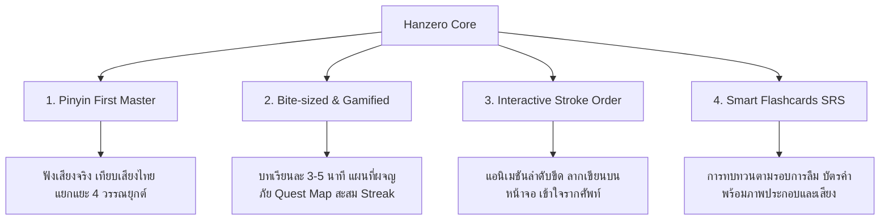

# 🎯 01 - Product Vision & Concept

## 1. ข้อมูลทั่วไปของโปรเจกต์
* **ชื่อโปรเจกต์:** Hanzero (ฮั่นซีโร่)
* **ความหมายของชื่อ:** **Hanzi (汉字 - ตัวอักษรจีน)** + **Zero (0)** 
* **สโลแกน:** "เริ่มจาก 0 สู่ภาษาจีนคล่องตัว" (From Zero to Hanzi Hero)
* **แกนหลัก:** เว็บแอปพลิเคชันสอนภาษาจีนที่ออกแบบมาสำหรับคนไม่มีพื้นฐานเลย ให้เรียนรู้ได้ง่าย ไม่น่าเบื่อ และเห็นพัฒนาการจริง

---

## 2. ปัญหาที่พบในตลาด (Pain Points)
1. **คนกลัวตัวอักษรจีน:** รู้สึกว่าขีดเยอะ จำยาก สับสน
2. **ออกเสียงพินอินไม่ถูก:** วรรณยุกต์และสระผสมเป็นอุปสรรคแรกที่ทำให้คนถอดใจ
3. **บทเรียนยาวและเครียด:** คอร์สส่วนใหญ่เน้นไวยากรณ์ทฤษฎีหนัก ขาดความสนุกและการมีส่วนร่วม (Engagement)
4. **ขาดการทบทวนอย่างมีแบบแผน:** เรียนแล้วลืมไวเพราะไม่มีระบบกระตุ้นความจำ (Spaced Repetition)

---

## 3. กลุ่มเป้าหมาย (Target Audience)
* **กลุ่มหลัก:** ผู้เริ่มต้นเรียนภาษาจีนอายุ 15 - 35 ปี ที่ไม่มีพื้นฐานเลย (Zero-knowledge)
* **กลุ่มรอง:** นักเรียน/นักศึกษาที่เตรียมสอบ HSK 1-2 หรือคนทำงานที่ต้องการทักษะสื่อสารภาษาจีนพื้นฐานในชีวิตประจำวัน

---

## 4. เสาหลักของประสบการณ์การเรียนรู้ (Key Pillars)

---

## 5. เป้าหมายความสำเร็จ (Success Metrics / MVP Goals)
- ผู้เรียนสามารถผสมเสียงพินอินและออกเสียง 4 วรรณยุกต์ได้ถูกต้อง
- ผู้เรียนจดจำคำศัพท์พื้นฐาน 50-100 คำแรก (HSK 1 level) ได้อย่างแม่นยำ
- ผู้เรียนรู้สึกเพลิดเพลินและอยากกลับมาเรียนต่อเนื่องทุกวัน (Daily Retention)
