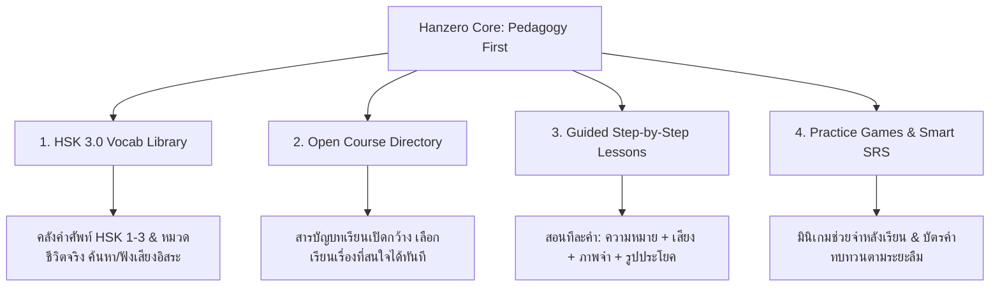

# 🎯 01 - Product Vision & Concept (ฉบับปรับทัพ: Pedagogy First)

## 1. ข้อมูลทั่วไปของโปรเจกต์
* **ชื่อโปรเจกต์:** Hanzero (ฮั่นซีโร่)
* **ความหมายของชื่อ:** **Hanzi (汉字 - ตัวอักษรจีน)** + **Zero (0)** 
* **สโลแกน:** "เริ่มจาก 0 สู่ภาษาจีนคล่องตัว" (From Zero to Hanzi Hero)
* **แกนหลัก:** **เว็บแอปพลิเคชันเรียนและฝึกฝนภาษาจีนข้ามแพลตฟอร์ม (Modern Responsive Web Platform)** ที่มุ่งเน้นการสอนจริง เข้าใจง่าย มี **คลังคำศัพท์ HSK 3.0 ครบถ้วน** ค้นหาและฟังเสียงได้อิสระ โดยมีสารบัญบทเรียนเปิดกว้าง (Open Course Catalog) และใช้มินิเกมเป็นแบบฝึกหัดเสริม ไม่ใช่เกมบล็อกความก้าวหน้า

---

## 2. ปัญหาที่พบในตลาด & ปัญหาที่ระบบเดิมเคยหลงทาง (Pain Points & Realignment)
1. **คนกลัวตัวอักษรจีน:** รู้สึกว่าขีดเยอะ จำยาก สับสน
2. **ออกเสียงพินอินไม่ถูก:** วรรณยุกต์และสระผสมเป็นอุปสรรคแรกที่ทำให้คนถอดใจ
3. **เว็บเรียนภาษากลายเป็นเกมแฟนตาซีที่ไม่ได้เรียนจริง (Critical Fix):** ระบบเดิมเน้นเควสต์ หลอดพลัง/หัวใจ บอส พาสปอร์ต จนกลายเป็นอุปสรรคขวางกั้นการเรียนรู้ ผู้เรียนเลือกบทที่ต้องการไม่ได้ และไม่มีแม้แต่หน้าค้นหาคำศัพท์
4. **ขาดคลังคำศัพท์ที่เข้าถึงได้ทันที (Dictionary & Vocab Explorer):** ผู้เรียนไม่สามารถเปิดดูหมวดหมู่คำศัพท์ HSK หรือค้นหาคำศัพท์ที่อยากรู้ได้

---

## 3. กลุ่มเป้าหมาย (Target Audience)
* **กลุ่มหลัก:** ผู้เริ่มต้นเรียนภาษาจีนอายุ 15 - 35 ปี ที่ไม่มีพื้นฐานเลย (Zero-knowledge) หรือต้องการปูพื้นฐานพินอินและคำศัพท์สำคัญ
* **กลุ่มรอง:** ผู้เตรียมสอบ HSK 1, HSK 2, HSK 3 หรือผู้ที่ต้องการเรียนรู้บทสนทนาเอาชีวิตรอดในชีวิตประจำวัน (สั่งอาหาร, ท่องเที่ยว, ซื้อของ)

---

## 4. เสาหลักของประสบการณ์การเรียนรู้ใหม่ (The 4 Core Pillars)

```mermaid
graph TD
    A[Hanzero Core: Pedagogy First] --> B[1. HSK 3.0 Vocab Library]
    A --> C[2. Open Course Directory]
    A --> D[3. Guided Step-by-Step Lessons]
    A --> E[4. Practice Games & Smart SRS]
    
    B --> B1[คลังคำศัพท์ HSK 1-3 & หมวดชีวิตจริง ค้นหา/ฟังเสียงอิสระ]
    C --> C1[สารบัญบทเรียนเปิดกว้าง เลือกเรียนเรื่องที่สนใจได้ทันที]
    D --> D1[สอนทีละคำ: ความหมาย + เสียง + ภาพจำ + รูปประโยค]
    E --> E1[มินิเกมช่วยจำหลังเรียน & บัตรคำทบทวนตามระยะลืม]
```

---

## 5. เป้าหมายความสำเร็จ (Success Metrics)
- ผู้เรียนสามารถเข้ามาค้นหา ฟังเสียง และทบทวนคำศัพท์ HSK 3.0 ได้อย่างอิสระตลอดเวลา
- ผู้เรียนสามารถเลือกเรียนบทเรียนใดก็ได้ในระบบได้ทันทีโดยไม่ต้องรอปลดล็อก
- จบบทเรียน ผู้เรียนต้องตอบได้จริงว่า "วันนี้ได้คำศัพท์อะไรบ้าง ออกเสียงอย่างไร และแปลว่าอะไร"
- ประสบการณ์ลื่นไหลทั้งบน Desktop และ Mobile รองรับการอ่านและฟังเสียง TTS คุณภาพสูง
