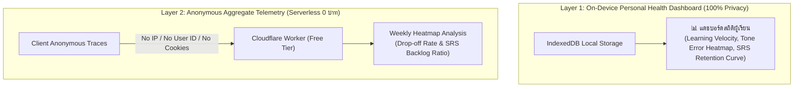

# 📱 02 - Hanzero Feature Specifications (สเปกฟีเจอร์อย่างละเอียด)

เอกสารนี้ระบุข้อกำหนดฟังก์ชันการทำงาน (Functional Requirements), พฤติกรรมการตอบสนอง (System Behaviors), กรณีเกิดข้อผิดพลาด (Edge Cases) และกฎเกณฑ์ทางประสบการณ์ผู้ใช้ (UX Rules) ของระบบ **Hanzero** ทั้งหมด เพื่อเป็นมาตรฐานอ้างอิงของทีมพัฒนาและ AI Agent

---

## 🧭 1. ประสบการณ์แรกเข้าและเส้นทางผู้เรียน (Onboarding & Learner Journey)

### 1.1 ประตูต้อนรับผู้เรียนใหม่ (Welcome & Placement Modal)
เมื่อผู้ใช้เข้าใช้งานเว็บแอปครั้งแรก (ไม่มีบันทึกใน LocalStorage):
- **หน้าต่าง Onboarding:** แสดงการต้อนรับอย่างอบอุ่นสไตล์ Modern Oriental ด้วยคาแรกเตอร์ "น้องหมีแพนด้าเปาเปา (Baobao 宝包)"
- **ทางเลือกเริ่มต้น (2 Tracks):**
  1. **"เริ่มจาก 0 ไม่เคยเรียนมาก่อน" (Recommended):** นำทางเข้าสู่ **Tier 0: Pinyin & Stroke Mastery** ทันที เพื่อปูพื้นฐานเสียง วรรณยุกต์ และ 8 เส้นขีด
  2. **"มีพื้นฐานพินอินแล้ว ข้ามไปบทสนทนา":** ปลดล็อกข้ามไปสู่ **Tier 1: Explorer (Unit 1: ทักทาย & ขอบคุณ)** โดยแสดงข้อความแจ้งเตือนว่าสามารถกลับมาทบทวน Tier 0 ได้ตลอดเวลา
- **Silent Mode Initial Prompt:** ตัวเลือกถามเบื้องต้น "ตอนนี้สะดวกเปิดเสียงหรือไม่?" เพื่อตั้งค่าเสียงล่วงหน้า

### 1.2 แผนผังเส้นทางการเรียนรู้ (Dual-Tier Quest Map)
- ผู้เรียนสามารถกดสลับมุมมองระหว่าง **Tier 0 (Foundation)** และ **Tier 1-4 (Communication)** ได้ผ่านแถบ Tier Switcher ด้านบน
- ป้องกันผู้เรียนสับสนระหว่าง *Engineering Vertical Slice* (Unit 1 ที่พัฒนาขึ้นก่อนเป็นแม่แบบ) กับ *Real Learner Path* (เริ่มจาก Tier 0 สู่ Tier 1)

---

## 🔊 2. เครื่องยนต์เสียงและการรับมือความผิดพลาด (Audio Engine & Resilience)

### 2.1 ระบบสังเคราะห์เสียงพูด (Web Speech API Chinese TTS)
- ใช้เสียงภาษาจีนกลางมาตรฐาน (`zh-CN`, `cmn-Hans-CN`)
- **การปรับความเร็วเสียง (Rate Control):**
  - โหมดปกติ: `1.0x`
  - โหมดเต่า/ฝึกฟัง (Slow Mode): `0.75x` สำหรับผู้เริ่มต้นฟังพินอินชัดเจน
- **iOS Safari Keep-alive & Unlock Gesture:**
  - เพิ่มระบบ AudioContext Unlocker เมื่อผู้ใช้แตะปุ่มใดๆ ครั้งแรกในหน้าเว็บ (Touch/Click Gesture) ป้องกันปัญหา iOS บล็อก Autoplay
  - กลไก Ping Keep-alive ทุก 10 วินาที ป้องกัน `speechSynthesis` หยุดชะงักบน Chrome/WebKit

### 2.2 แผนสำรองกรณีเครื่องไม่มีเสียงจีน (Graceful Voice Degradation Matrix)
| สถานะของอุปกรณ์ | การตรวจจับ (Detection) | พฤติกรรมของระบบ (System Behavior) |
| :--- | :--- | :--- |
| **มีเสียง zh-CN ครบถ้วน** | `voices.some(v => v.lang.includes('zh'))` | เล่นเสียง Native TTS คมชัด 100% |
| **ไม่มีเสียงภาษาจีนในเครื่อง** | ค้นหา `zh` แล้วได้ค่าว่าง | 1. แสดงไอคอนแจ้งเตือนสีส้มพร้อม Tooltip "เบราว์เซอร์ยังไม่ได้ติดตั้งเสียงภาษาจีน"<br/>2. **Tier 0 Phonemes:** เล่นเสียงคนจริงจาก **Static Audio Pack (~2MB)** ทันที เพื่อไม่ให้กระทบการฝึกฟังพินอิน<br/>3. **Tier 1+ Words:** เล่นเสียงคลื่นความถี่แทน (Web Audio Pitch Tone 1-4) พร้อม Mouth Chart และ Waveform |
| **เบราว์เซอร์ไม่รองรับ Web Speech** | `'speechSynthesis' in window === false` | ปิดระบบเสียงพูดอัตโนมัติ สลับไปใช้ Static Audio Pack สำหรับพินอิน และ Web Audio SFX แทน |

### 2.3 โหมดการเดินทาง / โหมดเงียบ (Commute & Silent Mode)
- ผู้ใช้สามารถเปิดสลับโหมดเงียบ (🔇 Silent Mode) ได้จาก Header Bar หรือหน้าตั้งค่า
- เมื่อเปิด Silent Mode:
  - ระบบจะงดเล่นเสียง TTS และ SFX ทั้งหมด
  - ในส่วนควิซ (Quiz Container) คำถามประเภท "ฟังเสียงแล้วเลือกวรรณยุกต์" จะถูกสลับเป็น "ดูพินอินแล้วเลือกคำแปล" หรือ "ดูตัวอักษรแล้วเติมพินอิน" โดยอัตโนมัติ เพื่อให้เรียนบนรถสาธารณะได้ราบรื่น

### 2.4 ระบบฝึกพูดและเทียบเสียงด้วยตนเอง (Client-side Shadowing & Self-Echo)
- ฟังก์ชัน **"Echo Mic"**: ผู้เรียนกดปุ่มไมโครโฟนเพื่ออัดเสียงตัวเองสั้นๆ (2 วินาที)
- ใช้ `MediaRecorder API` ในหน่วยความจำเครื่อง (In-memory ArrayBuffer) โดยไม่ส่งขึ้นเซิร์ฟเวอร์ (Zero Cloud Cost & 100% Privacy)
- ระบบเล่นเสียงต้นฉบับ Native Speaker ทันที แล้วตามด้วยเสียงที่ผู้เรียนเพิ่งอัด เพื่อให้หูของผู้เรียนเปรียบเทียบวรรณยุกต์ได้ด้วยตัวเอง

---

## ✍️ 3. การแสดงผลอักษรจีนและการคัดลายมือ (Hanzi Legibility & Handwriting)

### 3.1 มาตรฐานขนาดตัวอักษรจีนเพื่อความคมชัด (Legibility Standards)
เพื่อป้องกันปัญหาเส้นขีดอักษรจีนกลืนกันบนหน้าจอมือถือ (Stroke Clutter):
- **ขนาดขั้นต่ำในการ์ดคำศัพท์ (Vocab Card):** อักษรจีนต้องมีขนาดไม่ต่ำกว่า `36px` (หรือ `2.25rem`)
- **ขนาดขั้นต่ำในแบบฝึกหัด/ควิซ:** ขนาดไม่ต่ำกว่า `28px` (หรือ `1.75rem`)
- **ปุ่มขยายเส้นขีด (Stroke Zoom Inspector):** แตะที่ตัวอักษรจีนใดๆ เพื่อเปิดหน้าต่าง Modal ขยายใหญ่ 120px พร้อมแสดงตารางตารางเก้าช่องแบบ米字格 (Mǐzìgé) เพื่อดูรายละเอียดเส้นขีดชัดเจน

### 3.2 ระบบฝึกคัดอักษรจีน (Hanzi Writer Engine)
- ใช้เอนจิน `hanzi-writer` ฝังใน Canvas
- **2 โหมดการทำงาน:**
  1. *โหมดสาธิต (Animated Stroke):* วาดเส้นตามลำดับถูกต้อง พร้อมไฮไลต์หัวปากกา
  2. *โหมดทดสอบ (Stroke Quiz):* ให้ผู้ใช้ใช้นิ้วลากตามเส้นขีด หากลากผิดลำดับ เส้นจะกระพริบสีแดงและมีคำแนะนำให้ลากใหม่
- **Resource Cleanup:** มีการสั่ง `writer.destroy()` เมื่อ Component unmount เสมอ เพื่อป้องกัน Canvas Memory Leak

### 3.3 ระบบค่อยๆ ซ่อนพินอิน (Progressive Pinyin Fading)
- เพื่อแก้ปัญหาผู้เรียน **"ติด Pinyin"** จนไม่อ่านตัวอักษรจีน:
  - ใน Unit 1–4 แสดง Pinyin เด่นชัด 100% ควบคู่ตัวจีน
  - ตั้งแต่ Unit 5 ขึ้นไป ผู้เรียนสามารถเลือกโหมด **"Pinyin Faded"** (พินอินแสดงเป็นสีเทาจาง 30%) หรือ **"Pinyin Hidden"** (ซ่อนพินอิน แล้วใช้การแตะเพื่อแอบดู Tap-to-reveal)

### 3.4 การออกแบบวรรณยุกต์ที่เป็นมิตรกับผู้มีภาวะตาบอดสี (Accessible Tone Indicators)
- หลีกเลี่ยงการใช้สีเขียว-แดงเพียงอย่างเดียวในการระบุวรรณยุกต์
- ทุกจุดที่แสดงวรรณยุกต์ ต้องมี **สัญลักษณ์รูปคลื่นเสียง (Contour Marks: ¯ ˊ ˇ ˋ)** หรือ **ตัวเลขกำกับวรรณยุกต์ (1, 2, 3, 4)** ประกบข้างสีเสมอ เพื่อให้ผู้มีภาวะตาบอดสีแดง-เขียวแยกแยะได้ 100%

---

## 🎮 4. ระบบเศรษฐกิจเกมและโซนเรียนรู้ปลอดภัย (Gamification & Safe Practice Zone)

### 4.1 ระบบหัวใจ (Heart Economy)
- ผู้เรียนมีหัวใจเริ่มต้น **5 ดวง** (❤️ ❤️ ❤️ ❤️ ❤️)
- **กฎโซนปลอดภัย (Safe Practice Zone - Pedagogical Protection):**
  - 🛡️ **Tier 0 (Pinyin & Pronunciation): ไม่มีการตัดหัวใจเด็ดขาด!** ผู้เริ่มต้นสามารถลองฟังและตอบผิดได้ไม่จำกัด เพื่อส่งเสริมการกล้าทดลองและไม่สร้างความเครียด
  - 🛡️ **โหมด Flashcard ทบทวน (SRS Review): ไม่มีการตัดหัวใจ!**
  - ⚠️ **การตัดหัวใจจะเกิดขึ้นเฉพาะใน:** แบบทดสอบท้ายบท (Unit Quiz) และ ด่านบอส (Boss Challenge) ของ Tier 1 เป็นต้นไป
- **กลไกการฟื้นฟูหัวใจ (Heart Recovery):**
  1. *ฟื้นฟูตามเวลา:* ได้รับ 1 หัวใจทุกๆ 4 ชั่วโมง
  2. *ฟื้นฟูด้วยการฝึกฝน (Practice to Earn):* เข้าทำแบบฝึกหัดทบทวนคำศัพท์เก่าถูก 5 ข้อ ได้รับ 1 หัวใจทันที (ไม่จำกัดจำนวนครั้ง ไม่ต้องรอข้ามวัน)

### 4.2 ระบบไฟต่อเนื่อง (Streak System)
- บันทึกการเรียนติดต่อกันรายวัน (Daily Streak 🔥)
- กำหนดเวลาตัดรอบที่เที่ยงคืน (00:00 น. ตามเวลาท้องถิ่นของผู้เรียน)
- มี Freeze Streak Token (ไอเทมแช่แข็งไฟ) ป้องกันไฟดับหากลืมเรียน 1 วัน

### 4.3 เป้าหมายรายวันและการสรุปเซสชัน (Daily Goals & Session Closure)
- **ตั้งค่าเป้าหมายรายวัน (Daily Goal):**
  - สบายๆ (Casual): 5 นาที / วัน (1 บทเรียน)
  - มาตรฐาน (Regular): 10 นาที / วัน (2 บทเรียน + ทบทวน SRS)
  - จริงจัง (Intense): 15 นาที / วัน (3 บทเรียน + ทบทวนครบ Deck)
- **หน้าสรุปจบเซสชัน (Daily Completion Card):**
  - เมื่อบรรลุเป้าหมายประจำวัน แสดงการ์ดสรุปผล: XP ที่ได้รับ, สถิติความแม่นยำ, คำศัพท์ที่ทำได้ดี และจุดที่ต้องระวัง พร้อมเสียงเอฟเฟกต์ฉลอง สร้างความรู้สึกสำเร็จในแต่ละวัน (Sense of Closure)

---

## 🧠 5. ระบบทบทวนคำศัพท์อัจฉริยะ (Spaced Repetition System - SM-2)

### 5.1 อัลกอริทึม SM-2 ประยุกต์
- ปัจจัยความง่ายเริ่มต้น (Ease Factor: $EF = 2.5$)
- ตัวคูณช่วงเวลา (Interval Progression):
  - รอบที่ 1: 1 วัน
  - รอบที่ 2: 3 วัน
  - รอบที่ 3: 7 วัน
  - รอบที่ 4: 14 วัน
  - รอบที่ 5 ขึ้นไป: $Interval \times EF$
- **เกณฑ์การให้คะแนนความจำ (Self-Rating 4 ระดับ):**
  - `Again` (0 คะแนน): ลืมสนิท -> รีเซ็ตรอบทบทวนกลับเป็น 1 วันทันที
  - `Hard` (1 คะแนน): นึกออกช้าหรือตอบเกือบผิด -> ขยายรอบสั้นลง ปรับ $EF - 0.15$
  - `Good` (2 คะแนน): นึกออกปกติ -> ขยายรอบตามเกณฑ์มาตรฐาน
  - `Easy` (3 คะแนน): ตอบได้ทันทีโดยไม่ต้องคิด -> ขยายรอบเพิ่มขึ้น ปรับ $EF + 0.15$

### 5.2 การควบคุมปริมาณและแก้ปัญหาการบ้านทับถม (Daily Cap & Backlog Triage)
- **Daily Review Cap:** จำกัดคำศัพท์ที่ต้องทบทวนไม่เกิน **20 คำต่อวัน** เพื่อไม่ให้ภาระการเรียนล้นสมอง
- **Backlog Triage (แก้ปัญหา SRS Bankruptcy):**
  - หากผู้เรียนหยุดเรียนไปเกิน 7 วัน ระบบจะตรวจจับการ์ดที่ค้างส่ง (Overdue Cards)
  - แสดงปุ่ม **"เกลี่ยการบ้านค้าง (Catch-up Mode)"**: กระจายคำศัพท์ที่ค้างส่งออกไปเป็นรอบละ 10 คำต่อวัน ผสมกับคำศัพท์ใหม่ ไม่บังคับให้ทบทวนร้อยคำในวันเดียว

---

## 💾 6. การจัดการข้อมูลและการอัปเกรด (Persistence, PWA & Resilient Storage)

### 6.1 โครงสร้าง LocalStorage Versioned Schema (`v1`)
ข้อมูลผู้เรียนจะถูกจัดเก็บในคีย์ `hanzero_user_state_v1`:
```typescript
{
  schema_version: 1,
  updated_at: string, // ISO Date
  preferences: {
    theme: "light" | "dark",
    silent_mode: boolean,
    pinyin_display: "full" | "faded" | "hidden", // Progressive Pinyin Fading
    daily_goal_minutes: number, // 5, 10, 15
    speech_rate: number, // 0.75 - 1.0
    sound_effects_volume: number
  },
  progress: {
    current_tier: string,
    unlocked_tiers: string[],
    unlocked_units: string[],
    completed_lessons: string[],
    streak: { count: number, last_date: string, frozen: boolean },
    hearts: { current: number, max: number, last_regen: string },
    xp: number,
    daily_minutes_spent: number
  },
  srs: Record<string, SrsCardState>,
  diagnostics: {
    failed_pinyin_tones: Record<string, number>, // เก็บสถิติเสียงที่ฟังผิดบ่อย
    quiz_mistakes_count: number
  }
}
```

### 6.2 กลไกการย้ายข้อมูลอัตโนมัติ (Auto-Migration)
- เมื่อเปิดแอป ระบบจะตรวจเช็ก `schema_version`
- หากผู้ใช้มีข้อมูลจากเวอร์ชันเก่า ฟังก์ชัน `migrateUserState(raw)` จะแปลงโครงสร้างและเติมค่าเริ่มต้นที่ขาดหายให้อัตโนมัติ โดยไม่ลบความก้าวหน้าเดิมของผู้เรียน

### 6.3 การสำรองข้อมูลสองชั้นและ PWA (PWA & IndexedDB Mirror)
- **PWA Service Worker:** แคชหน้าเว็บและ Static Audio Pack ให้ทำงานแบบ Offline 100% และรองรับการติดตั้งลงหน้าจอมือถือ (Add to Home Screen)
- **Safari ITP Protection:** ข้อมูลสถานะจะถูกซิงก์คู่ขนานระหว่าง `LocalStorage` และ `IndexedDB` ป้องกันการถูกล้างข้อมูลเมื่อไม่ได้เปิดแอปเกิน 7 วันบน iOS Safari

### 6.4 การสำรองและกู้คืนข้อมูล 1-คลิก (Backup & Restore)
- ในหน้าตั้งค่า (Settings Modal) มีปุ่ม:
  - 📥 **"ส่งออกข้อมูลสำรอง (Export Backup)":** ดาวน์โหลดไฟล์ `hanzero_backup_YYYY-MM-DD.json`
  - 📤 **"นำเข้าข้อมูลสำรอง (Import Backup)":** เลือกไฟล์ JSON เพื่อกู้คืนความก้าวหน้าลงในเครื่องใหม่หรือเบราว์เซอร์ใหม่

---

## 📊 7. ตัวชี้วัดความสำเร็จของผลิตภัณฑ์ (Product KPIs & Organic Growth)

### 7.1 ตัวชี้วัดหลัก (North Star Metrics)
1. **Tier 0 Completion Rate:** สัดส่วนผู้เรียนที่จบทั้ง 6 Units ของ Tier 0 ได้สำเร็จ (> 60%)
2. **Day-7 Retention Rate:** สัดส่วนผู้เรียนที่กลับมาเรียนซ้ำภายใน 7 วัน (> 35%)
3. **Pinyin Tone Discrimination Accuracy:** อัตราการแยกแยะเสียงวรรณยุกต์ถูกต้องในควิซสุดท้ายของ Tier 0 (> 80%)
4. **SRS Review Engagement:** อัตราการเคลียร์ Due Deck ภายใต้ Daily Cap ประจำวัน (> 70%)

### 7.2 ระบบวินิจฉัยปัญหาแบบรักษาความเป็นส่วนตัว (Privacy-Friendly Local Diagnostics)
- ไม่เก็บข้อมูลส่วนตัวใดๆ ของผู้ใช้
- เก็บเฉพาะข้อมูลการเรียนรู้เชิงสถิติใน LocalStorage:
  - 3 เสียงพินอินที่ผู้เรียนชาวไทยตอบผิดบ่อยที่สุด (Top 3 Confused Phonemes) เพื่อนำมาพัฒนาคอร์สเสริม
  - อัตราการกดปุ่ม Slow Mode และ Silent Mode

### 7.3 การแชร์ความสำเร็จเพื่อการเติบโตแบบออร์แกนิก (Shareable Milestone Passport)
- เมื่อผู้เรียนผ่านการทดสอบ **Tier 0 Grand Boss** หรือจบ **Unit 1 Boss Challenge**:
  - ระบบจะสร้าง **"Hanzero Passport / Certificate Card"** คาแรกเตอร์น้องหมีเปาเปาสุดน่ารัก ระบุชื่อผู้เรียน, จำนวนคำที่พิชิต, สถิติ Streak และเหรียญตราความสำเร็จ
  - มีปุ่มบันทึกเป็นรูปภาพ (Canvas to Image) หรือแชร์ผ่าน `navigator.share()` ไปยัง Instagram Stories / X / Facebook ทันที (Zero-cost Viral Loop)

---

## 🎮 8. ระบบแรงจูงใจและการป้องกันผู้เรียนหมดไฟในระดับกลาง-สูง (Tier 2-4 Gamification & Anti-Churn)

### 8.1 การจัดการความเสี่ยงจาก "Intermediate Plateau"
เมื่อผู้เรียนก้าวสู่ Tier 2-4 คำศัพท์สะสมพุ่งสูงเกิน 1,000–2,500 คำ และไวยากรณ์มีความซับซ้อนขึ้นอย่างก้าวกระโดด ระบบ Gamification ต้องปรับจากการให้รางวัลความแปลกใหม่ สู่การประคองวินัยและป้องกันความเหนื่อยล้า:

1. **Streak Shield Banking & Weekend Pass:**
   - ผู้เรียนสามารถสะสม "โล่ป้องกันไฟดับ (Streak Shield)" ได้สูงสุด 2 ชิ้น โดยใช้แต้ม XP หรือจากการเรียนครบตามเป้าหมาย 7 วันติดต่อกัน
   - **Weekend Pass:** ตัวเลือกสำหรับคนวัยทำงานในการแช่แข็งไฟในวันเสาร์-อาทิตย์ เพื่อพักผ่อนโดยไม่ต้องกังวลเรื่อง Streak เสีย
   - **Revenge Quest:** หากลืมเรียนและไฟดับจริง ผู้เรียนมีสิทธิ์ทำภารกิจแก้ตัว (ทบทวนการ์ด 30 ใบใน 24 ชั่วโมง) เพื่อชุบชีวิต Streak กลับมาได้เดือนละ 1 ครั้ง
2. **SRS Leech Quarantine (คลินิกคำศัพท์ดื้อ):**
   - คำศัพท์ที่ผู้เรียนกด `Again` หรือตอบผิดสะสมเกิน 4 ครั้ง จะถูกแยกออกจาก Daily Due Deck อัตโนมัติ เข้าสู่ "Vocab Clinic"
   - ในคลินิก คำศัพท์จะถูกนำเสนอผ่านบริบทใหม่ เช่น รูปภาพจำลอง, การแตกรากศัพท์ (Radical Breakdown), หรือตัวอย่างประโยคเฉพาะ ไม่ให้สร้างความหงุดหงิดในรอบทบทวนปกติ
3. **การฟื้นฟูหัวใจผ่านการทบทวนด่วน (Stamina Recovery through Speed Review):**
   - เมื่อหัวใจหมดใน Tier 2+ ผู้เรียนสามารถเข้าเล่น **"Speed Review 60 วินาที"** (ทบทวนคำง่ายที่แม่นยำอยู่แล้วแบบจับเวลา) เพื่อฟื้นฟู 2 หัวใจทันที เปลี่ยนความผิดพลาดเป็นรอบการทบทวนที่ผ่อนคลาย
4. **การรวมกลุ่มแบบร่วมมือกัน (Baobao High-Speed Rail Cohort):**
   - หลีกเลี่ยง Toxic Leaderboard แบบตัวใครตัวมัน โดยจัดกลุ่มผู้เรียน 15–20 คนในระดับเดียวกันเข้าสู่ "ขบวนรถไฟเดียวกัน"
   - ทุกคะแนน XP ของสมาชิกจะช่วยผลักขบวนรถไฟเดินทางจากปักกิ่งสู่เซี่ยงไฮ้ เมื่อถึงปลายทาง ทุกคนได้รับ Passport Stamp และไอเทมตกแต่งประจำสัปดาห์ร่วมกัน (Positive Social Interdependence)
5. **เหรียญตราทักษะเฉพาะทาง (Skill-Tree Competency Badges):**
   - มอบเหรียญตราตามความเชี่ยวชาญจริง เช่น *"Master of 把"*, *"Chéngyǔ Collector"*, *"Street Food Connoisseur"* ซึ่งนำมาประดับบน Shareable Profile Card ได้

---

## 🛠️ 9. กระบวนการขยายเนื้อหาแบบไร้โค้ด (Content Contribution Pipeline)

### 9.1 เครื่องมือสร้างบทเรียนผ่านเว็บ (Web-based Studio)
- เข้าถึงได้ผ่าน `/studio` ทำงานบน Client 100% (Zero Cloud Database)
- ฟอร์มกรอกข้อมูลพร้อมระบบ Live Mobile Preview สำหรับสร้างการ์ดคำศัพท์ บทสนทนา และแบบฝึกหัด
- **In-browser Pedagogical Linter:**
  - แปลงวรรณยุกต์พินอินอัตโนมัติ พร้อมตรวจจับกฎการเปลี่ยนเสียง (Tone Sandhi: 3+3, 不, 一)
  - ตรวจสอบความถูกต้องของเส้นขีดอักษรจีนกับฐานข้อมูล `hanzi-writer`
  - ตรวจสอบกฎ Interleaving 20% สำหรับทบทวนคำศัพท์เก่า

### 9.2 การนำเข้าและส่งออกข้อมูล (Export & Git Hand-off)
1. **1-Click JSON Export:** ดาวน์โหลดไฟล์บทเรียนมาตรฐาน (เช่น `unit_11_scan_pay.json`)
2. **GitHub Pull Request Integration:** ป้อน GitHub Personal Access Token ชั่วคราวเพื่อส่ง PR เข้าคลังหลักอัตโนมัติผ่าน Octokit REST API
3. **Modular Lesson Bundling:** ใช้ Dynamic `import()` แยกไฟล์บทเรียนตาม Unit ทำให้ขนาดของ Core Bundle คงที่และโหลดเฉพาะเมื่อผู้เรียนกดเปิดบทนั้น
4. **Custom Community Pack Loader:** ผู้เรียนสามารถนำเข้าไฟล์ JSON หรือป้อน URL ของคลังบทเรียนชุมชนเพื่อเพิ่มเนื้อหาเสริมเข้ามาเรียนในแอปส่วนตัวได้ทันที

---

## 📈 10. กลยุทธ์การวัดผลการเรียนรู้แบบนิรนามและไร้เซิร์ฟเวอร์ (Zero-Backend Privacy Telemetry)

### 10.1 สถาปัตยกรรมการวัดผล 2 ระดับ (Two-Layer Telemetry Architecture)



### 10.2 กรอบตัวชี้วัดสำคัญ (Key Metrics Framework)
1. **Curriculum Funnel & Drop-off Rate per Lesson:**
   - ติดตามจุดที่ผู้เรียนกดปิดบทเรียนกลางคัน หากบทเรียนใดมี Drop-off > 15% บ่งชี้ว่าเนื้อหายากเกินไป (Cognitive Overload) ต้องเพิ่มตัวช่วย Scaffolding
2. **SRS Health: Backlog Ratio & Lapse Rate:**
   - **Backlog Ratio:** สัดส่วนผู้เรียนที่มีการ์ดค้างส่งเกิน 20 ใบ หากเกิน 10% ให้ระบบปรับลดขนาด Daily Cap ลงอัตโนมัติ
   - **Lapse Rate:** สัดส่วนคำศัพท์ที่กด `Again` หลังจากผ่านรอบแรกไปแล้ว (เกณฑ์มาตรฐาน < 15%)
3. **Pinyin Tone Confusion Matrix:**
   - บันทึกคู่เสียงที่ผู้เรียนกดตอบผิดซ้ำบ่อยที่สุดในหน่วยความจำเครื่อง เพื่อนำมาจัดชุดฝึกฟังเฉพาะบุคคลก่อนเริ่มบทเรียนใหม่
4. **มาตรฐานความเป็นส่วนตัว 100% (Zero-PII Guarantee):**
   - ไม่มีการเก็บชื่อ อีเมล IP Address หรือ Device Fingerprint
   - ข้อมูลสถิติเชิงปริมาณถูกส่งแบบ Batch ในรูปแบบ Anonymous Payloads และไม่ใช้ Third-party Tracking Cookies

