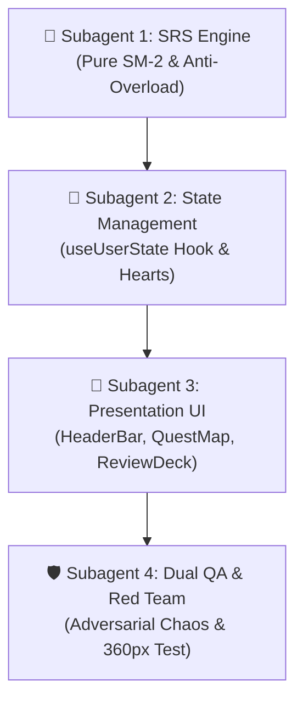

# 🤖 Phase 3: Subagent Prompt Blueprints (คู่มือแม่แบบ Prompt สำหรับทีม AI Agent)

เอกสารฉบับนี้รวบรวม **Prompt แม่แบบฉบับสมบูรณ์** สำหรับส่งมอบงานให้ทีม AI Subagents ในการขับเคลื่อนการพัฒนา **Phase 3 (Gamification, Progression & SRS Flashcards)** ของโปรเจกต์ Hanzero เพื่อให้ Session ถัดไปหรือตัวแทนในอนาคตสามารถนำไปสั่งงานได้ทันทีอย่างเป็นระบบ ไร้ข้อผิดพลาด และสอดคล้องกับกฎ `AGENTS.md` 100%

---

## 🗺️ แผนภาพลำดับการทำงาน (Dependency & Execution Flow)



---

## 1. 🧠 Subagent 1: SRS & Math Engine Specialist (Pure TypeScript)

* **เป้าหมาย:** สร้าง Core SRS Algorithm คำนวณช่วงเวลาการทบทวนคำศัพท์ SuperMemo SM-2 แบบ Pure TypeScript (Zero-UI, 100% Testable)
* **ไฟล์เป้าหมาย:** 
  - `src/engines/srs/srsEngine.ts`
  - `src/engines/srs/srsEngine.test.ts`
* **เอกสารอ้างอิง:** [docs/plan/phase_03_gamification_srs.md](file:///c:/DevProjects/hanzero/hanzero/docs/plan/phase_03_gamification_srs.md) และ [src/types/user.ts](file:///c:/DevProjects/hanzero/hanzero/src/types/user.ts)

### 📋 Prompt สำหรับคัดลอกสั่งงาน Subagent 1:
```markdown
คุณคือ SRS & Math Algorithm Specialist ตามพิมพ์เขียวใน agents/technical_qa.md และ AGENTS.md §4.2
ภารกิจของคุณคือพัฒนาเครื่องยนต์คำนวณการทบทวนคำศัพท์อัจฉริยะ Spaced Repetition System (SRS) แบบ Pure TypeScript:

1. ไฟล์ที่ต้องสร้าง:
   - src/engines/srs/srsEngine.ts (Zero-UI, Pure Functions)
   - src/engines/srs/srsEngine.test.ts (Automated Unit Tests ด้วย Vitest)

2. กฎเกณฑ์และสมการทางคณิตศาสตร์ (SuperMemo SM-2 Algorithm):
   - ระดับการประเมินของผู้เรียน (Grade: 0 = Again, 1 = Hard, 2 = Good, 3 = Easy)
   - ค่าความง่ายเริ่มต้น (Initial Ease Factor): 2.5 (ค่าต่ำสุดไม่ต่ำกว่า 1.3)
   - การปรับ Ease Factor: EF' = EF + (0.1 - (3 - grade) * (0.08 + (3 - grade) * 0.02))
   - การคำนวณช่วงวัน (Intervals):
     * รอบที่ 1 (Repetition = 1): 1 วัน
     * รอบที่ 2 (Repetition = 2): 3 วัน (หรือ 6 วันตามคะแนน)
     * รอบที่ 3+ (Repetition >= 3): Interval * EaseFactor
     * หากตอบ Again (Grade = 0): Reset Repetitions = 0, Interval = 1 วัน แต่คงค่า Ease Factor ไว้

3. กลไกป้องกันการล้นสมอง (Anti-Overload & Cognitive Resilience):
   - Daily Review Cap: จำกัดจำนวนการ์ดที่หยิบขึ้นมาทบทวนในแต่ละวันสูงสุดไม่เกิน 20 คำ (MAX_DAILY_REVIEWS = 20)
   - Backlog Triage Mode: เมื่อผู้เรียนขาดเรียนเกิน 7 วัน (Inactive > 7 days) ฟังก์ชัน getDueCardsWithTriage จะแบ่งการ์ดที่คั่งค้างเป็นชุดย่อยวันละ 10 คำ (TRIAGE_BATCH_SIZE = 10) พร้อมแจ้งสถานะ isTriageActive: true เพื่อไม่ให้ผู้เรียนท้อแท้กับคำศัพท์ค้างเป็นร้อยคำ

4. Quality Gate & Acceptance Criteria:
   - ห้ามใช้ 'any' โดยเด็ดขาด ใช้ Type Definition จาก src/types/user.ts (SrsItemRecord)
   - เขียน Unit Test ครอบคลุมทุกเคส:
     * การตอบ Again/Hard/Good/Easy และการปรับเปลี่ยน Ease Factor
     * การจำกัดเพดาน 20 คำต่อวัน (Daily Cap)
     * การเปิดใช้งาน Backlog Triage เมื่อคำนวณจากวันที่ค้างเรียน
   - รัน 'npm test' ผ่าน 100% และ 'npm run lint' ผ่านโค้ดสะอาด
```

---

## 2. 💖 Subagent 2: Gamification & State Management Specialist

* **เป้าหมาย:** สร้าง Custom Hook จัดการสถานะผู้ใช้, ระบบหัวใจ 5 ดวง, ระบบ Streak, และกฎ Safe Practice Zone โดยต่อเชื่อมกับ `storageEngine.ts` ที่มีอยู่เดิม
* **ไฟล์เป้าหมาย:**
  - `src/hooks/useUserState.ts`
  - `src/hooks/useUserState.test.ts`
* **เอกสารอ้างอิง:** [src/engines/storage/storageEngine.ts](file:///c:/DevProjects/hanzero/hanzero/src/engines/storage/storageEngine.ts) และ [src/types/user.ts](file:///c:/DevProjects/hanzero/hanzero/src/types/user.ts)

### 📋 Prompt สำหรับคัดลอกสั่งงาน Subagent 2:
```markdown
คุณคือ Gamification & State Architecture Specialist ตามพิมพ์เขียวใน agents/gamification_designer.md และ web_dev.md
ภารกิจของคุณคือสร้าง Custom Hook useUserState เพื่อเป็นศูนย์กลางควบคุม State ความก้าวหน้าของผู้เรียน:

1. ไฟล์ที่ต้องสร้าง:
   - src/hooks/useUserState.ts
   - src/hooks/useUserState.test.ts

2. การเชื่อมต่อกับ Storage Engine ที่มีอยู่แล้ว:
   - ดึงและบันทึกข้อมูลผ่าน src/engines/storage/storageEngine.ts (มีระบบ LocalStorage Hot Tier + IndexedDB Cold Tier สำรองข้อมูลอัตโนมัติอยู่แล้ว)
   - ผูก Event หรือ Callback เพื่ออัปเดต React State ให้ Responsive เมื่อข้อมูลเปลี่ยนแปลง

3. กลไกเศรษฐกิจเกมและจิตวิทยาการเรียนรู้ (Game Economy & Pedagogy):
   - ระบบหัวใจ (Heart Economy):
     * หัวใจสูงสุด 5 ดวง (MAX_HEARTS = 5)
     * ฟื้นฟูอัตโนมัติ 1 ดวงทุก 4 ชั่วโมง (คำนวณจาก last_heart_regen_timestamp)
     * Practice-to-Earn: เมื่อหัวใจหมด สามารถเข้าโหมดทบทวนการ์ดคำศัพท์ ตอบถูกสะสมครบ 5 ข้อ ได้รับหัวใจคืนทันที 1 ดวง
   - 🛡️ กฎ Safe Practice Zone (สำคัญสูงสุด):
     * โหมดฝึกฝน Tier 0 (Pinyin) และโหมด SRS Flashcard Review จะไม่มีการหักหัวใจเด็ดขาดเมื่อตอบผิด (deductHeart() ต้องตรวจสอบ mode ปัจจุบัน)
     * หักหัวใจเฉพาะใน Unit Quiz และ Boss Challenge ของ Tier 1 ขึ้นไปเท่านั้น
   - ระบบ Streak & XP:
     * บันทึกวันเรียนต่อเนื่อง (Streak) และรองรับ Streak Freeze Shield
     * สะสมคะแนน XP และคำนวณ Level (Level = floor(XP / 100) + 1)
   - Daily Goals:
     * บันทึกเป้าหมายรายวัน 5 / 10 / 15 นาที
     * ตรวจสอบว่าวันนี้เรียนครบเป้าหมายหรือยัง (isDailyGoalMet)

4. Quality Gate & Acceptance Criteria:
   - ครอบคลุมการ Cleanup Resource ไม่เกิด Memory Leak
   - เขียน Unit Test ครอบคลุม:
     * การหักหัวใจในโหมดปกติ และการยกเว้นใน Safe Practice Zone
     * การคำนวณการฟื้นฟูหัวใจตามเวลาจริง (Time travel mock)
     * การสะสม Practice-to-Earn 5 ข้อเพื่อได้หัวใจ
     * การอัปเดต Streak และ XP
   - รัน 'npm test' และ 'npm run lint' ผ่านครบถ้วน
```

---

## 3. 🎨 Subagent 3: Modern Oriental UX/UI & Mobile Specialist

* **เป้าหมาย:** พัฒนาคอมโพเนนต์นำทาง QuestMap, HeaderBar ที่ทนทานต่อหน้าจอมือถือแคบสุด 360px, และหน้าการ์ดทบทวนคำศัพท์ ReviewDeck สไตล์ Modern Oriental Minimalism
* **ไฟล์เป้าหมาย:**
  - `src/components/layout/HeaderBar.tsx`
  - `src/components/layout/QuestMap.tsx`
  - `src/components/srs/ReviewDeck.tsx`
  - Unit Tests สำหรับแต่ละคอมโพเนนต์
* **เอกสารอ้างอิง:** [agents/ux_ui_designer.md](file:///c:/DevProjects/hanzero/hanzero/agents/ux_ui_designer.md) และ [src/styles/index.css](file:///c:/DevProjects/hanzero/hanzero/src/styles/index.css)

### 📋 Prompt สำหรับคัดลอกสั่งงาน Subagent 3:
```markdown
คุณคือ Modern Oriental UX/UI & Mobile Ergonomics Specialist ตามพิมพ์เขียวใน agents/ux_ui_designer.md
ภารกิจของคุณคือสร้าง UI สำหรับ Phase 3 ให้มีความสวยงาม ผ่อนคลาย น่าเล่น และรองรับหน้าจอมือถือขนาด 360px ได้อย่างสมบูรณ์แบบ:

1. ไฟล์ที่ต้องพัฒนา:
   - src/components/layout/HeaderBar.tsx (พร้อมทดสอบบนจอแคบ <=380px)
   - src/components/layout/QuestMap.tsx (แผนที่ผจญภัยแบบคดเคี้ยว)
   - src/components/srs/ReviewDeck.tsx (การ์ดทบทวนคำศัพท์พลิก 3D)

2. สเปกการออกแบบของแต่ละส่วน:
   - HeaderBar.tsx:
     * แสดง Streak (ไฟลุก 🔥), XP/Level (ดาว ⭐), และ Heart Meter (❤️)
     * 📱 Mobile 360px Small Viewport Resilience: เมื่อความกว้างหน้าจอ <= 380px ให้ย่อหัวใจเป็น '❤️ x 5' อัตโนมัติ เพื่อไม่ให้แถบด้านบนล้นจอ
     * ปุ่ม ⚙️ Settings Modal: เปิดดูสรุปเป้าหมายรายวัน และปุ่ม 1-Click Backup Export/Import
   - QuestMap.tsx:
     * เส้นทางเดินแบบคดเคี้ยวสลับซ้าย-ขวาสไตล์ Modern Oriental
     * หมุดด่าน (Node Types):
       - 🔒 Locked: สีเทา ล็อกอยู่
       - 🟢 Active/Current: สีหยกเปล่งแสง พร้อมแอนิเมชันลูกเด้งดึ๋งๆ เชิญชวนให้กด
       - ⭐ Completed: สีทองประดับดาว 1-3 ดวง กดกลับไปทบทวนได้
       - 👑 Boss Node: หมุดเจดีย์ทรงแปดเหลี่ยม สำหรับบอสประจำ Unit
     * แถบ Tier Switcher: สลับดูแผนที่ Tier 0 (Pinyin) และ Tier 1 (A1 Starter)
   - ReviewDeck.tsx:
     * การ์ดคำศัพท์พลิกได้แบบ 3D CSS Transform (Flip Card)
     * ด้านหน้า: ตัวอักษรจีนขนาดใหญ่ พร้อมปุ่มลำโพงฟังเสียง
     * ด้านหลัง: พินอิน คำแปลไทย-อังกฤษ ประโยคตัวอย่าง
     * แถบปุ่มประเมินตนเอง 4 ปุ่ม: Again (แดง), Hard (ส้ม), Good (หยก), Easy (ฟ้า) ทุกปุ่มมีขนาด Hitbox ไม่ต่ำกว่า 44x44px

3. กฎเหล็กด้าน UX & Performance:
   - ใช้ชุดสี Design Tokens: Rice Paper (#FDFBF7), Ink Stone (#12161A), Jade (#10B981 / #047857), Ochre (#F59E0B), Vermilion (#DC2626)
   - Zero Layout Shift, ลื่นไหล 60fps, ไม่มี CSS Library ภายนอกที่ทำให้ Bundle บวม
   - ปฏิบัติตามมาตรฐาน W3C ARIA ห้ามมี Nested button

4. Quality Gate & Acceptance Criteria:
   - เขียน Unit Test ทดสอบการ Render, การคลิก, และการย่อหัวใจบนจอแคบ 360px
   - รัน 'npm test' ผ่าน 100% และไม่มี Error บนเบราว์เซอร์
```

---

## 4. 🛡️ Subagent 4: Pedagogical & Red Team QA Specialist

* **เป้าหมาย:** ทดสอบเจาะระบบ ตรวจสอบความถูกต้องของตรรกะเกม ตรวจทานสำนวนภาษา และโจมตีระบบแบบ Adversarial Stress Test
* **เอกสารอ้างอิง:** [agents/pedagogical_qa.md](file:///c:/DevProjects/hanzero/hanzero/agents/pedagogical_qa.md) และ [agents/red_team_adversary.md](file:///c:/DevProjects/hanzero/hanzero/agents/red_team_adversary.md)

### 📋 Prompt สำหรับคัดลอกสั่งงาน Subagent 4:
```markdown
คุณคือ Pedagogical QA & Red Team Adversarial Specialist ตามพิมพ์เขียวใน agents/pedagogical_qa.md และ red_team_adversary.md
ภารกิจของคุณคือตรวจสอบความสมบูรณ์และทดสอบเจาะระบบ Phase 3 เพื่อปิดทุกช่องโหว่:

1. การตรวจสอบเชิงวิชาการ (Pedagogical QA):
   - ตรวจสอบกฎ Safe Practice Zone: ตรวจสอบว่าไม่มีโค้ดส่วนใดใน Tier 0 และ SRS Review ที่หักหัวใจผู้เรียนเมื่อตอบผิดเด็ดขาด
   - ตรวจสอบคำแปลภาษาไทยและคำศัพท์ใน Review Deck ให้สละสลวย เป็นธรรมชาติ ถูกต้อง 100%

2. การทดสอบแบบ Red Team Chaos Attacks:
   - 💥 Small Viewport 320px Squeeze: บีบหน้าจอให้แคบสุด 320px และ 360px ตรวจสอบ HeaderBar และ QuestMap ว่าไม่มีองค์ประกอบใดล้นหน้าจอ (No horizontal scroll)
   - 💥 Review Flood Attack: รัวคลิกปุ่มประเมิน Again/Good 50 ครั้งติดต่อกัน ตรวจสอบว่าระบบ SRS อัปเดตคิวอย่างถูกต้อง ไม่เกิด Infinite Loop หรือ State ค้าง
   - 💥 LocalStorage Eviction / Data Tamper: ปลอมแปลงข้อมูล UserState ใน LocalStorage ให้ผิด Schema แล้วรีเฟรช ตรวจดูว่าระบบ Self-Healing และ Migration กู้คืนสถานะได้ 100% โดยไม่เกิด White Screen of Death
   - 💥 Time-Travel Jump: จำลองเวลาเครื่องกระโดดไปข้างหน้า 10 วัน ตรวจสอบว่า Backlog Triage Mode ทำงานและเสนอการ์ดย่อย 10 คำ ไม่ถล่มผู้เรียนด้วยการ์ดค้าง 100 คำ

3. สรุปผลการตรวจสอบ (Audit Report):
   - บันทึกผลการทดสอบลงใน docs/plan/phase_03_gamification_srs.md
   - รายงานจุดบกพร่องที่พบ (ถ้ามี) เพื่อให้ทีม Dev แก้ไขทันทีก่อนส่งมอบงาน
```

---

## 📌 สรุปวิธีเรียกใช้งานในเซสชันถัดไป

เมื่อเริ่มแชตหรือเซสชันถัดไป สามารถส่งคำสั่งง่ายๆ เช่น:
> *"นำ Prompt ของ Subagent 1 จาก `docs/prompts/phase_03_subagents_prompts.md` ไปรันสร้าง `srsEngine.ts` ได้เลย"*

ระบบจะดึงบริบทและทำงานต่อเนื่องได้ทันทีโดยไม่สูญเสียทิศทางของโปรเจกต์ครับ 🐰✨
