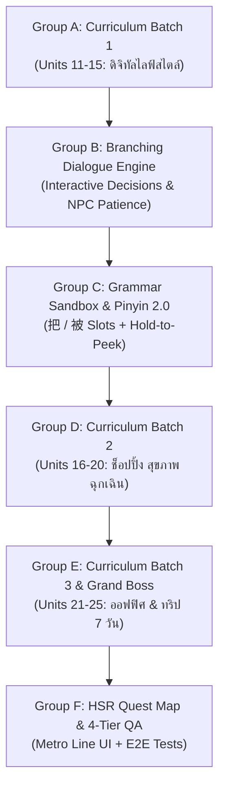

# 🚄 Phase 7 Kickoff Prompt: Tier 2 Traveler Quest Multi-Agent Blueprint
*(สำหรับคัดลอกไปวางในหน้า New Chat เพื่อให้ทีม Subagents เริ่มวางแผนและพัฒนาระบบอย่างเป็นระบบ)*

---

## 📌 วิธีใช้งาน:
คัดลอกข้อความในกรอบ `Markdown` ด้านล่างนี้ทั้งหมด แล้วนำไปวางในช่องแชตใหม่ (New Chat) ได้ทันที:

```markdown
# 🎋 Hanzero Phase 7: Tier 2 Traveler Quest — Multi-Agent Development Kickoff

สวัสดีทีมงาน Antigravity Subagents ทุกท่าน! วันนี้เราจะร่วมกันวางแผนและพัฒนา **Phase 7: Tier 2 Content Rollout & HSK 3-4 Quest Map** ของโปรเจกต์ **Hanzero (ฮั่นซีโร่)** 

ภารกิจของเราคือการสร้างหลักสูตรและระบบการเรียนรู้ระดับ **"Tier 2: Traveler" (Units 11–25 รวม 15 Units / 60 บทเรียน)** เพื่อให้ผู้เรียนที่เริ่มต้นจากศูนย์ สามารถเดินทางท่องเที่ยวและใช้ชีวิตดิจิทัลในประเทศจีนคนเดียวได้อย่างแท้จริง (Digital & Cashless China Survival) เช่น การสแกนจ่าย QR Code (WeChat Pay / Alipay), การสั่งเดลิเวอรี่ Meituan, การจองตั๋วรถไฟความเร็วสูง 12306, การเช็กอินโรงแรมและวางเงินมัดจำ, การพบแพทย์และซื้อยาที่ร้านขายยา, และการรับมือกับสถานการณ์ฉุกเฉิน

---

## 👥 บทบาทหน้าที่ของทีมงาน (Subagent Roster)

โปรดแบ่งบทบาทหน้าที่ตามพิมพ์เขียวใน `agents/` และ `AGENTS.md` อย่างเคร่งครัด:

1. **`curriculum_tutor` (อาจารย์สอนภาษาจีนสายพี่เลี้ยง):**
   - เรียบเรียงเนื้อหาบทเรียน Units 11 ถึง 25 ตามโครงสร้างใน `docs/curriculum/03_lesson_levels.md`
   - ผลิตไฟล์ JSON ใน `src/data/lessons/` โดยเน้นคำศัพท์ HSK 3-4 และสถานการณ์ดิจิทัลไลฟ์สไตล์จริง
   - ถ่ายทอดสำนวนและบริบททางวัฒนธรรม พร้อมคำแปลภาษาไทยที่เป็นธรรมชาติ
2. **`web_dev` (สถาปนิกและวิศวกรซอฟต์แวร์):**
   - พัฒนา Pure TypeScript Engines (`src/engines/scenario/branchingDialogueEngine.ts`, `src/engines/grammar/grammarSlotEngine.ts`) Zero-UI, 100% Testable
   - พัฒนา UI Components: `InteractiveScenarioPlayer.tsx`, `GrammarSlotBuilder.tsx`, `HsrQuestMap.tsx`
   - ออกแบบ State Hook `useBranchingDialogue.ts` และเชื่อมต่อกับ `storageEngine.ts`
3. **`ux_ui_designer` (นักออกแบบสุนทรียภาพ Modern Oriental):**
   - ออกแบบเส้นทางรถไฟความเร็วสูง (High-Speed Rail Metro Map) และบัตรโดยสารดิจิทัล
   - กำหนด Micro-interactions: แถบอารมณ์ความพึงพอใจของ NPC (Patience Bar), วิดเจ็ต Hold-to-Peek พินอิน
   - ดูแลความสวยงามและ Touch ergonomics บนหน้าจอมือถือ (Responsive ลงลึกถึง 320px)
4. **`pedagogical_qa` (ผู้ตรวจการภาษาศาสตร์จีน):**
   - ตรวจสอบอักษรจีนตัวย่อ, ตำแหน่งวรรณยุกต์ Pinyin, และกฎ Tone Sandhi (3+3, 一, 不)
   - ตรวจสอบความถูกต้องของไวยากรณ์ขั้นกลาง (ประโยค 把, 被, คำเสริมบอกทิศทาง/ผลลัพธ์)
   - รันตรวจสอบผ่าน `npm run validate:curriculum -- --strict`
5. **`technical_qa` (ผู้ตรวจการความเสถียรและประสิทธิภาพ):**
   - ตรวจสอบ Strict Typing 100% (ห้ามใช้ `any`), รัน `npm run lint` และ `npx tsc --noEmit`
   - ควบคุม Bundle Budget ให้ Client Bundle เล็ก กระชับ โหลดเร็ว 60fps
   - ตรวจจับ Memory Leaks และ Resource Cleanup (AudioContext, EventListeners, Timers)
6. **`red_team_adversary` (หน่วยจู่โจมล่าบั๊ก & Chaos Engineering):**
   - ทลายระบบบทสนทนาแตกกิ่ง: ตรวจสอบทางตัน (Dead ends), วนลูปไม่รู้จบ (Circular loops)
   - จำลองสถานการณ์แบนด์วิดท์ต่ำ เน็ตหลุดขณะส่งของเดลิเวอรี่ หรือการกดปุ่มทางเลือกรัวๆ
7. **`test_automation_engineer` (สถาปนิกระบบทดสอบอัตโนมัติ):**
   - สร้าง Vitest Unit Tests สำหรับ Pure Engines ทุกตัว (Coverage > 90%)
   - สร้าง Playwright E2E Tests สำหรับเส้นทางการเรียนรู้ Traveler Quest

---

## 📦 แผนงานแบ่งตามกลุ่มงาน (Group-by-Group Breakdown)

เพื่อการทำงานที่เป็นระเบียบและตรวจสอบได้ง่าย ให้ทีมงานดำเนินการตามลำดับกลุ่มงาน (Group Slices) ดังนี้:



### 🚅 Group A: Core Traveler Curriculum Batch 1 (Units 11–15)
* **เป้าหมาย:** สร้างบทเรียนดิจิทัลไลฟ์สไตล์ที่จำเป็นสูงสุดในการเอาชีวิตรอดในจีนยุคใหม่
* **Units ที่ต้องผลิต:**
  1. **Unit 11: 扫码支付 (Scan & Pay):** 微信, 支付宝, 扫一扫, 付款码, 收款码, 零钱, 充值 (โครงสร้าง 把 พื้นฐาน)
  2. **Unit 12: 外卖与快递 (Food Delivery & Courier):** 外卖, 菜单, 地址, 门牌号, 备注, 骑手, 快递柜, 取件码 (Directional Complements: 送过来 / 拿上去)
  3. **Unit 13: 高铁与出行 (High-Speed Rail):** 高铁, 二等座, 身份证, 检票口, 候车室, 改签, 退票 (โครงสร้าง 不但...而且...)
  4. **Unit 14: 租房与生活设施 (Renting & Living):** 房东, 房租, 合同, 押金, 水电费, 修理, 师傅 (โครงสร้าง 押一付三 / Resultative Complements)
  5. **Unit 15: 餐厅点菜进阶 (Advanced Dining & Table Culture):** 招牌菜, 忌口, 微辣, 免葱, 少油, 买单, 打包 (โครงสร้าง 越...越... / 是...的)
* **เกณฑ์การตรวจรับ:** ผ่าน `npm run validate:curriculum -- --strict` ครบ 100%

### 🎭 Group B: Branching Dialogue & Scenario Decision Engine
* **เป้าหมาย:** สร้างระบบจำลองสถานการณ์จริงที่มีทางเลือกและผลลัพธ์ (Interactive Decision Trees)
* **ไฟล์ที่ต้องพัฒนา:**
  - `src/engines/scenario/branchingDialogueEngine.ts` (Pure logic: Node graph, choice branching, NPC patience meter, condition triggers)
  - `src/engines/scenario/branchingDialogueEngine.test.ts` (Unit tests ทุกแขนง)
  - `src/hooks/useBranchingDialogue.ts` (React state management)
  - `src/components/lesson/InteractiveScenarioPlayer.tsx` (UI แสดงบทสนทนา, แถบอารมณ์ NPC, เสียงพากย์, และข้อคิดวัฒนธรรม)
* **เกณฑ์การตรวจรับ:** ไม่มี Dead-end branch, รองรับเสียงสังเคราะห์ Web Audio / Web Speech, ทนทานต่อการกดย้ำๆ

### 🧩 Group C: Complex Grammar Sandbox & Dynamic Pinyin Fading 2.0
* **เป้าหมาย:** ระบบฝึกไวยากรณ์เชิงโครงสร้างโดยไม่ต้องท่องจำ และการก้าวข้ามการพึ่งพาพินอิน
* **ไฟล์ที่ต้องพัฒนา:**
  - `src/engines/grammar/grammarSlotEngine.ts` & `src/engines/grammar/grammarSlotEngine.test.ts`
  - `src/components/lesson/GrammarSlotBuilder.tsx`: วิดเจ็ตลาก/แตะเรียงบล็อกไวยากรณ์ (เช่น โครงสร้าง $[S] + 把 + [O] + [V] + [Result]$ และ $[S] + 被 + [Agent] + [V]$)
  - **Dynamic Pinyin Fading 2.0**: ใน Tier 2 ให้พินอินซ่อนเป็นค่าเริ่มต้น (Hidden by default) ผู้เรียนสามารถกดค้าง (**Hold to Peek**) เพื่อดูพินอินชั่วคราว พร้อมบันทึก Peek Count ไปยัง SRS Engine
* **เกณฑ์การตรวจรับ:** 60fps Drag & Drop / Tap interaction บนจอสัมผัสมือถือ, รองรับ 320px ไม่ล้นจอ

### 🛍️ Group D: Core Traveler Curriculum Batch 2 (Units 16–20)
* **เป้าหมาย:** เสริมทักษะการแก้ปัญหาเฉพาะหน้า การเจรจา และความปลอดภัย
* **Units ที่ต้องผลิต:**
  1. **Unit 16: 商场退换货 (Shopping Returns & Exchange):** 尺码, 试衣间, 质量, 打折, 发票, 退货, 换货 (โครงสร้างประโยค 被)
  2. **Unit 17: 看病与买药进阶 (Hospital & Pharmacy):** 挂号, 门诊, 嗓子, 拉肚子, 过敏, 药房, 检查, 严重 (Potential Complements: 吃得下 / 好不了)
  3. **Unit 18: 银行与通信业务 (Banking & SIM Cards):** 办理, 表格, 签字, 护照, 营业厅, 流量, 开户 (โครงสร้าง 只有...才...)
  4. **Unit 19: 中国节庆与拜访 (Festivals & Social Etiquette):** 春节, 中秋节, 拜年, 红包, 礼物, 客气, 打扰 (คำบอกระดับ 稍微 / 特别 / 非常)
  5. **Unit 20: 求助与意外处理 (Emergency & Lost Items):** 丢失, 警察, 报案, 证件, 找回, 危险, 倒霉 (ไวยากรณ์ 竟然 / 连...都...)
* **เกณฑ์การตรวจรับ:** คำศัพท์และการจำลองสถานการณ์สอดคล้องกับระเบียบราชการและชีวิตจริงในจีน

### 💼 Group E: Core Traveler Curriculum Batch 3 & Grand Boss (Units 21–25)
* **เป้าหมาย:** การสื่อสารทางสังคมขั้นสูง สภาพแวดล้อมการทำงาน และภารกิจจำลองทริปแบ็กแพ็ก 7 วัน
* **Units ที่ต้องผลิต:**
  1. **Unit 21: 文娱与观影 (Entertainment & Leisure):** 电影院, 排片, 剧情, 门票, 展览, 推荐 (การเปรียบเทียบ A 没有 B 那么...)
  2. **Unit 22: 健身与户外 (Fitness & Outdoors):** 健身房, 跑步, 羽毛球, 锻炼, 坚持, 散步 (โครงสร้าง 一边...一边... / 着)
  3. **Unit 23: 日常办公初探 (Office Culture):** 打印, 会议室, 发邮件, 同事, 请假, 通知, 安排 (คำบอกลำดับ 首先...然后...最后...)
  4. **Unit 24: 观点与讨论 (Opinions & Discussion):** 认为, 看法, 同意, 反对, 其实, 尽管, 态度 (คำเชื่อม 尽管...但是...)
  5. **Unit 25: Grand Boss: 穿越中国 (7-Day Backpacking Survival):** รวมคำศัพท์ Tier 2 กว่า 600 คำ จำลองการเดินทางผ่าน 4 มหานคร (ปักกิ่ง ➔ ซีอาน ➔ เฉิงตู ➔ เซี่ยงไฮ้) เผชิญเหตุการณ์สุ่ม เช่น รถไฟดีเลย์ ตั๋วเต็ม สั่งอาหารผิดโต๊ะ
* **เกณฑ์การตรวจรับ:** Grand Boss Quest มีบททดสอบครอบคลุมทั้ง 4 ทักษะ (ฟัง พูด อ่าน ประกอบประโยค)

### 🗺️ Group F: HSR Metro Quest Map & 4-Tier Verification
* **เป้าหมาย:** แผนที่การเดินทางแบบเส้นทางรถไฟความเร็วสูง และการทดสอบระบบแบบ End-to-End
* **ไฟล์ที่ต้องพัฒนา:**
  - `src/components/quest/HsrQuestMap.tsx`: แผนที่สายรถไฟจำลองสถานีต่างๆ สไตล์ Metro Map พร้อมแอนิเมชันรถไฟเคลื่อนที่เมื่อเรียนจบ Unit
  - `e2e/traveler-journey.spec.ts`: Playwright E2E Suite ทดสอบการเล่น Branching Dialogue, Grammar Slot, และการปลดล็อกสถานีรถไฟ
  - อัปเดต `docs/plan/phase_07_tier2_traveler_quest.md` ทำเครื่องหมายเสร็จสิ้นทุกรายการ
* **เกณฑ์การตรวจรับ:** Playwright E2E Tests ผ่านครบ, Vitest Unit Tests ผ่าน 100%, Lint & Type Check 0 errors

---

## 🚦 ลำดับขั้นตอนการเริ่มงาน (How to Proceed)

ขอให้ทีมงานเริ่มดำเนินการตามขั้นตอน:
1. **จัดทำ Implementation Plan ละเอียด:** วิเคราะห์โครงสร้าง Schema และ Components ที่ต้องสร้างตาม Group A ถึง F
2. **เริ่มทำทีละ Group อย่างเคร่งครัด (Micro-Slicing):** ห้ามทำพร้อมกันจนคุมขอบเขตไม่ได้ เมื่อทำเสร็จแต่ละ Group ให้ทดสอบและยืนยันผลก่อนเริ่ม Group ถัดไป
3. **ส่งมอบงานตาม Definition of Done (DoD):** ทุกชิ้นงานต้องมี Type ถูกต้อง, มี Unit/E2E Test, ไม่มี Console Error, และผ่านการตรวจสอบภาษาศาสตร์จีน 100%

พร้อมแล้ว เริ่มขั้นตอนที่ 1 ได้เลยครับ!
```
