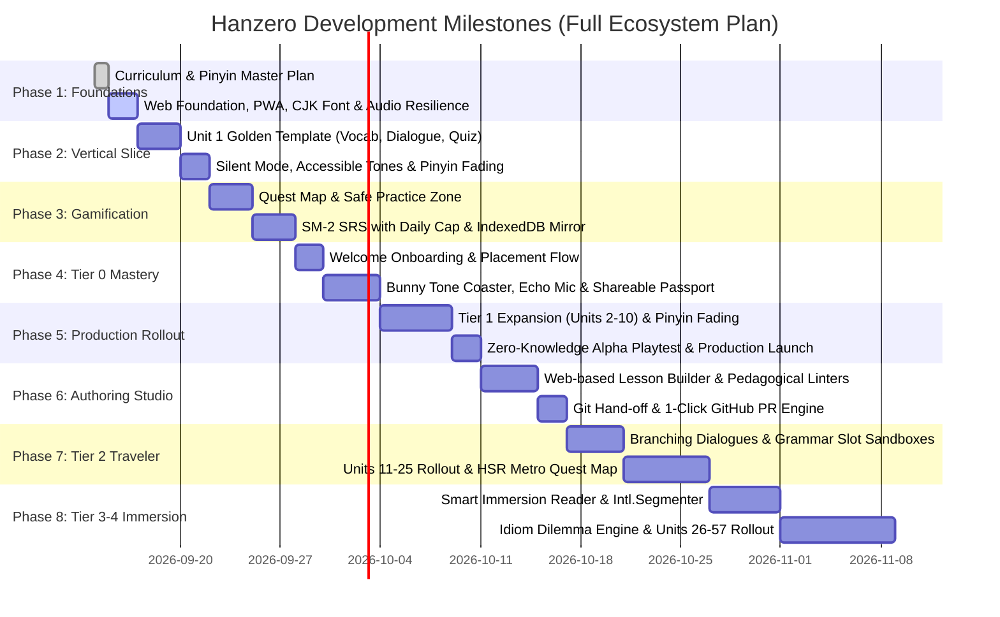

# 🚀 Hanzero Milestone & Development Plan

เอกสารนี้แสดงลำดับขั้นตอนการพัฒนา (Development Phases) และแผนงานส่งมอบของแพลตฟอร์ม **Hanzero (ฮั่นซีโร่)** จากรากฐานการเรียนรู้สู่เว็บแอปพลิเคชันที่พร้อมใช้งานจริง ตามมาตรฐานการกำกับดูแลของ Senior Product Manager

---

## 🗺️ แผนผังภาพรวม 8 ระยะ (The 8 Milestones)

> 📋 **แผนปฏิบัติการและเกณฑ์การตรวจรับงานอย่างละเอียด (Actionable Execution Plans):**  
> ติดตาม Checklist รายวันและ Quality Gates ได้ใน [docs/plan/](../plan/README.md) โดยแบ่งออกเป็น 8 เฟสการส่งมอบ

---

## 📌 รายละเอียดของแต่ละระยะ

### 🏁 Phase 1: Web Foundation, Design System, PWA & Resilience Engines
**เป้าหมาย:** สร้างรากฐาน Web Application ที่รวดเร็ว ลื่นไหล สไตล์ Modern Oriental พร้อมติดตั้ง PWA เพื่อป้องกัน Safari ล้างข้อมูล, วางกลยุทธ์ Font Subsetting ป้องกันเว็บหน่วง และระบบเสียงสองประสานที่มี Static Audio Pack สำรองสำหรับ Tier 0
* [phase_01_web_foundation_engines.md](../plan/phase_01_web_foundation_engines.md)
* Scaffolding: Vite + React + TypeScript + Vitest + ESLint
* **PWA & Storage Mirror:** ติดตั้ง `vite-plugin-pwa` พร้อม IndexedDB Secondary Mirror รับมือ Safari 7-day inactivity wipe
* **CJK Font Subsetting Strategy:** ควบคุมขนาดฟอนต์ `LXGW WenKai` / `Noto Sans SC` ไม่เกิน 300–500 KB ป้องกัน FOIT/FOUT
* Design System: Hanzi Legibility Tokens (ขั้นต่ำ 36px/28px) และ Accessible Tone Indicators (มี Contour mark/ตัวเลข ไม่พึ่งพาสีเดี่ยวๆ)
* Audio Resilience: `audioEngine.ts` พร้อม Chinese Voice Detection, iOS Audio Unlocker, และ **Pre-rendered Tier 0 Static Audio Pack (~2MB)**
* Canvas Stroke Engine: `HanziWriterBox.tsx` พร้อมระบบล้าง Memory Leak

---

### 💻 Phase 2: Unit 1 Complete Lesson Experience (Vertical Slice)
**เป้าหมาย:** สร้างบทเรียนแรก Unit 1 เพื่อเป็น **Engineering Vertical Slice & UX Golden Template** ทดสอบการผสานชิ้นส่วน Flashcard, Dialogue, Grammar และ Quiz พร้อมระบบค่อยๆ ซ่อนพินอิน (Progressive Pinyin Fading)
* [phase_02_unit1_lesson_experience.md](../plan/phase_02_unit1_lesson_experience.md)
* บัตรคำศัพท์ 3 ภาษา พร้อมปุ่ม Stroke Zoom Modal ขยายดูเส้นขีดในตาราง 120px
* เครื่องเล่นบทสนทนา Interactive Dialogue Player แชตสไตล์โมเดิร์น
* **Progressive Pinyin Fading:** ระบบสลับซ่อนพินอินหรือแตะเพื่อแอบดู เพื่อฝึกอ่านตัวอักษรจีนจริง
* **Accessible Tone Design:** สัญลักษณ์วรรณยุกต์กำกับชัดเจน รองรับผู้มีภาวะตาบอดสีแดง-เขียว
* มินิเกมควิซ 4 รูปแบบ พร้อมระบบปรับโหมดเดินทาง (Silent Mode) อัตโนมัติเมื่อไม่สะดวกเปิดเสียง

---

### 🎮 Phase 3: Gamification, Safe Practice Zone, Daily Goals & SRS Persistence
**เป้าหมาย:** สร้างแรงจูงใจให้ผู้เรียนกลับมาเรียนทุกวัน กำหนดเป้าหมายรายวัน และทบทวนอย่างมีประสิทธิภาพโดยป้องกันอาการ "การบ้านทับถม (SRS Bankruptcy)"
* [phase_03_gamification_srs.md](../plan/phase_03_gamification_srs.md)
* แผนที่เส้นทางการเรียนรู้ Quest Map สลับดูได้ทั้ง Tier 0 และ Tier 1
* **Safe Practice Zone:** ปิดการหักหัวใจในโหมดฝึกฟังพินอินและ SRS Flashcards เพื่อถนอมผู้เรียนมือใหม่
* ระบบฟื้นฟูหัวใจ Practice-to-Earn (ฝึกคำศัพท์ถูก 5 คำ = 1 หัวใจ)
* **Daily Goals & Closure:** ตั้งเป้าหมาย 5 / 10 / 15 นาที พร้อมหน้า Daily Completion Card สรุปผลความสำเร็จประจำวัน
* **เครื่องยนต์ Spaced Repetition (SM-2):**
  * **Daily Review Cap:** จำกัดทบทวนไม่เกิน 20 คำต่อวัน
  * **Backlog Triage Mode:** ระบบเกลี่ยการ์ดค้างส่งเมื่อหยุดเรียนไปนาน
* LocalStorage Schema Migration (v1) + IndexedDB Mirror พร้อมปุ่ม 1-Click JSON Backup Export/Import

---

### 🌱 Phase 4: Tier 0 Pinyin Mastery, Echo Mic & Onboarding Flow
**เป้าหมาย:** เปิดประตูต้อนรับผู้เรียนเริ่มต้นจากศูนย์เด็ดขาด ด้วยเส้นทาง Onboarding ที่เข้าใจง่าย ระบบเทียบเสียงพูดตนเอง และการ์ดแชร์ความสำเร็จ
* [phase_04_tier0_pinyin_mastery.md](../plan/phase_04_tier0_pinyin_mastery.md)
* หน้าต่างต้อนรับ `WelcomeModal.tsx` นำทางเลือกระหว่าง "เริ่มจาก 0" กับ "ข้ามไปบทสนทนา"
* บรรจุบทเรียน Tier 0 ทั้ง 6 Units (รวมสระผสมและสระนาสิก) พร้อมระบบภาพช่วยจำรูปปากและ Static Audio Pack
* มินิเกม Bunny Tone Coaster ฝึกลากเส้นวรรณยุกต์ 4 เสียง (Safe Zone ไม่หักหัวใจ)
* **Client-side Echo Mic (Shadowing):** บันทึกเสียงผู้เรียน 2 วินาทีแล้วเล่นเทียบเสียง Native ทันที
* บอร์ดเปรียบเทียบเสียงคู่ก้ำกึ่ง (Minimal Pairs)
* ด่านทดสอบ Boss Quest ปลดล็อกพร้อม **"Hanzero Passport Card"** บันทึกเป็นรูปแชร์ลง Social Media ได้ทันที

---

### 🌿 Phase 5: Tier 1 Expansion, Alpha Playtest & Production Launch
**เป้าหมาย:** ขยายเนื้อหา Tier 1 ครบถ้วนทั้ง 10 Units (40 บทย่อย) ดำเนินการทดสอบกับผู้เรียนจริง (Zero-Knowledge Alpha Playtest) และเปิดตัวสู่ผู้ใช้จริง
* [phase_05_tier1_content_rollout.md](../plan/phase_05_tier1_content_rollout.md)
* ปล่อยเนื้อหา Batch A, B, C ตามลำดับ พร้อมกฎ Interleaving 20%
* สคริปต์ตรวจความถูกต้องของเนื้อหาอัตโนมัติ (`validateCurriculum.ts`)
* **Zero-Knowledge Alpha Playtest:** ทดสอบการใช้งานจริงกับกลุ่มผู้ใช้คนไทยที่ไม่มีพื้นฐานภาษาจีน เพื่อเก็บ Feedback ปรับปรุง UX
* ติดตั้งระบบวัดผล Product North Star KPIs (D1/D7 Retention, Tier 0 Completion Rate)
* ติดตั้งระบบวิเคราะห์ปัญหาข้อผิดพลาดแบบนิรนาม (Zero-Cost Local Diagnostics)
* Build & Deploy อัตโนมัติขึ้น GitHub Pages ผ่าน GitHub Actions พร้อม OpenGraph Meta Tags รองรับการแชร์บัตรความสำเร็จ

---

### 🛠️ Phase 6: Content Authoring Studio & Community Contribution
**เป้าหมาย:** สร้างเครื่องมือจัดการและผลิตเนื้อหาผ่าน Web GUI แบบ Zero-Backend เพื่อปลดล็อกคอขวดของทีม พัฒนาระบบ Linter ตรวจจับความผิดพลาดทางภาษาศาสตร์ และเชื่อมต่อ GitHub Pull Request
* [phase_06_content_authoring_studio.md](../plan/phase_06_content_authoring_studio.md)
* **Visual Lesson Studio GUI (`/studio`):** หน้าต่างสร้างการ์ดคำศัพท์ บทสนทนา และควิซแบบเห็นตัวอย่างทันที (Live Phone Preview) รองรับการสร้างเนื้อหา 3 ภาษา (中-泰-英)
* **Pedagogical Linters (เครื่องยนต์ตรวจจับความถูกต้องทางภาษาศาสตร์):**
  * **Auto Pinyin Tone Placer:** แปลงตัวเลขพินอินเป็นสัญลักษณ์วรรณยุกต์มาตรฐานตามตำแหน่งสระสากล (`ni3hao3` ➔ `nǐhǎo`)
  * **Tone Sandhi Engine:** ตรวจจับและแจ้งเตือนกฎผันเสียงอัตโนมัติ: เสียงสามชนกัน (3+3 ➔ 2+3), เสียงสามครึ่งเสียง (Half-Third Tone 211/21), กฎของ `不` (bù ➔ bú หน้าเสียง 4), และกฎของ `一` (yí หน้าเสียง 4, yì หน้าเสียง 1,2,3)
  * **Hanzi Character & Stroke Validator:** ตรวจสอบความถูกต้องของเส้นขีดและรองรับระบบคัดลายมือ `hanzi-writer`
  * **Interleaving Validator:** ตรวจสอบสัดส่วนคำศัพท์เก่าจาก Unit ก่อนหน้าในแบบฝึกหัด ต้องไม่น้อยกว่า 20%
* **Audio Sandbox:** ทดสอบฟังเสียง Web Speech TTS ปรับความเร็ว 0.75x–1.0x และจัดเตรียม Static Fallback Audio สำหรับคำศัพท์ยาก
* **Git Hand-off (Zero-Backend Workflow):** ส่งออกไฟล์ JSON ตาม Schema มาตรฐาน หรือเปิด Pull Request ผ่าน Octokit Client-side โดยใช้ Personal Access Token (PAT) ชั่วคราวในหน่วยความจำ

---

### 🎋 Phase 7: Tier 2 Traveler Rollout & HSK 3-4 Quest Map
**เป้าหมาย:** ยกระดับสู่การใช้ชีวิตจริงและการท่องเที่ยวในจีน (15 Units / 60 บทเรียน) พร้อมรองรับไวยากรณ์ขั้นกลางที่ซับซ้อนและการจำลองบทสนทนาแตกกิ่ง
* [phase_07_tier2_traveler_quest.md](../plan/phase_07_tier2_traveler_quest.md)
* **Branching Dialogues (`InteractiveScenarioPlayer.tsx`):** บทสนทนาแตกกิ่งกับ NPC พร้อมแถบความพึงพอใจและมารยาททางสังคม (Patience Bar) และเกร็ดวัฒนธรรม
* **Grammar Slot Sandboxes (`GrammarSlotBuilder.tsx`):** วิดเจ็ตลากวางบล็อกประโยคโครงสร้างซับซ้อน:
  * ประโยค 把 (Ba-construction): $[S] + 把 + [O] + [V] + [Result/Direction]$
  * ประโยค 被 (Bei-passive): โครงสร้างประธานถูกกระทำในบริบทธรรมชาติ
  * คำเสริมบอกทิศทางและผลลัพธ์ (Directional & Resultative Complements): เช่น $送过来$, $修好了$, $吃得下$ vs $吃不下$
* **Dynamic Pinyin Fading 2.0:** ซ่อนพินอินเป็นค่าเริ่มต้นในการ์ดคำศัพท์และบทสนทนา พร้อมฟังก์ชัน Hold-to-Peek และบันทึกจำนวนการแอบดูเข้า SRS
* **HSR Metro Quest Map (`HsrQuestMap.tsx`):** แผนที่การเดินทางรถไฟความเร็วสูงเชื่อมเมืองใหญ่จีน (ปักกิ่ง ➔ ซีอาน ➔ เฉิงตู ➔ เซี่ยงไฮ้) ปลดล็อกตั๋วเดินทางประทับตรา
* **Data Scalability & Ingestion:** โหลดบทเรียนแบบแยกส่วนด้วย Dynamic `import()` ราย Unit และแคชเส้นขีด Hanzi แบบ On-Demand ลง `IndexedDB: hanzi_strokes` ป้องกัน Bundle บวม
* **ปล่อยเนื้อหา Units 11–25 ครบ 60 บทย่อย:** ครอบคลุมสแกนจ่าย QR, สั่งเดลิเวอรี่, รถไฟความเร็วสูง, เช่าห้อง, พบแพทย์, ดูหนัง, ธนาคาร และ Grand Boss: 穿越中国

---

### 🐉 Phase 8: Tier 3-4 Advanced Immersion & Fluency Tools
**เป้าหมาย:** เสริมสร้างความคล่องตัวระดับมืออาชีพ วัฒนธรรม วรรณกรรม และการทำงาน (Units 26–57) พร้อมเครื่องมือช่วยเสพสื่อจีนจริง
* [phase_08_tier3_4_advanced_immersion.md](../plan/phase_08_tier3_4_advanced_immersion.md)
* **Smart Immersion Reader:** เครื่องมืออ่านบทความจีนพร้อมระบบตัดคำ Client-side ด้วย `Intl.Segmenter` และปุ่มกดเซฟคำศัพท์เข้า SRS
* **Idiom (成语) Dilemma Engine:** เรียนรู้ที่มาสุภาษิตจีนผ่านมินิสตอรี่ และแบบฝึกหัดแก้ปัญหาทางธุรกิจ
* **Native Speed Audio Ladder:** ระบบฝึกฟังความเร็ว 0.8x ➔ 1.0x ➔ 1.25x ผสมเสียงบรรยากาศจำลอง พร้อมโหมด Commute Podcast
* **Voice Pitching & Advanced Shadowing:** อัดเสียงฝึกนำเสนอและฝึกพูดประโยคยาว 15–30 วินาที

