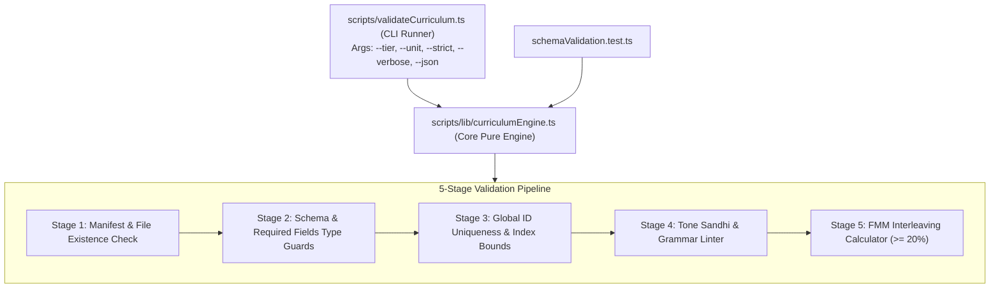

# 📋 [TASK-501] Phase 5 Slice 5.1: Curriculum Validator & Quality Linter Engine

> **สถานะปัจจุบัน:** `TODO` ⏳ | **ผู้รับผิดชอบ:** `web_dev` | **ผู้ตรวจรับ:** `pedagogical_qa` & `technical_qa` | **ผ่านการ Hardening รอบที่ 2 โดย Red Team** 🛡️🔥

---

## 🎯 1. วัตถุประสงค์และขอบเขต (Objective & Scope)
สร้างเครื่องมือตรวจสอบความถูกต้องของบทเรียนอัตโนมัติ (Automated Curriculum Validator & Linter Engine) ทั้งในรูปแบบ Pure TypeScript Engine (`scripts/lib/curriculumEngine.ts`) และ CLI Runner (`scripts/validateCurriculum.ts`) เพื่อรับประกันคุณภาพเนื้อหาภาษาจีน 100% ปราศจากข้อผิดพลาดสัทศาสตร์ ไวยากรณ์ และโครงสร้างข้อมูล:
1. **Target Single Source of Truth:** ตรวจสอบไฟล์บทเรียนรันไทม์จริงใน `src/data/lessons/` (Tier 0 ทั้ง 6 Units และ Tier 1 Units 1-10) ควบคู่กับ `data/lessons/curriculum_manifest.json`
2. **Schema & Mandatory Fields Guard:** ตรวจสอบชนิดข้อมูลและฟิลด์บังคับตาม [src/types/lesson.ts](file:///d:/V/project/Hanzero/hanzero/src/types/lesson.ts)
3. **Pinyin Diacritics & Orthography:** ตรวจสอบตำแหน่งการวางสระวรรณยุกต์ตามกฎสากล ($a > o > e > i/u$), เครื่องหมายแบ่งพยางค์ `隔音符号` (`'`), และสระ `ü` / `ǚ`
4. **Hardened Tone Sandhi Linter:** ตรวจจับและบังคับความถูกต้องของการผันเสียง `不` (bù/bú/bu), `一` (yī/yí/yì/yi/yāo) พร้อมระบบข้อยกเว้นพิเศษ (Exceptions Whitelist)
5. **Interleaving Rate Calculator ($\ge 20\%$):** ใช้ Forward Maximum Matching (FMM) Tokenizer เพื่อตรวจนับคำศัพท์เก่าข้าม Unit ป้องกันปัญหา Substring False Positives
6. **Simplified Chinese & Grammar Guard:** บล็อกอักษรจีนตัวเต็ม (Traditional Variants) 100% และบล็อกการใช้ไวยากรณ์ต้องห้าม เช่น `不有` (บังคับใช้ `没有`)

---

## 📂 2. ไฟล์ที่ส่งมอบ (Delivered Files)
- [ ] `[NEW]` `scripts/lib/curriculumEngine.ts` (Pure Functional Engine, Zero-DOM, 100% Testable)
- [ ] `[NEW]` `scripts/validateCurriculum.ts` (CLI Runner with Args Parser & Colorized Output)
- [ ] `[MODIFY]` `package.json` (เพิ่ม `tsx` devDependency และคำสั่ง `validate:curriculum`)
- [ ] `[TEST]` `src/data/lessons/tier1/schemaValidation.test.ts` (เพิ่ม Unit Tests สำหรับ Validator Engine)

---

## 📋 3. สถาปัตยกรรมและรายละเอียดทางเทคนิค (Technical Specifications)

### 3.1 โครงสร้าง 2 ชั้น (Separation of Concerns)


### 3.2 CLI Options & Exit Codes
```bash
npx tsx scripts/validateCurriculum.ts [options]
```
| Flag | Type | Default | Description |
| :--- | :--- | :--- | :--- |
| `--tier <0\|1\|all>` | string | `all` | เลือกตรวจเฉพาะ Tier 0, Tier 1 หรือทั้งหมด |
| `--unit <id>` | string | `all` | เลือกตรวจเฉพาะ Unit ID (เช่น `tier1_u01`, `tier0_u02`) |
| `--strict` | boolean | `false` | ปรับ Warning (เช่น Interleaving หมิ่นเหม่ หรือ Sandhi ข้อยกเว้น) ให้เป็น Fatal Error |
| `--verbose` | boolean | `false` | แสดงรายละเอียดความคืบหน้ารายคำศัพท์และรายบท |
| `--json` | boolean | `false` | ส่งออกผลลัพธ์เป็น JSON สำหรับนำเข้า CI Telemetry |

* **Exit Code `0`:** ผ่านการตรวจ 100% ไร้ข้อผิดพลาด
* **Exit Code `1`:** พบข้อผิดพลาดโครงสร้าง Schema, ฟิลด์ตกหล่น, ตัวอักษรตัวเต็ม หรือ ID ซ้ำ
* **Exit Code `2`:** พบข้อผิดพลาด Tone Sandhi หรือ Interleaving Rate $< 20\%$ ในโหมด `--strict`

---

### 3.3 กฎเกณฑ์สัทศาสตร์และไวยากรณ์ขั้นสูง (Red Team Hardened Sandhi Rules)

#### ก. กฎการผันเสียงของ `不` (bù / bú / bu)
1. **หน้าพยางค์เสียงที่ 4 ➔ บังคับเป็น `bú` (เสียง 2):**
   - เช่น `不是` (`bú shì`), `不客气` (`bú kèqi`), `不要` (`bú yào`), `不对` (`bú duì`), `不去` (`bú qù`)
   - *Linter Assertion:* หาก Hanzi มี `不` + [อักษรเสียง 4] $\rightarrow$ `pinyin`/`display_pinyin` ต้องเป็น `bú` และ `sandhi_rule: 'bu'`
2. **หน้าพยางค์เสียงที่ 1, 2, 3 ➔ คงเสียงเดิม `bù` (เสียง 4):**
   - หน้าเสียง 1: `不吃` (`bù chī`), `不高` (`bù gāo`), `不喝` (`bù hē`)
   - หน้าเสียง 2: `不行` (`bù xíng`), `不来` (`bù lái`)
   - หน้าเสียง 3: `不好` (`bù hǎo`), `不买` (`bù mǎi`)
3. **โครงสร้างคำถาม A-不-A และ $A\text{不}AB$ ➔ ออกเสียงเบา `bu` (Neutral):**
   - เช่น `好不好` (`hǎo bu hǎo`), `是不是` (`shì bu shì`), `吃不吃` (`chī bu chī`), `喜不喜欢` (`xǐ bu xǐhuan`)
4. **Hard Syntax Ban against `不有`:**
   - ห้ามพบคำว่า `不有` ใน Hanzi หรือ Tokens เด็ดขาด (ต้องใช้ `没有` เท่านั้น) Regex: `/(?<![^\s,。！？])不有/`

#### ข. กฎการผันเสียงของ `一` (yī / yí / yì / yi / yāo)
1. **ข้อยกเว้นคงเสียงเดิม `yī` (เสียง 1):**
   - **การนับเลขเดี่ยว & ลำดับที่:** `一, 二, 三` (`yī, èr, sān`), มี `第` นำหน้า `第一` (`dì-yī`), `第一天` (`dì-yī tiān`), `第一次` (`dì-yī cì`)
   - **เลขหลักหน่วยเกิน 10:** `十一` (`shíyī`), `二十一` (`èrshíyī`), `二十一个` (`èrshíyī ge`)
   - **ชื่อเดือนและปฏิทินเฉพาะ:** `一月` (`yīyuè` = มกราคม คงเสียง 1 แม้ `月` จะเป็นเสียง 4!), `一号` (`yī hào`), `星期一` (`xīngqīyī`)
2. **การผันเป็น `yí` (เสียง 2) เมื่ออยู่หน้าเสียงที่ 4:**
   - เช่น `一个月` (`yí ge yuè` มีลักษณนาม), `一块` (`yí kuài`), `一共` (`yí gòng`), `一定` (`yí dìng`), `一次` (`yí cì`), `一个` (`yí ge`)
3. **การผันเป็น `yì` (เสียง 4) เมื่ออยู่หน้าเสียงที่ 1, 2, 3:**
   - หน้าเสียง 1: `一天` (`yì tiān`), `一杯` (`yì bēi`), `一些` (`yì xiē`)
   - หน้าเสียง 2: `一年` (`yì nián`), `一直` (`yì zhí`), `一条` (`yì tiáo`)
   - หน้าเสียง 3: `一起` (`yì qǐ`), `一点儿` (`yì diǎnr`), `一碗` (`yì wǎn`), `一本` (`yì běn`)
4. **กริยาซ้ำรูป A-一-A ➔ ออกเสียงเบา `yi`:**
   - Regex: `/(.)一\1/` เช่น `看一看` (`kàn yi kàn`), `试一试` (`shì yi shì`), `等一等` (`děng yi děng`), `听一听` (`tīng yi tīng`)
5. **การอ่านเลขห้อง/เบอร์โทรศัพท์ ➔ อ่าน `yāo`:**
   - Whitelist ในบริบท `房间` / `电话` / `密码` / `号码` ยอมรับพินอิน `yāo` (เช่น ห้อง 101 `yāo líng yāo`)

#### ค. เครื่องหมายแบ่งพยางค์ (隔音符号) และสระ `ü`
- พยางค์ที่ขึ้นต้นด้วย $a, o, e$ ตามหลังพยางค์อื่น ต้องมีเครื่องหมาย `'` เช่น `kě'ài` (可爱), `xī'ān` (西安), `tiān'ānmén` (天安门)
- คำที่ใช้สระ `ü` เช่น `nǚ` (女), `lǜ` (绿) ต้องไม่ถูกลดรูปเป็น `u` หากไม่ได้ตามหลัง `j, q, x, y`

#### ง. การคำนวณ Interleaving ด้วย Forward Maximum Matching (FMM) Tokenizer
- ใช้ Lexicon ที่รวบรวมจากคำศัพท์ทั้งหมดใน Units ก่อนหน้า ($S_{\text{prev}}$)
- ทำการ Tokenize ประโยคในบทสนทนาและไวยากรณ์ด้วย FMM Tokenizer เพื่อป้องกันการนับ Substring ผิดพลาด
- คำนวณ Interleaving Rate $\ge 20\%$ เที่ยงตรง 100%

#### จ. บัญชีดำอักษรจีนตัวเต็ม (Expanded Traditional Blacklist)
- บล็อกอักษร: `國, 謝, 歡, 見, 們, 門, 個, 樣, 東, 點, 這, 買, 賣, 錢, 車, 飯, 時, 後, 電, 話, 學, 習, 開, 關, 飛, 機, 藥, 醫, 體, 熱, 氣, 雙, 邊, 麵, 飲, 館, 號, 線, 誰`

---

## 🧪 4. เกณฑ์การตรวจรับคุณภาพ (Acceptance & Quality Gate)
- [ ] ติดตั้ง `tsx` ใน `devDependencies`
- [ ] พัฒนา `scripts/lib/curriculumEngine.ts` พร้อม Stage 1–5 สมบูรณ์
- [ ] พัฒนา `scripts/validateCurriculum.ts` รองรับ CLI Flags ครบถ้วน
- [ ] รัน `npm run validate:curriculum` ผ่าน 100% บน Tier 0 (Units 0.1-0.6) และ Tier 1 Unit 1
- [ ] มี Unit Tests ทดสอบเคส Red Team: `一月` (yī), `看一看` (yi), `101` (yāo), `喜不喜欢` (bu), และตรวจจับ `不有` สำเร็จ
- [ ] สคริปต์ทำงานเสร็จสิ้นภายใน $< 500\text{ms}$
