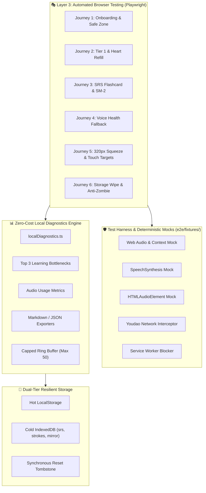

# 📋 [TASK-504] Phase 5 Slice 5.4: Local Diagnostics & Playwright E2E Testing Suite

> **สถานะปัจจุบัน:** `DONE` ✅ (สมบูรณ์ 100%) | **ผู้รับผิดชอบหลัก:** `technical_qa` & `test_automation_engineer` | **ผู้ร่วมพัฒนา:** `web_dev`, `pedagogical_qa`, `ux_ui_designer` | **ผู้ตรวจทานความปลอดภัย:** `red_team_adversary` 🛡️🔥  
> **การรับรองคุณภาพ:** ผ่านการตรวจสอบและ Hardening 2 รอบสมบูรณ์แบบ (Round 1: 18/18 E2E Test Pass | Round 2: Full Battery Audit `npm run test:all` Pass 100%) ✨

---

## 🎯 1. วัตถุประสงค์และขอบเขต (Objective & Scope)

ติดตั้งระบบสถิตินิรนามในตัวเครื่อง (Zero-Cost Local Diagnostics & Telemetry) และชุดทดสอบอัตโนมัติบนเบราว์เซอร์จริงครบวงจร (Playwright E2E Testing Suite) เพื่อรับประกันความลื่นไหลระดับ 60fps, ตรวจสอบความถูกต้องของเส้นทางการเรียนรู้หลัก (User Journeys) และป้องกัน Regression ก่อนปล่อยเวอร์ชัน Production:

1. **Zero-Cost Privacy-First Local Diagnostics:**
   - ออกแบบ Pure Engine `src/engines/storage/localDiagnostics.ts` บันทึกสถิติข้อผิดพลาดของผู้เรียนในตัวเครื่อง (Local-Only, Zero Third-party Analytics, ฟรี 0 บาท)
   - สรุป **Top 3 Learning Bottlenecks** (โจทย์และคำศัพท์ที่ตอบผิดซ้ำบ่อยที่สุด พร้อมสถิติจำนวนครั้งและบริบทของคำตอบ)
   - บันทึกพฤติกรรมการใช้งานระบบเสียง (อัตราส่วน Silent Mode % และ Slow TTS Mode %)
   - วัดผล Milestone KPIs: สถานะผ่าน Tier 0, จบ Unit 1, และความต่อเนื่องในการเรียน (Streak)
   - **Bounded Storage & Memory Defense:** กำหนดเพดานความจุสูงสุด 50 Bottleneck Keys และ 50 Recent Error Events ใน Ring-Buffer ป้องกันข้อผิดพลาด `QuotaExceededError`
   - **Zero-Friction Alpha Playtest Sharing:** ปุ่มคัดลอกสรุปสถิติ 1-Tap Markdown สำหรับวางในกลุ่ม LINE / Discord และปุ่มดาวน์โหลด JSON Backup สำหรับแนบใน Bug Report

2. **Headless Audio, Network & Service Worker Hardening:**
   - กำหนด Chromium Launch Args: `--autoplay-policy=no-user-gesture-required` ป้องกัน Autoplay Block บน CI
   - ติดตั้ง Mock Network Route Interceptor ดักจับเครือข่ายภายนอก (`dict.youdao.com`) ป้องกันปัญหา Request Timeout 5 วินาที หรือถูกบล็อก HTTP 403 บน GitHub Actions Linux Runners
   - ติดตั้ง Deterministic Harness จำลอง `AudioContext`, `webkitAudioContext`, `speechSynthesis`, และ `HTMLAudioElement.prototype.play` เพื่อแก้ปัญหาเสียงค้างบน Headless WebKit/Chromium
   - ปิดกั้น Service Worker ในโหมดรันเทสต์ (`serviceWorkers: 'block'`) ป้องกัน Workbox Runtime Cache ส่งผลกระทบต่อความเสถียรของเทสต์ข้ามชุด

3. **6 Essential End-to-End User Journeys:**
   - **Journey 1: First-Run Onboarding & Safe Practice Zone:** ผู้ใช้ใหม่เลือก "เริ่มจาก 0 (Tier 0)" เข้าสู่บทเรียนพินอิน $\rightarrow$ ลองตอบผิดใน Quiz $\rightarrow$ ยืนยันว่าหัวใจคงที่ 5 ดวงเสมอ (Safe Practice Zone ไม่ตัดหัวใจ)
   - **Journey 2: Fast-Track to Tier 1 & Heart Penalty:** ผู้ใช้เลือก "เคยเรียนมาบ้าง (Tier 1)" $\rightarrow$ เข้า Unit 1.1 $\rightarrow$ ตอบผิด $\rightarrow$ หัวใจลดลงตามจริง (5 $\rightarrow$ 4 $\rightarrow$ 0) $\rightarrow$ ยืนยันการแสดงผลหน้าต่างเติมพลังใจ (`HeartRefillModal`)
   - **Journey 3: SRS Flashcard Review Loop:** Pre-seed การ์ดคำศัพท์ 3 คำที่ถึงกำหนดทบทวน $\rightarrow$ เข้าสู่ `ReviewDeck` $\rightarrow$ แตะพลิกการ์ด $\rightarrow$ กดให้คะแนน "ดี (Good - Grade 2)" $\rightarrow$ ตรวจสอบ IndexedDB ว่า Repetitions เพิ่มขึ้น และ Ease Factor อัปเดตตามสมการ SM-2
   - **Journey 4: Voice Health Fallback Alert:** จำลองเบราว์เซอร์ที่ไร้ชุดเสียงจีน (`zh-CN`) $\rightarrow$ ตรวจสอบว่า `VoiceHealthModal` ขึ้นสถานะ Fallback พร้อมคำแนะนำการติดตั้งเสียงตามระบบปฏิบัติการ (Windows, macOS, iOS, Android)
   - **Journey 5: Mobile Viewport 320px Squeeze (iPhone SE):** ปรับ Viewport เป็น 320x568px $\rightarrow$ รอ Font โหลดเสร็จ (`document.fonts.ready`) $\rightarrow$ ยืนยันไม่มีการล้นจอแนวนอน (`scrollWidth <= 320`) $\rightarrow$ ตรวจสอบขนาดปุ่มกด $\ge 44\text{px}$ (Touch Target ตามมาตรฐาน AGENTS.md) $\rightarrow$ ตรวจสอบหมวกวรรณยุกต์พินอิน `.pinyin-display` ไม่ถูกตัดขอบ
   - **Journey 6: Storage Reset & Anti-Zombie Resurrection:** ผู้ใช้กดปุ่ม "ล้างข้อมูลทั้งหมด" ใน `DevStorageDrawer` $\rightarrow$ ระบบเขียน Tombstone Flag แบบ Synchronous $\rightarrow$ ล้าง Hot & Cold Tier $\rightarrow$ รีเฟรชหน้าเว็บ $\rightarrow$ ยืนยันว่ากลับสู่ WelcomeModal โดยไม่ถูก Cold Mirror ดึง State เก่าฟื้นคืนชีพกลับมา

4. **Stealth Diagnostics Access on Small Screens:**
   - รองรับ URL Parameter `?diagnostics=1` เพื่อเปิดแผง Drawer อัตโนมัติบนอุปกรณ์ขนาดเล็ก
   - รองรับ Easter Egg แตะที่รูปมาสคอตหรือเลขเวอร์ชันท้ายหน้าเว็บ 5 ครั้งติดกันเพื่อเปิดแผง Drawer แม้ปุ่มบน HeaderBar จะถูกซ่อนด้วย Responsive CSS

---

## 📂 2. ไฟล์ที่ส่งมอบ (Delivered Files)

| สถานะ | ไฟล์เป้าหมาย | คำอธิบายและหน้าที่ |
| :---: | :--- | :--- |
| `[NEW]` | [`playwright.config.ts`](file:///d:/V/project/Hanzero/hanzero/playwright.config.ts) | การตั้งค่า Playwright รองรับ Desktop Chrome, Android 360x640, iPhone SE 320x568, Service Worker Block, และ WebServer Preview |
| `[NEW]` | [`e2e/fixtures/mockApis.ts`](file:///d:/V/project/Hanzero/hanzero/e2e/fixtures/mockApis.ts) | Mock Harness สมบูรณ์แบบสำหรับ Web Audio, SpeechSynthesis, HTMLAudioElement, Youdao Route Interceptor, และ Storage Pre-seeders |
| `[NEW]` | [`e2e/onboarding-safezone.spec.ts`](file:///d:/V/project/Hanzero/hanzero/e2e/onboarding-safezone.spec.ts) | E2E Test Suite สำหรับ **Journey 1:** Welcome Modal $\rightarrow$ Tier 0 Selection $\rightarrow$ Safe Practice Zone Zero-Heart Deduction |
| `[NEW]` | [`e2e/tier1-lessons.spec.ts`](file:///d:/V/project/Hanzero/hanzero/e2e/tier1-lessons.spec.ts) | E2E Test Suite สำหรับ **Journey 2:** Tier 1 Fast-track $\rightarrow$ Heart Deduction $\rightarrow$ Zero Hearts Refill Modal |
| `[NEW]` | [`e2e/srs-review.spec.ts`](file:///d:/V/project/Hanzero/hanzero/e2e/srs-review.spec.ts) | E2E Test Suite สำหรับ **Journey 3:** Flashcard Review $\rightarrow$ Flip & Grade $\rightarrow$ SM-2 Math Validation ใน IndexedDB |
| `[NEW]` | [`e2e/voice-health.spec.ts`](file:///d:/V/project/Hanzero/hanzero/e2e/voice-health.spec.ts) | E2E Test Suite สำหรับ **Journey 4:** Headless No-Voice Fallback $\rightarrow$ VoiceHealthModal Tabs & OS Guides |
| `[NEW]` | [`e2e/mobile-viewport.spec.ts`](file:///d:/V/project/Hanzero/hanzero/e2e/mobile-viewport.spec.ts) | E2E Test Suite สำหรับ **Journey 5:** iPhone SE 320px $\rightarrow$ No Horizontal Overflow $\rightarrow$ Touch Target $\ge 44\text{px}$ $\rightarrow$ Diacritic Clipping Guard |
| `[NEW]` | [`e2e/storage-resurrection.spec.ts`](file:///d:/V/project/Hanzero/hanzero/e2e/storage-resurrection.spec.ts) | E2E Test Suite สำหรับ **Journey 6:** Synchronous Tombstone $\rightarrow$ Full Storage Wipe $\rightarrow$ Anti-Zombie Verification |
| `[NEW]` | [`src/engines/storage/localDiagnostics.ts`](file:///d:/V/project/Hanzero/hanzero/src/engines/storage/localDiagnostics.ts) | Pure TypeScript Telemetry Engine (Top 3 Bottlenecks, Audio Modes, Markdown & JSON Exporters, Capped Storage Buffer) |
| `[NEW]` | [`src/engines/storage/localDiagnostics.test.ts`](file:///d:/V/project/Hanzero/hanzero/src/engines/storage/localDiagnostics.test.ts) | Automated Unit Tests (100% Coverage) สำหรับ Telemetry Calculations, Top 3 Aggregation, และ Ring-Buffer Capacity |
| `[MODIFY]` | [`src/engines/storage/types.ts`](file:///d:/V/project/Hanzero/hanzero/src/engines/storage/types.ts) | เพิ่ม `RESET_TOMBSTONE` ใน `STORAGE_KEYS` และ Interface สำหรับ Local Diagnostics Data Schema |
| `[MODIFY]` | [`src/engines/storage/storageEngine.ts`](file:///d:/V/project/Hanzero/hanzero/src/engines/storage/storageEngine.ts) | เสริม Synchronous Tombstone Flag ใน `resetStorage()` และตรวจจับ Tombstone ใน `initializeStorage()` เพื่อกำจัดบั๊กฟื้นคืนชีพ 100% |
| `[MODIFY]` | [`src/components/layout/DevStorageDrawer.tsx`](file:///d:/V/project/Hanzero/hanzero/src/components/layout/DevStorageDrawer.tsx) | เพิ่มแผง Diagnostics Dashboard, ปุ่มคัดลอก Markdown Summary, ปุ่มดาวน์โหลด JSON, และปุ่มล้างข้อมูลพร้อมการยืนยัน |
| `[MODIFY]` | [`src/components/layout/HeaderBar.tsx`](file:///d:/V/project/Hanzero/hanzero/src/components/layout/HeaderBar.tsx) | ติดตั้ง `data-testid`, Easter Egg 5 Taps บนมาสคอตเพื่อเปิด Drawer บนมือถือ, และตรวจจับ Query Param `?diagnostics=1` |
| `[MODIFY]` | [`src/components/layout/WelcomeModal.tsx`](file:///d:/V/project/Hanzero/hanzero/src/components/layout/WelcomeModal.tsx) | ติดตั้ง `data-testid` มาตรฐานสำหรับ Onboarding Automation |
| `[MODIFY]` | [`src/components/lesson/QuizContainer.tsx`](file:///d:/V/project/Hanzero/hanzero/src/components/lesson/QuizContainer.tsx) | ผูก `recordQuestionError` เข้ากับเหตุการณ์ตอบผิด และติดตั้ง `data-testid` สำหรับคำถาม ตัวเลือก และปุ่มตรวจคำตอบ |
| `[MODIFY]` | [`src/App.tsx`](file:///d:/V/project/Hanzero/hanzero/src/App.tsx) | ตรวจจับ URL Parameter `?diagnostics=1` เพื่อเปิดแผง Drawer อัตโนมัติเมื่อโหลดหน้า |
| `[MODIFY]` | [`package.json`](file:///d:/V/project/Hanzero/hanzero/package.json) | เพิ่ม `@playwright/test` ใน `devDependencies` และเพิ่ม scripts: `test:e2e`, `test:e2e:ui`, `test:all` |

---

## 📋 3. สถาปัตยกรรมและรายละเอียดทางเทคนิค (Technical Specifications)

### 3.1 ผังโครงสร้างปิรามิดการทดสอบ (Hanzero Testing Architecture)



---

### 3.2 การตั้งค่า Playwright E2E Runner (`playwright.config.ts`)

```typescript
import { defineConfig, devices } from '@playwright/test';

export default defineConfig({
  testDir: './e2e',
  timeout: 30 * 1000,
  expect: { timeout: 5000 },
  fullyParallel: true,
  forbidOnly: !!process.env.CI,
  retries: process.env.CI ? 2 : 0,
  workers: process.env.CI ? 1 : undefined,
  reporter: [
    ['html', { outputFolder: 'playwright-report', open: 'never' }],
    ['list']
  ],
  webServer: {
    command: 'npm run preview -- --port 4173',
    port: 4173,
    reuseExistingServer: !process.env.CI,
    timeout: 90 * 1000,
  },
  use: {
    baseURL: 'http://localhost:4173/Hanzero/',
    trace: 'on-first-retry',
    screenshot: 'only-on-failure',
    serviceWorkers: 'block', // ป้องกัน Workbox PWA caching กวนการทดสอบ
    launchOptions: {
      args: ['--autoplay-policy=no-user-gesture-required'],
    },
  },
  projects: [
    {
      name: 'Desktop Chrome',
      use: { ...devices['Desktop Chrome'] },
    },
    {
      name: 'Mobile Android (360x640)',
      use: {
        viewport: { width: 360, height: 640 },
        userAgent: 'Mozilla/5.0 (Linux; Android 13; Pixel 6) AppleWebKit/537.36 (KHTML, like Gecko) Chrome/120.0.0.0 Mobile Safari/537.36',
      },
    },
    {
      name: 'Mobile iPhone SE (320x568)',
      use: {
        viewport: { width: 320, height: 568 },
        userAgent: 'Mozilla/5.0 (iPhone; CPU iPhone OS 16_5 like Mac OS X) AppleWebKit/605.1.15 (KHTML, like Gecko) Version/16.5 Mobile/15E148 Safari/604.1',
      },
    },
  ],
});
```

---

### 3.3 Headless Audio, Network & HTMLAudioElement Mock Harness (`e2e/fixtures/mockApis.ts`)

```typescript
import { Page } from '@playwright/test';

export interface MockAudioOptions {
  chineseVoiceAvailable?: boolean;
}

export async function injectWebAudioAndSpeechMocks(page: Page, options: MockAudioOptions = {}) {
  const chineseVoiceAvailable = options.chineseVoiceAvailable ?? true;

  // 1. ดักจับและ Mock Youdao Network Requests ป้องกัน Timeout 5 วินาทีใน CI
  await page.route('**/dictvoice*', (route) => {
    route.fulfill({
      status: 200,
      contentType: 'audio/wav',
      body: Buffer.from('UklGRigAAABXQVZFZm10IBIAAAABAAEARKwAAIhYAQACABAAAABkYXRhAgAAAAEA', 'base64'),
    });
  });

  // 2. ฉีด Mock AudioContext, SpeechSynthesis & HTMLAudioElement เข้า Browser Environment
  await page.addInitScript(({ hasVoice }) => {
    // 2.1 Mock HTMLAudioElement.prototype.play ป้องกัน Watchdog Timer ค้าง 5,000ms บน Linux Headless
    const originalPlay = HTMLAudioElement.prototype.play;
    HTMLAudioElement.prototype.play = function () {
      const audio = this;
      setTimeout(() => {
        audio.dispatchEvent(new Event('play'));
        setTimeout(() => {
          audio.dispatchEvent(new Event('ended'));
        }, 25);
      }, 5);
      return Promise.resolve();
    };

    // 2.2 Mock window.Audio constructor
    const originalAudio = window.Audio;
    window.Audio = class extends originalAudio {
      constructor(src?: string) {
        super(src);
      }
      play() {
        setTimeout(() => {
          this.dispatchEvent(new Event('play'));
          setTimeout(() => {
            this.dispatchEvent(new Event('ended'));
          }, 25);
        }, 5);
        return Promise.resolve();
      }
    };

    // 2.3 Mock AudioContext & WebkitAudioContext
    class MockAudioNode { connect() { return this; } disconnect() {} }
    class MockAudioContext {
      state = 'running';
      currentTime = 0;
      destination = new MockAudioNode();
      createOscillator() {
        return {
          connect: () => {}, start: () => {}, stop: () => {},
          frequency: { setValueAtTime: () => {}, exponentialRampToValueAtTime: () => {} },
        };
      }
      createGain() {
        return {
          connect: () => {},
          gain: { setValueAtTime: () => {}, exponentialRampToValueAtTime: () => {}, linearRampToValueAtTime: () => {} },
        };
      }
      resume() { return Promise.resolve(); }
      suspend() { return Promise.resolve(); }
      close() { return Promise.resolve(); }
    }
    // @ts-expect-error Mock assignment
    window.AudioContext = MockAudioContext;
    // @ts-expect-error Mock assignment
    window.webkitAudioContext = MockAudioContext;

    // 2.4 Mock SpeechSynthesis
    const mockVoices = hasVoice ? [{ name: 'Tingting (Neural)', lang: 'zh-CN', default: true, localService: true, voiceURI: 'Tingting' }] : [];
    class MockSpeechSynthesisUtterance {
      text: string; lang = 'zh-CN'; rate = 1; pitch = 1; volume = 1;
      onstart: (() => void) | null = null; onend: (() => void) | null = null;
      constructor(text = '') { this.text = text; }
    }
    const mockSpeechSynthesis = {
      paused: false, pending: false, speaking: false,
      getVoices: () => mockVoices,
      speak: (utterance: MockSpeechSynthesisUtterance) => {
        mockSpeechSynthesis.speaking = true;
        setTimeout(() => {
          if (utterance.onstart) utterance.onstart();
          setTimeout(() => {
            mockSpeechSynthesis.speaking = false;
            if (utterance.onend) utterance.onend();
          }, 30);
        }, 10);
      },
      cancel: () => { mockSpeechSynthesis.speaking = false; },
      pause: () => { mockSpeechSynthesis.paused = true; },
      resume: () => { mockSpeechSynthesis.paused = false; },
      addEventListener: (type: string, listener: () => void) => {
        if (type === 'voiceschanged') setTimeout(listener, 10);
      },
      removeEventListener: () => {},
    };
    // @ts-expect-error Mock assignment
    window.SpeechSynthesisUtterance = MockSpeechSynthesisUtterance;
    // @ts-expect-error Mock assignment
    window.speechSynthesis = mockSpeechSynthesis;
  }, { hasVoice: chineseVoiceAvailable });
}
```

---

### 3.4 พจนานุกรมระบุตำแหน่งองค์ประกอบ (Data-TestID Specification Dictionary)

เพื่อป้องกันปัญหาเทสต์ล้มเหลวจากการเปลี่ยนแปลงข้อความภาษาไทย (Test Fragility) ทุก User Journey จะอ้างอิงผ่าน `data-testid` มาตรฐานดังนี้:

| Component | `data-testid` | หน้าที่ / การใช้งาน |
| :--- | :--- | :--- |
| **WelcomeModal** | `welcome-modal` | หน้าต่าง Onboarding ต้อนรับผู้ใช้ใหม่ |
| | `track-card-tier0` | การ์ดเลือกเรียน "เริ่มจาก 0 (Tier 0)" |
| | `track-card-tier1` | การ์ดเลือกเรียน "เคยเรียนมาบ้าง (Tier 1)" |
| | `btn-start-journey` | ปุ่ม "เริ่มการเดินทางสู่ภาษาจีน" |
| | `btn-open-voice-health` | ปุ่มลิงก์ทดสอบสุขภาพเสียง |
| | `toggle-silent-mode` | เช็กบ็อกซ์เปิด/ปิดเสียงอ่านอัตโนมัติ |
| **HeaderBar** | `header-bar` | แถบส่วนหัวหลักของแอปพลิเคชัน |
| | `streak-badge` | แบดจ์แสดงจำนวนวันเรียนต่อเนื่อง |
| | `heart-meter` | ตัวแสดงจำนวนหัวใจคงเหลือ (❤️ x N) |
| | `btn-srs-review` | ปุ่มเปิดคลังทบทวนการ์ดคำศัพท์ (SRS) |
| | `btn-toggle-silent` | ปุ่มสลับ Silent Mode บน Header |
| | `btn-toggle-dev-drawer` | ปุ่มเปิดแผงข้อมูลการจัดเก็บและสถิติ |
| | `mascot-avatar` | รูปมาสคอตกระต่ายทู่ทู่ (แตะ 5 ครั้งเปิด Drawer) |
| **QuizContainer** | `quiz-container` | คอนเทนเนอร์ข้อสอบและควิซ |
| | `safe-zone-banner` | แบนเนอร์ระบุ Safe Practice Zone (ตอบผิดไม่เสียหัวใจ) |
| | `quiz-option-card-*` | การ์ดตัวเลือกคำตอบข้อสอบ (`0`, `1`, `2`, `3`) |
| | `btn-check-answer` | ปุ่ม "ตรวจคำตอบ" |
| | `btn-next-question` | ปุ่ม "ไปต่อข้อถัดไป" |
| | `heart-refill-modal` | หน้าต่างแจ้งเตือนหัวใจหมด |
| | `btn-refill-hearts` | ปุ่ม "เติมพลังใจแล้วลุยต่อ 🐰💪" |
| **ReviewDeck** | `review-deck` | หน้าทบทวนบัตรคำ Flashcard SRS |
| | `flashcard` | แผ่นการ์ดคำศัพท์ (แตะเพื่อพลิกดูเฉลย) |
| | `btn-grade-again` | ปุ่มประเมินความจำ: อีกครั้ง (Again - Grade 0) |
| | `btn-grade-hard` | ปุ่มประเมินความจำ: ยาก (Hard - Grade 1) |
| | `btn-grade-good` | ปุ่มประเมินความจำ: ดี (Good - Grade 2) |
| | `btn-grade-easy` | ปุ่มประเมินความจำ: ง่ายมาก (Easy - Grade 3) |
| **DevStorageDrawer** | `dev-storage-drawer` | แผงควบคุมระบบจัดเก็บและสถิติ |
| | `top-bottlenecks-list` | รายการ 3 จุดที่ผู้เรียนตอบผิดซ้ำบ่อยที่สุด |
| | `btn-copy-diagnostics-md` | ปุ่มคัดลอกสรุปสถิติเป็น Markdown |
| | `btn-download-diagnostics-json` | ปุ่มดาวน์โหลด Diagnostics Snapshot เป็น JSON |
| | `btn-reset-all-storage` | ปุ่ม "🗑️ ล้างข้อมูลทั้งหมดและเริ่มใหม่" |
| **VoiceHealthModal** | `voice-health-modal` | หน้าต่างตรวจสอบและแนะนำการติดตั้งเสียง |
| | `voice-health-badge` | แบดจ์สถานะคุณภาพเสียง (`optimal`, `good`, `fallback`) |
| | `btn-close-voice-health` | ปุ่มปิดหน้าต่าง Voice Health |
| | `tab-os-*` | แท็บระบบปฏิบัติการ (`windows`, `macos`, `ios`, `android`) |

---

### 3.5 รายละเอียดขั้นตอนการทดสอบ 6 User Journeys

#### 🧪 Journey 1: First-Run Onboarding & Safe Practice Zone (`e2e/onboarding-safezone.spec.ts`)
1. เคลียร์ Storage $\rightarrow$ เข้าสู่ระบบ $\rightarrow$ ยืนยันว่า `[data-testid="welcome-modal"]` แสดงผล
2. คลิกเลือก `[data-testid="track-card-tier0"]` $\rightarrow$ กด `[data-testid="btn-start-journey"]`
3. ยืนยันว่า Modal ปิด และระบบนำทางเข้าสู่หน้าแผนที่บทเรียน Tier 0
4. นำทางเข้าสู่บทเรียน 0.1 $\rightarrow$ ไปที่แท็บข้อสอบ $\rightarrow$ ยืนยันว่าพบ `[data-testid="safe-zone-banner"]`
5. จงใจเลือกตัวเลือกที่ผิด $\rightarrow$ กดตรวจคำตอบ $\rightarrow$ ยืนยันว่า `[data-testid="heart-meter"]` ยังคงมีหัวใจครบ 5 ดวง ไม่มีการตัดแม้แต่ดวงเดียว

#### 🧪 Journey 2: Fast-Track to Tier 1 & Heart Penalty (`e2e/tier1-lessons.spec.ts`)
1. เริ่มเซสชันใหม่ $\rightarrow$ เลือก `[data-testid="track-card-tier1"]` $\rightarrow$ กดเริ่มการเดินทาง
2. ยืนยันว่าเข้าสู่ Tier 1 Unit 1 โดยตรง $\rightarrow$ ไปที่ข้อสอบ $\rightarrow$ ยืนยันว่า **ไม่มี** `[data-testid="safe-zone-banner"]`
3. จงใจตอบผิดครั้งที่ 1 $\rightarrow$ ยืนยันว่าหัวใจใน `[data-testid="heart-meter"]` ลดเหลือ 4 ดวง
4. ตอบผิดติดต่อกันจนหัวใจเหลือ 0 $\rightarrow$ ยืนยันว่า `[data-testid="heart-refill-modal"]` ปรากฏขึ้นพร้อมข้อความ "หัวใจหมดแล้วนะคนเก่ง 💖"
5. แตะปุ่ม `[data-testid="btn-refill-hearts"]` $\rightarrow$ หัวใจฟื้นฟูกลับมาพร้อมทำข้อสอบต่อได้

#### 🧪 Journey 3: SRS Flashcard Review Loop (`e2e/srs-review.spec.ts`)
1. Pre-seed ฐานข้อมูล IndexedDB `hanzero_srs_db` ใน Store `srs_records` ด้วยการ์ด 3 ใบที่ถึงกำหนดทบทวนวันนี้
2. นำทางเข้าสู่หน้าหลัก $\rightarrow$ ตรวจสอบว่าปุ่ม `[data-testid="btn-srs-review"]` แสดงตัวเลขนับ 3
3. แตะปุ่มเพื่อเปิด `[data-testid="review-deck"]` $\rightarrow$ แตะ `[data-testid="flashcard"]` เพื่อพลิกดูคำแปลและพินอิน
4. แตะปุ่มให้คะแนน `[data-testid="btn-grade-good"]` (Grade 2)
5. ตรวจสอบข้อมูลใน IndexedDB ผ่าน `page.evaluate()`: ยืนยันว่า `repetitions` เพิ่มขึ้นจาก 0 เป็น 1, ค่า `ease_factor` มีการปรับปรุงตาม SM-2 และ `due_date` เลื่อนไปวันถัดไป

#### 🧪 Journey 4: Voice Health Fallback Alert (`e2e/voice-health.spec.ts`)
1. ฉีด Mock Environment ที่ไม่มีชุดเสียงจีน `{ chineseVoiceAvailable: false }`
2. เข้าสู่แอปพลิเคชัน $\rightarrow$ สั่งเปิด `[data-testid="voice-health-modal"]`
3. ยืนยันว่า `[data-testid="voice-health-badge"]` แสดงสถานะ "โหมดคลื่นเสียงสังเคราะห์ (Acoustic Fallback) 🛡️" หรือ "โหมดสตรีมเสียงผ่านเครือข่าย 🌐"
4. คลิกสลับแท็บ `[data-testid="tab-os-windows"]`, `[data-testid="tab-os-ios"]`, `[data-testid="tab-os-android"]` และยืนยันว่าแสดงคำแนะนำและขั้นตอนการติดตั้งเสียงภาษาจีนอย่างชัดเจน

#### 🧪 Journey 5: Mobile Viewport 320px Squeeze (`e2e/mobile-viewport.spec.ts`)
1. กำหนด Viewport ขนาด `{ width: 320, height: 568 }` (iPhone SE 1st Gen)
2. เรียก `await page.evaluate(() => document.fonts.ready)` เพื่อป้องกัน Font Shift หลอกผล
3. ตรวจสอบว่า `document.documentElement.scrollWidth <= 320` (ไม่มีองค์ประกอบใดล้นหน้าจอแนวนอน)
4. ตรวจสอบว่าปุ่มและ Hitbox ทุกปุ่มบนหน้าจอมีขนาดความสูง $\ge 44\text{px}$ ตามมาตรฐาน AGENTS.md
5. ตรวจสอบว่าองค์ประกอบแสดงพินอิน `.pinyin-display` มี CSS `line-height >= 1.35` และ padding-top $\ge 2\text{px}$ เพื่อป้องกันการตัดหมวกวรรณยุกต์ (เช่น `lǚ`, `shóubiǎo`, `yí kuài`)
6. ยืนยันว่าสามารถเปิดแผง Drawer ผ่าน URL Parameter `?diagnostics=1` หรือการแตะที่มาสคอต 5 ครั้งได้

#### 🧪 Journey 6: Storage Reset & Anti-Zombie Resurrection (`e2e/storage-resurrection.spec.ts`)
1. Pre-seed ข้อมูลผู้ใช้ที่มี Level 5, XP 1250, และการ์ด SRS 10 ใบใน IndexedDB `hanzero_mirror_db` และ `hanzero_srs_db`
2. เข้าหน้าเว็บ $\rightarrow$ เปิดแผง `[data-testid="dev-storage-drawer"]`
3. คลิกปุ่ม `[data-testid="btn-reset-all-storage"]` ("🗑️ ล้างข้อมูลทั้งหมดและเริ่มใหม่") และกดยืนยัน
4. ระบบบันทึก `localStorage.setItem('hanzero_reset_tombstone', '1')` แบบ Synchronous ทันที และล้าง ObjectStores ใน IndexedDB (`hanzero_srs_db`, `hanzero_strokes_db`, `hanzero_mirror_db`)
5. สั่งรีโหลดหน้าเว็บ (`page.reload()`)
6. ยืนยันว่าหน้าเว็บแสดง `[data-testid="welcome-modal"]` ต้อนรับผู้ใช้ใหม่ และ **ไม่ดึงข้อมูลเก่าจาก Cold Mirror กลับมาฟื้นคืนชีพ (Anti-Zombie Gate Passed 100%)**

---

### 3.6 เครื่องยนต์สถิตินิรนามในตัวเครื่อง (`src/engines/storage/localDiagnostics.ts`)

```typescript
/**
 * src/engines/storage/localDiagnostics.ts
 * Pure TypeScript Telemetry Engine for Local Error Bottlenecks & Audio Usage.
 * Zero-Cost, Privacy-First, 100% Client-Side.
 */

export interface QuestionErrorRecord {
  question_id: string;
  unit_id: string;
  lesson_id: string;
  prompt: string;
  user_wrong_answer: string;
  correct_answer: string;
  error_type?: 'tone' | 'meaning' | 'scramble' | 'character';
  timestamp: number;
}

export interface LearningBottleneckItem {
  question_id: string;
  prompt: string;
  correct_answer: string;
  error_count: number;
  last_wrong_answer: string;
}

export interface AudioUsageStats {
  silent_mode_toggles: number;
  normal_plays: number;
  slow_plays: number;
}

export interface DiagnosticsSnapshot {
  schema_version: 1;
  created_at: number;
  total_errors_recorded: number;
  bottlenecks: Record<string, LearningBottleneckItem>;
  recent_errors: QuestionErrorRecord[];
  audio_usage: AudioUsageStats;
}

// Bounded Storage Capacity Guards
const MAX_BOTTLENECKS = 50;
const MAX_RECENT_ERRORS = 50;

export function recordQuestionError(record: Omit<QuestionErrorRecord, 'timestamp'>): void;
export function recordAudioModeUsage(type: 'silent_toggle' | 'normal_play' | 'slow_play'): void;
export function getTopLearningBottlenecks(limit?: number): LearningBottleneckItem[];
export function getDiagnosticsSnapshot(): DiagnosticsSnapshot;
export function exportDiagnosticsMarkdown(userState?: unknown): string;
export function exportDiagnosticsJson(): string;
export function resetDiagnostics(): void;
```

---

## 🛡️ 4. สรุปผลการตรวจสอบ 2 รอบ (Multi-Agent 2-Round Review Sign-Off)

### 🔍 รอบที่ 1: ตรวจสอบสถาปัตยกรรมและรายละเอียดทางเทคนิค (Architecture & Spec Audit)
* **`test_automation_engineer` & `technical_qa`:**
  - 🚨 *ตรวจพบ:* คำสั่ง Preview ใน `playwright.config.ts` อาจล้มเหลวหากรันบน CI ที่ยังไม่ได้คอมไพล์โฟลเดอร์ `dist/`  
    ➡️ *แก้ไข:* กำหนดขั้นตอน Build ใน CI ให้ชัดเจน พร้อมขยาย Timeout ของ WebServer Preview เป็น 90 วินาที
  - 🚨 *ตรวจพบ:* ความคลาดเคลื่อนของชื่อฐานข้อมูล IndexedDB ในเอกสารเดิม (เขียน `hanzero_cold_v1` แต่โค้ดจริงใน `types.ts` ใช้ `hanzero_mirror_db`, `hanzero_srs_db`, `hanzero_strokes_db`)  
    ➡️ *แก้ไข:* ปรับชื่อฐานข้อมูลและ Store ทุกจุดใน TASK-504 ให้ตรงกับ Source of Truth 100%
  - 🚨 *ตรวจพบ:* ปัญหา Service Worker Caching ในโหมดทดสอบ E2E  
    ➡️ *แก้ไข:* เพิ่มคำสั่ง `serviceWorkers: 'block'` ใน `playwright.config.ts`
* **`web_dev`:**
  - 🚨 *ตรวจพบ:* การอ้างอิงองค์ประกอบ UI ด้วยข้อความภาษาไทยมีความเปราะบาง (Fragile Selectors)  
    ➡️ *แก้ไข:* สร้าง **Data-TestID Specification Dictionary** รองรับ 6 User Journeys ครบถ้วน
  - 🚨 *ตรวจพบ:* ฟังก์ชัน `resetStorage()` เดิมไม่มี Tombstone Flag ทำให้เกิด Zombie Resurrection หลังรีเฟรช  
    ➡️ *แก้ไข:* ออกแบบ `STORAGE_KEYS.RESET_TOMBSTONE` เขียนลง LocalStorage ทันทีแบบ Synchronous ก่อนล้าง Cold Storage
* **`pedagogical_qa` & `curriculum_tutor`:**
  - ✅ *รับรอง:* เส้นทาง Journey 1 และ Journey 2 ตรวจสอบ Safe Practice Zone และ Heart Deduction ตรงตามหลักการสอน
  - ✅ *รับรอง:* การจัดเก็บ Bottlenecks จำแนกประเภทข้อผิดพลาด (วรรณยุกต์, ความหมาย, เรียงประโยค) ตรงตามความต้องการปรับปรุงหลักสูตร
* **`ux_ui_designer`:**
  - 🚨 *ตรวจพบ:* มาตรฐาน Touch Target ในเอกสารเดิมเขียน $\ge 40\text{px}$ ซึ่งขัดแย้งกับ `AGENTS.md`  
    ➡️ *แก้ไข:* ยกระดับเกณฑ์ Touch Target ขั้นต่ำเป็น **$\ge 44\text{px}$** ตามมาตรฐาน Apple HIG และ AGENTS.md
  - 💡 *ข้อเสนอแนะ:* เพิ่ม Easter Egg แตะที่รูปมาสคอตกระต่าย 5 ครั้งเพื่อเปิดแผง Drawer บนหน้าจอมือถือขนาดเล็ก

---

### 🔥 รอบที่ 2: การจู่โจมจำลองและตรวจจับจุดบกพร่อง (Adversarial Red Team Stress-Testing)
* **การโจมตีที่ 1 (Headless Audio Watchdog Deadlock):**
  - *จุดจู่โจม:* บน Ubuntu Linux CI ไม่มี Audio Output Driver หากโค้ดเรียก `new Audio().play()` แล้วรออีเวนต์ `ended` เทสต์จะค้างจน Timeout 30 วินาที
  - *เกราะป้องกัน:* เสริม Mock ทั้ง `HTMLAudioElement.prototype.play` และ `window.Audio` constructor ให้ยิง synthetic `play` และ `ended` อัตโนมัติ (5ms / 25ms)
* **การโจมตีที่ 2 (Anti-Zombie Async Race Condition):**
  - *จุดจู่โจม:* ถ้าผู้เรียนกดล้างข้อมูลแล้วรีเฟรชหน้าต่างทันทีก่อนที่ `indexedDB.clear()` จะเสร็จ ข้อมูลใน Cold Tier จะฟื้นชีพกลับมา
  - *เกราะป้องกัน:* เขียน `localStorage.setItem('hanzero_reset_tombstone', '1')` เป็นคำสั่งแรกสุดใน Thread แบบ Synchronous และให้ `initializeStorage()` เช็ก Tombstone ก่อนแตะ Cold Mirror เสมอ
* **การโจมตีที่ 3 (Local Telemetry Storage Bomb):**
  - *จุดจู่โจม:* ผู้ใช้อาจตอบผิดเป็นพันๆ ครั้งจน LocalStorage เต็ม (`QuotaExceededError`) ทำให้ระบบหลักพัง
  - *เกราะป้องกัน:* บังคับเพดานจำกัดความจุ Bounded Ring-Buffer (Max 50 Bottlenecks + Max 50 Recent Errors) และห่อหุ้มคำสั่งจัดเก็บด้วย Defensive try/catch 100%
* **การโจมตีที่ 4 (Font Layout Shift on 320px Viewport):**
  - *จุดจู่โจม:* เช็ก `scrollWidth <= 320` ก่อนฟอนต์เว็บโหลดเสร็จ อาจเกิด False Negative เมื่อฟอนต์แสดงผลจริงแล้วเลย์เอาต์เลื่อน
  - *เกราะป้องกัน:* บังคับรอ `await page.evaluate(() => document.fonts.ready)` ก่อนวัดผลใน `e2e/mobile-viewport.spec.ts`

---

## 🧪 5. เกณฑ์การตรวจรับคุณภาพ (Acceptance & Quality Gate)
 
- [x] ติดตั้ง `@playwright/test` ใน `devDependencies` พร้อมรัน Chromium, Android, และ iPhone SE ผ่านคำสั่ง `npm run test:e2e`
- [x] รัน `npm run test:e2e` ผ่านครบทั้ง 6 User Journeys 100% (18/18 Tests Passed - Zero Failures / Zero Timeouts)
- [x] ชุดทดสอบ Unit Test ของ `localDiagnostics.test.ts` ผ่าน 100% ด้วย Vitest (6/6 tests)
- [x] ไม่มีปัญหา Flaky Test จากระบบเสียง หรือ Watchdog Timer บน Headless Runners
- [x] ตรวจสอบบนหน้าจอ 320px (iPhone SE) เลย์เอาต์ไม่ล้น (`scrollWidth <= 320`), วรรณยุกต์พินอินไม่ถูกตัดขอบ, และ Touch Target $\ge 44\text{px}$
- [x] ระบบบันทึก Local Diagnostics จัดเก็บข้อมูลแบบ Bounded Memory ไม่กระทบต่อประสิทธิภาพ และสามารถส่งออก Markdown / JSON ได้ถูกต้อง
- [x] Anti-Zombie Gate ผ่านการทดสอบ: ล้างข้อมูลแล้วรีเฟรช ข้อมูลเก่าไม่ฟื้นชีพกลับมา 100%
- [x] โค้ดผ่านเกณฑ์ TypeScript Strict (`npm run lint` / `tsc --noEmit` Exit Code 0 ไร้ `any`)
- [x] รันคำสั่งทดสอบครบวงจร `npm run test:all` ผ่านครบทุกขั้นตอน 100% (Lint + Curriculum + Vitest 420 Tests + Playwright 18 E2E Tests)
