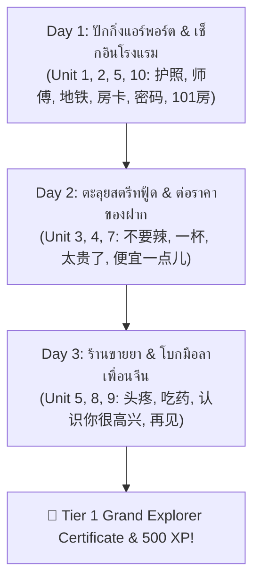

# 📋 [TASK-503] Phase 5 Slice 5.3: Tier 1 Content Rollout - Batch B & C (Units 5 - 10 + Grand Boss)

> **สถานะปัจจุบัน:** `TODO` ⏳ | **ผู้รับผิดชอบ:** `curriculum_tutor` | **ผู้ตรวจรับ:** `pedagogical_qa` & `technical_qa` | **ผ่านการ Hardening รอบที่ 2 โดย Red Team** 🛡️🔥

---

## 🎯 1. วัตถุประสงค์และขอบเขต (Objective & Scope)
ขยายเนื้อหาบทเรียน Tier 1 ให้ครบถ้วนทั้ง 10 Units (รวม 40 บทย่อย) พร้อมบททดสอบปิดท้ายอันยิ่งใหญ่ **Tier 1 Grand Boss Quest**:
1. **Batch B (การเดินทาง สังคม และชีวิตประจำวัน):**
   - Unit 5: การเดินทาง & ทิศทาง (แท็กซี่, รถไฟใต้ดิน, เลี้ยวซ้าย/ขวา, ถามทาง)
   - Unit 6: ครอบครัว & เพื่อน (แนะนำสมาชิกในบ้าน, จำนวนคน, เพื่อนร่วมงาน)
   - Unit 7: กิจวัตร & งานอดิเรก (ตื่นนอน, ทำงาน, ดูหนัง, วันหยุด) *(⚡ Sandhi: `一起` yì qǐ)*
2. **Batch C (สุขภาพ การเตรียมตัว และการเดินทางระดับโปร):**
   - Unit 8: สภาพอากาศ & ฤดูกาล (ร้อน, หนาว, ฝนตก, หิมะตก, การเตรียมเสื้อผ้า)
   - Unit 9: ร่างกาย สุขภาพ & ไม่สบาย (ปวดหัว, เป็นไข้, ซื้อยา, ไปโรงพยาบาล) *(⚡ แยก `吃药` vs `喝药`)*
   - Unit 10: โรงแรม & เที่ยวบิน (เช็กอินโรงแรม, ขอรหัส Wi-Fi, ห้อง 101 `yāo líng yāo`, สนามบิน)
3. 🏆 **Tier 1 Grand Boss Quest (Lesson 10.4):** มหากาพย์ 3 วัน 2 คืน (3-Stage Multistage Quest) ผสานทักษะจากทั้ง 10 Units สู่การจำลองชีวิตจริง พร้อม **Stage Checkpoint Persistence** ป้องกันการเริ่มใหม่เมื่อตอบผิด

---

## 📂 2. ไฟล์ที่ส่งมอบ (Delivered Files)
- [ ] `[NEW]` `src/data/lessons/tier1/unit05_directions_transport.json` (~45 KB)
- [ ] `[NEW]` `src/data/lessons/tier1/unit06_family_friends.json` (~45 KB)
- [ ] `[NEW]` `src/data/lessons/tier1/unit07_daily_routines.json` (~45 KB)
- [ ] `[NEW]` `src/data/lessons/tier1/unit08_weather_seasons.json` (~45 KB)
- [ ] `[NEW]` `src/data/lessons/tier1/unit09_health_body.json` (~45 KB)
- [ ] `[NEW]` `src/data/lessons/tier1/unit10_hotel_airport.json` (~55 KB, รวม Grand Boss Quest)
- [ ] `[MODIFY]` `src/data/lessons/tier1/schemaValidation.test.ts`

---

## 📋 3. โครงสร้างเนื้อหาระดับบทเรียนและคลังคำศัพท์ (Curriculum Blueprint)

### 3.1 🚇 Batch B: การเดินทางและสังคม (Units 5, 6, 7)

#### Unit 5: การเดินทาง & ทิศทาง (`tier1_u05`)
- **Vocab แกนกลาง:** `在` (zài), `哪儿` (nǎr), `这里` (zhèlǐ), `那里` (nàlǐ), `去` (qù), `怎么走` (zěnme zǒu), `左` (zuǒ), `右` (yòu), `前` (qián), `地铁` (dìtiě), `出租车` (chūzūchē), `车站` (chēzhàn), `师傅` (shīfu)
- **🧱 เลโก้ไวยากรณ์สถานที่:** `[ประธาน] + 在 [สถานที่] + [กริยา]` (เช่น `我在车站等你` - คนไทยมักพูดผิดเป็น 我等你在这个车站)
- **💡 วัฒนธรรม:** เรียกคนขับแท็กซี่ว่า `师傅` (shīfu) แสดงความเป็นกันเองและสุภาพที่สุด

#### Unit 6: ครอบครัว & คนรอบตัว (`tier1_u06`)
- **Vocab แกนกลาง:** `爸爸` (bàba), `妈妈` (māma), `哥哥` (gēge), `姐姐` (jiějie), `弟弟` (dìdi), `妹妹` (mèimei), `家` (jiā), `有` (yǒu), `没有` (méiyǒu), `口` (kǒu), `朋友` (péngyou), `同学` (tóngxué), `同事` (tóngshì)
- **🧱 เลโก้ไวยากรณ์ครอบครัว:**
  - ลักษณนามคนในบ้านใช้ `口` (เช่น `我家有四口人`)
  - การปฏิเสธ `有` ต้องใช้ **`没有` เสมอ** (ห้ามพูด `不有` เด็ดขาด!)
  - แสดงความเป็นเจ้าของ: `[สรรพนาม] + (的) + [คนในบ้าน]` เช่น `我妈妈`, `我的朋友`

#### Unit 7: กิจวัตรประจำวัน & งานอดิเรก (`tier1_u07`)
- **Vocab แกนกลาง:** `起床` (qǐchuáng), `上班` (shàngbān), `睡觉` (shuìjiào), `学习` (xuéxí), `喜欢` (xǐhuan), `看电影` (kàn diànyǐng), `听音乐` (tīng yīnyuè), `玩手机` (wán shǒujī), `周末` (zhōumò), `常常` (chángcháng), `一起` (yìqǐ)
- **⚡ Tone Sandhi ตอกย้ำ:** `一起` (`yì qǐ`: 一 หน้าเสียง 3 ผันเป็น `yì`), คำถาม $A\text{不}AB$ `喜不喜欢` (`xǐ bu xǐhuan`: 不 เสียงเบา)
- **🧱 เลโก้ไวยากรณ์:** `[ประธาน] + 跟 [คน] + 一起 + [กริยา]` (เช่น `我跟你一起看电影`)
- **💡 วัฒนธรรมสำนวนพูด:** `玩手机` (เล่นโทรศัพท์มือถือ)

---

### 3.2 🏨 Batch C: สุขภาพและการเดินทางขั้นสูง (Units 8, 9, 10)

#### Unit 8: สภาพอากาศ & ฤดูกาล (`tier1_u08`)
- **Vocab แกนกลาง:** `天气` (tiānqì), `怎么样` (zěnmeyàng), `热` (rè), `冷` (lěng), `下雨` (xiàyǔ), `下雪` (xiàxuě), `阴天` (yīntiān), `晴天` (qíngtiān), `春天` (chūntiān), `夏天` (xiàtiān), `秋天` (qiūtiān), `冬天` (dōngtiān)
- **🧱 เลโก้ไวยากรณ์:** `[ประธาน/หัวข้อ] + 怎么样？` และการเปลี่ยนสภาพด้วย `了` (เช่น `下雨了` = ฝนตกแล้ว)

#### Unit 9: ร่างกาย สุขภาพ & ไม่สบาย (`tier1_u09`)
- **Vocab แกนกลาง:** `头` (tóu), `肚子` (dùzi), `眼睛` (yǎnjing), `手` (shǒu), `脚` (jiǎo), `疼` (téng), `不舒服` (bù shūfu), `发烧` (fāshāo), `感冒` (gǎnmào), `医院` (yīyuàn), `医生` (yīshēng), `药` (yào), `吃药` (chīyào), `休息` (xiūxi)
- **⚡ Tone Sandhi:** `不舒服` (`bù shūfu`: 不 หน้าเสียง 1 คงรูป bù)
- **🧱 เลโก้ไวยากรณ์:** `[อวัยวะ] + 疼` (เช่น `头疼`), คำแนะนำ `多喝热水` (ดื่มน้ำอุ่นเยอะๆ)
- **🚨 กับดักภาษา:** ยาเม็ดแผนปัจจุบันใช้ `吃药` (chī yào) ห้ามใช้ 喝药 (ซึ่งใช้กับยาต้มสมุนไพรจีน)

#### Unit 10: โรงแรม & เที่ยวบิน (`tier1_u10`)
- **Vocab แกนกลาง:** `预订` (yùdìng), `房间` (fángjiān), `入住` (rùzhù), `房卡` (fángkǎ), `押金` (yājīn), `密码` (mìmǎ), `浴室` (yùshì), `空调` (kōngtiáo), `坏了` (huàile), `机场` (jīchǎng), `登机牌` (dēngjīpái), `行李` (xíngli), `护照` (hùzhào)
- **⚡ พินอินเลขห้อง:** ห้อง 101 ต้องสอนและออกเสียงว่า `yāo líng yāo` (一 อ่าน yāo ในเบอร์/เลขห้อง)
- **🧱 เลโก้ไวยากรณ์:** `请问 Wi-Fi 密码是多少？` / `[อุปกรณ์] + 坏了`
- **💡 วัฒนธรรม:** `押金` (เงินมัดจำห้องพัก)

---

### 3.3 🏆 Tier 1 Grand Boss Quest (Lesson 10.4): ภารกิจเที่ยวจีน 3 วัน 2 คืน
ออกแบบเป็นการจำลอง Interactive Multistage Odyssey เชื่อมโยง 3 วันต่อเนื่อง พร้อม **State Checkpoint Persistence**:

* **Anti-Churn Checkpoint:** บันทึก State การผ่าน Stage ลง LocalStorage (`grand_boss_checkpoint`) เพื่อให้ผู้เรียนที่หัวใจหมดใน Day 2 หรือ Day 3 สามารถกลับมาเล่นต่อจากด่านย่อยเดิมได้หลังจากเติมหัวใจ ไม่ถูกบังคับเริ่มใหม่ตั้งแต่ Day 1

---

## 🧪 4. เกณฑ์การตรวจรับคุณภาพ (Acceptance & Quality Gate)
- [ ] บทเรียน Tier 1 ครบทั้ง 10 Units (40 บทย่อย) อยู่ใน `src/data/lessons/tier1/`
- [ ] ผ่านการตรวจ Linter `npm run validate:curriculum -- --strict` 100% ไร้ข้อผิดพลาด
- [ ] อัตรา Interleaving Rate $\ge 20\%$ ในทุก Unit
- [ ] Grand Boss Quest มีครบทั้ง 3 Stage พร้อม Stage Checkpoint Persistence
- [ ] ตรวจทานภาษาจีนตัวย่อและวรรณยุกต์พินอินร่วมกับ Pedagogical QA 100%
- [ ] โหลดไฟล์ข้อมูลแบบ Dynamic Lazy Import เพื่อรักษา Bundle Size
