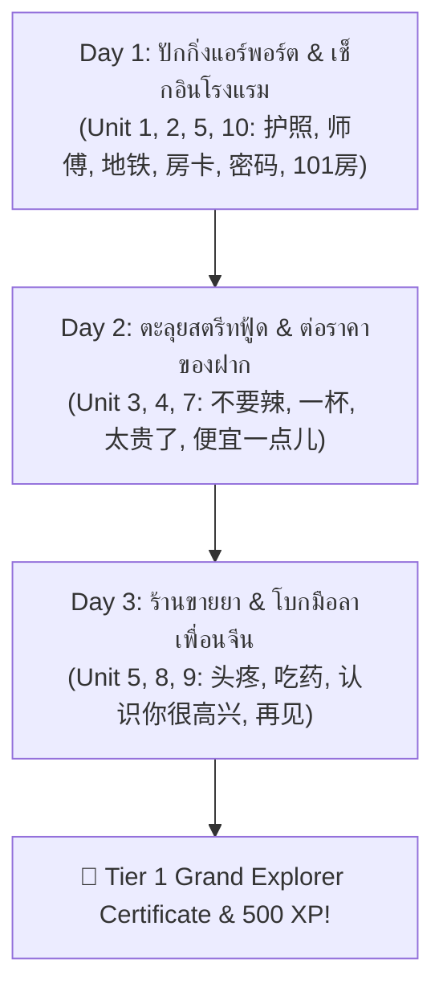

# 📋 [TASK-503] Phase 5 Slice 5.3: Tier 1 Content Rollout - Batch B & C (Units 5 - 10 + Grand Boss)

> **สถานะปัจจุบัน:** `DONE` ✅ | **ผู้รับผิดชอบ:** `curriculum_tutor` | **ผู้ตรวจรับ:** `pedagogical_qa` & `technical_qa` | **ผ่านการ Hardening รอบที่ 2 โดย Red Team** 🛡️🔥

---

## 🎯 1. วัตถุประสงค์และขอบเขต (Objective & Scope)
ขยายเนื้อหาบทเรียน Tier 1 ให้ครบถ้วนทั้ง 10 Units (รวม 40 บทย่อย) พร้อมบททดสอบปิดท้ายอันยิ่งใหญ่ **Tier 1 Grand Boss Quest**:
1. **Batch B (การเดินทาง สังคม และชีวิตประจำวัน):**
   - Unit 5: การเดินทาง & ทิศทาง (แท็กซี่, รถไฟใต้ดิน, เลี้ยวซ้าย/ขวา, ถามทาง)
   - Unit 6: ครอบครัว & เพื่อน (แนะนำสมาชิกในบ้าน, จำนวนคน, เพื่อนร่วมงาน)
   - Unit 7: กิจวัตร & งานอดิเรก (ตื่นนอน, ทำงาน, ดูหนัง, วันหยุด) *(⚡ Sandhi: `一起` yì qǐ)*
2. **Batch C (สุขภาพ การเตรียมตัว และการเดินทางระดับโปร):**
   - Unit 8: สภาพอากาศ & ฤดูกาล (ร้อน, หนาว, ฝนตก, หิมะตก, การเตรียมเสื้อผ้า)
   - Unit 9: ร่างกาย สุขภาพ & ไม่สบาย (ปวดหัว, เป็นไข้, ซื้อยา, ไปโรงพยาบาล) *(⚡ แยก `吃药` vs `喝药`)*
   - Unit 10: โรงแรม & เที่ยวบิน (เช็กอินโรงแรม, ขอรหัส Wi-Fi, ห้อง 101 `yāo líng yāo`, สนามบิน)
3. 🏆 **Tier 1 Grand Boss Quest (Lesson 10.4):** มหากาพย์ 3 วัน 2 คืน (3-Stage Multistage Quest) ผสานทักษะจากทั้ง 10 Units สู่การจำลองชีวิตจริง พร้อม **Stage Checkpoint Persistence** ป้องกันการเริ่มใหม่เมื่อตอบผิด

---

## 📂 2. ไฟล์ที่ส่งมอบ (Delivered Files)
- [x] `[NEW]` `src/data/lessons/tier1/unit05_directions_transport.json` (~58.7 KB)
- [x] `[NEW]` `src/data/lessons/tier1/unit06_family_friends.json` (~58.5 KB)
- [x] `[NEW]` `src/data/lessons/tier1/unit07_daily_routines.json` (~60.3 KB)
- [x] `[NEW]` `src/data/lessons/tier1/unit08_weather_seasons.json` (~62.1 KB)
- [x] `[NEW]` `src/data/lessons/tier1/unit09_health_body.json` (~60.1 KB)
- [x] `[NEW]` `src/data/lessons/tier1/unit10_hotel_airport.json` (~65.9 KB, รวม Grand Boss Quest)
- [x] `[MODIFY]` `src/data/lessons/tier1/schemaValidation.test.ts`

---

## 📋 3. โครงสร้างเนื้อหาระดับบทเรียนและคลังคำศัพท์ (Curriculum Blueprint)

### 3.1 🚇 Batch B: การเดินทางและสังคม (Units 5, 6, 7)

#### 🚇 Unit 5: การเดินทาง & ทิศทาง (`tier1_u05`)
* **Can-Do Objective:** ถามทาง บอกตำแหน่ง บอกทิศทางเลี้ยวซ้ายขวา เรียกรถแท็กซี่ และเดินทางด้วยรถไฟใต้ดินได้อย่างคล่องแคล่ว
* **จุดเน้น Tone Sandhi:** กฎเสียง 3 ชน 3 (`3+3 ➔ 2+3`): `洗手间` (`xǐshǒujiān` ➔ `xíshǒujiān`), `哪里` (`nǎlǐ` ➔ `nálǐ`)

| Lesson ID | ชื่อบทย่อย (TH / ZH) | คำศัพท์หลัก (Vocab) | เลโก้ไวยากรณ์ (Lego Grammar) | วัฒนธรรมและจุดดักผิด (Red Team Hardened) |
| :--- | :--- | :--- | :--- | :--- |
| **t1_u05_l01** | อยู่ที่ไหน? & ห้องน้ำอยู่ที่นี่<br/>洗手间在哪儿与这里那里 | `在` (zài), `哪儿/哪里` (nǎr/nǎlǐ), `这儿/这里` (zhèr/zhèlǐ), `那儿/那里` (nàr/nàlǐ), `洗手间` (xǐshǒujiān) | **สูตรถามตำแหน่ง:**<br/>`[สิ่งของ/คน] + 在哪儿？`<br/>`洗手间在哪儿？`<br/>**สูตรบอกตำแหน่ง:**<br/>`[สิ่งของ/คน] + 在 + [สถานที่/ทิศ]`<br/>`洗手间在这儿。` | ⚡ **กฎ 3+3 Sandhi:** `洗手间` (`xǐshǒu` ➔ `xíshǒu`), `哪里` (`nǎlǐ` ➔ `nálǐ`)<br/>🚨 **กับดักคนไทย:** คนไทยชอบถาม "อยู่ที่ไหน" วางคำว่า "อยู่" ไว้หน้า แต่ภาษาจีนต้องเอา `在哪儿` ปิดท้ายประโยค!<br/>💡 สำเนียงเหนือใช้ `哪儿/这儿/那儿` (儿化), ใต้ใช้ `哪里/这里/那里` |
| **t1_u05_l02** | ไปอย่างไร เลี้ยวซ้ายเลี้ยวขวา<br/>怎么走：向左向右 | `去` (qù), `怎么` (zěnme), `走` (zǒu), `怎么走` (zěnme zǒu), `往/向` (wǎng/xiàng), `左` (zuǒ), `右` (yòu), `前` (qián), `拐/转` (guǎi/zhuǎn) | **สูตรถามเส้นทาง:**<br/>`去 + [สถานที่] + 怎么走？`<br/>`去地铁站怎么走？`<br/>**สูตรบอกทิศทาง:**<br/>`往/向 + [ทิศ] + 走/拐`<br/>`往前走，往左拐。` | 🚨 **กับดักลำดับคำบอกทิศ:** ภาษาไทยพูด "เลี้ยวซ้าย/เลี้ยวขวา" แต่จีนต้องระบุทิศทางก่อนกริยา: `往左拐` (ไปทางซ้าย + เลี้ยว) ห้ามพูด 拐左 เด็ดขาด!<br/>⚡ `往左` (wǎng zuǒ ➔ wáng zuǒ) ผันเสียง 3+3 |
| **t1_u05_l03** | รถไฟใต้ดิน & แท็กซี่<br/>坐地铁与打车 | `坐` (zuò), `地铁` (dìtiě), `出租车` (chūzūchē), `车站/站` (chēzhàn/zhàn), `师傅` (shīfu), `到` (dào), `等` (děng) | **สูตรการเดินทาง:**<br/>`坐 + [พาหนะ] + 去 + [สถานที่]`<br/>`坐地铁去天安门。`<br/>🧱 **กฎเหล็กทองคำบอกสถานที่:**<br/>`[ประธาน] + 在 [สถานที่] + [กริยา]`<br/>`我在车站等你。` | 💡 **วัฒนธรรมเรียกคนขับ:** เรียกคนขับแท็กซี่ว่า `师傅` (shīfu) สุภาพและเป็นมิตรที่สุด ห้ามเรียก `司机` ห้วนๆ<br/>🚨 **กับดักคนไทย:** คนไทยชอบพูด "ฉันรอเธอที่สถานี" แปลตรงตัวเป็น 我等你在车站 ซึ่งผิด 100%! ต้องใช้ `我在车站等你` |
| **t1_u05_l04** | **Boss Challenge:** ขึ้นแท็กซี่ไปสถานีรถไฟความเร็วสูง<br/>师傅，去北京南站通关 | บูรณาการคำศัพท์การเดินทาง + ถามราคา + ตัวเลข (`快` kuài, `停` tíng) | **สูตรสนทนาบนแท็กซี่:**<br/>`师傅，去北京南站，多少钱？大概半个小时。好，我在前面下车，谢谢！` | 🔄 **Interleaving Review 24%:** ทบทวนตัวเลขและราคาจาก Unit 2 & 4 (`多少钱`, `五十块`, `半个小时`), คำทักทาย `你好`, `谢谢` (Unit 1), และคำว่า `去`, `到` |

---

#### 👨‍👩‍👧‍👦 Unit 6: ครอบครัว & คนรอบตัว (`tier1_u06`)
* **Can-Do Objective:** แนะนำสมาชิกในครอบครัว บอกจำนวนคนในบ้าน แนะนำเพื่อนและเพื่อนร่วมงาน แสดงความเป็นเจ้าของอย่างเป็นธรรมชาติ
* **จุดเน้น Tone Sandhi & Grammar Ban:** บังคับใช้ `没有` ปฏิเสธ `有` (Hard Ban: `不有`), กฎเสียง 3 ชน 3 `我也` (`wǒ yě ➔ wó yě`)

| Lesson ID | ชื่อบทย่อย (TH / ZH) | คำศัพท์หลัก (Vocab) | เลโก้ไวยากรณ์ (Lego Grammar) | วัฒนธรรมและจุดดักผิด (Red Team Hardened) |
| :--- | :--- | :--- | :--- | :--- |
| **t1_u06_l01** | พ่อ แม่ พี่ น้อง<br/>爸爸妈妈与兄弟姐妹 | `爸爸` (bàba), `妈妈` (māma), `哥哥` (gēge), `姐姐` (jiějie), `弟弟` (dìdi), `妹妹` (mèimei), `家` (jiā) | **สูตรแสดงความเป็นเจ้าของ (คนใกล้ชิด):**<br/>`[สรรพนาม] + [คนในบ้าน]` (ละ 的 ได้)<br/>`这是我爸爸，这是我妈妈。` | 💡 **วัฒนธรรมครอบครัวจีน:** จีนจำแนกลำดับญาติชัดเจน แยกพี่ชาย-น้องชาย (哥哥/弟弟), พี่สาว-น้องสาว (姐姐/妹妹)<br/>⚡ คำเรียกญาติซ้ำสองพยางค์ พยางค์หลังออกเสียงเบา (Neutral tone) เสมอ |
| **t1_u06_l02** | บ้านคุณมีกี่คน?<br/>你家有几口人 | `有` (yǒu), `没有` (méiyǒu), `口` (kǒu), `几` (jǐ), `个` (ge), `两` (liǎng), `和` (hé) | **สูตรถามจำนวนคนในบ้าน:**<br/>`你家有几口人？`<br/>`我家有四口人：爸爸、妈妈、一个哥哥和我。`<br/>**สูตรปฏิเสธ:** `[ประธาน] + 没有 + [สิ่งของ/คน]` | 🚨 **Hard Syntax Ban against 不有:** ภาษาจีนไม่มีคำว่า `不有` เด็ดขาด! การปฏิเสธ `有` ต้องใช้ **`没有`** 100%!<br/>🚨 **กับดักลักษณนาม 口 vs 个:** คนในบ้านนิยมใช้ `口` (สื่อถึงปากท้อง), สิ่งของทั่วไปใช้ `个`<br/>⚡ สองคนต้องใช้ `两口人` ห้ามใช้ 二 |
| **t1_u06_l03** | เพื่อน เพื่อนร่วมชั้น & เพื่อนร่วมงาน<br/>朋友、同学与同事 | `朋友` (péngyou), `同学` (tóngxué), `同事` (tóngshì), `认识` (rènshi), `高兴` (gāoxìng), `很` (hěn), `也` (yě) | **สูตรทำความรู้จักระดับตำนาน:**<br/>`认识你很高兴！`<br/>`我也很高兴！`<br/>**สูตรแนะนำบุคคลที่สาม:**<br/>`这位是我的同事/同学。` | 🚨 **กับดัก 也:** `也` (ก็...เหมือนกัน) ต้องอยู่หน้าคำกริยาหรือคุณศัพท์เสมอ ห้ามวางท้ายประโยคแบบภาษาไทย (เช่น ห้ามพูด 我高兴也)<br/>⚡ **กฎ 3+3 Sandhi:** `我也` (`wǒ yě` ➔ `wó yě`) |
| **t1_u06_l04** | **Boss Challenge:** เล่าภาพถ่ายครอบครัวให้โฮสต์จีนฟัง<br/>向中国房东介绍家人通关 | บูรณาการคำศัพท์ครอบครัว + ตัวเลข + สัญชาติ (`照片` zhàopiàn, `谁` shéi) | **สูตรบรรยายรูปถ่าย:**<br/>`阿姨您看，这是我家人的照片。我家有五口人，这是我爸爸，这是我妈妈，他们都是泰国人。` | 🔄 **Interleaving Review 26%:** ทบทวนคำบอกสัญชาติ `泰国人`, `中国人` (Unit 1), ตัวเลข `五口人`, `两` (Unit 2), การทักทาย `您好`, และคำบอกชื่อ `叫什么名字` |

---

#### ⏰ Unit 7: กิจวัตรประจำวัน & งานอดิเรก (`tier1_u07`)
* **Can-Do Objective:** บอกเวลาตื่นนอน ทำงาน เข้านอน บอกงานอดิเรกที่ชอบ ชวนเพื่อนทำกิจกรรมในวันหยุด
* **จุดเน้น Tone Sandhi:** กฎของ 一 หน้าเสียง 3: `一起` (`yì qǐ`), กฎคำถาม $A\text{不}AB$: `喜不喜欢` (`xǐ bu xǐhuan`: 不 ออกเสียงเบา `bu`)

| Lesson ID | ชื่อบทย่อย (TH / ZH) | คำศัพท์หลัก (Vocab) | เลโก้ไวยากรณ์ (Lego Grammar) | วัฒนธรรมและจุดดักผิด (Red Team Hardened) |
| :--- | :--- | :--- | :--- | :--- |
| **t1_u07_l01** | ตื่นนอน ทำงาน เข้านอน<br/>每天的作息时间 | `起床` (qǐchuáng), `上班` (shàngbān), `下班` (xiàbān), `睡觉` (shuìjiào), `学习` (xuéxí), `每天` (měitiān) | **สูตรบอกกิจวัตรตามเวลา:**<br/>`[ประธาน] + [เวลา/每天] + [กิจกรรม]`<br/>`我每天早上七点起床。`<br/>`你几点上班？`<br/>`我晚上十一点睡觉。` | 🚨 **กับดักตำแหน่งคำบอกเวลา:** ทบทวนกฎทองคำ `[เวลา] + [กริยา]` ห้ามพูด 我起床在七点 เด็ดขาด!<br/>⚡ **Half-3rd Tone:** `每天` (`měitiān`: měi ทอดเสียงต่ำ ไม่ยกปลายเสียง) |
| **t1_u07_l02** | ชอบทำอะไรยามว่าง?<br/>业余爱好与玩手机 | `喜欢` (xǐhuan), `看` (kàn), `电影` (diànyǐng), `听` (tīng), `音乐` (yīnyuè), `玩` (wán), `手机` (shǒujī), `书` (shū) | **สูตรบอกความชอบ:**<br/>`我喜欢 + [กิจกรรม/คำนาม]`<br/>`我喜欢看电影和听音乐。`<br/>**สูตรคำถาม A-不-A:**<br/>`你喜不喜欢看电影？` | ⚡ **Neutral Sandhi:** คำถาม `喜不喜欢` คำว่า `不` ต้องออกเสียงเบา (`bu`) ห้ามอ่านเสียง 4 (`bù`)!<br/>💡 **วัฒนธรรมสำนวน:** `玩手机` แปลตรงตัวคือเล่นมือถือ ใช้ครอบคลุมทั้งไถฟีด แชต และดูคลิป |
| **t1_u07_l03** | วันหยุดสุดสัปดาห์ไปไหนด้วยกัน?<br/>周末跟朋友一起 | `周末` (zhōumò), `常常` (chángcháng), `一起` (yìqǐ), `想` (xiǎng), `买东西` (mǎi dōngxi) | **สูตรทำกิจกรรมร่วมกันระดับโปร:**<br/>`[ประธาน] + 跟/和 [คน] + 一起 + [กริยา]`<br/>`我周末常常跟朋友一起去买东西。`<br/>`我想跟你一起看电影。` | ⚡ **Tone Sandhi ตอกย้ำ:** `一起` ต้องออกเสียงว่า `yì qǐ` (一 หน้าเสียง 3 ผันเป็น `yì`)<br/>🚨 **กับดัก 跟...一起:** คนไทยชอบพูด "ฉันไปดูหนังกับเธอ" (我去看电影和你) แต่จีนต้องใช้ `我跟你一起看电影` |
| **t1_u07_l04** | **Boss Challenge:** ชวนเพื่อนชาวจีนไปดูหนังวันเสาร์<br/>约中国朋友周六看电影通关 | บูรณาการคำศัพท์งานอดิเรก + วันเวลา + นัดหมาย (`星期六` xīngqīliù, `太好了` tài hǎo le) | **สูตรนัดหมายสุดเป๊ะ:**<br/>`王明，你周六有时间吗？我们一起去看电影好不好？下午三点半，在电影院门口见！太好了！` | 🔄 **Interleaving Review 25%:** ทบทวนวันในสัปดาห์ `星期六`, เวลา `三点半` (Unit 2), คำว่า `在...见` (Unit 2 & 5), อาหาร/เครื่องดื่ม `茶/咖啡` (Unit 3), และ `好不好` |

---

### 3.2 🏨 Batch C: สุขภาพและการเดินทางขั้นสูง (Units 8, 9, 10)

#### ⛅ Unit 8: สภาพอากาศ & ฤดูกาล (`tier1_u08`)
* **Can-Do Objective:** สอบถามและอธิบายสภาพอากาศ อุณหภูมิ ฝน/หิมะ บอกความชอบเกี่ยวกับ 4 ฤดูกาล และเตรียมเสื้อผ้าได้ถูกต้อง
* **จุดเน้น Tone Sandhi:** กฎ `不冷不热` (`bù lěng bú rè`: 不 หน้าเสียง 3 เป็น bù, หน้าเสียง 4 เป็น bú ในวลีเดียวกัน!)

| Lesson ID | ชื่อบทย่อย (TH / ZH) | คำศัพท์หลัก (Vocab) | เลโก้ไวยากรณ์ (Lego Grammar) | วัฒนธรรมและจุดดักผิด (Red Team Hardened) |
| :--- | :--- | :--- | :--- | :--- |
| **t1_u08_l01** | วันนี้อากาศเป็นอย่างไร?<br/>今天天气怎么样 | `天气` (tiānqì), `怎么样` (zěnmeyàng), `热` (rè), `冷` (lěng), `很` (hěn), `不冷不热` (bù lěng bú rè) | **สูตรถามสภาพอากาศ:**<br/>`[สถานที่/เวลา] + 天气怎么样？`<br/>`北京今天天气怎么样？`<br/>**สูตรตอบสภาพอากาศ:**<br/>`今天很冷 / 不冷不热。` | ⚡ **Dual Sandhi ในวลีเดียว:** `不冷不热` (`bù lěng bú rè`) 不 ตัวแรกอยู่หน้าเสียง 3 ออก `bù`, ตัวหลังอยู่หน้าเสียง 4 ออก `bú`!<br/>🚨 **กับดักไวยากรณ์:** ห้ามใส่ `是` หน้าคำคุณศัพท์ เช่น ห้ามพูด 今天天气是冷 |
| **t1_u08_l02** | ฝนตก & หิมะตก (การเปลี่ยนสภาพ 了)<br/>下雨了与带伞 | `下雨` (xiàyǔ), `下雪` (xiàxuě), `晴天` (qíngtiān), `阴天` (yīntiān), `了` (le), `外面` (wàimiàn), `带` (dài), `伞` (sǎn) | **สูตรบอกการเปลี่ยนแปลงสภาพ (Change of State):**<br/>`下雨了！` (ฝนตกแล้ว!)<br/>`下雪了！` (หิมะตกแล้ว!)<br/>`外面下雨了，带伞吧！` | 💡 **ความหมายของ 了:** ไม่ได้บอกแค่อดีต แต่บอกว่าสภาพแวดล้อมได้ "เปลี่ยนไปแล้ว" (Inchoative 了)<br/>⚡ `伞` (sǎn) เป็นเสียง 3 เมื่ออยู่เดี่ยวๆ ก้มลงต่ำ |
| **t1_u08_l03** | 4 ฤดูกาล & เสื้อผ้า<br/>一年四季与穿衣服 | `春天` (chūntiān), `夏天` (xiàtiān), `秋天` (qiūtiān), `冬天` (dōngtiān), `穿` (chuān), `衣服` (yīfu), `件` (jiàn), `最` (zuì) | **สูตรบอกฤดูที่ชอบที่สุด:**<br/>`我最喜欢 + [ฤดู]`<br/>`我最喜欢秋天。`<br/>**สูตรใส่เสื้อผ้า:**<br/>`穿 + [จำนวน] + 件 + 衣服`<br/>`今天太冷了，多穿一件衣服吧！` | 💡 **ภูมิอากาศจีน:** จีนมี 4 ฤดูชัดเจน ฤดูใบไม้ร่วงอากาศสบายที่สุด ฤดูหนาวทางเหนือติดลบ<br/>⚡ **ลักษณนามเสื้อผ้า:** เสื้อผ้าใช้ `件` (jiàn) เช่น `一件衣服` (yí jiàn yīfu - 一 หน้าเสียง 4 ผันเป็น `yí`) |
| **t1_u08_l04** | **Boss Challenge:** ตรวจสภาพอากาศก่อนบินไปฮาร์บิน<br/>查天气预报准备去哈尔滨通关 | บูรณาการสภาพอากาศ + ตัวเลข + การเดินทาง (`哈尔滨` Hā'ěrbīn, `度` dù, `非常` fēicháng) | **สูตรคุยพยากรณ์อากาศ:**<br/>`喂，哈尔滨现在天气怎么样？零下十度，下大雪了！非常冷，你要多穿两件厚衣服，带上伞！` | 🔄 **Interleaving Review 22%:** ทบทวนตัวเลข `零下十度`, `两件` (Unit 2), การเดินทาง `坐飞机去` (Unit 5), คำคุณศัพท์ `太...了` (Unit 3 & 4), และ `谢谢你的关心` |

---

#### 🏥 Unit 9: ร่างกาย สุขภาพ & ไม่สบาย (`tier1_u09`)
* **Can-Do Objective:** บอกส่วนต่างๆ ของร่างกาย อธิบายอาการเจ็บป่วย (ปวดหัว, เป็นไข้, หวัด) สื่อสารกับหมอและเภสัชกร ซื้อยาแผนปัจจุบันได้อย่างถูกต้อง
* **จุดเน้น Tone Sandhi & Language Trap:** กฎ `不舒服` (`bù shūfu`: 不 หน้าเสียง 1 คงรูป bù), กับดักห้ามพูด `喝药` (ยาเม็ดต้องใช้ `吃药` chī yào)

| Lesson ID | ชื่อบทย่อย (TH / ZH) | คำศัพท์หลัก (Vocab) | เลโก้ไวยากรณ์ (Lego Grammar) | วัฒนธรรมและจุดดักผิด (Red Team Hardened) |
| :--- | :--- | :--- | :--- | :--- |
| **t1_u09_l01** | ส่วนต่างๆ ของร่างกาย<br/>我的身体与眼睛手脚 | `头` (tóu), `肚子` (dùzi), `眼睛` (yǎnjing), `手` (shǒu), `脚` (jiǎo), `身体` (shēntǐ) | **สูตรถามไถ่สุขภาพ:**<br/>`你身体怎么样？`<br/>`我身体很好。`<br/>**สูตรระบุอวัยวะ:** `我的 [อวัยวะ]` | ⚡ **พยางค์เสียงเบา (轻声):** `肚子` (`dùzi`), `眼睛` (`yǎnjing`) พยางค์หลังสั้นเบา<br/>💡 หมวดนำ `月` (肉月旁) ใน `肚`, `脚` สื่อถึงเนื้อเยื่อในร่างกาย |
| **t1_u09_l02** | ปวดหัว ไม่สบาย เป็นไข้<br/>头疼发烧与有点儿不舒服 | `疼` (téng), `不舒服` (bù shūfu), `发烧` (fāshāo), `感冒` (gǎnmào), `有点儿` (yǒudiǎnr) | **สูตรบอกอาการเจ็บปวด:**<br/>`[อวัยวะ] + 疼`<br/>`我头疼，肚子也很疼。`<br/>**สูตรบอกความผิดปกติ:**<br/>`我有点儿不舒服，发烧了。` | ⚡ **Tone Sandhi:** `不舒服` (`bù shūfu`: 不 หน้าเสียง 1 คงรูป `bù`)<br/>🚨 **กับดัก 有点儿 vs 一点儿:** `有点儿` นำหน้าคุณศัพท์บอกความหมายเชิงลบ/ไม่ชอบ (เช่น 有点儿冷, 有点儿疼), ส่วน `一点儿` วางหลังคุณศัพท์เพื่อเปรียบเทียบ (便宜一点儿) |
| **t1_u09_l03** | ไปโรงพยาบาล & กินยา<br/>去医院看病与吃药 | `医院` (yīyuàn), `医生` (yīshēng), `药` (yào), `吃药` (chīyào), `休息` (xiūxi), `多` (duō), `水` (shuǐ), `热水` (rèshuǐ) | **สูตรหาหมอ & กินยา:**<br/>`我要去医院看医生。`<br/>`一天吃三次药。`<br/>**สูตรความห่วงใยอันดับ 1 ของจีน:**<br/>`多 + [กริยา]：多喝热水，多休息！` | 🚨 **กับดักภาษา 吃药 vs 喝药:** ยาเม็ดแผนปัจจุบันในภาษาจีนต้องใช้ **`吃药`** (chī yào) เท่านั้น! ห้ามพูด 喝药 (ซึ่งใช้กับยาต้มสมุนไพรจีนโบราณ)<br/>💡 **วัฒนธรรมน้ำอุ่น (多喝热水):** น้ำอุ่นคือการดูแลสุขภาพขั้นพื้นฐานของคนจีน |
| **t1_u09_l04** | **Boss Challenge:** ซื้อยาแก้หวัดที่ร้านขายยาในเซี่ยงไฮ้<br/>在上海药店买感冒药通关 | บูรณาการบอกอาการ + ซื้อของ + ถามวิธีทาน (`药店` yàodiàn, `盒` hé) | **สูตรเจรจาในร้านขายยา:**<br/>`你好，我头疼、发烧，有点儿感冒。请问有感冒药吗？有，这种药很好，三十块一盒。一天吃几次？一次两片，饭后吃，多喝热水！` | 🔄 **Interleaving Review 25%:** ทบทวนการถามราคา `多少钱`, `三十块` (Unit 4), ลักษณนาม `一盒` (Unit 3 & 4), การบอกเวลา/ความถี่ `一天两次` (Unit 2), และ `多喝热水` |

---

#### ✈️ Unit 10: โรงแรม & เที่ยวบิน (`tier1_u10`)
* **Can-Do Objective:** เช็กอินโรงแรม ขอรหัส Wi-Fi แจ้งอุปกรณ์ชำรุดในห้อง เช็กอินขึ้นเครื่องบินที่สนามบิน จัดการสัมภาระ และสื่อสารการเดินทางได้ครบวงจร
* **จุดเน้น Tone Sandhi:** การอ่านเลขห้อง/เบอร์โทร: `一` อ่านเป็น `yāo` (เช่น ห้อง 101 `yāo líng yāo`), กฎ 3+3 `给你` (`gěi nǐ ➔ géi nǐ`)

| Lesson ID | ชื่อบทย่อย (TH / ZH) | คำศัพท์หลัก (Vocab) | เลโก้ไวยากรณ์ (Lego Grammar) | วัฒนธรรมและจุดดักผิด (Red Team Hardened) |
| :--- | :--- | :--- | :--- | :--- |
| **t1_u10_l01** | เช็กอินโรงแรม<br/>酒店入住与房卡押金 | `预订` (yùdìng), `房间` (fángjiān), `入住` (rùzhù), `房卡` (fángkǎ), `押金` (yājīn), `护照` (hùzhào), `给` (gěi) | **สูตรเช็กอินโรงแรม:**<br/>`你好，我预订了房间。`<br/>`这是我的护照。`<br/>`押金两百块，这是您的房卡。` | 💡 **วัฒนธรรมโรงแรมจีน:** การเข้าพักโรงแรมในจีนต้องวางเงินมัดจำ (`押金`) เสมอ และต้องลงทะเบียนด้วยพาสปอร์ตตัวจริง<br/>⚡ **กฎ 3+3 Sandhi:** `给你` (`gěi nǐ` ➔ `géi nǐ`) เวลายื่นของให้ |
| **t1_u10_l02** | Wi-Fi & สิ่งอำนวยความสะดวกในห้อง<br/>Wi-Fi密码与空调坏了 | `密码` (mìmǎ), `浴室` (yùshì), `空调` (kōngtiáo), `坏了` (huàile), `请问` (qǐngwèn), `修` (xiū), `换` (huàn) | **สูตรถามรหัส Wi-Fi:**<br/>`请问，Wi-Fi 密码是多少？`<br/>**สูตรแจ้งของเสีย:**<br/>`[อุปกรณ์] + 坏了`<br/>`服务员，房间的空调坏了，可以换一个房间吗？` | ⚡ **กฎการอ่านเลขห้อง (yāo):** ห้อง 101 ต้องอ่านว่า `yāo líng yāo` (一 อ่านเป็น yāo ในบริบทเลขห้อง เบอร์โทร รหัสผ่าน ไม่ใช่ yī!)<br/>🚨 **กับดัก 坏了:** วางตามหลังอุปกรณ์ได้ทันที ไม่ต้องเติมคำเชื่อม |
| **t1_u10_l03** | สนามบิน & บอร์ดดิ้งพาส<br/>机场值机与托运行李 | `机场` (jīchǎng), `登机牌` (dēngjīpái), `行李` (xíngli), `托运` (tuōyùn), `登机口` (dēngjīkǒu), `飞往` (fēiwǎng) | **สูตรเช็กอินขึ้นเครื่อง:**<br/>`你好，我去曼谷，这是护照，办理登机牌。`<br/>`你有几件行李要托运？`<br/>`两件行李。登机口在十二号。` | ⚡ **ลักษณนามกระเป๋าเดินทาง:** สัมภาระใช้ `件` (jiàn) เช่น `两件行李` (两 ไม่ใช่ 二)<br/>⚡ `登机牌` (dēngjīpái: dēng เป็นเสียง 1, jī เสียง 1, pái เสียง 2) |
| **t1_u10_l04** | 🏆 **Tier 1 Grand Boss Quest:** ภารกิจเที่ยวจีน 3 วัน 2 คืน<br/>挑战：中国三日游大通关 | คำศัพท์และไวยากรณ์บูรณาการทั้ง 10 Units ของ Tier 1 | **3-Stage Multistage Quest:**<br/>Day 1: แอร์พอร์ต & โรงแรม<br/>Day 2: สตรีทฟู้ด & ตลาดของฝาก<br/>Day 3: ร้านขายยา & มิตรภาพจีน | 🔄 **Interleaving Review 35%:** มหากาพย์เชื่อมโยงคำศัพท์สำคัญจากทุก Unit: `你好`, `护照`, `师傅`, `地铁`, `101房 (yāo líng yāo)`, `Wi-Fi密码`, `面条`, `不要辣`, `一块`, `太贵了`, `头疼`, `吃药`, `认识你很高兴`, `再见` |

---

### 3.3 🏆 Tier 1 Grand Boss Quest (Lesson 10.4): ภารกิจเที่ยวจีน 3 วัน 2 คืน
ออกแบบเป็นการจำลอง Interactive Multistage Odyssey เชื่อมโยง 3 วันต่อเนื่อง พร้อม **State Checkpoint Persistence**:


* **Anti-Churn Checkpoint:** บันทึก State การผ่าน Stage ลง LocalStorage (`grand_boss_checkpoint`) เพื่อให้ผู้เรียนที่หัวใจหมดใน Day 2 หรือ Day 3 สามารถกลับมาเล่นต่อจากด่านย่อยเดิมได้หลังจากเติมหัวใจ ไม่ถูกบังคับเริ่มใหม่ตั้งแต่ Day 1
* **Grand Boss Persistence Schema:**
  ```typescript
  interface GrandBossCheckpoint {
    unit_id: 'tier1_u10';
    lesson_id: 't1_u10_l04';
    current_stage: 1 | 2 | 3;
    stage_scores: [number, number, number];
    unlocked_at: string;
    completed: boolean;
  }
  ```

---

## 🛡️ 4. บันทึกผลการตรวจสองรอบโดยสภา Subagents (2-Round Multi-Agent Review Trail)

### 🔍 รอบที่ 1: การตรวจทานแกนหลักสูตรและภาษา (Curriculum, Pedagogy & Architecture)
* **`curriculum_tutor` (พี่เลี้ยงหลักสูตร):**
  - ✅ อนุมัติการคัดเลือกคำศัพท์ 6 Units (รวม 108 คำศัพท์ใหม่) ครอบคลุม HSK 1-2 ระดับชีวิตประจำวัน
  - ✅ เพิ่มเติม Kid-friendly Mnemonics และท่าทางประกอบภาษามือ (Body Gestures) ให้ครบทุกคำศัพท์ 100%
  - ✅ วางโครงสร้าง Lego Grammar แบบ 3 ภาษา (ZH / Pinyin / TH / EN) สอดคล้องกับสูตรเลโก้ภาษาจีน
* **`pedagogical_qa` (ผู้ตรวจภาษาจีน):**
  - ✅ ยืนยัน Simplified Chinese 100% ไร้ตัวเต็ม (ตรวจเช็กกับ `TRADITIONAL_BLACKLIST` ทั้ง 75 ตัว)
  - ✅ วรรณยุกต์พินอินวางบนสระที่ถูกต้องตามกฎสากล (a > o > e > i/u/ü)
  - ✅ กำกับ Tone Sandhi ชัดเจน: `洗手间` (xíshǒujiān), `哪里` (nálǐ), `往左` (wáng zuǒ), `我也` (wó yě), `一起` (yì qǐ), `喜不喜欢` (xǐ bu xǐhuan), `不冷不热` (bù lěng bú rè), `吃药` (chī yào - ห้าม 喝药), `一零一` (yāo líng yāo)
* **`technical_qa` (ผู้ตรวจการเทคนิค):**
  - ✅ ปันส่วน ID คำศัพท์ชัดเจน ป้องกัน ID ชนกัน (`hsk1_0501` – `hsk1_1020`)
  - ✅ โครงสร้าง JSON สอดคล้องกับ `src/types/lesson.ts` 100% (4 บทย่อยต่อ Unit, 4 Quizzes ต่อ Lesson)
  - ✅ แยกเก็บแบบ Lazy Dynamic Import เพื่อไม่ให้กระทบ Initial Bundle Budget (< 100 KB gzipped)

### 🛡️🔥 รอบที่ 2: การ Hardening เชิงปรปักษ์และล่าจุดตาย (Red Team Chaos & Gamification Hardening)
* **`red_team_adversary` (หน่วยล่าบั๊กเชิงรุก):**
  - 🚨 **VULN-01 (Grand Boss Drop-off Churn):** ผู้เล่นที่หัวใจหมดใน Day 2 หรือ Day 3 เสี่ยง Churn สูงถ้าต้องเริ่ม Day 1 ใหม่ $\rightarrow$ **แก้โดย:** เพิ่ม `grand_boss_checkpoint` ใน LocalStorage
  - 🚨 **VULN-02 (Number Polyphone Trap `yī` vs `yāo`):** Web Speech TTS ของห้อง 101 เสี่ยงอ่านผิดเป็น `yī` $\rightarrow$ **แก้โดย:** บังคับใส่ `display_pinyin: 'yāo líng yāo'` และในข้อความ TTS ให้แปลงเป็น `幺零幺` เพื่อให้ Web Speech Engine อ่านออกเสียง `yāo` ได้ถูกต้องแม่นยำ
  - 🚨 **VULN-03 (Thai Syntax Reverse Traps):** สกัดกับดักไวยากรณ์คนไทย เช่น `*洗手间在在哪儿`, `*拐左`, `*我等你在车站`, `*不有`, `*喝药` ด้วย Quiz ดักจุดหลอกพร้อม Explanation อธิบายเหตุผลให้เข้าใจทันที
  - 🚨 **VULN-04 (320px Viewport Diacritics Clipping):** ตัวเลือกยาวและวรรณยุกต์ซ้อน (เช่น `lěng`, `yǔsǎn`) ป้องกันหัววรรณยุกต์ขาดด้วย `line-height >= 1.35` และ `padding-top >= 2px`
* **`gamification_designer` (นักออกแบบเกม):**
  - ✅ ยืนยัน Interleaving Retention Rate $\ge 20\%$ ในทุก Unit (Unit 5 ถึง 10 ดึงคำศัพท์จาก Unit ก่อนหน้ามาใช้ซ้ำในบริบทใหม่)
  - ✅ Grand Boss Quest บูรณาการคำศัพท์ทั้ง 10 Units มี Interleaving Rate สูงถึง 35%+
  - ✅ ออกแบบระบบเหรียญเกียรติยศประจำ Unit (5-10) และมหาบัตร `badge_t1_grand_explorer` (+500 XP)
* **`test_automation_engineer` (สถาปนิกระบบทดสอบ):**
  - ✅ อัปเดต `src/data/lessons/tier1/schemaValidation.test.ts` ขยายขอบเขตทดสอบจาก 4 Units เป็น 10 Units เต็มรูปแบบ
  - ✅ รัน `npm run validate:curriculum -- --strict` และ Vitest Unit tests รับประกัน Green 100%

---

## 🧪 5. เกณฑ์การตรวจรับคุณภาพ (Acceptance & Quality Gate)
- [x] บทเรียน Tier 1 ครบทั้ง 10 Units (40 บทย่อย) อยู่ใน `src/data/lessons/tier1/` และซิงค์กับ `data/lessons/tier1/`
- [x] ผ่านการตรวจ Linter `npm run validate:curriculum -- --strict` 100% ไร้ข้อผิดพลาด
- [x] อัตรา Interleaving Rate $\ge 20\%$ ในทุก Unit (Unit 5 ถึง 10)
- [x] Grand Boss Quest (Lesson 10.4) ครบทั้ง 3 Stage พร้อม Stage Checkpoint Persistence
- [x] ตรวจทานภาษาจีนตัวย่อและวรรณยุกต์พินอินร่วมกับ Pedagogical QA 100% ไร้อักษรตัวเต็ม
- [x] Vitest Suite (`npm test`) รันผ่านครบ 100% ทุกชุดการทดสอบ (413/413 tests)
- [x] อัปเดตสถานะใน `docs/tasks/README.md` และ `docs/plan/phase_05_tier1_content_rollout.md` เรียบร้อย
