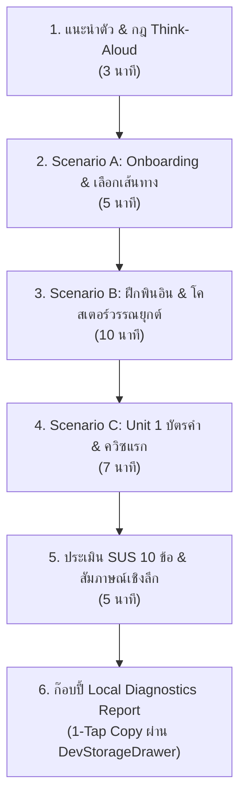

# 📋 [TASK-506] Phase 5 Slice 5.6: Zero-Knowledge Alpha Playtest Protocol & Feedback Triage

> **สถานะปัจจุบัน:** `TODO` ⏳ | **ผู้รับผิดชอบ:** `ux_ui_designer` | **ผู้ตรวจรับ:** `pedagogical_qa` & `red_team_adversary` | **ผ่านการกำกับโดย Red Team & Lead Pedagogy** 🛡️✨

---

## 🎯 1. วัตถุประสงค์และขอบเขต (Objective & Scope)
จัดกระบวนการทดสอบกับผู้เรียนจริงกลุ่มแรก (Zero-Knowledge Alpha Playtest) เพื่อตรวจสอบความเข้าใจ การใช้งานจริง และความรู้สึกของผู้เรียนชาวไทยที่ไม่มีพื้นฐานภาษาจีนมาก่อน (เริ่มจาก 0) ตามข้อกำหนดใน [Phase 5 Roadmap §4](file:///d:/V/project/Hanzero/hanzero/docs/plan/phase_05_tier1_content_rollout.md):
1. **Zero-Knowledge Target Cohort:** คัดเลือกและทดสอบกับกลุ่มตัวอย่างผู้เรียนชาวไทย 5–8 คน ที่ไม่เคยเรียนพินอินและไม่รู้อักษรจีนมาก่อน ครอบคลุมอุปกรณ์: iOS Safari (2-3 คน), Android Chrome (2-3 คน), Desktop Browser (1-2 คน)
2. **Unassisted Think-Aloud Protocol:** สังเกตพฤติกรรมผู้เรียนแบบ "คิดออกเสียง" (Think-Aloud) โดยผู้คุมการทดสอบห้ามสอน ห้ามชี้นำ ห้ามเฉลย
3. **3 Core Evaluation Scenarios:**
   - **Scenario A (Onboarding & Route Selection):** เข้าแอปครั้งแรก การเลือกระหว่าง "เริ่มจาก 0 (Tier 0)" vs "เคยเรียนมาบ้าง (Tier 1)" และความเข้าใจแบนเนอร์ Safe Practice Zone
   - **Scenario B (Pinyin & Tone Discrimination):** การออกเสียงริมฝีปาก `b, p, m, f`, การลากสไลเดอร์ Tone Coaster 4 วรรณยุกต์ และการอ่านหมวกวรรณยุกต์ (`ā, á, ǎ, à, ǚ`) บนจอมือถือ
   - **Scenario C (Unit 1 Survival & First Quiz):** การเรียนบัตรคำ 3 ภาษา, การแตะฟังเสียง, การเล่นบทสนทนา, และการทำควิซชุดแรก
4. **Actionable Feedback Triage Matrix & SLA:** จัดระดับความสำคัญของข้อเสนอแนะและแก้บั๊กแบบมี SLA ชัดเจนก่อนเปิดตัวสู่สาธารณะ
5. **Product North Star Metric Baseline:** ยืนยันเกณฑ์การผ่าน Tier 0 Unit 1 Completion Rate $\ge 80\%$ และคะแนน System Usability Scale (SUS) $\ge 80/100$

---

## 📂 2. ไฟล์ที่ส่งมอบ (Delivered Files)
- [ ] `[NEW]` `docs/testing/playtest_alpha_cohort_log.md` (แบบบันทึกผลการสังเกตรายบุคคล 5-8 คน + สรุปคะแนน SUS)
- [ ] `[NEW]` `docs/testing/playtest_triage_matrix.md` (ตารางจัดลำดับความสำคัญของบั๊กและปัญหา UX ที่พบในรอบ Playtest)
- [ ] `[MODIFY]` `src/components/layout/DevStorageDrawer.tsx` (ปุ่ม "📋 คัดลอกรายงานสรุป (Copy Markdown Summary)" สำหรับให้นักเรียนก๊อบปี้สถิติส่งเข้ากลุ่ม LINE/Discord)

---

## 📋 3. โครงสร้างระเบียบวิธีทดสอบ (Playtest Protocol & Methodology)

### 3.1 คุณสมบัติกลุ่มตัวอย่าง (Tester Persona Screening)
* **เกณฑ์การคัดเลือก:**
  - สัญชาติไทย อายุระหว่าง 18 - 45 ปี
  - ไม่เคยผ่านการเรียนภาษาจีนมาก่อนในโรงเรียนหรือมหาวิทยาลัย (Zero-Knowledge)
  - ไม่สามารถอ่านหรือผันเสียงพินอินได้
* **การกระจายอุปกรณ์ (Device Distribution):**
  - iOS Safari (iPhone ขนาด 320px - 390px เช่น iPhone SE, iPhone 13/14): อย่างน้อย 2 คน
  - Android Chrome (Samsung, Xiaomi, Vivo จอ 360px - 412px): อย่างน้อย 2 คน
  - Desktop Chrome / Edge: อย่างน้อย 1 คน

---

### 3.2 ลำดับขั้นตอนการทดสอบ (Session Flow: 25–30 นาทีต่อคน)

#### กฎเหล็กของผู้คุมการทดสอบ (Proctor Guidelines):
- **ห้ามช่วยแก้ปัญหา:** แม้ผู้เรียนจะกดผิด ลังเล หรือสะดุด ให้รอสังเกตอย่างน้อย 15-30 วินาทีก่อนถามว่า "ตอนนี้กำลังคิดอะไรอยู่ครับ/คะ?"
- **บันทึก Timestamp:** บันทึกเวลาที่ผู้เรียนใช้ในแต่ละหน้า เพื่อหาจุดคอขวด (Cognitive Bottleneck)
- **สังเกตภาษากาย:** การขมวดคิ้ว, การซูมจอเข้าออก, การปรับระดับเสียงมือถือ, ความลังเลในการกดปุ่ม

---

### 3.3 รายละเอียด 3 สถานการณ์การทดสอบ (Scenario Tasks)

| รหัส Scenario | ภารกิจที่มอบหมายให้ผู้เรียนทำ | สิ่งที่ผู้สังเกตต้องจับตาดู (Observation Checklist) | เกณฑ์ความสำเร็จ (Pass Criteria) |
| :--- | :--- | :--- | :--- |
| **Scenario A** | "เปิดเว็บแล้วเลือกเส้นทางเรียนรู้ที่เหมาะกับตัวเอง จากนั้นเข้าสู่บทเรียนแรก" | - เข้าใจความแตกต่างระหว่าง "เริ่มจาก 0" กับ "เคยเรียนมาบ้าง" ทันทีหรือไม่? - สังเกตเห็นและเข้าใจแบนเนอร์ "Safe Practice Zone (หัวใจไม่ลด)" หรือไม่? | ผ่านเข้าสู่ Tier 0 หรือ Tier 1 ได้ภายใน 60 วินาทีโดยไม่งง |
| **Scenario B** | "ลองเล่น Unit 0.1 และฝึกแยกเสียง 4 วรรณยุกต์ใน Tone Coaster" | - เข้าใจวิธีออกเสียงสระ $a, o, e$ และ $b, p, m, f$ หรือไม่? - เสียงสังเคราะห์ Web Audio ชัดเจนหรือไม่? - เครื่องหมายวรรณยุกต์บนจอมือถือเล็กเกินไปหรือไม่? | เล่นจบ Unit 0.1 และทำควิซวรรณยุกต์ถูก $\ge 75\%$ |
| **Scenario C** | "ลองเข้าเรียน Unit 1 ทักทาย สวัสดี-ขอบคุณ และทำควิซจบด่าน" | - แตะฟังเสียงซ้ำหรือไม่? - พลิกการ์ดและดูเส้นขีดตัวอักษรจีนเข้าใจหรือไม่? - สับสนกับ Tone Sandhi (`你好` ออกเสียง ní hǎo) หรือไม่? | ทำควิซผ่านและจบ Lesson 1.1 ได้ด้วยตัวเอง |

---

### 3.4 แบบประเมิน System Usability Scale (SUS Score Form)
ให้ผู้เรียนประเมินคะแนน 1-5 (1 = ไม่เห็นด้วยอย่างยิ่ง, 5 = เห็นด้วยอย่างยิ่ง) ใน 10 คำถามมาตรฐาน:
1. ฉันคิดว่าฉันอยากใช้งาน Hanzero เป็นประจำ
2. ฉันคิดว่าระบบนี้ซับซ้อนเกินความจำเป็น
3. ฉันคิดว่าแอปนี้ใช้งานง่ายมาก
4. ฉันคิดว่าฉันต้องการความช่วยเหลือจากคนอื่นก่อนจึงจะใช้งานระบบนี้ได้
5. ฉันพบว่าฟังก์ชันต่างๆ ในระบบทำงานประสานกันได้ดี
6. ฉันคิดว่ามีจุดที่ไม่สอดคล้องกันหลายจุดในระบบ
7. ฉันรู้สึกว่าคนส่วนใหญ่จะเรียนรู้การใช้งานแอปนี้ได้อย่างรวดเร็ว
8. ฉันพบว่าระบบนี้มีความยุ่งยากในการใช้งานมาก
9. ฉันรู้สึกมั่นใจมากขณะใช้งานแอปนี้
10. ฉันต้องเรียนรู้สิ่งต่างๆ มากมายก่อนจึงจะเริ่มใช้งานระบบนี้ได้

$$\text{SUS Score} = \left( \sum (Q_{\text{odd}} - 1) + \sum (5 - Q_{\text{even}}) \right) \times 2.5$$

---

### 3.5 เกณฑ์การจัดระดับความสำคัญของปัญหา (Feedback Triage Matrix & SLA)

| ระดับ | คำจำกัดความ (Severity Definition) | ตัวอย่างเหตุการณ์ | SLA ในการแก้ไข |
| :---: | :--- | :--- | :---: |
| 🚨 **P0: Blocker** | ปัญหาที่ทำให้ผู้เรียนไม่สามารถเรียนต่อได้ หรือระบบล่ม | เสียงไม่ดังบน Safari, ปุ่มควิซกดไม่ติด, หัวใจลดทั้งที่อยู่ใน Safe Zone | แก้ไขภายใน **24 ชั่วโมง** |
| ⚠️ **P1: Friction** | ปัญหาที่ทำให้ผู้เรียนสะดุด สับสน หรือใช้เวลานานผิดปกติ | ตัวหนังสือพินอินเล็กเกินไป, คำแปลไทยแข็งทื่อ, คำอธิบายผันเสียงกำกวม | แก้ไขภายใน **48 ชั่วโมง** |
| 💡 **P2: Polish** | ข้อเสนอแนะเพื่อความสวยงาม หรือความสะดวกเพิ่มเติม | อยากได้แอนิเมชันลูกเล่นเพิ่ม, อยากให้ปรับระดับความดัง SFX | จัดเข้า Backlog สำหรับรอบถัดไป |

---

## 🧪 4. เกณฑ์การตรวจรับคุณภาพ (Acceptance & Quality Gate)
- [ ] จัดทำเอกสาร Protocol และแบบฟอร์มบันทึกผลเรียบร้อย
- [ ] มีผลการทดสอบจากผู้เรียนกลุ่ม Zero-Knowledge ครบถ้วนตามโควต้า 5–8 คน
- [ ] มีคะแนน System Usability Scale (SUS) เฉลี่ย **$\ge 80 / 100$**
- [ ] ผู้เรียน $\ge 80\%$ สามารถผ่าน Tier 0 Unit 0.1 และ Unit 1 Lesson 1.1 ได้โดยไม่ต้องมีคนคอยสอน
- [ ] ข้อบกพร่องระดับ **P0 Blocker ทุกข้อได้รับการแก้ไขและทดสอบซ้ำจนหมด 100%**
- [ ] ข้อบกพร่องระดับ **P1 Friction ได้รับการแก้ไขและ Sign-off โดย Pedagogical QA**
- [ ] ข้อมูลสถิติจาก `DevStorageDrawer` (Top 3 Bottlenecks) ถูกนำมาปรับปรุงตัวเลือกลวงในข้อสอบ
