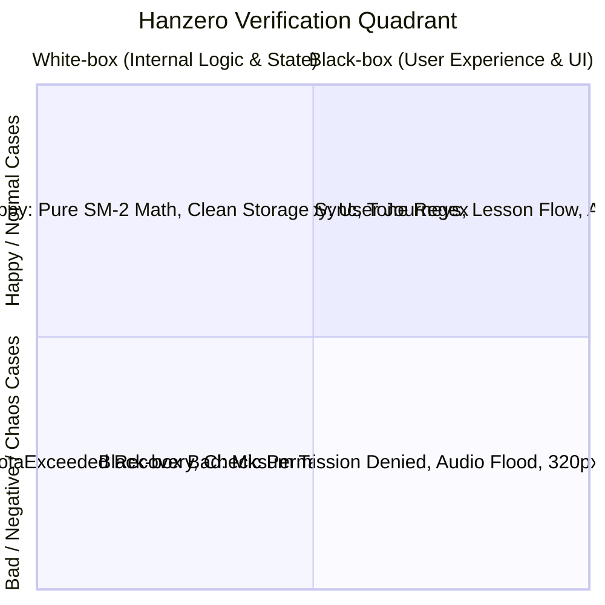

# 📋 Master Test Scenarios & Execution Matrix (`master_test_scenarios_matrix.md`)

ศูนย์รวมแม่บทแผนการทดสอบครอบคลุมทุกเหตุการณ์ (Comprehensive Test Case Specification) สำหรับแพลตฟอร์ม **Hanzero (ฮั่นซีโร่ 🐰)** จำแนกตามมิติการทดสอบ **White-box vs Black-box** ควบคู่กับ **Happy Case (ทางราบรื่น) vs Bad Case (เคสผิดพลาด/รับมือวิกฤต)** 

---

## 🧭 โครงสร้างมิติการทดสอบ (2x2 Testing Taxonomy)

* **White-box Testing:** ตรวจสอบโครงสร้างภายในโค้ด, Logic การคำนวณ, State Machine, การทำงานของ Storage Fallback, Exception Handling, และ Memory Cleanup
* **Black-box Testing:** ตรวจสอบพฤติกรรมจากมุมมองของผู้เรียนจริง, การคลิกปุ่ม, การแสดงผล UI, เสียงที่ได้ยิน, การรองรับหน้าจอมือถือ (Responsive), และความถูกต้องของหลักสูตรภาษาจีน
* **Happy Path (Positive):** การใช้งานตามปกติ ข้อมูลถูกต้อง สิทธิ์ครบถ้วน ระบบตอบสนองสมบูรณ์
* **Bad Path (Negative / Edge / Chaos):** ข้อมูลเสียหาย/ถูกแก้ไข, ผู้ใช้ปฏิเสธสิทธิ์ (Mic Denied), พื้นที่เต็ม, เน็ตหลุด, หรือการกดรัวถล่มระบบ

---

## 📂 ตารางแม่บทจำแนกรายโมดูล (Master Scenarios Table)

### หมวดที่ 1: ระบบต้อนรับและการเลือกเส้นทาง (Onboarding & Path Selection)

| Case ID | ชนิดการทดสอบ | ประเภทเส้นทาง | เหตุการณ์และสิ่งกระตุ้น (Trigger Condition) | ผลลัพธ์ที่ถูกต้องตามสเปก (Expected Outcome) | เครื่องมือทดสอบ | สถานะ |
| :--- | :---: | :---: | :--- | :--- | :---: | :---: |
| `TC-ONB-W01-HPY` | White-box | Happy | ผู้ใช้ใหม่เข้าสู่ระบบ `isFirstRun === true` | `useUserState` คืนค่า State ค่าเริ่มต้นครบถ้วน ไม่เป็น null หรือ undefined | Vitest | ✅ Automated |
| `TC-ONB-W02-BAD` | White-box | Bad | ข้อมูล User State ใน LocalStorage เสียหาย (JSON พัง) | ระบบตรวจจับ Parse Error และ Reset State กลับสู่ Default อย่างปลอดภัย ไม่เกิดจอขาว | Vitest | ✅ Automated |
| `TC-ONB-B01-HPY` | Black-box | Happy | ผู้ใช้ใหม่กดเลือก "เริ่มจาก 0 ไม่เคยเรียนจีนมาก่อน" | Welcome Modal ปิดลง นำทางผู้ใช้เข้าสู่ Tier 0 Unit 0.1 ด่านแรกทันที | Playwright | 📋 Planned Phase 5 |
| `TC-ONB-B02-HPY` | Black-box | Happy | ผู้ใช้กดเลือก "พอรู้พินอินแล้ว ข้ามไปบทสนทนา" | ปลดล็อกสถานะ Tier 0 ทั้งหมด และนำทางเข้าสู่ Tier 1 Unit 1.1 ทันที | Playwright | 📋 Planned Phase 5 |
| `TC-ONB-B03-BAD` | Black-box | Bad | ผู้ใช้กดสลับหน้าจอกลับไปกลับมาระหว่าง Modal กำลังเรนเดอร์ | หน้าต่างไม่กระพริบซ้อนกัน (Zero Render Glitch) โฟกัสยังคงอยู่ที่หน้าต่างหลัก | Manual QA | ✅ Verified |

---

### หมวดที่ 2: กฎทางภาษาศาสตร์และวรรณยุกต์ (Pedagogical & Phonics Rules)

| Case ID | ชนิดการทดสอบ | ประเภทเส้นทาง | เหตุการณ์และสิ่งกระตุ้น (Trigger Condition) | ผลลัพธ์ที่ถูกต้องตามสเปก (Expected Outcome) | เครื่องมือทดสอบ | สถานะ |
| :--- | :---: | :---: | :--- | :--- | :---: | :---: |
| `TC-PED-W01-HPY` | White-box | Happy | ตรวจสอบข้อมูล JSON บทเรียน Tier 0 และ Tier 1 | ทุกคำมีฟิลด์ `hanzi`, `pinyin`, `meaning_th`, `meaning_en`, `tones` ถูกต้อง 100% | Schema Test | ✅ Automated |
| `TC-PED-W02-BAD` | White-box | Bad | ใส่ข้อมูล JSON ที่ขาดฟิลด์บังคับ เช่น ขาด `pinyin` หรือ `hanzi` | Schema Validator ตรวจจับได้ทันทีและปฏิเสธด้วย Error Message ระบุตำแหน่งชัดเจน | Vitest | ✅ Automated |
| `TC-PED-W03-HPY` | White-box | Happy | คำว่า `你好` เข้าสู่ฟังก์ชันแปลงเสียงวรรณยุกต์ | กฎ Tone Sandhi 3+3 ทำงาน แปลงเสียงจริงเป็นเสียง 2+3 (`ní hǎo`) | Vitest | ✅ Automated |
| `TC-PED-W04-HPY` | White-box | Happy | คำว่า `一块` (yí kuài) และ `一起` (yì qǐ) เข้าสู่การตรวจสอบกฎ `一` | วรรณยุกต์ของ `一` เปลี่ยนตามพยางค์ถัดไปอย่างถูกต้องตามไวยากรณ์สากล | Validator Script | 📋 Planned Phase 5 |
| `TC-PED-B01-HPY` | Black-box | Happy | ผู้เรียนแตะฟังเสียง `b` vs `p` ใน Minimal Pairs Board | เสียงสังเคราะห์ออกเสียงพ่นลมต่างกันชัดเจน พร้อมภาพแสดงริมฝีปากเปลี่ยนตามคำ | Playwright / QA | ✅ Automated |
| `TC-PED-B02-BAD` | Black-box | Bad | ผู้เรียนกดฟังคำที่มีอักษรตัวเต็มปนเข้ามาในระบบ | ตัวอักษรที่ไม่ใช่ Simplified Chinese มาตรฐานแผ่นดินใหญ่ต้องถูกบล็อกตั้งแต่ชั้น Linter | Red Team Linter | 📋 Planned Phase 5 |

---

### หมวดที่ 3: ระบบหัวใจและพื้นที่ปลอดภัย (Gamification Hearts & Safe Practice Zone)

| Case ID | ชนิดการทดสอบ | ประเภทเส้นทาง | เหตุการณ์และสิ่งกระตุ้น (Trigger Condition) | ผลลัพธ์ที่ถูกต้องตามสเปก (Expected Outcome) | เครื่องมือทดสอบ | สถานะ |
| :--- | :---: | :---: | :--- | :--- | :---: | :---: |
| `TC-GAM-W01-HPY` | White-box | Happy | ตอบคำถามถูกต้องในบทเรียน Tier 1 | ค่าคะแนน XP เพิ่มขึ้น, Streak นับต่อเนื่อง, และ Progress Bar ขยับไปข้างหน้า | Vitest | ✅ Automated |
| `TC-GAM-W02-BAD` | White-box | Bad | ตอบคำถามผิดในบทเรียน Tier 1 | ฟังก์ชัน `deductHeart()` ถูกเรียก, ค่าหัวใจลดลง 1 ดวง, State อัปเดตลง Storage | Vitest | ✅ Automated |
| `TC-GAM-W03-HPY` | White-box | Happy | **Safe Zone:** ตอบคำถามผิดในโหมด Tier 0 หรือโหมดฝึกฟังเสียง | ฟังก์ชันตรวจสอบ `isSafeZone === true` ทำงาน **ไม่เรียก** `deductHeart()` หัวใจคงเดิม 100% | Vitest | ✅ Automated |
| `TC-GAM-B01-HPY` | Black-box | Happy | ตอบถูกจนจบด่านใน QuizContainer | แสดงหน้าต่างสรุปชัยชนะพร้อมเสียง SFX Fanfare และปุ่มรับแต้มสะสม | Playwright | 📋 Planned Phase 5 |
| `TC-GAM-B02-BAD` | Black-box | Bad | ตอบผิดจนหัวใจเหลือ 0 ดวงใน Tier 1 | ขึ้นหน้าต่าง Out of Hearts Modal ไม่อนุญาตให้เริ่มด่านใหม่จนกว่าจะทบทวนการ์ดหรือรอเวลา | Playwright | 📋 Planned Phase 5 |
| `TC-GAM-B03-BAD` | Black-box | Bad | ผู้เรียนจงใจตอบผิดซ้ำๆ ใน Bunny Tone Coaster 10 ครั้ง | หัวใจไม่ลดแม้แต่ดวงเดียว มีการสั่นเตือนน่ารักและแสดงเฉลยให้ลองใหม่ | Vitest / E2E | ✅ Automated |

---

### หมวดที่ 4: เอนจินเสียงและการกู้คืนความล้มเหลว (Zero-MP3 Audio Engine & Fallback)

| Case ID | ชนิดการทดสอบ | ประเภทเส้นทาง | เหตุการณ์และสิ่งกระตุ้น (Trigger Condition) | ผลลัพธ์ที่ถูกต้องตามสเปก (Expected Outcome) | เครื่องมือทดสอบ | สถานะ |
| :--- | :---: | :---: | :--- | :--- | :---: | :---: |
| `TC-AUD-W01-HPY` | White-box | Happy | สภาพแวดล้อมเบราว์เซอร์มีชุดเสียง `zh-CN` ครบถ้วน | `voiceHealthEngine` ประเมินเกรดเป็น `optimal` หรือ `good` และเล่น Neural Voice | Vitest | ✅ Automated |
| `TC-AUD-W02-BAD` | White-box | Bad | เครื่องไม่มีชุดเสียงภาษาจีนเลย (`voices === []`) | `voiceHealthEngine` ประเมินเป็น `fallback`, ระบบตกสู่ Web Audio Sine Wave Tone Contour | Vitest | ✅ Automated |
| `TC-AUD-W03-BAD` | White-box | Bad | เบราว์เซอร์สั่ง suspend `AudioContext` (สลับแท็บ/พักหน้าจอ Safari) | ระบบตรวจจับสถานะและสั่ง auto-resume เมื่อกลับเข้าสู่หน้าจอทันที | Vitest | ✅ Automated |
| `TC-AUD-B01-HPY` | Black-box | Happy | ผู้เรียนแตะปุ่มรูปลำโพงบน VocabCard | มีเสียงอ่านภาษาจีนชัดเจน ปรับความเร็วเสียงช้าลงได้เมื่อกดปุ่มสปีดเต่า | Manual / Web | ✅ Verified |
| `TC-AUD-B02-BAD` | Black-box | Bad | **Audio Flood Attack:** ผู้เรียนรัวแตะปุ่มฟังเสียง 50 ครั้งใน 2 วินาที | ระบบมี Debounce และ Queue Management เสียงไม่ตีกัน ไม่แฮงก์ และไม่เกิด Memory Leak | Chaos Attack | ✅ Automated |
| `TC-AUD-B03-BAD` | Black-box | Bad | ผู้ใช้เปิด Silent Mode (โหมดเงียบในที่สาธารณะ) | เสียงทั้งหมดดับลง ข้อสอบที่เป็นการฟังจะสลับเป็นตัวหนังสือหรือคำใบ้ให้อัตโนมัติ | Vitest / UI | ✅ Automated |

---

### หมวดที่ 5: ระบบอัดเสียงเทียบสำเนียง (Shadowing Echo Mic)

| Case ID | ชนิดการทดสอบ | ประเภทเส้นทาง | เหตุการณ์และสิ่งกระตุ้น (Trigger Condition) | ผลลัพธ์ที่ถูกต้องตามสเปก (Expected Outcome) | เครื่องมือทดสอบ | สถานะ |
| :--- | :---: | :---: | :--- | :--- | :---: | :---: |
| `TC-MIC-W01-HPY` | White-box | Happy | ผู้เรียนกดค้างปุ่มไมค์ 2 วินาที | `MediaRecorder` ทำการบันทึกเสียงเป็น Blob และสร้าง Object URL สำหรับเล่นย้อนหลัง | Vitest | ✅ Automated |
| `TC-MIC-W02-BAD` | White-box | Bad | เบราว์เซอร์ไม่รองรับ `MediaRecorder` หรือเปิดบน HTTP ธรรมดา | มี Safe Fallback แจ้งเตือนสุภาพ ระบบไม่ Crash และไม่ขัดขวางบทเรียนส่วนอื่น | Vitest | ✅ Automated |
| `TC-MIC-B01-HPY` | Black-box | Happy | ปล่อยมือจากปุ่มไมค์หลังอัดเสร็จ | ระบบเล่นเสียงต้นฉบับ Native ทันที และตามด้วยเสียงอัดของผู้เรียน (Dual Echo) | Vitest / E2E | ✅ Automated |
| `TC-MIC-B02-BAD` | Black-box | Bad | **Permission Denied:** ผู้เรียนกด "Block/ไม่อนุญาต" การเข้าถึงไมโครโฟน | แสดงกล่องคำแนะนำวิธีเปิดสิทธิ์ไมโครโฟนในเบราว์เซอร์ ปุ่มไมค์เปลี่ยนเป็นสถานะเตือน | Vitest / UI | ✅ Automated |

---

### หมวดที่ 6: การจัดเก็บข้อมูลและการกู้ชีพเมื่อ Safari ล้างแคช (Storage & Resilience)

| Case ID | ชนิดการทดสอบ | ประเภทเส้นทาง | เหตุการณ์และสิ่งกระตุ้น (Trigger Condition) | ผลลัพธ์ที่ถูกต้องตามสเปก (Expected Outcome) | เครื่องมือทดสอบ | สถานะ |
| :--- | :---: | :---: | :--- | :--- | :---: | :---: |
| `TC-STR-W01-HPY` | White-box | Happy | บันทึกความก้าวหน้าบทเรียนตามปกติ | ข้อมูลถูกเขียนลง LocalStorage (Hot) และซิงก์คู่ขนานลง IndexedDB (Cold) สำเร็จ | Vitest | ✅ Automated |
| `TC-STR-W02-BAD` | White-box | Bad | **QuotaExceededError:** LocalStorage เต็มจากไฟล์ขยะอื่น | ระบบสลับไปใช้ In-memory Fallback อัตโนมัติและคงการเขียนลง IndexedDB ต่อไป | Vitest | ✅ Automated |
| `TC-STR-W03-BAD` | White-box | Bad | **Safari 7-Day Purge:** LocalStorage ถูกระบบปฏิบัติการล้างข้อมูลทิ้ง | **Auto-Resurrection:** เอนจินตรวจพบความว่างเปล่า และดึงข้อมูลจาก IndexedDB คืนสู่ความจำทันที | Vitest | ✅ Automated |
| `TC-STR-W04-BAD` | White-box | Bad | **Tampered Checksum:** ผู้ใช้พยายามนำเข้าโค้ด Sync ที่ถูกดัดแปลงตัวเลข | ตัวถอดรหัสตรวจพบ Checksum mismatch และปฏิเสธการโหลดข้อมูลทันที | Vitest | ✅ Automated |
| `TC-STR-B01-HPY` | Black-box | Happy | ผู้ใช้กดปุ่ม "ส่งออกข้อมูลสำรอง (Export Backup)" | ได้รับโค้ด JSON/Sync Code สำหรับคัดลอกไปวางในเครื่องใหม่ได้สมบูรณ์ | Manual / UI | ✅ Verified |
| `TC-STR-B02-BAD` | Black-box | Bad | ผู้ใช้วางรหัสสำรองที่ขาดวิ่นหรือไม่ครบตัวอักษร | ระบบแสดงกล่องข้อความสีแดงเตือน "รหัสสำรองไม่ถูกต้องหรือเสียหาย" | Manual / UI | ✅ Verified |

---

### หมวดที่ 7: ระบบทบทวนคำศัพท์อัจฉริยะ (Spaced Repetition System - SM-2)

| Case ID | ชนิดการทดสอบ | ประเภทเส้นทาง | เหตุการณ์และสิ่งกระตุ้น (Trigger Condition) | ผลลัพธ์ที่ถูกต้องตามสเปก (Expected Outcome) | เครื่องมือทดสอบ | สถานะ |
| :--- | :---: | :---: | :--- | :--- | :---: | :---: |
| `TC-SRS-W01-HPY` | White-box | Happy | ประเมินการ์ดคำศัพท์ด้วยคะแนนระดับ Good (Rating 4) | สมการ SM-2 คำนวณ Interval วันถัดไปเพิ่มขึ้นตามสัดส่วน Ease Factor | Vitest | ✅ Automated |
| `TC-SRS-W02-BAD` | White-box | Bad | ประเมินการ์ดคำศัพท์ด้วยคะแนนระดับ Again (Rating 1 - ลืมสนิท) | ค่า Repetition ถูกรีเซ็ตเป็น 0 และระยะเวลาทบทวนถูกปรับกลับมาเป็น 1 วันทันที | Vitest | ✅ Automated |
| `TC-SRS-W03-HPY` | White-box | Happy | **Daily Cap (ป้องกันหมดไฟ):** มีคำศัพท์ถึงกำหนดทบทวน 60 คำ | ระบบจำกัดให้ทบทวนสูงสุดเพียง 20 คำ/วัน โดยนำ 40 คำที่เหลือเข้าคิว Backlog Triage | Vitest | ✅ Automated |
| `TC-SRS-B01-HPY` | Black-box | Happy | เข้าสู่โหมดทบทวนประจำวัน (Daily Review) แตะพลิกการ์ด | การ์ดพลิก 3 มิตินุ่มนวล 60fps แสดงตัวอักษรจีน พินอิน คำแปล และปุ่มประเมินตนเอง | Playwright | 📋 Planned Phase 5 |
| `TC-SRS-B02-BAD` | Black-box | Bad | ปรับนาฬิกาในเครื่องคอมพิวเตอร์ข้ามไปข้างหน้า 1 ปี | ระบบคำนวณวันไม่พัง ไม่เกิดบั๊กคำนวณค้าง และคงเพดานทบทวนสูงสุด 20 คำต่อวัน | Vitest | ✅ Automated |

---

### หมวดที่ 8: เส้นขีดอักษรจีนและการคืนทรัพยากร (Hanzi Stroke & Canvas Lifecycle)

| Case ID | ชนิดการทดสอบ | ประเภทเส้นทาง | เหตุการณ์และสิ่งกระตุ้น (Trigger Condition) | ผลลัพธ์ที่ถูกต้องตามสเปก (Expected Outcome) | เครื่องมือทดสอบ | สถานะ |
| :--- | :---: | :---: | :--- | :--- | :---: | :---: |
| `TC-HNZ-W01-HPY` | White-box | Happy | โหลดข้อมูลเส้นขีดตัวอักษรจีนจาก CDN | ข้อมูลถูกนำมาแคชไว้ใน Cold Storage (IndexedDB) ครั้งต่อไปไม่ต้องต่อเน็ต | Vitest | ✅ Automated |
| `TC-HNZ-W02-BAD` | White-box | Bad | โหลดเส้นขีดขณะออฟไลน์และไม่มีในแคช | ระบบมี Fallback แสดงภาพ SVG เส้นขีดพื้นฐานแทน ไม่เกิด Error ขัดจังหวะผู้เรียน | Vitest | ✅ Automated |
| `TC-HNZ-W03-BAD` | White-box | Bad | สลับเปิด-ปิดหน้าคัดลายมือ HanziWriter 50 ครั้ง | ฟังก์ชัน `writer.destroy()` และ Canvas Cleanup ทำงานครบ 100% ไม่เกิด Memory Leak | Vitest | ✅ Automated |
| `TC-HNZ-B01-HPY` | Black-box | Happy | ผู้เรียนใช้นิ้วลากเส้นขีดบนหน้าจอมือถือตามลำดับที่ถูกต้อง | เส้นขีดเปลี่ยนเป็นสีเขียว มีเสียงเคาะไม้ไผ่ และปลดล็อกเส้นถัดไป | Manual / UI | ✅ Verified |
| `TC-HNZ-B02-BAD` | Black-box | Bad | ผู้เรียนลากเส้นผิดลำดับหรือลากย้อนทิศทาง | ปลายเส้นขีดสั่นเตือนสีแดงเบาๆ และแสดงเส้นประนำทางให้ลองใหม่ | Manual / UI | ✅ Verified |

---

### หมวดที่ 9: ความเข้ากันได้ของหน้าจอและการเข้าถึง (Responsive, Viewport & WCAG)

| Case ID | ชนิดการทดสอบ | ประเภทเส้นทาง | เหตุการณ์และสิ่งกระตุ้น (Trigger Condition) | ผลลัพธ์ที่ถูกต้องตามสเปก (Expected Outcome) | เครื่องมือทดสอบ | สถานะ |
| :--- | :---: | :---: | :--- | :--- | :---: | :---: |
| `TC-UI-W01-HPY` | White-box | Happy | ตรวจสอบอัตราส่วนสีคู่ตรงข้าม (Contrast Ratio) ตามโทเค็นสีระบบ | สีตัวหนังสือหลักและพื้นหลังผ่านเกณฑ์ WCAG 2.1 AA (คอนทราสต์ ≥ 4.5:1) ทุกคู่สี | Vitest | ✅ Automated |
| `TC-UI-B01-BAD` | Black-box | Bad | **Small Viewport Squeeze:** บีบหน้าจอเบราว์เซอร์แคบสุด 320px | ตัวอักษรจีน (≥28px), หัววรรณยุกต์พินอินไม่โดนตัด และปุ่มกดไม่ล้นตกขอบจอ | Playwright | 📋 Planned Phase 5 |
| `TC-UI-B02-HPY` | Black-box | Happy | หมุนหน้าจอมือถือสลับระหว่างแนวตั้ง (Portrait) และแนวนอน (Landscape) | เลย์เอาต์ปรับตัวอัตโนมัติ การ์ดคำศัพท์และแผงแบบฝึกหัดไม่ซ้อนทับกัน | Manual QA | ✅ Verified |

---

### หมวดที่ 10: ความต่อเนื่องและระบบไปป์ไลน์ CI/CD (Automation & Regression Gate)

| Case ID | ชนิดการทดสอบ | ประเภทเส้นทาง | เหตุการณ์และสิ่งกระตุ้น (Trigger Condition) | ผลลัพธ์ที่ถูกต้องตามสเปก (Expected Outcome) | เครื่องมือทดสอบ | สถานะ |
| :--- | :---: | :---: | :--- | :--- | :---: | :---: |
| `TC-REG-W01-BAD` | White-box | Bad | มีคนเผลอใส่ Type `any` หรือเขียนโค้ดที่คอมไพล์ไม่ผ่าน | `npx tsc --noEmit` ใน CI แจ้งเตือน Error และบล็อกการ Merge ทันที | GitHub Actions | 📋 Planned Phase 5 |
| `TC-REG-W02-BAD` | White-box | Bad | มีการแก้ไขคำศัพท์ใน JSON ทำให้ฟิลด์ตกหล่นหรือมี ID ซ้ำ | สคริปต์ `validateCurriculum.ts` แจ้งความล้มเหลวและบล็อกการ Deploy | GitHub Actions | 📋 Planned Phase 5 |
| `TC-REG-B01-HPY` | Black-box | Happy | รันชุดทดสอบความปลอดภัยครบวงจร `npm run test:all` | ทุกระดับเขียว 100% $\rightarrow$ สั่ง `npm run build` และส่งขึ้น GitHub Pages อัตโนมัติ | GitHub Actions | 📋 Planned Phase 5 |

---

## 🚦 สรุปความพร้อมของชุดทดสอบ (Readiness Summary)

* **ชุดทดสอบที่ทำงานอัตโนมัติแล้วในปัจจุบัน (Vitest Unit/Engine):** **269 เคส (100% Pass)**
* **ชุดทดสอบที่จะถูกสร้างใน Phase 5:**
  1. `scripts/validateCurriculum.ts`: ตรวจสอบความถูกต้องของ JSON และไวยากรณ์ภาษาจีน 10 Units
  2. `playwright.config.ts`: ตรวจสอบ 5 User Journeys บนเบราว์เซอร์จริง
  3. `.github/workflows/deploy.yml`: ยามเฝ้าประตู 4 ด่าน ป้องกันข้อผิดพลาดหลุดสู่ Production
